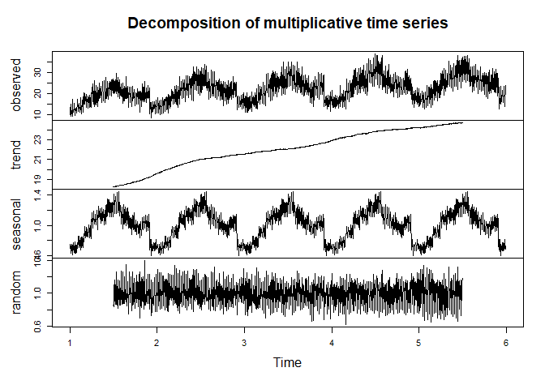
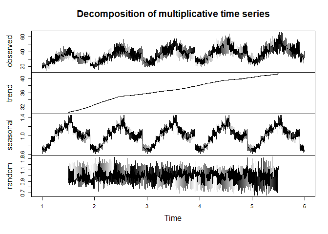
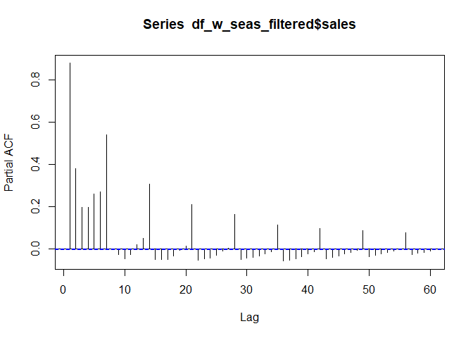

LightGBM: A Multi-Step Time Series Forecasting Approach with Bayesian
Optimization
================

In the world of business analytics, being able to predict sales with
high accuracy can allow one to gain a strategic edge to make data-driven
decisions that optimize inventory, resource allocation, marketing
strategies and drive growth. With the precise prediction of future
sales, businesses can proactively respond to market trends, stay ahead
of the curve, and efficiently manage their inventory. In this tutorial,
we’ll explore the potential of an immensely popular gradient boosting
framework developed by Microsoft, LightGBM, for multi-step sales
forecasting by making precise predictions based on store type and item
type while capturing the nuances of time series information such as
trend and seasonality. In contrast to classical approaches such as ARIMA
that are made specifically for time series data, LightGBM is a pure
machine learning approach.

Please note that this tutorial assumes that readers have a foundational
level of statistical knowledge and familiarity with essential tools.
This includes an understanding of ensemble methods (specifically
boosting techniques such as Gradient Boosting Decision Tree).
Additionally, a grasp of classical time series analysis and
decomposition is beneficial for comprehending the concepts discussed.
While I strive to make the tutorial accessible and informative, readers
with prior experiences will find it easier to follow along and fully
grasp the concepts covered. Nevertheless, I will explain key concepts as
we delve into the intricacies of the forecasting pipeline and modeling
techniques. I highly encourage for readers to actively engage with
additional materials and seek further resources as there are many
nuances involved that would be difficult to cover with just this
tutorial. Here are some materials I recommend:

- Hyndman, R.J., & Athanasopoulos, G. (2021) Forecasting: principles and
practice, 3rd edition, OTexts: Melbourne, Australia. OTexts.com/fpp3
- Ke, G., Meng, Q., Finley, T., Wang, T., Chen, W., Ma, W., Ye, Q., Liu,
T.-Y. (2017). Lightgbm: A highly efficient gradient boosting decision
tree. Advances in Neural Information Processing Systems, 30, 3146–3154
- Natekin A and Knoll A (2013) Gradient boosting machines, a tutorial.
Front. Neurorobot. 7:21. doi: 10.3389/fnbot.2013.00021

For this tutorial, we will be using the dataset provided by Kaggle in
their 2018 competition _[Store Item Demand Forecasting Challenge](https://www.kaggle.com/competitions/demand-forecasting-kernels-only)_


We will first start with data preprocessing.

# Data preprocessing

``` r
library(fpp2)
library(lubridate)
library(dplyr)
df <- read.csv("C://Users//wl//Desktop//Work//[Website]//Demand Forecast//Kaggle Challenge//train.csv")

View(df) # 2013-01-01 to 2017-12-31
unique(df$store)
```

    ##  [1]  1  2  3  4  5  6  7  8  9 10

``` r
unique(df$item) # 50 items
```

    ##  [1]  1  2  3  4  5  6  7  8  9 10 11 12 13 14 15 16 17 18 19 20 21 22 23 24 25
    ## [26] 26 27 28 29 30 31 32 33 34 35 36 37 38 39 40 41 42 43 44 45 46 47 48 49 50

``` r
df$year <- as.factor(year(df$date)) # add in year column
df$month <- as.factor(month(df$date)) # add in month column
df$day <- as.factor(day(df$date)) # add in day column
df$item <- as.factor(df$item) # change item type to factors
df$store <- as.factor(df$store) # change store type to factors

df[!complete.cases(df), ] # find how many NA rows
```

    ## [1] date  store item  sales year  month day  
    ## <0 rows> (or 0-length row.names)

``` r
x_var_time <- c("year", "month", "day") # assign time variables
x_var <- c("store", "item") # assign other non-time variables
y_var <- c("sales") # assign target variables

df2 <- df |>
  select(all_of(c(x_var, x_var_time, y_var))) |> # filter dataframe
  arrange(year, month, day)
```

Upon examination, we discover that the dataset encompasses records
spanning from January 1, 2013, to December 31, 2017. Within this data,
we have information from 10 distinct stores and 50 unique items.

Assuming that each item have its own seasonality component, we begin by
computing the average sales of each product across all stores on the
same day. This step allows us to derive the specific seasonality
component for each individual item. Next, we incorporate the mean sales
for each item, categorized by item type, year, month, and day. As part
of this process, we eliminate store-specific data from our analysis
since we assume that the seasonality component remains constant across
all stores. Additionally, the sales column is no longer required since
we are using mean sales.

To facilitate our analysis, we will generate individual time series
objects for each of the 50 products. Given the substantial number of
products, we’ll leverage parallelization techniques to accelerate this
procedure and efficiently manage computations in parallel. By employing
this approach, we can fully capitalize on our computing resources,
effectively minimizing the time needed to create the time series objects
for all products.

# Create time series object for each item (to extract seasonalities)

``` r
library(parallel)
library(doParallel)

df_mean <- df2 |>
  group_by(year, month, day, item) |>
  summarise(mean_sales = mean(sales)) |>
  inner_join(df2, by = c("year", "month", "day", "item")) |>
  filter(store == "1") |>
  select(-c(store, sales))

ncores <- detectCores() - 1
my_cluster <- makeCluster(ncores, type = "PSOCK")
registerDoParallel(cl = my_cluster)

# creating the TS using parallelization and saving all TS objects into a list
TS_list <- foreach(i = 1:length(unique(df$item)), .packages = "dplyr") %dopar% {
  df_sub <- subset(df_mean, item == unique(df$item)[i])
  
  ts(df_sub |>
       arrange(year, month, day) |>
       ungroup() |>
       select(mean_sales), frequency = 365.25)  
}

# extract each of the TS object in the TS_list into its own TS object
for (i in 1:length(unique(df$item))) {
  df_name <- paste("TS_item_", i, sep = "")
  
  assign(df_name, TS_list[[i]])
}
```

Now that we have our time series objects, we will do some exploratory
data analysis (EDA) to delve deeper into the dataset. To do this, we can
generate time series plots for various products according to their
average revenue. These visualizations will provide insights into the
revenue generation patterns of different items, and it will allow us to
detect any discernible seasonal components. By assessing the variance in
the data over time, we can see if the data exhibits heteroskedasticity
(varying variance) or homoskedasticity (constant variance), which will
be important later on when we do our time series decomposition.

# Exploratory data analysis

``` r
library(ggplot2)
library(scales)
library(lubridate)
library(ggthemes)

# plot for item 1
start_date <- as.Date("2013-01-01")
end_date <- as.Date("2017-12-31")
test1 <- data.frame(Date = 1:length(TS_item_1), Value = TS_item_1)
test1$Date <- start_date + test1$Date - 1

# plot for item 2
start_date <- as.Date("2013-01-01")
end_date <- as.Date("2017-12-31")
test2 <- data.frame(Date = 1:length(TS_item_2), Value = TS_item_2)
test2$Date <- start_date + test2$Date - 1

# plot for item 3
start_date <- as.Date("2013-01-01")
end_date <- as.Date("2017-12-31")
test3 <- data.frame(Date = 1:length(TS_item_3), Value = TS_item_3)
test3$Date <- start_date + test3$Date - 1

# overlay them
test_plot_all <- ggplot() +
  geom_line(data = test1, aes(x = Date, y = mean_sales, color = "item 1")) +
  geom_line(data = test2, aes(x = Date, y = mean_sales, color = "item 2")) +
  geom_line(data = test3, aes(x = Date, y = mean_sales, color = "item 3")) +
  scale_x_date(labels = date_format("%Y-%b"), breaks = seq(from = start_date, to = end_date, by = "12 month")) +
  xlab("Date") +
  ylab("Average Revenue ($)") +
  ggtitle("Average Revenue Per Day for Item 1, 2, and 3") +
  scale_color_manual(values = c("item 1" = "#009E73", "item 2" = "#CC79A7", "item 3" = "#87CEEB"), name = "Item Type")

test_plot_all
```


Upon closer examination, we observe that the three products display
remarkably similar seasonality sales patterns. When the sales of one
product exhibit an upward trend, the other two products tend to follow
suit. Based on this observation, we can assume that all other products
would also showcase a similar pattern, with variations in revenue
magnitude and movement, rather than the direction of movement.
Additionally, as time progresses, we notice that the variance of revenue
increases, indicating the presence of heteroskedasticity in our data.
This variability in revenue suggests that the data’s dispersion changes
over time, adding further complexity to our analysis.

By identifying these patterns and characteristics through our EDA, we
gain valuable insights into the interplay between product sales and
their shared seasonality which will prove instrumental in devising
appropriate forecasting techniques and ensuring accurate predictions for
future revenue trends.

Based on the previous plot, we observe that the seasonal variation
increases over time, indicating that a multiplicative decomposition
approach is better suited for our data. Therefore, our current objective
is to extract the seasonality components of each product and normalize
them to eliminate the scale dependency of the seasonal patterns. To
achieve this, we will leverage parallelization techniques again to
efficiently extract the normalized seasonal components for all products,
storing them in a list for easy management and analysis. This approach
will optimize the computation process, allowing us to handle the vast
amount of data effectively. Once the normalized seasonal components have
been successfully extracted, we will integrate them back into our
dataframe.

# Time series decomposition and seasonality extraction

``` r
library(imputeTS)

# multiplicative decomposition
plot(decompose(TS_item_1, type = "multiplicative"))
```

<!-- -->

``` r
plot(decompose(TS_item_3, type = "multiplicative"))
```

<!-- -->

``` r
# extract normalized seasonal components into a list
seasonal_list <- foreach(i = 1:length(TS_list), .combine = "c", .packages = "imputeTS") %dopar% {
  na_replace(as.numeric(decompose(TS_list[[i]], type = "multiplicative")$seasonal), summary(as.numeric(decompose(TS_list[[i]], type = "multiplicative")$seasonal))[[3]]) / max(na.omit(as.numeric(decompose(TS_list[[i]], type = "multiplicative")$seasonal)))
}

stopCluster(cl = my_cluster)

# add seasonal component into df_mean and rename the column
df_mean_w_seas <- cbind(df_mean, seasonal_list)
names(df_mean_w_seas)[length(names(df_mean_w_seas))] <- "seasonal" 

# add back seasonal component to original dataframe df
df_w_seas <- df |>
  left_join(df_mean_w_seas, by = c("year", "month", "day", "item"))
```

Indeed, the observation of a seemingly upward linear trend in some of
the time series data during the multiplicative time series decomposition
is crucial for our analysis. The presence of a trend indicates that
there is a systematic change in the data over time, where the values
increase or decrease consistently as time progresses. By incorporating
the trend component into our model, we can account for the underlying
growth or decline in sales over time. This information is vital for
making predictions beyond the observed historical data and ensuring that
our forecasts align with the actual sales trajectory.

We will now proceed with feature engineering to add crucial features
that will help us forecast our target variable. There are many features
we can include in our model, but some of these may or may not be
applicable depending on context and the results from the time series
decomposition we observed, as well as from PACF plots. Nevertheless,
some of these features are listed below:

- Seasonality: We will use the already extracted seasonality in training
our model. Seasonality captures recurring patterns that occur at
specific times within each year.
- Month and Day Variables: We will use separate variables for month and
day to capture any monthly or daily patterns in the data.
- Day of the Week: Including a variable for the day of the week will help
us differentiate sales patterns between weekdays and weekends, as they
are likely to differ.
- Day of the Year: Adding a variable for the day of the year will help us
identify any annual trends or patterns.
- Date Components: We will include variables to indicate whether it is a
weekend, the start/end of the month, and the start/end of the year.
These date components can reveal specific patterns related to these time
frames.
- Lagged Periods: Including lagged values of the target variable can help
us capture any dependencies or autocorrelation within the time series
data.
- Running Days Column: We will create a column that captures the number of
days elapsed since the start of the time series data. This will help us
model the trend component over time.
- Public Holidays: If we have information about public holidays, we can
include them as features. Public holidays can have a significant impact
on sales patterns.
- Restock Inventory Information: If available, including information about
restock inventory can help us account for sudden changes in stock levels
that may influence sales.
- Anomalies in Operations: Including information about anomalies in
operations can help us identify and account for any irregularities in
the data that may affect sales.
- Macroeconomic Factors: If relevant, we can include other macroeconomic
factors that may have an impact on sales, such as inflation rates,
unemployment rates, or GDP growth.

# Feature engineering

``` r
library(tidyr)

# select initial variables for modelling
df_w_seas_filtered <- df_w_seas |> select(c(date, sales, seasonal, store, item, month, day))

# plotting PACF
pacf(df_w_seas_filtered$sales, lag = 60) # we see that day-of-the-week effect and the previous-day effect are the most important
```

<!-- -->

``` r
# feature engineering
df_w_seas_filtered <- df_w_seas_filtered |>
  arrange(store, item, date) |>
  group_by(store, item) |>
  mutate(running_days = row_number()) |>
  mutate(lag1d = lag(sales, default = 0)) |>
  mutate(lag7d = lag(sales, n = 7, default = 0)) |>
  fill(lag1d, .direction = "up") |>
  fill(lag7d, .direction = "up") |>
  mutate(day_of_month = case_when(
    day(date) == 1 ~ "start",
    day(date) == days_in_month(date) ~ "end",
    TRUE ~ "normal"
    )) |>
  ungroup() |>
  cbind(data.frame(weekday = factor(wday(df_w_seas_filtered$date, label=TRUE), ordered = FALSE))) |>
  mutate(is_weekend = case_when(
    weekday %in% c("Sat", "Sun") ~ "yes",
    TRUE ~ "no"
  )) |>
  mutate_if(is.character, as.factor) |>
  select(c(date, sales, lag1d, lag7d, seasonal, store, item, month, day, day_of_month, weekday, is_weekend, running_days))

df_w_seas_filtered$date <- as.Date(df_w_seas_filtered$date)

# final check before tuning and modelling
View(df_w_seas_filtered)
```

We will now proceed to generate the training and test sets. Due to
temporal dependency, it is important to split our time series data in a
manner that the test data comprises the most recent periods. Since we
are doing a multi-step forecast, the accuracy of the next period’s
forecast is likely to surpass those made further into the future. This
is because the next period’s forecast can rely on actual observed lagged
values, whereas forecasts further into the future must rely on predicted
lagged values. As we forecast further into the future, the number of
predictions to be made increases which can lead to compounding errors.
Nevertheless, it is still a powerful time series forecasting method and
can produce accurate results. There is also no need to do one-hot
encoding for categorical features, since LightGBM automatically handles
categorical features.

# Create training and test set for modelling

``` r
library(purrr)

# create a training set with 80% of data
train_df <- df_w_seas_filtered |>
  group_by(store, item) |>
  filter(date >= as.Date("2013-01-01") & date <= as.Date("2016-12-31")) |>
  ungroup()

# filter out value for last day of training set for lag1d of first day of test set
train_sales_2016 <- train_df |>
  filter(date == as.Date("2016-12-31")) |>
  select(store, item, sales)

train_sales_7days_before <- train_df |>
  filter(date >= as.Date("2016-12-25") & date <= as.Date("2016-12-31")) |>
  select(date, store, item, sales) |>
  mutate(date = date + days(7))
  

# create the test set with the remaining 20% of data
test_df <- df_w_seas_filtered |>
  group_by(store, item) |>
  filter(date > as.Date("2016-12-31")) |>
  ungroup() |>
  left_join(train_sales_2016, by = c("store", "item"), suffix = c("", ".y")) |>
  mutate(lag1d = ifelse(date == as.Date("2017-01-01"), sales.y, 0.0001),
         lag1d = replace(lag1d, is.na(lag1d), sales)) |>
  select(-sales.y) |>
  left_join(train_sales_7days_before, by = c("store", "item", "date"), suffix = c("", ".y")) |>
  mutate(lag7d = ifelse(date >= as.Date("2017-01-01") & date <= as.Date("2017-01-07"), sales.y, 0.0001),
         lag7d = replace(lag7d, is.na(lag7d), sales)) |>
  select(-sales.y, -date)

# duplicate test set without target variable
test_df2 <- test_df[, colnames(test_df) != "sales"]

# extract target variable of test set
y_test <- as.data.frame(test_df) |>
  select(sales) |>
  pull(sales) |>
  as.numeric()

# remove date and the first 7 days of each store and item combination as there is no observable lag7d values
train_df <- train_df |>
  filter(date >= as.Date("2013-01-08")) |>
  select(-date)

# duplicate training set without target variable
train_df2 <- train_df[, colnames(train_df) != "sales"]

# extract target variable of training set
y_train <- as.data.frame(train_df) |>
  select(sales) |>
  pull(sales) |>
  as.numeric()
```

With the training and test sets prepared, we can now proceed to
hyperparameter tuning for our LightGBM model before modelling. For this
regression task, we’ll utilize the DART (Dropouts meet Multiple Additive
Regression Trees) boosting method, known for its improved accuracy
compared to Goss and GBDT, albeit being slightly slower. We will set 50
boosting iterations for this task. The key hyperparameters we’ll
optimize for our LightGBM learner include sampling fractions, number of
leaves, max depths, learning rate, and drop rate and skip drop rate for
DART boosting. These hyperparameters contribute to regularization,
preventing overfitting of the model. You can refer to LightGBM official
_[documentation](https://lightgbm.readthedocs.io/en/stable/)_
for other hyperparameters that are available.

To optimize the hyperparameters effectively, we’ll employ Bayesian
Optimization, which models the objective function (RMSE in our case) as
a probabilistic surrogate model like Gaussian Process. This method
estimates the most promising hyperparameters to explore next, making the
search more efficient compared to other approaches like grid search or
random search.

During tuning, we’ll use 5-fold cross-validation for sampling, and to
speed up the process, the tuning algorithm will stop early if the next
batch of hyperparameters does not improve the RMSE metric by at least
0.5. Once hyperparameter tuning is complete, we’ll proceed with the
modelling phase using the best set of hyperparameters.

# Hyperparameter tuning

``` r
set.seed(333)
library(mlr3)
library(mlr3learners)
library(mlr3extralearners)
library(paradox)
library(mlr3tuning)
library(mlr3mbo)
library(DiceKriging)
library(ranger)

# create task for lgbm
target_col <- "sales"

task <- mlr3::TaskRegr$new(
  id = "demand_forecast",
  backend = train_df,
  target = target_col
)

# editing the learner and set hyperparameter search bounds
mlr_learners$get("regr.lightgbm")
```

    ## <LearnerRegrLightGBM:regr.lightgbm>: Gradient Boosting
    ## * Model: -
    ## * Parameters: num_threads=1, verbose=-1, objective=regression,
    ##   convert_categorical=TRUE
    ## * Packages: mlr3, mlr3extralearners, lightgbm
    ## * Predict Types:  [response]
    ## * Feature Types: logical, integer, numeric, factor
    ## * Properties: hotstart_forward, importance, missings, weights

``` r
learner <- mlr3extralearners::lrn(
  "regr.lightgbm",
  bagging_fraction = to_tune(0.4, 1),
  num_leaves = to_tune(7, 4095),
  max_depth = to_tune(2, 63),
  learning_rate = to_tune(0.001, 0.25),
  drop_rate = to_tune(0.01, 0.2),
  skip_drop = to_tune(0, 0.5)
)

# define the hyperparameters we want to keep static
learner$param_set$values <- mlr3misc::insert_named(
  learner$param_set$values,
    list(
    "boosting" = "dart",
    "seed" = 17L,
    "num_iterations" = 50,
    "objective" = "regression",
    "convert_categorical" = TRUE
  )
)

tuner <- tnr("mbo")

# create a tuning instance for our tuning
instance <- ti(
  task = task,
  learner = learner,
  resampling = rsmp("cv", folds = 5),
  measures = msr("regr.rmse"),
  terminator = trm("stagnation_batch", n = 1, threshold = 0.5)
)

# now we are ready to tune our model
tuner$optimize(instance)
```

    ## INFO  [00:12:14.118] [bbotk] Finished optimizing after 25 evaluation(s)
    ## INFO  [00:12:14.119] [bbotk] Result:
    ## INFO  [00:12:14.120] [bbotk]  bagging_fraction num_leaves max_depth learning_rate  drop_rate skip_drop
    ## INFO  [00:12:14.120] [bbotk]         0.4371666        459        57      0.152877 0.01300753 0.4798233
    ## INFO  [00:12:14.120] [bbotk]  learner_param_vals  x_domain regr.rmse
    ## INFO  [00:12:14.120] [bbotk]          <list[13]> <list[6]>  7.512203

    ##    bagging_fraction num_leaves max_depth learning_rate  drop_rate skip_drop
    ## 1:        0.4371666        459        57      0.152877 0.01300753 0.4798233
    ##    learner_param_vals  x_domain regr.rmse
    ## 1:         <list[13]> <list[6]>  7.512203

``` r
# assign tuned hyperparameters
best_bagging_fraction = instance$result$bagging_fraction
best_num_leaves = instance$result$num_leaves
best_max_depth = instance$result$max_depth
best_learning_rate = instance$result$learning_rate
best_drop_rate = instance$result$drop_rate
best_skip_drop = instance$result$skip_drop
```

We are now finally ready to train our model.

# Training the model

``` r
# initialize the learner
best_learner <- mlr3::lrn(
  "regr.lightgbm"
)

# insert tuned hyperparameter
best_learner$param_set$values <- mlr3misc::insert_named(
  best_learner$param_set$values,
    list(
      "bagging_fraction" = best_bagging_fraction,
      "num_leaves" = best_num_leaves,
      "max_depth" = best_max_depth,
      "learning_rate" = best_learning_rate,
      "drop_rate" = best_drop_rate,
      "skip_drop" = best_skip_drop,
      "boosting" = "dart",
      "seed" = 17L,
      "num_iterations" = 100,
      "objective" = "regression",
      "convert_categorical" = TRUE
  )
)

# fit the model on the training data
lgbm_model <- best_learner$train(task)

# check importance of features for the fitted model
lgbm_importance <- lgbm_model$importance()
lgbm_importance
```

    ##        lag7d        lag1d         item        month      weekday        store 
    ## 0.8956642954 0.0474605233 0.0147734597 0.0101244545 0.0084737464 0.0084097696 
    ## running_days          day   is_weekend     seasonal day_of_month 
    ## 0.0073982923 0.0051852725 0.0016367143 0.0006645874 0.0002088846

As we can see from the importance score, it appears that the most
important predictor is weekly lag value.

We can now check our model performance against the train data. Depending
on the task, certain evaluation metrics may be more suitable to test
performance of the model. For this case, we will be using MAPE.

# Checking model performance on train data

``` r
fitted <- lgbm_model |>
  predict(train_df2)

final_df2 <- cbind(train_df2, y_train, fitted)

train_mape <- final_df2 |>
  as.data.frame() |>
  ungroup() |>
  mutate(MAPE_Inv = (y_train - fitted) / y_train) |>
  mutate(MAPE_Inv_abs = abs(MAPE_Inv))

train_mape <- train_mape |>
  arrange(store, item)

# summarize the results for each combination of categories
summary_train <- train_mape |>
  group_by(store, item) |>
  summarize(Average_MAPE_Train = 1 - mean(MAPE_Inv_abs))

summary_train <- summary_train[!is.na(summary_train$Average_MAPE_Train), ]
summary_train <- summary_train[summary_train$Average_MAPE_Train <= 1, ]

summary_train
```

    ## # A tibble: 500 × 3
    ## # Groups:   store [10]
    ##    store item  Average_MAPE_Train
    ##    <fct> <fct>              <dbl>
    ##  1 1     1                  0.789
    ##  2 1     2                  0.887
    ##  3 1     3                  0.847
    ##  4 1     4                  0.777
    ##  5 1     5                  0.746
    ##  6 1     6                  0.886
    ##  7 1     7                  0.882
    ##  8 1     8                  0.905
    ##  9 1     9                  0.876
    ## 10 1     10                 0.898
    ## # … with 490 more rows

We can also check our model performance against the test data. Unlike
the one we did with the training data, this evaluation is less
straightforward due to our simulation of real-world applications. In
such scenarios, we encounter the challenge that lag1d would only be
observable for the very next period, while lag7d is solely observed up
to 7 periods ahead. To overcome this limitation, we will be using
multi-step forecasting to derive these unobservable values, requiring an
iterative process that would be more computational demanding.

# Checking model performance on test data

``` r
# initialize final predicted dataframe, and copy test_df2
predicted_df <- data.frame()
temp_df <- test_df2

# we first do the forecast for first 7 days since their lag7d are observed
for (j in 1:7) {
  for (k in as.vector(unique(test_df$store))) {
    for (l in as.vector(unique(test_df$item))) {
      forecast_df <-
        filter(temp_df, store == k, item == l, day == j, month == 1)

      forecast_sale <- lgbm_model |>
        predict(forecast_df)
      
      forecast_df <- forecast_df |>
        cbind(forecast_sale)
      
      predicted_df <- predicted_df |>
        rbind(forecast_df)
    }
  }
  # updating lag1d for next period
  forecast_df <-
    filter(temp_df, day == j + 1, month == 1)
  
  forecast_df$lag1d <-
    predicted_df$forecast_sale[(nrow(predicted_df) - ((length(
      unique(test_df$item)
    ) * length(
      unique(test_df$store)
    )) - 1)):nrow(predicted_df)]
  
  merged_df <-
    merge(
      temp_df,
      forecast_df,
      by = c("store", "item", "month", "day"),
      all.x = TRUE
    )
  
  temp_df$lag1d <-
    ifelse(!is.na(merged_df$lag1d.y),
           merged_df$lag1d.y,
           temp_df$lag1d)
}

# now we do for the rest of the days in the first month
for (i in 1) {
  for (j in 8:length(unique(filter(test_df, month == i)$day))) {
    # updating lag1d for next period
    forecast_df <-
      filter(temp_df, day == j, month == i)
    
    forecast_df$lag1d <-
      predicted_df$forecast_sale[(nrow(predicted_df) - ((length(
        unique(test_df$item)
      ) * length(
        unique(test_df$store)
      )) - 1)):nrow(predicted_df)]
    
    # updating lag7d for next period
    forecast_df$lag7d <-
      predicted_df$forecast_sale[(nrow(predicted_df) - (((length(unique(test_df$item)) * length(unique(test_df$store))) * 7) - 1)):(nrow(predicted_df) - ((length(unique(test_df$item)) * length(unique(test_df$store))) * 6))]
    
    merged_df <-
      merge(
        temp_df,
        forecast_df,
        by = c("store", "item", "month", "day"),
        all.x = TRUE
      )
    
    temp_df$lag1d <-
      ifelse(!is.na(merged_df$lag1d.y),
             merged_df$lag1d.y,
             temp_df$lag1d)
    
    temp_df$lag7d <-
      ifelse(!is.na(merged_df$lag7d.y),
             merged_df$lag7d.y,
             temp_df$lag7d)
    
    for (k in as.vector(unique(test_df$store))) {
      for (l in as.vector(unique(test_df$item))) {
        forecast_df <-
          filter(temp_df, store == k, item == l, day == j, month == i)

        forecast_sale <- lgbm_model |>
          predict(forecast_df)
        
        forecast_df <- forecast_df |>
          cbind(forecast_sale)
        
        predicted_df <- predicted_df |>
          rbind(forecast_df)
      }
    }
  }
}

# now we do for the rest of the days for the rest of the months
for (i in 2:12) {
  for (j in 1:length(unique(filter(test_df, month == i)$day))) {
    # updating lag1d for next period
    forecast_df <-
      filter(temp_df, day == j, month == i)
    
    forecast_df$lag1d <-
      predicted_df$forecast_sale[(nrow(predicted_df) - ((length(
        unique(test_df$item)
      ) * length(
        unique(test_df$store)
      )) - 1)):nrow(predicted_df)]
    
    # updating lag7d for next period
    forecast_df$lag7d <-
      predicted_df$forecast_sale[(nrow(predicted_df) - (((length(unique(test_df$item)) * length(unique(test_df$store))) * 7) - 1)):(nrow(predicted_df) - ((length(unique(test_df$item)) * length(unique(test_df$store))) * 6))]
    
    merged_df <-
      merge(
        temp_df,
        forecast_df,
        by = c("store", "item", "month", "day"),
        all.x = TRUE
      )
    
    temp_df$lag1d <-
      ifelse(!is.na(merged_df$lag1d.y),
             merged_df$lag1d.y,
             temp_df$lag1d)
    
    temp_df$lag7d <-
      ifelse(!is.na(merged_df$lag7d.y),
             merged_df$lag7d.y,
             temp_df$lag7d)
    
    for (k in as.vector(unique(test_df$store))) {
      for (l in as.vector(unique(test_df$item))) {
        forecast_df <-
          filter(temp_df, store == k, item == l, day == j, month == i)

        forecast_sale <- lgbm_model |>
          predict(forecast_df)
        
        forecast_df <- forecast_df |>
          cbind(forecast_sale)
        
        predicted_df <- predicted_df |>
          rbind(forecast_df)
      }
    }
  }
}

final_test_df2 <- cbind(predicted_df |>
                          arrange(store, item, month, day), y_test)

test_mape <- final_test_df2 |>
  as.data.frame() |>
  ungroup() |>
  mutate(MAPE_Inv = (y_test - forecast_sale) / y_test) |>
  mutate(MAPE_Inv_abs = abs(MAPE_Inv))

test_mape <- test_mape |>
  arrange(store, item)

# summarize the results for each combination of categories
summary_test <- test_mape |>
  group_by(store, item) |>
  summarize(Average_MAPE_Test = 1 - mean(MAPE_Inv_abs))

summary_test <- summary_test[!is.na(summary_test$Average_MAPE_Test), ]
summary_test <- summary_test[summary_test$Average_MAPE_Test <= 1, ]

summary_test
```

    ## # A tibble: 500 × 3
    ## # Groups:   store [10]
    ##    store item  Average_MAPE_Test
    ##    <fct> <fct>             <dbl>
    ##  1 1     1                 0.801
    ##  2 1     2                 0.879
    ##  3 1     3                 0.853
    ##  4 1     4                 0.808
    ##  5 1     5                 0.792
    ##  6 1     6                 0.884
    ##  7 1     7                 0.884
    ##  8 1     8                 0.889
    ##  9 1     9                 0.877
    ## 10 1     10                0.889
    ## # … with 490 more rows

# Plot to show predicted sales vs actual sales figure for test set

``` r
forecast_performance <- final_test_df2 |>
  filter(store == "1", item == "1") |>
  mutate(year = "2017")

forecast_performance$date <- as.Date(paste(forecast_performance$year, forecast_performance$month, forecast_performance$day, sep = "-"))

forecast_analysis <- ggplot() +
  geom_line(data = forecast_performance, aes(x = as.Date(date), y = y_test, color = "Actual"), alpha = 0.35) +
  geom_line(data = forecast_performance, aes(x = as.Date(date), y = forecast_sale, color = "Predicted")) +
  scale_x_date(labels = date_format("%Y-%b"), breaks = date_breaks("3 months")) +
  xlab("Date") +
  ylab("Amount ($)") +
  ggtitle("Forecasted Sales for Store 1, Item 1") +
  scale_color_manual(values = c("Actual" = "#009E73", "Predicted" = "#CC79A7"), name = "Legend")

forecast_analysis
```


# Compare train and test accuracy

``` r
summary_all <- summary_train |>
  left_join(summary_test, by = c('store', 'item')) |>
  mutate(accuracy_gap = round(Average_MAPE_Train - Average_MAPE_Test , 2)) |>
  arrange(desc(accuracy_gap))

summary_all
```

    ## # A tibble: 500 × 5
    ## # Groups:   store [10]
    ##    store item  Average_MAPE_Train Average_MAPE_Test accuracy_gap
    ##    <fct> <fct>              <dbl>             <dbl>        <dbl>
    ##  1 2     28                 0.928             0.891         0.04
    ##  2 2     13                 0.928             0.900         0.03
    ##  3 2     15                 0.928             0.896         0.03
    ##  4 2     18                 0.926             0.892         0.03
    ##  5 2     22                 0.926             0.898         0.03
    ##  6 2     38                 0.926             0.894         0.03
    ##  7 2     45                 0.927             0.896         0.03
    ##  8 3     15                 0.924             0.896         0.03
    ##  9 4     15                 0.922             0.893         0.03
    ## 10 8     13                 0.925             0.897         0.03
    ## # … with 490 more rows

As evident from the results, the differences in accuracy between the
model performances on the training data and the test data is relatively
small, with only a 4% gap. Notably, the model demonstrates consistent
and commendable performance across various groups, with accuracy scores
for most groups surpassing 80% and many even reaching or exceeding 90%.

This achievement is particularly remarkable considering the utilization
of a multi-step forecasting technique, which inherently introduces
compounding errors. Despite this challenge, the model’s resilience and
ability to maintain high accuracy levels are evident, affirming its
reliability and effectiveness in predicting sales accurately.

The ability to accurately predict sales holds immense strategic value,
empowering decision-makers to leverage data-driven insights for
optimizing inventory, resource allocation, marketing strategies, and
overall growth. By precisely forecasting future sales, businesses can
proactively respond to dynamic market trends, maintain a competitive
edge, and streamline inventory management. This tutorial delves into the
capabilities of LightGBM to conduct multi-step sales forecasting.
Through this approach, we can make precise predictions while effectively
capturing the intricate time series details. LightGBM represents a pure
machine learning approach with promising new dimensions in sales
prediction accuracy and business insights. I have no doubt that as time
progresses, we will continue to see new approaches and ideas, and we
will be well-equipped to navigate the complexities of time series
forecasting and drive data-backed strategies that fuel success and
growth.

The code chunks below are additional tutorial on how we can use the
model we created to predict future values.

# Predict seasonality for next year

``` r
# initialize future dates and dataframe
date_vector <- seq(as.Date("2018-01-01"), as.Date("2018-12-31"), by = "day")

# create a weighted mean for seasonality using simple exponential smoothing for future days for a year based on past 5 years
forecast_seasonal <- c()

for(i in as.vector(unique(test_df$store))) {
  for (j in as.vector(unique(test_df$item))) {
    for (k in 1:length(date_vector)) {
      filtered_df <- df_w_seas |>
        filter(
          store == i,
          item == j,
          as.integer(month) == month(date_vector[k]),
          as.integer(day) == day(date_vector[k])
        )
      
      decay_level <-
        0.2 # choose the appropriate decay factor alpha where 0<=r<=1
      weighted_mean_seasonality <-
        forecast::ses(filtered_df$seasonal, alpha = decay_level, h = 1)
      
      forecast_seasonal <-
        append(forecast_seasonal, weighted_mean_seasonality$x[1])
    }
  }
}

store_vector <- rep(as.vector(unique(train_df$store)), each = length(date_vector) * length(as.vector(unique(train_df$item))))
item_vector <- rep(as.vector(unique(train_df$item)), each = length(date_vector), times = length(as.vector(unique(train_df$store))))

# create a dataframe to store forecasted seasonality for each store and item at each day
next_forecast <- data.frame(
  date = rep(date_vector, length(as.vector(
    unique(train_df$store)
  )) * length(as.vector(
    unique(train_df$item)
  ))),
  store = store_vector,
  item = item_vector,
  seasonal = forecast_seasonal
)
```

# Predicting new unseen data

``` r
# adding in required variables
next_forecast$month <- as.factor(month(next_forecast$date))
next_forecast$day <- as.factor(day(next_forecast$date))
next_forecast$store <- factor(next_forecast$store, levels = levels(train_df2$store))
next_forecast$item <- factor(next_forecast$item, levels = levels(train_df2$item))
next_forecast$lag1d <- rep(NA_real_, nrow(next_forecast))
next_forecast$lag7d <- rep(NA_real_, nrow(next_forecast))

next_forecast <- next_forecast |>
  arrange(store, item, date) |>
  group_by(store, item) |>
  mutate(running_days = row_number() + max(final_test_df2$running_days)) |>  
  mutate(day_of_month = case_when(
    day(date) == 1 ~ "start",
    day(date) == days_in_month(date) ~ "end",
    TRUE ~ "normal"
    )) |>
  ungroup() |>
  cbind(data.frame(weekday = factor(wday(next_forecast$date, label=TRUE), ordered = FALSE))) |>
  mutate(is_weekend = case_when(
    weekday %in% c("Sat", "Sun") ~ "yes",
    TRUE ~ "no"
  )) |>
  mutate_if(is.character, as.factor) |>
  select(c(date, seasonal, lag1d, lag7d, store, item, month, day, day_of_month, weekday, is_weekend, running_days))

df_w_seas_filtered$date <- df_w_seas_filtered$date + days(1)

lag1d <- df_w_seas_filtered[df_w_seas_filtered$date == as.Date("2018-01-01"), ]

merged_df <-
  merge(next_forecast,
        lag1d,
        by = c("store", "item", "date"),
        all.x = TRUE)

next_forecast$lag1d <-
  ifelse(!is.na(merged_df$sales),
         merged_df$sales,
         next_forecast$lag1d)

df_w_seas_filtered$date <- df_w_seas_filtered$date + days(6)

lag7d <- df_w_seas_filtered[df_w_seas_filtered$date >= as.Date("2018-01-01") & df_w_seas_filtered$date <= as.Date("2018-01-07"), ]

merged_df <-
  merge(next_forecast,
        lag7d,
        by = c("store", "item", "date"),
        all.x = TRUE)

next_forecast$lag7d <-
  ifelse(!is.na(merged_df$sales),
         merged_df$sales,
         next_forecast$lag7d)

next_forecast <- next_forecast |>
  select(- date)

# initialize final predicted dataframe, and copy next_forecast
final_forecast <- data.frame()
temp_df2 <- next_forecast

# we first do the forecast for first 7 days since their lag7d are observed
for (j in 1:7) {
  for (k in as.vector(unique(next_forecast$store))) {
    for (l in as.vector(unique(next_forecast$item))) {
      forecast_df <-
        filter(temp_df2, store == k, item == l, day == j, month == 1)

      forecast_sale <- lgbm_model |>
        predict(forecast_df)
      
      forecast_df <- forecast_df |>
        cbind(forecast_sale = forecast_sale)
      
      final_forecast <- final_forecast |>
        rbind(forecast_df)
    }
  }
  # updating lag1d for next period
  forecast_df <-
    filter(temp_df2, day == j + 1, month == 1)
  
  forecast_df$lag1d <-
    final_forecast$forecast_sale[(nrow(final_forecast) - ((length(
      unique(next_forecast$item)
    ) * length(
      unique(next_forecast$store)
    )) - 1)):nrow(final_forecast)]
  
  merged_df <-
    merge(
      temp_df2,
      forecast_df,
      by = c("store", "item", "month", "day"),
      all.x = TRUE
    )
  
  temp_df2$lag1d <-
    ifelse(!is.na(merged_df$lag1d.y),
           merged_df$lag1d.y,
           temp_df2$lag1d)
}

# now we do for the rest of the days in the first month
for (i in 1) {
  for (j in 8:length(unique(filter(next_forecast, month == i)$day))) {
    # updating lag1d for next period
    forecast_df <-
      filter(temp_df2, day == j, month == i)
    
    forecast_df$lag1d <-
      final_forecast$forecast_sale[(nrow(final_forecast) - ((length(
        unique(next_forecast$item)
      ) * length(
        unique(next_forecast$store)
      )) - 1)):nrow(final_forecast)]
    
    # updating lag7d for next period
    forecast_df$lag7d <-
      final_forecast$forecast_sale[(nrow(final_forecast) - (((length(unique(next_forecast$item)) * length(unique(next_forecast$store))) * 7) - 1)):(nrow(final_forecast) - ((length(unique(next_forecast$item)) * length(unique(next_forecast$store))) * 6))]
    
    merged_df <-
      merge(
        temp_df2,
        forecast_df,
        by = c("store", "item", "month", "day"),
        all.x = TRUE
      )
    
    temp_df2$lag1d <-
      ifelse(!is.na(merged_df$lag1d.y),
             merged_df$lag1d.y,
             temp_df2$lag1d)
    
    temp_df2$lag7d <-
      ifelse(!is.na(merged_df$lag7d.y),
             merged_df$lag7d.y,
             temp_df2$lag7d)
    
    for (k in as.vector(unique(next_forecast$store))) {
      for (l in as.vector(unique(next_forecast$item))) {
        forecast_df <-
          filter(temp_df2, store == k, item == l, day == j, month == i)

        forecast_sale <- lgbm_model |>
          predict(forecast_df)
        
        forecast_df <- forecast_df |>
          cbind(forecast_sale = forecast_sale)
        
        final_forecast <- final_forecast |>
          rbind(forecast_df)
      }
    }
  }
}

# now we do for the rest of the days for the rest of the months
for (i in 2:12) {
  for (j in 1:length(unique(filter(next_forecast, month == i)$day))) {
    # updating lag1d for next period
    forecast_df <-
      filter(temp_df2, day == j, month == i)
    
    forecast_df$lag1d <-
      final_forecast$forecast_sale[(nrow(final_forecast) - ((length(
        unique(next_forecast$item)
      ) * length(
        unique(next_forecast$store)
      )) - 1)):nrow(final_forecast)]
    
    # updating lag7d for next period
    forecast_df$lag7d <-
      final_forecast$forecast_sale[(nrow(final_forecast) - (((length(unique(next_forecast$item)) * length(unique(next_forecast$store))) * 7) - 1)):(nrow(final_forecast) - ((length(unique(next_forecast$item)) * length(unique(next_forecast$store))) * 6))]
    
    merged_df <-
      merge(
        temp_df2,
        forecast_df,
        by = c("store", "item", "month", "day"),
        all.x = TRUE
      )
    
    temp_df2$lag1d <-
      ifelse(!is.na(merged_df$lag1d.y),
             merged_df$lag1d.y,
             temp_df2$lag1d)
    
    temp_df2$lag7d <-
      ifelse(!is.na(merged_df$lag7d.y),
             merged_df$lag7d.y,
             temp_df2$lag7d)
    
    for (k in as.vector(unique(next_forecast$store))) {
      for (l in as.vector(unique(next_forecast$item))) {
        forecast_df <-
          filter(temp_df2, store == k, item == l, day == j, month == i)

        forecast_sale <- lgbm_model |>
          predict(forecast_df)
        
        forecast_df <- forecast_df |>
          cbind(forecast_sale = forecast_sale)
        
        final_forecast <- final_forecast |>
          rbind(forecast_df)
      }
    }
  }
}

# final forecast dataframe with forecasted sales for all groups for 1 year
View(final_forecast)
```

# Plot to show predicted sales

``` r
forecast_future <- final_forecast |>
  filter(store == "1", item == "1") |>
  mutate(year = "2018")

forecast_future$date <- as.Date(paste(forecast_future$year, forecast_future$month, forecast_future$day, sep = "-"))

forecast_future_analysis <- ggplot() +
  geom_line(data = forecast_future, aes(x = as.Date(date), y = forecast_sale, color = "Predicted")) +
  scale_x_date(labels = date_format("%Y-%b"), breaks = date_breaks("3 months")) +
  xlab("Date") +
  ylab("Amount ($)") +
  ggtitle("Forecasted Sales for Store 1, Item 1") +
  scale_color_manual(values = c("Predicted" = "#CC79A7"), name = "Legend")

forecast_future_analysis
```


