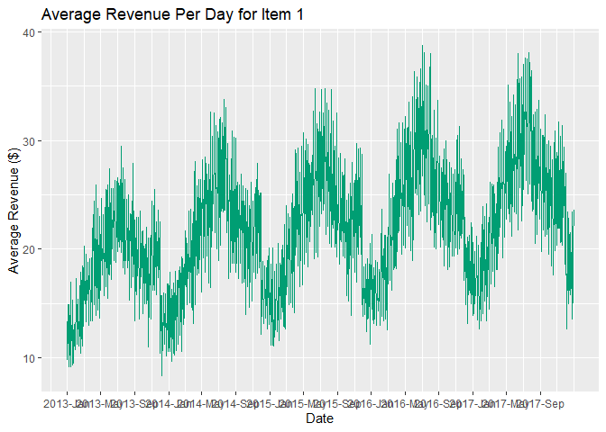
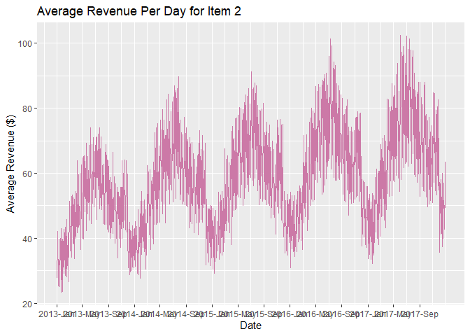

LightGBM: A Multi-Step Time Series Forecasting Approach with Bayesian
Optimization
================

In the world of business analytics, being able to predict sales with
high accuracy can allow one to gain a strategic edge to make data-driven
decisions that optimize inventory, resource allocation, marketing
strategies and drive growth. With the precise prediction of future
sales, businesses can proactively respond to market trends, stay ahead
of the curve, and efficiently manage their inventory. In this tutorial,
we’ll explore the potential of an immensely popular gradient boosting
framework developed by Microsoft, LightGBM, for multi-step sales
forecasting by making precise predictions based on store type and item
type while capturing the nuances of time series information such as
trend and seasonality. In contrast to classical approaches such as ARIMA
that are made specifically for time series data, LightGBM is a pure
machine learning approach.

Please note that this tutorial assumes that readers have a foundational
level of statistical knowledge and familiarity with essential tools.
This includes an understanding of ensemble methods (specifically
boosting techniques such as Gradient Boosting Decision Tree).
Additionally, a grasp of classical time series analysis and
decomposition is beneficial for comprehending the concepts discussed.
While I strive to make the tutorial accessible and informative, readers
with prior experiences will find it easier to follow along and fully
grasp the concepts covered. Nevertheless, I will explain key concepts as
we delve into the intricacies of the forecasting pipeline and modeling
techniques. I highly encourage for readers to actively engage with
additional materials and seek further resources as there are many
nuances involved that would be difficult to cover with just this
tutorial. Here are some materials I recommend:

Hyndman, R.J., & Athanasopoulos, G. (2021) Forecasting: principles and
practice, 3rd edition, OTexts: Melbourne, Australia. OTexts.com/fpp3

Ke, G., Meng, Q., Finley, T., Wang, T., Chen, W., Ma, W., Ye, Q., Liu,
T.-Y. (2017). Lightgbm: A highly efficient gradient boosting decision
tree. Advances in Neural Information Processing Systems, 30, 3146–3154

Natekin A and Knoll A (2013) Gradient boosting machines, a tutorial.
Front. Neurorobot. 7:21. doi: 10.3389/fnbot.2013.00021

For this tutorial, we will be using the dataset provided by Kaggle in
their 2018 competition “Store Item Demand Forecasting Challenge”
(<https://www.kaggle.com/competitions/demand-forecasting-kernels-only>).

We will first start with data preprocessing.

# Data preprocessing

``` r
library(fpp2)
```

    ## Registered S3 method overwritten by 'quantmod':
    ##   method            from
    ##   as.zoo.data.frame zoo

    ## ── Attaching packages ────────────────────────────────────────────── fpp2 2.4 ──

    ## ✔ ggplot2   3.3.6     ✔ fma       2.4  
    ## ✔ forecast  8.20      ✔ expsmooth 2.3

    ## 

``` r
library(lubridate)
```

    ## Loading required package: timechange

    ## 
    ## Attaching package: 'lubridate'

    ## The following objects are masked from 'package:base':
    ## 
    ##     date, intersect, setdiff, union

``` r
library(dplyr)
```

    ## 
    ## Attaching package: 'dplyr'

    ## The following objects are masked from 'package:stats':
    ## 
    ##     filter, lag

    ## The following objects are masked from 'package:base':
    ## 
    ##     intersect, setdiff, setequal, union

``` r
df <- read.csv("C://Users//wl//Desktop//Work//[Website]//Demand Forecast//Kaggle Challenge//train.csv")

View(df) # 2013-01-01 to 2017-12-31

unique(df$store) # 10 stores
```

    ##  [1]  1  2  3  4  5  6  7  8  9 10

``` r
unique(df$item) # 50 items
```

    ##  [1]  1  2  3  4  5  6  7  8  9 10 11 12 13 14 15 16 17 18 19 20 21 22 23 24 25
    ## [26] 26 27 28 29 30 31 32 33 34 35 36 37 38 39 40 41 42 43 44 45 46 47 48 49 50

``` r
df$year <- as.factor(year(df$date)) # add in year column
df$month <- as.factor(month(df$date)) # add in month column
df$day <- as.factor(day(df$date)) # add in day column
df$item <- as.factor(df$item) # change item type to factors
df$store <- as.factor(df$store) # change store type to factors

df[!complete.cases(df), ] # find how many NA rows
```

    ## [1] date  store item  sales year  month day  
    ## <0 rows> (or 0-length row.names)

``` r
x_var_time <- c("year", "month", "day") # assign time variables
x_var <- c("store", "item") # assign other non-time variables
y_var <- c("sales") # assign target variables

df2 <- df |>
  select(all_of(c(x_var, x_var_time, y_var))) |> # filter dataframe
  arrange(year, month, day)
```

Upon examination, we discover that the dataset encompasses records
spanning from January 1, 2013, to December 31, 2017. Within this data,
we have information from 10 distinct stores and 50 unique items.

Assuming that each item have its own seasonality component, we begin by
computing the average sales of each product across all stores on the
same day. This step allows us to derive the specific seasonality
component for each individual item. Next, we incorporate the mean sales
for each item, categorized by item type, year, month, and day. As part
of this process, we eliminate store-specific data from our analysis
since we assume that the seasonality component remains constant across
all stores. Additionally, the sales column is no longer required since
we are using mean sales.

To facilitate our analysis, we will generate individual time series
objects for each of the 50 products. Given the substantial number of
products, we’ll leverage parallelization techniques to accelerate this
procedure and efficiently manage computations in parallel. By employing
this approach, we can fully capitalize on our computing resources,
effectively minimizing the time needed to create the time series objects
for all products.

# Create time series object for each item (to extract seasonalities)

``` r
library(parallel)
library(doParallel)
```

    ## Loading required package: foreach

    ## Loading required package: iterators

``` r
df_mean <- df2 |>
  group_by(year, month, day, item) |>
  summarise(mean_sales = mean(sales)) |>
  inner_join(df2, by = c("year", "month", "day", "item")) |>
  filter(store == "1") |>
  select(-c(store, sales))
```

    ## `summarise()` has grouped output by 'year', 'month', 'day'. You can override
    ## using the `.groups` argument.

``` r
ncores <- detectCores() - 1
my_cluster <- makeCluster(ncores, type = "PSOCK")
registerDoParallel(cl = my_cluster)

# creating the TS using parallelization and saving all TS objects into a list
TS_list <- foreach(i = 1:length(unique(df$item)), .packages = "dplyr") %dopar% {
  df_sub <- subset(df_mean, item == unique(df$item)[i])
  
  ts(df_sub |>
       arrange(year, month, day) |>
       ungroup() |>
       select(mean_sales), frequency = 365.25)  
}

# extract each of the TS object in the TS_list into its own TS object
for (i in 1:length(unique(df$item))) {
  df_name <- paste("TS_item_", i, sep = "")
  
  assign(df_name, TS_list[[i]])
}
```

Now that we have our time series objects, we will do some exploratory
data analysis (EDA) to delve deeper into the dataset. To do this, we can
generate time series plots for various products according to their
average revenue. These visualizations will provide insights into the
revenue generation patterns of different items, and it will allow us to
detect any discernible seasonal components. By assessing the variance in
the data over time, we can see if the data exhibits heteroskedasticity
(varying variance) or homoskedasticity (constant variance), which will
be important later on when we do our time series decomposition.

# Exploratory data analysis

``` r
library(ggplot2)
library(plotly)
```

    ## 
    ## Attaching package: 'plotly'

    ## The following object is masked from 'package:ggplot2':
    ## 
    ##     last_plot

    ## The following object is masked from 'package:stats':
    ## 
    ##     filter

    ## The following object is masked from 'package:graphics':
    ## 
    ##     layout

``` r
library(scales)
library(lubridate)
library(ggthemes)

# plot for item 1
start_date <- as.Date("2013-01-01")
end_date <- as.Date("2017-12-31")
test1 <- data.frame(Date = 1:length(TS_item_1), Value = TS_item_1)
test1$Date <- start_date + test1$Date - 1

test_plot1 <- ggplot(data = test1, aes(x = Date, y = mean_sales)) +
  geom_line(color = "#009E73") +
  scale_x_date(labels = date_format("%Y-%b"), breaks = seq(from = start_date, to = end_date, by = "4 month")) +
  xlab("Date") +
  ylab("Average Revenue ($)") +
  ggtitle("Average Revenue Per Day for Item 1")

test_plot1
```

<!-- -->

``` r
# plot for item 2
start_date <- as.Date("2013-01-01")
end_date <- as.Date("2017-12-31")
test2 <- data.frame(Date = 1:length(TS_item_2), Value = TS_item_2)
test2$Date <- start_date + test2$Date - 1

test_plot2 <- ggplot(data = test2, aes(x = Date, y = mean_sales)) +
  geom_line(color = "#CC79A7") +
  scale_x_date(labels = date_format("%Y-%b"), breaks = seq(from = start_date, to = end_date, by = "4 month")) +
  xlab("Date") +
  ylab("Average Revenue ($)") +
  ggtitle("Average Revenue Per Day for Item 2")

test_plot2
```

<!-- -->

``` r
# plot for item 3
start_date <- as.Date("2013-01-01")
end_date <- as.Date("2017-12-31")
test3 <- data.frame(Date = 1:length(TS_item_3), Value = TS_item_3)
test3$Date <- start_date + test3$Date - 1

test_plot3 <- ggplot(data = test3, aes(x = Date, y = mean_sales)) +
  geom_line(color = "#87CEEB") +
  scale_x_date(labels = date_format("%Y-%b"), breaks = seq(from = start_date, to = end_date, by = "4 month")) +
  xlab("Date") +
  ylab("Average Revenue ($)") +
  ggtitle("Average Revenue Per Day for Item 2")

test_plot3
```

<!-- -->

``` r
# overlay them
test_plot_all <- ggplot() +
  geom_line(data = test1, aes(x = Date, y = mean_sales, color = "item 1")) +
  geom_line(data = test2, aes(x = Date, y = mean_sales, color = "item 2")) +
  geom_line(data = test3, aes(x = Date, y = mean_sales, color = "item 3")) +
  scale_x_date(labels = date_format("%Y-%b"), breaks = seq(from = start_date, to = end_date, by = "5 month")) +
  xlab("Date") +
  ylab("Average Revenue ($)") +
  ggtitle("Average Revenue Per Day for Item 1, 2, and 3") +
  scale_color_manual(values = c("item 1" = "#009E73", "item 2" = "#CC79A7", "item 3" = "#87CEEB"), name = "Item Type") +
  theme_economist()

ggplotly(test_plot_all, viewer = "new")
```

<div id="htmlwidget-7624686467b043f9f96b" style="width:672px;height:480px;" class="plotly html-widget"></div>
<script type="application/json" data-for="htmlwidget-7624686467b043f9f96b">{"x":{"data":[{"x":[15706,15707,15708,15709,15710,15711,15712,15713,15714,15715,15716,15717,15718,15719,15720,15721,15722,15723,15724,15725,15726,15727,15728,15729,15730,15731,15732,15733,15734,15735,15736,15737,15738,15739,15740,15741,15742,15743,15744,15745,15746,15747,15748,15749,15750,15751,15752,15753,15754,15755,15756,15757,15758,15759,15760,15761,15762,15763,15764,15765,15766,15767,15768,15769,15770,15771,15772,15773,15774,15775,15776,15777,15778,15779,15780,15781,15782,15783,15784,15785,15786,15787,15788,15789,15790,15791,15792,15793,15794,15795,15796,15797,15798,15799,15800,15801,15802,15803,15804,15805,15806,15807,15808,15809,15810,15811,15812,15813,15814,15815,15816,15817,15818,15819,15820,15821,15822,15823,15824,15825,15826,15827,15828,15829,15830,15831,15832,15833,15834,15835,15836,15837,15838,15839,15840,15841,15842,15843,15844,15845,15846,15847,15848,15849,15850,15851,15852,15853,15854,15855,15856,15857,15858,15859,15860,15861,15862,15863,15864,15865,15866,15867,15868,15869,15870,15871,15872,15873,15874,15875,15876,15877,15878,15879,15880,15881,15882,15883,15884,15885,15886,15887,15888,15889,15890,15891,15892,15893,15894,15895,15896,15897,15898,15899,15900,15901,15902,15903,15904,15905,15906,15907,15908,15909,15910,15911,15912,15913,15914,15915,15916,15917,15918,15919,15920,15921,15922,15923,15924,15925,15926,15927,15928,15929,15930,15931,15932,15933,15934,15935,15936,15937,15938,15939,15940,15941,15942,15943,15944,15945,15946,15947,15948,15949,15950,15951,15952,15953,15954,15955,15956,15957,15958,15959,15960,15961,15962,15963,15964,15965,15966,15967,15968,15969,15970,15971,15972,15973,15974,15975,15976,15977,15978,15979,15980,15981,15982,15983,15984,15985,15986,15987,15988,15989,15990,15991,15992,15993,15994,15995,15996,15997,15998,15999,16000,16001,16002,16003,16004,16005,16006,16007,16008,16009,16010,16011,16012,16013,16014,16015,16016,16017,16018,16019,16020,16021,16022,16023,16024,16025,16026,16027,16028,16029,16030,16031,16032,16033,16034,16035,16036,16037,16038,16039,16040,16041,16042,16043,16044,16045,16046,16047,16048,16049,16050,16051,16052,16053,16054,16055,16056,16057,16058,16059,16060,16061,16062,16063,16064,16065,16066,16067,16068,16069,16070,16071,16072,16073,16074,16075,16076,16077,16078,16079,16080,16081,16082,16083,16084,16085,16086,16087,16088,16089,16090,16091,16092,16093,16094,16095,16096,16097,16098,16099,16100,16101,16102,16103,16104,16105,16106,16107,16108,16109,16110,16111,16112,16113,16114,16115,16116,16117,16118,16119,16120,16121,16122,16123,16124,16125,16126,16127,16128,16129,16130,16131,16132,16133,16134,16135,16136,16137,16138,16139,16140,16141,16142,16143,16144,16145,16146,16147,16148,16149,16150,16151,16152,16153,16154,16155,16156,16157,16158,16159,16160,16161,16162,16163,16164,16165,16166,16167,16168,16169,16170,16171,16172,16173,16174,16175,16176,16177,16178,16179,16180,16181,16182,16183,16184,16185,16186,16187,16188,16189,16190,16191,16192,16193,16194,16195,16196,16197,16198,16199,16200,16201,16202,16203,16204,16205,16206,16207,16208,16209,16210,16211,16212,16213,16214,16215,16216,16217,16218,16219,16220,16221,16222,16223,16224,16225,16226,16227,16228,16229,16230,16231,16232,16233,16234,16235,16236,16237,16238,16239,16240,16241,16242,16243,16244,16245,16246,16247,16248,16249,16250,16251,16252,16253,16254,16255,16256,16257,16258,16259,16260,16261,16262,16263,16264,16265,16266,16267,16268,16269,16270,16271,16272,16273,16274,16275,16276,16277,16278,16279,16280,16281,16282,16283,16284,16285,16286,16287,16288,16289,16290,16291,16292,16293,16294,16295,16296,16297,16298,16299,16300,16301,16302,16303,16304,16305,16306,16307,16308,16309,16310,16311,16312,16313,16314,16315,16316,16317,16318,16319,16320,16321,16322,16323,16324,16325,16326,16327,16328,16329,16330,16331,16332,16333,16334,16335,16336,16337,16338,16339,16340,16341,16342,16343,16344,16345,16346,16347,16348,16349,16350,16351,16352,16353,16354,16355,16356,16357,16358,16359,16360,16361,16362,16363,16364,16365,16366,16367,16368,16369,16370,16371,16372,16373,16374,16375,16376,16377,16378,16379,16380,16381,16382,16383,16384,16385,16386,16387,16388,16389,16390,16391,16392,16393,16394,16395,16396,16397,16398,16399,16400,16401,16402,16403,16404,16405,16406,16407,16408,16409,16410,16411,16412,16413,16414,16415,16416,16417,16418,16419,16420,16421,16422,16423,16424,16425,16426,16427,16428,16429,16430,16431,16432,16433,16434,16435,16436,16437,16438,16439,16440,16441,16442,16443,16444,16445,16446,16447,16448,16449,16450,16451,16452,16453,16454,16455,16456,16457,16458,16459,16460,16461,16462,16463,16464,16465,16466,16467,16468,16469,16470,16471,16472,16473,16474,16475,16476,16477,16478,16479,16480,16481,16482,16483,16484,16485,16486,16487,16488,16489,16490,16491,16492,16493,16494,16495,16496,16497,16498,16499,16500,16501,16502,16503,16504,16505,16506,16507,16508,16509,16510,16511,16512,16513,16514,16515,16516,16517,16518,16519,16520,16521,16522,16523,16524,16525,16526,16527,16528,16529,16530,16531,16532,16533,16534,16535,16536,16537,16538,16539,16540,16541,16542,16543,16544,16545,16546,16547,16548,16549,16550,16551,16552,16553,16554,16555,16556,16557,16558,16559,16560,16561,16562,16563,16564,16565,16566,16567,16568,16569,16570,16571,16572,16573,16574,16575,16576,16577,16578,16579,16580,16581,16582,16583,16584,16585,16586,16587,16588,16589,16590,16591,16592,16593,16594,16595,16596,16597,16598,16599,16600,16601,16602,16603,16604,16605,16606,16607,16608,16609,16610,16611,16612,16613,16614,16615,16616,16617,16618,16619,16620,16621,16622,16623,16624,16625,16626,16627,16628,16629,16630,16631,16632,16633,16634,16635,16636,16637,16638,16639,16640,16641,16642,16643,16644,16645,16646,16647,16648,16649,16650,16651,16652,16653,16654,16655,16656,16657,16658,16659,16660,16661,16662,16663,16664,16665,16666,16667,16668,16669,16670,16671,16672,16673,16674,16675,16676,16677,16678,16679,16680,16681,16682,16683,16684,16685,16686,16687,16688,16689,16690,16691,16692,16693,16694,16695,16696,16697,16698,16699,16700,16701,16702,16703,16704,16705,16706,16707,16708,16709,16710,16711,16712,16713,16714,16715,16716,16717,16718,16719,16720,16721,16722,16723,16724,16725,16726,16727,16728,16729,16730,16731,16732,16733,16734,16735,16736,16737,16738,16739,16740,16741,16742,16743,16744,16745,16746,16747,16748,16749,16750,16751,16752,16753,16754,16755,16756,16757,16758,16759,16760,16761,16762,16763,16764,16765,16766,16767,16768,16769,16770,16771,16772,16773,16774,16775,16776,16777,16778,16779,16780,16781,16782,16783,16784,16785,16786,16787,16788,16789,16790,16791,16792,16793,16794,16795,16796,16797,16798,16799,16800,16801,16802,16803,16804,16805,16806,16807,16808,16809,16810,16811,16812,16813,16814,16815,16816,16817,16818,16819,16820,16821,16822,16823,16824,16825,16826,16827,16828,16829,16830,16831,16832,16833,16834,16835,16836,16837,16838,16839,16840,16841,16842,16843,16844,16845,16846,16847,16848,16849,16850,16851,16852,16853,16854,16855,16856,16857,16858,16859,16860,16861,16862,16863,16864,16865,16866,16867,16868,16869,16870,16871,16872,16873,16874,16875,16876,16877,16878,16879,16880,16881,16882,16883,16884,16885,16886,16887,16888,16889,16890,16891,16892,16893,16894,16895,16896,16897,16898,16899,16900,16901,16902,16903,16904,16905,16906,16907,16908,16909,16910,16911,16912,16913,16914,16915,16916,16917,16918,16919,16920,16921,16922,16923,16924,16925,16926,16927,16928,16929,16930,16931,16932,16933,16934,16935,16936,16937,16938,16939,16940,16941,16942,16943,16944,16945,16946,16947,16948,16949,16950,16951,16952,16953,16954,16955,16956,16957,16958,16959,16960,16961,16962,16963,16964,16965,16966,16967,16968,16969,16970,16971,16972,16973,16974,16975,16976,16977,16978,16979,16980,16981,16982,16983,16984,16985,16986,16987,16988,16989,16990,16991,16992,16993,16994,16995,16996,16997,16998,16999,17000,17001,17002,17003,17004,17005,17006,17007,17008,17009,17010,17011,17012,17013,17014,17015,17016,17017,17018,17019,17020,17021,17022,17023,17024,17025,17026,17027,17028,17029,17030,17031,17032,17033,17034,17035,17036,17037,17038,17039,17040,17041,17042,17043,17044,17045,17046,17047,17048,17049,17050,17051,17052,17053,17054,17055,17056,17057,17058,17059,17060,17061,17062,17063,17064,17065,17066,17067,17068,17069,17070,17071,17072,17073,17074,17075,17076,17077,17078,17079,17080,17081,17082,17083,17084,17085,17086,17087,17088,17089,17090,17091,17092,17093,17094,17095,17096,17097,17098,17099,17100,17101,17102,17103,17104,17105,17106,17107,17108,17109,17110,17111,17112,17113,17114,17115,17116,17117,17118,17119,17120,17121,17122,17123,17124,17125,17126,17127,17128,17129,17130,17131,17132,17133,17134,17135,17136,17137,17138,17139,17140,17141,17142,17143,17144,17145,17146,17147,17148,17149,17150,17151,17152,17153,17154,17155,17156,17157,17158,17159,17160,17161,17162,17163,17164,17165,17166,17167,17168,17169,17170,17171,17172,17173,17174,17175,17176,17177,17178,17179,17180,17181,17182,17183,17184,17185,17186,17187,17188,17189,17190,17191,17192,17193,17194,17195,17196,17197,17198,17199,17200,17201,17202,17203,17204,17205,17206,17207,17208,17209,17210,17211,17212,17213,17214,17215,17216,17217,17218,17219,17220,17221,17222,17223,17224,17225,17226,17227,17228,17229,17230,17231,17232,17233,17234,17235,17236,17237,17238,17239,17240,17241,17242,17243,17244,17245,17246,17247,17248,17249,17250,17251,17252,17253,17254,17255,17256,17257,17258,17259,17260,17261,17262,17263,17264,17265,17266,17267,17268,17269,17270,17271,17272,17273,17274,17275,17276,17277,17278,17279,17280,17281,17282,17283,17284,17285,17286,17287,17288,17289,17290,17291,17292,17293,17294,17295,17296,17297,17298,17299,17300,17301,17302,17303,17304,17305,17306,17307,17308,17309,17310,17311,17312,17313,17314,17315,17316,17317,17318,17319,17320,17321,17322,17323,17324,17325,17326,17327,17328,17329,17330,17331,17332,17333,17334,17335,17336,17337,17338,17339,17340,17341,17342,17343,17344,17345,17346,17347,17348,17349,17350,17351,17352,17353,17354,17355,17356,17357,17358,17359,17360,17361,17362,17363,17364,17365,17366,17367,17368,17369,17370,17371,17372,17373,17374,17375,17376,17377,17378,17379,17380,17381,17382,17383,17384,17385,17386,17387,17388,17389,17390,17391,17392,17393,17394,17395,17396,17397,17398,17399,17400,17401,17402,17403,17404,17405,17406,17407,17408,17409,17410,17411,17412,17413,17414,17415,17416,17417,17418,17419,17420,17421,17422,17423,17424,17425,17426,17427,17428,17429,17430,17431,17432,17433,17434,17435,17436,17437,17438,17439,17440,17441,17442,17443,17444,17445,17446,17447,17448,17449,17450,17451,17452,17453,17454,17455,17456,17457,17458,17459,17460,17461,17462,17463,17464,17465,17466,17467,17468,17469,17470,17471,17472,17473,17474,17475,17476,17477,17478,17479,17480,17481,17482,17483,17484,17485,17486,17487,17488,17489,17490,17491,17492,17493,17494,17495,17496,17497,17498,17499,17500,17501,17502,17503,17504,17505,17506,17507,17508,17509,17510,17511,17512,17513,17514,17515,17516,17517,17518,17519,17520,17521,17522,17523,17524,17525,17526,17527,17528,17529,17530,17531],"y":[13.3,9.9,12.7,14.5,14.9,14.9,9.2,11.9,11.4,10.3,13.9,12.6,17,9.2,12.1,11.6,12.2,12.2,13.9,15.3,9.4,9.6,12.6,10.2,12.6,12.4,13.1,11.1,12.9,10.8,11.7,14.8,16.8,17.3,12.6,12.1,11.3,14,13,15.4,15.1,11.1,12.7,13.3,12.3,12,15.4,17.9,10.7,10.4,12.9,13.6,14.2,15.8,18.5,11.1,13.2,12.9,15.9,16.4,20.3,19.8,15.6,15,17,16.9,16.6,17.6,19.5,13.3,17.1,15.9,16.2,16,16.1,18.8,13,15.3,15.7,17.3,17.8,17.8,19.1,13.4,14.8,13.6,16.6,18.1,18.1,20.3,13.4,18.7,21,22.9,19.9,21.9,24.4,16.7,14.9,18.3,20.2,20.9,21,25.9,13.9,15.5,17.4,20.9,19.6,22.1,23.8,14.4,16.4,17.3,20.4,20.3,20.8,23,13.7,18.7,18.3,21.4,19,24.7,22.6,17.6,19.5,17.9,20.9,23.2,20.8,22.4,15.7,19.6,18.7,19,22,22.3,25.5,16.6,16.7,19.8,20.1,21.3,25,25.9,15.5,19.4,19.3,17.7,21.4,26.3,27.4,17.6,20.8,21.8,18.6,23.4,25.1,25.6,17.2,22.7,21.7,22.4,22,24.4,25.6,19,19.9,20.3,22.5,24.5,24,26.3,18.8,20,19.5,22.6,21.3,26,26.6,20.6,20.2,19.8,21.5,26.1,25.3,25.8,20.2,23,20.9,21.7,26.4,26.5,29.5,19.7,20.1,21.1,24.3,26,26.2,27.5,18.3,19.5,20.5,24.6,24.7,25.8,26.4,17.7,20,20.8,20.3,21.4,24.6,23.9,18.8,18.3,21.9,19,20.6,23.1,25,15.3,17,21.2,22.2,20.8,23.3,23.2,16.5,18.5,20.2,21.8,23.7,21,27.9,17.5,17.6,19.5,21.7,23.5,19.9,22.7,13.4,18.7,16.9,19.9,21,19.6,22.9,15.8,19.1,18.7,19.6,20.3,22.2,22.9,13.6,16.5,15.1,20.3,16.4,21.9,23.5,17.6,17.6,17.5,19.9,18.3,21.6,21.7,14.1,15.9,17.8,18.9,20.3,18.7,20,15,16.2,17.4,18.5,19,22,19.8,15,17.2,15.3,19.2,17.4,21,20.7,11,16.3,16.7,17.7,17.4,21,19.8,13.6,15.7,17.1,18.1,24.4,22.3,22.6,16.2,17.5,17.3,16.7,23.1,22.6,25.5,16.2,16.3,18,18.6,20,20.5,22.5,15.8,19.4,18.5,20.3,18.9,22.5,23.6,17.4,18.4,18.1,20.5,19.6,22.5,18.1,10.4,14.4,14.3,15.7,15.5,15.6,15.7,8.4,12.9,12.9,11,15.5,16,14.7,11.3,12.9,14.1,12.8,15.9,15.9,15.5,10.2,13.2,12.4,12.7,16.8,15.6,16.8,10.6,13.1,10.9,12.8,14.6,15.5,17.9,13.5,10.6,13.1,12.7,15.1,15.9,16.3,9.7,13.7,12.7,15.7,14.9,14.5,16.9,10.5,10.3,13.2,14,18,17.3,16.3,10.7,11,13,15.7,15.3,17.1,16.3,11.3,14.7,16.8,17.5,16.5,17.8,18.4,12.1,13.2,12.6,13.9,16.9,16.4,19.3,10.6,14.4,14.5,16.1,19.1,17.5,18.3,13.1,15.5,18,13.7,17.5,19.9,21.7,16.9,16.6,21,18.5,17.4,20.2,20.5,14.9,19.5,18.8,18.5,18,21.3,23.5,15.1,16,18,17.9,19.9,23.7,23.5,14.7,17.6,20.8,14.4,19.3,21.3,23.4,13.2,21.6,18.5,19.5,22.8,26.3,28.1,14.9,22.4,19.4,22.6,21.6,23.5,25.8,17.6,18.6,18.9,21.3,23.6,25.9,26.4,17.8,20.1,22.7,24.7,24.1,22.1,26.4,16.1,22.4,19.5,23.2,25.3,25,28.2,19.2,24.6,19.5,22.8,25.7,24.2,28.5,17.9,21.9,23.9,25.8,24.2,27.9,26,19.4,22.7,21.3,23.4,24.4,26.4,27.8,16.9,22.4,22,24.4,26.4,25.7,32.6,16.5,23.8,24.5,24.3,26.4,30.4,29.9,21.7,26.5,26.3,26,27.7,31.2,32.5,21.5,26.3,23.7,27.4,27.7,30.1,31.4,20,23.8,23.9,26.3,26.9,30.8,29.7,19,21.6,24.2,26.1,28.9,31.8,32.1,20.4,22.6,24.3,25.5,26.7,31.6,31.4,24.1,23.4,26.4,27.3,30.4,29,33.8,23.6,31.2,23.6,24.8,31.9,28.3,33,23.8,21.5,25.3,24.4,23.7,29.7,27.9,17.3,19.4,24.5,24.4,26.8,26.7,24.2,17.9,19.5,22,20.8,26.1,25.8,30.9,18.7,21.3,21.5,19.7,25,25.7,30.3,18.7,22.6,24.6,23.2,24.5,26.5,30.2,17.9,19.4,20.9,25.8,24.4,26.2,24.9,17.3,23.6,21.9,21.9,21.9,24.3,25.9,18.9,18.7,23.1,23,21.8,26.9,22,16.9,17.6,19.3,23.6,25.8,24,24.4,17,20.6,17.3,20.3,24,22.8,25.6,14,19.6,21.3,20.1,22,23,25.4,16.6,19.7,19.9,22,18.2,24,23.8,14.7,19.2,18.8,23.7,21.4,22.7,26.2,15.2,18.9,18.1,20.6,22,24,24.4,17.9,19.1,19,25.1,24.9,22.5,25.7,17.3,21.8,20.1,19.6,23.8,24.9,27.9,17.8,20.7,22.3,24.4,25.4,24.5,24.3,18.3,19.3,21.3,23.6,25.2,23.9,25.2,12.2,15.8,13.8,16.5,17.9,18.9,17.2,13.5,13.2,14.3,15.3,15.5,17.5,18.5,13.7,14.7,16.3,14.8,15.4,17.6,19,12.7,16.2,17,17,15.6,18.7,20.1,13.1,15,14,14.3,15.6,16.5,18.6,11.2,13.1,13.5,14.3,17.2,16.8,20.1,11.2,13.5,13,11.1,14.3,18,17.9,11.9,13.1,14.7,12.6,18.2,18.6,18.1,12.4,13.6,13.4,13.5,16,16.3,20.5,11.6,15.2,15.2,17.8,15.7,18.7,18.5,15.2,13.6,15.6,18.1,16,19.6,20.4,14.5,15.5,12.9,16.4,18.2,20.3,22.3,13,12.7,15.4,15.2,16.9,18.3,24,15.8,17.2,18.8,19,21.8,21.6,23.3,14.9,19.2,20.3,21.5,22.3,21.9,22.9,15.1,16.3,17.8,17.8,21.3,23.4,25.1,14.7,18.7,18.1,18,21.2,23.6,23.9,14.2,18.4,20.4,22.1,29.1,28.6,24.8,20.2,21.3,22.3,22.4,24.2,28.4,29.3,18.5,24.1,22.2,22.4,25,25.8,27.1,16.6,21.3,21.6,22.3,24.2,28.1,29.5,16.7,21,21,25.5,25.8,30.7,30,18.6,26.6,24.2,24.7,23.3,28.1,30.1,19.7,23.1,21.1,24.3,27.1,26.7,29.6,18.4,22.3,22.8,24,27.9,27.7,27.3,20.7,23.6,22.1,23.5,26,28,27.8,24,23.2,25.8,28.4,28.9,31.5,32.7,19.1,25.8,24.7,25.9,27,30.4,34.8,19.7,24.3,24.7,27.8,27.8,31.5,30.7,19.3,26.2,23.9,25.7,28.4,29,32.6,22.1,23.3,25.5,29.3,30,31.7,34.7,23.3,28.2,25.6,30.4,29.2,30.8,32.5,23.6,24.7,26.3,30.6,32,33.5,34.8,21.4,28.5,23.3,28.1,26.3,31.9,33.4,22.1,27.5,25,32.8,26.8,25.3,27.6,20.5,22.4,24.5,25.8,23.5,26.6,34.7,20.2,25.3,22.3,25.2,25.4,28.5,31.8,21.9,22.4,22.8,24.9,28.7,29.5,27,20.2,20.9,20.5,24.2,27.5,25.1,32.5,19.3,24.1,23.7,23.3,23.9,28.4,26.2,18.6,22.1,19,22.6,24,24.9,28.8,20.7,23.3,23,21.7,24.7,27.1,26.6,19.4,21.3,21.6,22.1,24.8,25.4,28.3,19.2,21.6,20.7,21.1,21,24,24.5,15.7,19.5,18.4,21.8,21.3,23.7,25.1,15.2,22.8,18.6,18.2,20.5,23.9,26.1,13.9,19.2,19.4,24.8,24.5,22.8,28,19.2,21,20.5,21.8,22,25.9,26.3,17.9,21.4,23.4,21.5,25.8,24.2,29.7,17,18.1,22.2,25,26.3,26,29.2,19.5,25.4,22.2,23.3,26.6,24.9,29.3,21.1,23.3,19.5,21.7,26.3,28.4,28.7,16,13.8,16.1,16,16.9,15.5,18.4,14.5,14,14.4,15.7,18.6,18.1,17.6,12.4,15,17.2,13.6,19.1,18.8,15.8,13.7,14.1,15.2,16,18.6,15.3,20.5,11.3,15.5,17.2,16.3,18.2,18.9,21.4,14.5,15.5,15.2,13.5,16.5,18,18.3,13.2,13.8,14.1,17.3,17.9,16.3,19,13,13.6,14.6,13.9,16.6,18.8,16.6,14.3,15.5,14.9,15.5,18.1,17.7,16.1,13,17.1,17,18.8,18.5,19.3,23.7,13.8,17.6,17.9,17.4,19,19.9,20,13.4,17.8,17.2,18,21.3,21.3,18.5,13.6,15.1,17,17.4,19.2,19.5,21.1,12.6,20.9,18.8,22,21.7,26.9,25.6,17.1,18.1,20.8,20.4,21.5,24.6,24.7,16.2,17.9,21.1,20.9,22.2,26.1,23.5,18.1,21.2,20.1,18.3,24.1,23.6,26.3,18.5,22.9,20.1,18.2,28.2,26.1,31,19.8,23.1,23.1,23.2,26.8,30.3,31.6,21.7,24.2,23.9,26.3,26.5,29.2,29.8,19.5,23.2,25,25.2,24,27.5,31.6,20.4,23,22.2,25.5,27.8,30,32.2,20.1,25.8,25.8,26.9,29.4,28.3,31.1,22.2,25.5,23.9,24.1,30.2,32.3,33.5,21.2,23.5,23.7,27,29.5,29.6,30.8,19.9,26.6,24.6,23,28.3,29.4,34,19,22.6,25.3,28,30.4,31.2,36.3,25.2,25.8,25.2,25.9,32.6,31.8,35.8,25,26.2,27.2,27.3,32.5,33.9,32,23.2,29.9,26,30.7,34.2,36.6,33.4,23.5,31.4,29.2,29.4,33.1,33.2,38.7,26.7,30.6,29,30.8,36.5,38.1,38.1,25.9,24,30.2,29.3,32.5,35.1,34.2,22.5,29,30.2,31.8,29.2,32.7,35,24.2,29.6,28.5,32.6,31,35.5,38,21.8,26.5,22.9,28.2,28.2,29.8,30.5,24,23.7,23.1,25,27.1,29.7,32.8,20.2,22.8,24.5,27.3,24.9,27,30.2,20,26.6,27.1,25.3,30.8,31.4,33.7,22.3,23.1,27.1,27.5,25.1,28.5,28.6,20.2,23.6,21.2,24.6,22.7,27.5,26.8,21.1,23.9,22.5,20.9,27.2,27.2,29.2,18.5,25.4,23.7,24.8,25.8,27.8,30,20.4,24.9,24.1,24.8,28.2,22.1,26.1,18.1,22.1,21.9,24.1,25.2,28,27.5,18.4,25.2,20.7,24.7,25.5,27.5,27,19.4,20.9,20.2,24.1,26.9,26.3,23.9,19.4,19.9,19.8,22.8,22.9,27.3,25.1,20.1,22.6,24.2,23.3,25,29.7,30.5,19.5,22,21.7,25.2,26.4,27.4,31.3,20,23.8,21.3,22,24.6,27.2,28.3,21,21.7,21.6,25.2,25.5,27.3,25.8,19.6,26.8,22.9,17.1,18.7,22.3,22.9,18.1,14.9,18.3,17.4,19.6,19.1,21.1,13.2,16.9,16.6,15.8,19.3,20.2,21.3,17.2,16.5,16,18.4,17.9,19.9,22.4,15,15.9,15.8,18.6,22,19.4,20.5,13.9,14.1,15.5,17.5,19.8,19,17.3,15,16.4,16.2,17.1,17.5,19.7,21.2,13.5,16.5,17.2,17.9,20.4,17.3,18.7,12.7,15.5,13.3,15.5,17.9,17.9,20.6,13.4,14.6,17.6,17.1,20.8,20.7,23.9,14.1,17.1,18.9,18.5,20.5,23,22.8,15.2,18.1,18.5,17.3,17.9,20.2,24.2,13.4,17.7,15.7,19.4,21.1,22.4,21.8,14.5,17.5,21.4,20.4,25.5,24.1,26.2,16.8,17.1,20.2,20.8,23.1,26,25.6,18,21.4,22.1,21,24.2,25.9,24.3,16.6,20,23.3,20.3,22.1,21.3,24.2,18.1,20.7,18.1,22.7,22.9,29.4,29,19.6,22.6,24.8,25.1,28.1,30.7,30,22,25.5,23.8,25.2,27,31.4,31.9,19.2,24.4,26.2,26,27.7,30.9,31,21.1,24.4,25.2,25.2,27.2,28.6,29.5,22.8,25,27.3,27.8,29.6,30.4,35.1,23.8,25.2,23.3,24.5,28.8,30.8,33.5,22.5,26.4,24.2,30.5,31.2,29.7,32.2,21.2,26.6,26.3,28.3,27.2,33.3,34.2,23.4,26.5,24.5,31,28.5,32.5,33.3,23.3,28.5,27.6,27.4,33.1,33.3,38,21.8,28.1,28.4,31.5,29.3,34.9,35.7,25.7,26.4,28.7,29.9,30.1,31.2,35.8,22.6,25.3,31.3,29.1,30.7,35.9,37,25.5,31.9,29.3,29.8,35.5,33.1,37.6,26.3,31.7,30.1,29.2,36.1,35.2,37.5,25.1,29.5,29.4,33.7,31.7,38.1,36.4,26,31.6,29.9,31.8,33.7,35.3,36.4,25.7,25.3,23.5,27.7,29.4,32.4,30.7,23.7,26.6,27.8,25.9,29.8,32.6,29.7,20.5,25.7,28.1,28.2,26.9,30.3,32.9,21.4,28.5,24.7,26.2,31,33.7,29.3,22.8,24.3,27.6,27.6,27.9,27.5,31,19.8,23,23.2,27.1,29.8,30.5,30.5,21.8,24,24.5,28.7,26.2,28.3,32.4,21.2,25.7,25.4,27.5,25.6,27.2,29.6,21.4,22.2,24.9,23.5,27,26.9,30,19.5,24.4,22.2,26.4,28.3,27.6,29.5,18.5,23.4,25.4,25.1,28.1,28.2,28,17.6,22.4,21,23.4,26.9,28.7,30.9,19.9,21.7,21.6,23,22.8,27.7,28.9,20.5,20.4,23.4,25.8,25.5,31.7,28.7,21.9,23.2,21.9,25.8,24.1,30.4,27.5,20.6,24.6,20.7,26.8,27.8,30.7,31.4,20.4,25.3,24.1,26.8,29.4,28.2,29.4,18.6,21.3,24.6,27,19,21.8,22.6,12.7,17.3,17.7,16.2,19.1,23.4,22.4,15,17.3,16.2,18.9,19.8,21.3,21.5,15.8,16.2,16.5,17.8,19.7,19,23.4,13.6,16.5,15.4,17.8,20.7,23.6,22.7],"text":["Date: 2013-01-01<br />mean_sales: 13.3<br />colour: item 1","Date: 2013-01-02<br />mean_sales:  9.9<br />colour: item 1","Date: 2013-01-03<br />mean_sales: 12.7<br />colour: item 1","Date: 2013-01-04<br />mean_sales: 14.5<br />colour: item 1","Date: 2013-01-05<br />mean_sales: 14.9<br />colour: item 1","Date: 2013-01-06<br />mean_sales: 14.9<br />colour: item 1","Date: 2013-01-07<br />mean_sales:  9.2<br />colour: item 1","Date: 2013-01-08<br />mean_sales: 11.9<br />colour: item 1","Date: 2013-01-09<br />mean_sales: 11.4<br />colour: item 1","Date: 2013-01-10<br />mean_sales: 10.3<br />colour: item 1","Date: 2013-01-11<br />mean_sales: 13.9<br />colour: item 1","Date: 2013-01-12<br />mean_sales: 12.6<br />colour: item 1","Date: 2013-01-13<br />mean_sales: 17.0<br />colour: item 1","Date: 2013-01-14<br />mean_sales:  9.2<br />colour: item 1","Date: 2013-01-15<br />mean_sales: 12.1<br />colour: item 1","Date: 2013-01-16<br />mean_sales: 11.6<br />colour: item 1","Date: 2013-01-17<br />mean_sales: 12.2<br />colour: item 1","Date: 2013-01-18<br />mean_sales: 12.2<br />colour: item 1","Date: 2013-01-19<br />mean_sales: 13.9<br />colour: item 1","Date: 2013-01-20<br />mean_sales: 15.3<br />colour: item 1","Date: 2013-01-21<br />mean_sales:  9.4<br />colour: item 1","Date: 2013-01-22<br />mean_sales:  9.6<br />colour: item 1","Date: 2013-01-23<br />mean_sales: 12.6<br />colour: item 1","Date: 2013-01-24<br />mean_sales: 10.2<br />colour: item 1","Date: 2013-01-25<br />mean_sales: 12.6<br />colour: item 1","Date: 2013-01-26<br />mean_sales: 12.4<br />colour: item 1","Date: 2013-01-27<br />mean_sales: 13.1<br />colour: item 1","Date: 2013-01-28<br />mean_sales: 11.1<br />colour: item 1","Date: 2013-01-29<br />mean_sales: 12.9<br />colour: item 1","Date: 2013-01-30<br />mean_sales: 10.8<br />colour: item 1","Date: 2013-01-31<br />mean_sales: 11.7<br />colour: item 1","Date: 2013-02-01<br />mean_sales: 14.8<br />colour: item 1","Date: 2013-02-02<br />mean_sales: 16.8<br />colour: item 1","Date: 2013-02-03<br />mean_sales: 17.3<br />colour: item 1","Date: 2013-02-04<br />mean_sales: 12.6<br />colour: item 1","Date: 2013-02-05<br />mean_sales: 12.1<br />colour: item 1","Date: 2013-02-06<br />mean_sales: 11.3<br />colour: item 1","Date: 2013-02-07<br />mean_sales: 14.0<br />colour: item 1","Date: 2013-02-08<br />mean_sales: 13.0<br />colour: item 1","Date: 2013-02-09<br />mean_sales: 15.4<br />colour: item 1","Date: 2013-02-10<br />mean_sales: 15.1<br />colour: item 1","Date: 2013-02-11<br />mean_sales: 11.1<br />colour: item 1","Date: 2013-02-12<br />mean_sales: 12.7<br />colour: item 1","Date: 2013-02-13<br />mean_sales: 13.3<br />colour: item 1","Date: 2013-02-14<br />mean_sales: 12.3<br />colour: item 1","Date: 2013-02-15<br />mean_sales: 12.0<br />colour: item 1","Date: 2013-02-16<br />mean_sales: 15.4<br />colour: item 1","Date: 2013-02-17<br />mean_sales: 17.9<br />colour: item 1","Date: 2013-02-18<br />mean_sales: 10.7<br />colour: item 1","Date: 2013-02-19<br />mean_sales: 10.4<br />colour: item 1","Date: 2013-02-20<br />mean_sales: 12.9<br />colour: item 1","Date: 2013-02-21<br />mean_sales: 13.6<br />colour: item 1","Date: 2013-02-22<br />mean_sales: 14.2<br />colour: item 1","Date: 2013-02-23<br />mean_sales: 15.8<br />colour: item 1","Date: 2013-02-24<br />mean_sales: 18.5<br />colour: item 1","Date: 2013-02-25<br />mean_sales: 11.1<br />colour: item 1","Date: 2013-02-26<br />mean_sales: 13.2<br />colour: item 1","Date: 2013-02-27<br />mean_sales: 12.9<br />colour: item 1","Date: 2013-02-28<br />mean_sales: 15.9<br />colour: item 1","Date: 2013-03-01<br />mean_sales: 16.4<br />colour: item 1","Date: 2013-03-02<br />mean_sales: 20.3<br />colour: item 1","Date: 2013-03-03<br />mean_sales: 19.8<br />colour: item 1","Date: 2013-03-04<br />mean_sales: 15.6<br />colour: item 1","Date: 2013-03-05<br />mean_sales: 15.0<br />colour: item 1","Date: 2013-03-06<br />mean_sales: 17.0<br />colour: item 1","Date: 2013-03-07<br />mean_sales: 16.9<br />colour: item 1","Date: 2013-03-08<br />mean_sales: 16.6<br />colour: item 1","Date: 2013-03-09<br />mean_sales: 17.6<br />colour: item 1","Date: 2013-03-10<br />mean_sales: 19.5<br />colour: item 1","Date: 2013-03-11<br />mean_sales: 13.3<br />colour: item 1","Date: 2013-03-12<br />mean_sales: 17.1<br />colour: item 1","Date: 2013-03-13<br />mean_sales: 15.9<br />colour: item 1","Date: 2013-03-14<br />mean_sales: 16.2<br />colour: item 1","Date: 2013-03-15<br />mean_sales: 16.0<br />colour: item 1","Date: 2013-03-16<br />mean_sales: 16.1<br />colour: item 1","Date: 2013-03-17<br />mean_sales: 18.8<br />colour: item 1","Date: 2013-03-18<br />mean_sales: 13.0<br />colour: item 1","Date: 2013-03-19<br />mean_sales: 15.3<br />colour: item 1","Date: 2013-03-20<br />mean_sales: 15.7<br />colour: item 1","Date: 2013-03-21<br />mean_sales: 17.3<br />colour: item 1","Date: 2013-03-22<br />mean_sales: 17.8<br />colour: item 1","Date: 2013-03-23<br />mean_sales: 17.8<br />colour: item 1","Date: 2013-03-24<br />mean_sales: 19.1<br />colour: item 1","Date: 2013-03-25<br />mean_sales: 13.4<br />colour: item 1","Date: 2013-03-26<br />mean_sales: 14.8<br />colour: item 1","Date: 2013-03-27<br />mean_sales: 13.6<br />colour: item 1","Date: 2013-03-28<br />mean_sales: 16.6<br />colour: item 1","Date: 2013-03-29<br />mean_sales: 18.1<br />colour: item 1","Date: 2013-03-30<br />mean_sales: 18.1<br />colour: item 1","Date: 2013-03-31<br />mean_sales: 20.3<br />colour: item 1","Date: 2013-04-01<br />mean_sales: 13.4<br />colour: item 1","Date: 2013-04-02<br />mean_sales: 18.7<br />colour: item 1","Date: 2013-04-03<br />mean_sales: 21.0<br />colour: item 1","Date: 2013-04-04<br />mean_sales: 22.9<br />colour: item 1","Date: 2013-04-05<br />mean_sales: 19.9<br />colour: item 1","Date: 2013-04-06<br />mean_sales: 21.9<br />colour: item 1","Date: 2013-04-07<br />mean_sales: 24.4<br />colour: item 1","Date: 2013-04-08<br />mean_sales: 16.7<br />colour: item 1","Date: 2013-04-09<br />mean_sales: 14.9<br />colour: item 1","Date: 2013-04-10<br />mean_sales: 18.3<br />colour: item 1","Date: 2013-04-11<br />mean_sales: 20.2<br />colour: item 1","Date: 2013-04-12<br />mean_sales: 20.9<br />colour: item 1","Date: 2013-04-13<br />mean_sales: 21.0<br />colour: item 1","Date: 2013-04-14<br />mean_sales: 25.9<br />colour: item 1","Date: 2013-04-15<br />mean_sales: 13.9<br />colour: item 1","Date: 2013-04-16<br />mean_sales: 15.5<br />colour: item 1","Date: 2013-04-17<br />mean_sales: 17.4<br />colour: item 1","Date: 2013-04-18<br />mean_sales: 20.9<br />colour: item 1","Date: 2013-04-19<br />mean_sales: 19.6<br />colour: item 1","Date: 2013-04-20<br />mean_sales: 22.1<br />colour: item 1","Date: 2013-04-21<br />mean_sales: 23.8<br />colour: item 1","Date: 2013-04-22<br />mean_sales: 14.4<br />colour: item 1","Date: 2013-04-23<br />mean_sales: 16.4<br />colour: item 1","Date: 2013-04-24<br />mean_sales: 17.3<br />colour: item 1","Date: 2013-04-25<br />mean_sales: 20.4<br />colour: item 1","Date: 2013-04-26<br />mean_sales: 20.3<br />colour: item 1","Date: 2013-04-27<br />mean_sales: 20.8<br />colour: item 1","Date: 2013-04-28<br />mean_sales: 23.0<br />colour: item 1","Date: 2013-04-29<br />mean_sales: 13.7<br />colour: item 1","Date: 2013-04-30<br />mean_sales: 18.7<br />colour: item 1","Date: 2013-05-01<br />mean_sales: 18.3<br />colour: item 1","Date: 2013-05-02<br />mean_sales: 21.4<br />colour: item 1","Date: 2013-05-03<br />mean_sales: 19.0<br />colour: item 1","Date: 2013-05-04<br />mean_sales: 24.7<br />colour: item 1","Date: 2013-05-05<br />mean_sales: 22.6<br />colour: item 1","Date: 2013-05-06<br />mean_sales: 17.6<br />colour: item 1","Date: 2013-05-07<br />mean_sales: 19.5<br />colour: item 1","Date: 2013-05-08<br />mean_sales: 17.9<br />colour: item 1","Date: 2013-05-09<br />mean_sales: 20.9<br />colour: item 1","Date: 2013-05-10<br />mean_sales: 23.2<br />colour: item 1","Date: 2013-05-11<br />mean_sales: 20.8<br />colour: item 1","Date: 2013-05-12<br />mean_sales: 22.4<br />colour: item 1","Date: 2013-05-13<br />mean_sales: 15.7<br />colour: item 1","Date: 2013-05-14<br />mean_sales: 19.6<br />colour: item 1","Date: 2013-05-15<br />mean_sales: 18.7<br />colour: item 1","Date: 2013-05-16<br />mean_sales: 19.0<br />colour: item 1","Date: 2013-05-17<br />mean_sales: 22.0<br />colour: item 1","Date: 2013-05-18<br />mean_sales: 22.3<br />colour: item 1","Date: 2013-05-19<br />mean_sales: 25.5<br />colour: item 1","Date: 2013-05-20<br />mean_sales: 16.6<br />colour: item 1","Date: 2013-05-21<br />mean_sales: 16.7<br />colour: item 1","Date: 2013-05-22<br />mean_sales: 19.8<br />colour: item 1","Date: 2013-05-23<br />mean_sales: 20.1<br />colour: item 1","Date: 2013-05-24<br />mean_sales: 21.3<br />colour: item 1","Date: 2013-05-25<br />mean_sales: 25.0<br />colour: item 1","Date: 2013-05-26<br />mean_sales: 25.9<br />colour: item 1","Date: 2013-05-27<br />mean_sales: 15.5<br />colour: item 1","Date: 2013-05-28<br />mean_sales: 19.4<br />colour: item 1","Date: 2013-05-29<br />mean_sales: 19.3<br />colour: item 1","Date: 2013-05-30<br />mean_sales: 17.7<br />colour: item 1","Date: 2013-05-31<br />mean_sales: 21.4<br />colour: item 1","Date: 2013-06-01<br />mean_sales: 26.3<br />colour: item 1","Date: 2013-06-02<br />mean_sales: 27.4<br />colour: item 1","Date: 2013-06-03<br />mean_sales: 17.6<br />colour: item 1","Date: 2013-06-04<br />mean_sales: 20.8<br />colour: item 1","Date: 2013-06-05<br />mean_sales: 21.8<br />colour: item 1","Date: 2013-06-06<br />mean_sales: 18.6<br />colour: item 1","Date: 2013-06-07<br />mean_sales: 23.4<br />colour: item 1","Date: 2013-06-08<br />mean_sales: 25.1<br />colour: item 1","Date: 2013-06-09<br />mean_sales: 25.6<br />colour: item 1","Date: 2013-06-10<br />mean_sales: 17.2<br />colour: item 1","Date: 2013-06-11<br />mean_sales: 22.7<br />colour: item 1","Date: 2013-06-12<br />mean_sales: 21.7<br />colour: item 1","Date: 2013-06-13<br />mean_sales: 22.4<br />colour: item 1","Date: 2013-06-14<br />mean_sales: 22.0<br />colour: item 1","Date: 2013-06-15<br />mean_sales: 24.4<br />colour: item 1","Date: 2013-06-16<br />mean_sales: 25.6<br />colour: item 1","Date: 2013-06-17<br />mean_sales: 19.0<br />colour: item 1","Date: 2013-06-18<br />mean_sales: 19.9<br />colour: item 1","Date: 2013-06-19<br />mean_sales: 20.3<br />colour: item 1","Date: 2013-06-20<br />mean_sales: 22.5<br />colour: item 1","Date: 2013-06-21<br />mean_sales: 24.5<br />colour: item 1","Date: 2013-06-22<br />mean_sales: 24.0<br />colour: item 1","Date: 2013-06-23<br />mean_sales: 26.3<br />colour: item 1","Date: 2013-06-24<br />mean_sales: 18.8<br />colour: item 1","Date: 2013-06-25<br />mean_sales: 20.0<br />colour: item 1","Date: 2013-06-26<br />mean_sales: 19.5<br />colour: item 1","Date: 2013-06-27<br />mean_sales: 22.6<br />colour: item 1","Date: 2013-06-28<br />mean_sales: 21.3<br />colour: item 1","Date: 2013-06-29<br />mean_sales: 26.0<br />colour: item 1","Date: 2013-06-30<br />mean_sales: 26.6<br />colour: item 1","Date: 2013-07-01<br />mean_sales: 20.6<br />colour: item 1","Date: 2013-07-02<br />mean_sales: 20.2<br />colour: item 1","Date: 2013-07-03<br />mean_sales: 19.8<br />colour: item 1","Date: 2013-07-04<br />mean_sales: 21.5<br />colour: item 1","Date: 2013-07-05<br />mean_sales: 26.1<br />colour: item 1","Date: 2013-07-06<br />mean_sales: 25.3<br />colour: item 1","Date: 2013-07-07<br />mean_sales: 25.8<br />colour: item 1","Date: 2013-07-08<br />mean_sales: 20.2<br />colour: item 1","Date: 2013-07-09<br />mean_sales: 23.0<br />colour: item 1","Date: 2013-07-10<br />mean_sales: 20.9<br />colour: item 1","Date: 2013-07-11<br />mean_sales: 21.7<br />colour: item 1","Date: 2013-07-12<br />mean_sales: 26.4<br />colour: item 1","Date: 2013-07-13<br />mean_sales: 26.5<br />colour: item 1","Date: 2013-07-14<br />mean_sales: 29.5<br />colour: item 1","Date: 2013-07-15<br />mean_sales: 19.7<br />colour: item 1","Date: 2013-07-16<br />mean_sales: 20.1<br />colour: item 1","Date: 2013-07-17<br />mean_sales: 21.1<br />colour: item 1","Date: 2013-07-18<br />mean_sales: 24.3<br />colour: item 1","Date: 2013-07-19<br />mean_sales: 26.0<br />colour: item 1","Date: 2013-07-20<br />mean_sales: 26.2<br />colour: item 1","Date: 2013-07-21<br />mean_sales: 27.5<br />colour: item 1","Date: 2013-07-22<br />mean_sales: 18.3<br />colour: item 1","Date: 2013-07-23<br />mean_sales: 19.5<br />colour: item 1","Date: 2013-07-24<br />mean_sales: 20.5<br />colour: item 1","Date: 2013-07-25<br />mean_sales: 24.6<br />colour: item 1","Date: 2013-07-26<br />mean_sales: 24.7<br />colour: item 1","Date: 2013-07-27<br />mean_sales: 25.8<br />colour: item 1","Date: 2013-07-28<br />mean_sales: 26.4<br />colour: item 1","Date: 2013-07-29<br />mean_sales: 17.7<br />colour: item 1","Date: 2013-07-30<br />mean_sales: 20.0<br />colour: item 1","Date: 2013-07-31<br />mean_sales: 20.8<br />colour: item 1","Date: 2013-08-01<br />mean_sales: 20.3<br />colour: item 1","Date: 2013-08-02<br />mean_sales: 21.4<br />colour: item 1","Date: 2013-08-03<br />mean_sales: 24.6<br />colour: item 1","Date: 2013-08-04<br />mean_sales: 23.9<br />colour: item 1","Date: 2013-08-05<br />mean_sales: 18.8<br />colour: item 1","Date: 2013-08-06<br />mean_sales: 18.3<br />colour: item 1","Date: 2013-08-07<br />mean_sales: 21.9<br />colour: item 1","Date: 2013-08-08<br />mean_sales: 19.0<br />colour: item 1","Date: 2013-08-09<br />mean_sales: 20.6<br />colour: item 1","Date: 2013-08-10<br />mean_sales: 23.1<br />colour: item 1","Date: 2013-08-11<br />mean_sales: 25.0<br />colour: item 1","Date: 2013-08-12<br />mean_sales: 15.3<br />colour: item 1","Date: 2013-08-13<br />mean_sales: 17.0<br />colour: item 1","Date: 2013-08-14<br />mean_sales: 21.2<br />colour: item 1","Date: 2013-08-15<br />mean_sales: 22.2<br />colour: item 1","Date: 2013-08-16<br />mean_sales: 20.8<br />colour: item 1","Date: 2013-08-17<br />mean_sales: 23.3<br />colour: item 1","Date: 2013-08-18<br />mean_sales: 23.2<br />colour: item 1","Date: 2013-08-19<br />mean_sales: 16.5<br />colour: item 1","Date: 2013-08-20<br />mean_sales: 18.5<br />colour: item 1","Date: 2013-08-21<br />mean_sales: 20.2<br />colour: item 1","Date: 2013-08-22<br />mean_sales: 21.8<br />colour: item 1","Date: 2013-08-23<br />mean_sales: 23.7<br />colour: item 1","Date: 2013-08-24<br />mean_sales: 21.0<br />colour: item 1","Date: 2013-08-25<br />mean_sales: 27.9<br />colour: item 1","Date: 2013-08-26<br />mean_sales: 17.5<br />colour: item 1","Date: 2013-08-27<br />mean_sales: 17.6<br />colour: item 1","Date: 2013-08-28<br />mean_sales: 19.5<br />colour: item 1","Date: 2013-08-29<br />mean_sales: 21.7<br />colour: item 1","Date: 2013-08-30<br />mean_sales: 23.5<br />colour: item 1","Date: 2013-08-31<br />mean_sales: 19.9<br />colour: item 1","Date: 2013-09-01<br />mean_sales: 22.7<br />colour: item 1","Date: 2013-09-02<br />mean_sales: 13.4<br />colour: item 1","Date: 2013-09-03<br />mean_sales: 18.7<br />colour: item 1","Date: 2013-09-04<br />mean_sales: 16.9<br />colour: item 1","Date: 2013-09-05<br />mean_sales: 19.9<br />colour: item 1","Date: 2013-09-06<br />mean_sales: 21.0<br />colour: item 1","Date: 2013-09-07<br />mean_sales: 19.6<br />colour: item 1","Date: 2013-09-08<br />mean_sales: 22.9<br />colour: item 1","Date: 2013-09-09<br />mean_sales: 15.8<br />colour: item 1","Date: 2013-09-10<br />mean_sales: 19.1<br />colour: item 1","Date: 2013-09-11<br />mean_sales: 18.7<br />colour: item 1","Date: 2013-09-12<br />mean_sales: 19.6<br />colour: item 1","Date: 2013-09-13<br />mean_sales: 20.3<br />colour: item 1","Date: 2013-09-14<br />mean_sales: 22.2<br />colour: item 1","Date: 2013-09-15<br />mean_sales: 22.9<br />colour: item 1","Date: 2013-09-16<br />mean_sales: 13.6<br />colour: item 1","Date: 2013-09-17<br />mean_sales: 16.5<br />colour: item 1","Date: 2013-09-18<br />mean_sales: 15.1<br />colour: item 1","Date: 2013-09-19<br />mean_sales: 20.3<br />colour: item 1","Date: 2013-09-20<br />mean_sales: 16.4<br />colour: item 1","Date: 2013-09-21<br />mean_sales: 21.9<br />colour: item 1","Date: 2013-09-22<br />mean_sales: 23.5<br />colour: item 1","Date: 2013-09-23<br />mean_sales: 17.6<br />colour: item 1","Date: 2013-09-24<br />mean_sales: 17.6<br />colour: item 1","Date: 2013-09-25<br />mean_sales: 17.5<br />colour: item 1","Date: 2013-09-26<br />mean_sales: 19.9<br />colour: item 1","Date: 2013-09-27<br />mean_sales: 18.3<br />colour: item 1","Date: 2013-09-28<br />mean_sales: 21.6<br />colour: item 1","Date: 2013-09-29<br />mean_sales: 21.7<br />colour: item 1","Date: 2013-09-30<br />mean_sales: 14.1<br />colour: item 1","Date: 2013-10-01<br />mean_sales: 15.9<br />colour: item 1","Date: 2013-10-02<br />mean_sales: 17.8<br />colour: item 1","Date: 2013-10-03<br />mean_sales: 18.9<br />colour: item 1","Date: 2013-10-04<br />mean_sales: 20.3<br />colour: item 1","Date: 2013-10-05<br />mean_sales: 18.7<br />colour: item 1","Date: 2013-10-06<br />mean_sales: 20.0<br />colour: item 1","Date: 2013-10-07<br />mean_sales: 15.0<br />colour: item 1","Date: 2013-10-08<br />mean_sales: 16.2<br />colour: item 1","Date: 2013-10-09<br />mean_sales: 17.4<br />colour: item 1","Date: 2013-10-10<br />mean_sales: 18.5<br />colour: item 1","Date: 2013-10-11<br />mean_sales: 19.0<br />colour: item 1","Date: 2013-10-12<br />mean_sales: 22.0<br />colour: item 1","Date: 2013-10-13<br />mean_sales: 19.8<br />colour: item 1","Date: 2013-10-14<br />mean_sales: 15.0<br />colour: item 1","Date: 2013-10-15<br />mean_sales: 17.2<br />colour: item 1","Date: 2013-10-16<br />mean_sales: 15.3<br />colour: item 1","Date: 2013-10-17<br />mean_sales: 19.2<br />colour: item 1","Date: 2013-10-18<br />mean_sales: 17.4<br />colour: item 1","Date: 2013-10-19<br />mean_sales: 21.0<br />colour: item 1","Date: 2013-10-20<br />mean_sales: 20.7<br />colour: item 1","Date: 2013-10-21<br />mean_sales: 11.0<br />colour: item 1","Date: 2013-10-22<br />mean_sales: 16.3<br />colour: item 1","Date: 2013-10-23<br />mean_sales: 16.7<br />colour: item 1","Date: 2013-10-24<br />mean_sales: 17.7<br />colour: item 1","Date: 2013-10-25<br />mean_sales: 17.4<br />colour: item 1","Date: 2013-10-26<br />mean_sales: 21.0<br />colour: item 1","Date: 2013-10-27<br />mean_sales: 19.8<br />colour: item 1","Date: 2013-10-28<br />mean_sales: 13.6<br />colour: item 1","Date: 2013-10-29<br />mean_sales: 15.7<br />colour: item 1","Date: 2013-10-30<br />mean_sales: 17.1<br />colour: item 1","Date: 2013-10-31<br />mean_sales: 18.1<br />colour: item 1","Date: 2013-11-01<br />mean_sales: 24.4<br />colour: item 1","Date: 2013-11-02<br />mean_sales: 22.3<br />colour: item 1","Date: 2013-11-03<br />mean_sales: 22.6<br />colour: item 1","Date: 2013-11-04<br />mean_sales: 16.2<br />colour: item 1","Date: 2013-11-05<br />mean_sales: 17.5<br />colour: item 1","Date: 2013-11-06<br />mean_sales: 17.3<br />colour: item 1","Date: 2013-11-07<br />mean_sales: 16.7<br />colour: item 1","Date: 2013-11-08<br />mean_sales: 23.1<br />colour: item 1","Date: 2013-11-09<br />mean_sales: 22.6<br />colour: item 1","Date: 2013-11-10<br />mean_sales: 25.5<br />colour: item 1","Date: 2013-11-11<br />mean_sales: 16.2<br />colour: item 1","Date: 2013-11-12<br />mean_sales: 16.3<br />colour: item 1","Date: 2013-11-13<br />mean_sales: 18.0<br />colour: item 1","Date: 2013-11-14<br />mean_sales: 18.6<br />colour: item 1","Date: 2013-11-15<br />mean_sales: 20.0<br />colour: item 1","Date: 2013-11-16<br />mean_sales: 20.5<br />colour: item 1","Date: 2013-11-17<br />mean_sales: 22.5<br />colour: item 1","Date: 2013-11-18<br />mean_sales: 15.8<br />colour: item 1","Date: 2013-11-19<br />mean_sales: 19.4<br />colour: item 1","Date: 2013-11-20<br />mean_sales: 18.5<br />colour: item 1","Date: 2013-11-21<br />mean_sales: 20.3<br />colour: item 1","Date: 2013-11-22<br />mean_sales: 18.9<br />colour: item 1","Date: 2013-11-23<br />mean_sales: 22.5<br />colour: item 1","Date: 2013-11-24<br />mean_sales: 23.6<br />colour: item 1","Date: 2013-11-25<br />mean_sales: 17.4<br />colour: item 1","Date: 2013-11-26<br />mean_sales: 18.4<br />colour: item 1","Date: 2013-11-27<br />mean_sales: 18.1<br />colour: item 1","Date: 2013-11-28<br />mean_sales: 20.5<br />colour: item 1","Date: 2013-11-29<br />mean_sales: 19.6<br />colour: item 1","Date: 2013-11-30<br />mean_sales: 22.5<br />colour: item 1","Date: 2013-12-01<br />mean_sales: 18.1<br />colour: item 1","Date: 2013-12-02<br />mean_sales: 10.4<br />colour: item 1","Date: 2013-12-03<br />mean_sales: 14.4<br />colour: item 1","Date: 2013-12-04<br />mean_sales: 14.3<br />colour: item 1","Date: 2013-12-05<br />mean_sales: 15.7<br />colour: item 1","Date: 2013-12-06<br />mean_sales: 15.5<br />colour: item 1","Date: 2013-12-07<br />mean_sales: 15.6<br />colour: item 1","Date: 2013-12-08<br />mean_sales: 15.7<br />colour: item 1","Date: 2013-12-09<br />mean_sales:  8.4<br />colour: item 1","Date: 2013-12-10<br />mean_sales: 12.9<br />colour: item 1","Date: 2013-12-11<br />mean_sales: 12.9<br />colour: item 1","Date: 2013-12-12<br />mean_sales: 11.0<br />colour: item 1","Date: 2013-12-13<br />mean_sales: 15.5<br />colour: item 1","Date: 2013-12-14<br />mean_sales: 16.0<br />colour: item 1","Date: 2013-12-15<br />mean_sales: 14.7<br />colour: item 1","Date: 2013-12-16<br />mean_sales: 11.3<br />colour: item 1","Date: 2013-12-17<br />mean_sales: 12.9<br />colour: item 1","Date: 2013-12-18<br />mean_sales: 14.1<br />colour: item 1","Date: 2013-12-19<br />mean_sales: 12.8<br />colour: item 1","Date: 2013-12-20<br />mean_sales: 15.9<br />colour: item 1","Date: 2013-12-21<br />mean_sales: 15.9<br />colour: item 1","Date: 2013-12-22<br />mean_sales: 15.5<br />colour: item 1","Date: 2013-12-23<br />mean_sales: 10.2<br />colour: item 1","Date: 2013-12-24<br />mean_sales: 13.2<br />colour: item 1","Date: 2013-12-25<br />mean_sales: 12.4<br />colour: item 1","Date: 2013-12-26<br />mean_sales: 12.7<br />colour: item 1","Date: 2013-12-27<br />mean_sales: 16.8<br />colour: item 1","Date: 2013-12-28<br />mean_sales: 15.6<br />colour: item 1","Date: 2013-12-29<br />mean_sales: 16.8<br />colour: item 1","Date: 2013-12-30<br />mean_sales: 10.6<br />colour: item 1","Date: 2013-12-31<br />mean_sales: 13.1<br />colour: item 1","Date: 2014-01-01<br />mean_sales: 10.9<br />colour: item 1","Date: 2014-01-02<br />mean_sales: 12.8<br />colour: item 1","Date: 2014-01-03<br />mean_sales: 14.6<br />colour: item 1","Date: 2014-01-04<br />mean_sales: 15.5<br />colour: item 1","Date: 2014-01-05<br />mean_sales: 17.9<br />colour: item 1","Date: 2014-01-06<br />mean_sales: 13.5<br />colour: item 1","Date: 2014-01-07<br />mean_sales: 10.6<br />colour: item 1","Date: 2014-01-08<br />mean_sales: 13.1<br />colour: item 1","Date: 2014-01-09<br />mean_sales: 12.7<br />colour: item 1","Date: 2014-01-10<br />mean_sales: 15.1<br />colour: item 1","Date: 2014-01-11<br />mean_sales: 15.9<br />colour: item 1","Date: 2014-01-12<br />mean_sales: 16.3<br />colour: item 1","Date: 2014-01-13<br />mean_sales:  9.7<br />colour: item 1","Date: 2014-01-14<br />mean_sales: 13.7<br />colour: item 1","Date: 2014-01-15<br />mean_sales: 12.7<br />colour: item 1","Date: 2014-01-16<br />mean_sales: 15.7<br />colour: item 1","Date: 2014-01-17<br />mean_sales: 14.9<br />colour: item 1","Date: 2014-01-18<br />mean_sales: 14.5<br />colour: item 1","Date: 2014-01-19<br />mean_sales: 16.9<br />colour: item 1","Date: 2014-01-20<br />mean_sales: 10.5<br />colour: item 1","Date: 2014-01-21<br />mean_sales: 10.3<br />colour: item 1","Date: 2014-01-22<br />mean_sales: 13.2<br />colour: item 1","Date: 2014-01-23<br />mean_sales: 14.0<br />colour: item 1","Date: 2014-01-24<br />mean_sales: 18.0<br />colour: item 1","Date: 2014-01-25<br />mean_sales: 17.3<br />colour: item 1","Date: 2014-01-26<br />mean_sales: 16.3<br />colour: item 1","Date: 2014-01-27<br />mean_sales: 10.7<br />colour: item 1","Date: 2014-01-28<br />mean_sales: 11.0<br />colour: item 1","Date: 2014-01-29<br />mean_sales: 13.0<br />colour: item 1","Date: 2014-01-30<br />mean_sales: 15.7<br />colour: item 1","Date: 2014-01-31<br />mean_sales: 15.3<br />colour: item 1","Date: 2014-02-01<br />mean_sales: 17.1<br />colour: item 1","Date: 2014-02-02<br />mean_sales: 16.3<br />colour: item 1","Date: 2014-02-03<br />mean_sales: 11.3<br />colour: item 1","Date: 2014-02-04<br />mean_sales: 14.7<br />colour: item 1","Date: 2014-02-05<br />mean_sales: 16.8<br />colour: item 1","Date: 2014-02-06<br />mean_sales: 17.5<br />colour: item 1","Date: 2014-02-07<br />mean_sales: 16.5<br />colour: item 1","Date: 2014-02-08<br />mean_sales: 17.8<br />colour: item 1","Date: 2014-02-09<br />mean_sales: 18.4<br />colour: item 1","Date: 2014-02-10<br />mean_sales: 12.1<br />colour: item 1","Date: 2014-02-11<br />mean_sales: 13.2<br />colour: item 1","Date: 2014-02-12<br />mean_sales: 12.6<br />colour: item 1","Date: 2014-02-13<br />mean_sales: 13.9<br />colour: item 1","Date: 2014-02-14<br />mean_sales: 16.9<br />colour: item 1","Date: 2014-02-15<br />mean_sales: 16.4<br />colour: item 1","Date: 2014-02-16<br />mean_sales: 19.3<br />colour: item 1","Date: 2014-02-17<br />mean_sales: 10.6<br />colour: item 1","Date: 2014-02-18<br />mean_sales: 14.4<br />colour: item 1","Date: 2014-02-19<br />mean_sales: 14.5<br />colour: item 1","Date: 2014-02-20<br />mean_sales: 16.1<br />colour: item 1","Date: 2014-02-21<br />mean_sales: 19.1<br />colour: item 1","Date: 2014-02-22<br />mean_sales: 17.5<br />colour: item 1","Date: 2014-02-23<br />mean_sales: 18.3<br />colour: item 1","Date: 2014-02-24<br />mean_sales: 13.1<br />colour: item 1","Date: 2014-02-25<br />mean_sales: 15.5<br />colour: item 1","Date: 2014-02-26<br />mean_sales: 18.0<br />colour: item 1","Date: 2014-02-27<br />mean_sales: 13.7<br />colour: item 1","Date: 2014-02-28<br />mean_sales: 17.5<br />colour: item 1","Date: 2014-03-01<br />mean_sales: 19.9<br />colour: item 1","Date: 2014-03-02<br />mean_sales: 21.7<br />colour: item 1","Date: 2014-03-03<br />mean_sales: 16.9<br />colour: item 1","Date: 2014-03-04<br />mean_sales: 16.6<br />colour: item 1","Date: 2014-03-05<br />mean_sales: 21.0<br />colour: item 1","Date: 2014-03-06<br />mean_sales: 18.5<br />colour: item 1","Date: 2014-03-07<br />mean_sales: 17.4<br />colour: item 1","Date: 2014-03-08<br />mean_sales: 20.2<br />colour: item 1","Date: 2014-03-09<br />mean_sales: 20.5<br />colour: item 1","Date: 2014-03-10<br />mean_sales: 14.9<br />colour: item 1","Date: 2014-03-11<br />mean_sales: 19.5<br />colour: item 1","Date: 2014-03-12<br />mean_sales: 18.8<br />colour: item 1","Date: 2014-03-13<br />mean_sales: 18.5<br />colour: item 1","Date: 2014-03-14<br />mean_sales: 18.0<br />colour: item 1","Date: 2014-03-15<br />mean_sales: 21.3<br />colour: item 1","Date: 2014-03-16<br />mean_sales: 23.5<br />colour: item 1","Date: 2014-03-17<br />mean_sales: 15.1<br />colour: item 1","Date: 2014-03-18<br />mean_sales: 16.0<br />colour: item 1","Date: 2014-03-19<br />mean_sales: 18.0<br />colour: item 1","Date: 2014-03-20<br />mean_sales: 17.9<br />colour: item 1","Date: 2014-03-21<br />mean_sales: 19.9<br />colour: item 1","Date: 2014-03-22<br />mean_sales: 23.7<br />colour: item 1","Date: 2014-03-23<br />mean_sales: 23.5<br />colour: item 1","Date: 2014-03-24<br />mean_sales: 14.7<br />colour: item 1","Date: 2014-03-25<br />mean_sales: 17.6<br />colour: item 1","Date: 2014-03-26<br />mean_sales: 20.8<br />colour: item 1","Date: 2014-03-27<br />mean_sales: 14.4<br />colour: item 1","Date: 2014-03-28<br />mean_sales: 19.3<br />colour: item 1","Date: 2014-03-29<br />mean_sales: 21.3<br />colour: item 1","Date: 2014-03-30<br />mean_sales: 23.4<br />colour: item 1","Date: 2014-03-31<br />mean_sales: 13.2<br />colour: item 1","Date: 2014-04-01<br />mean_sales: 21.6<br />colour: item 1","Date: 2014-04-02<br />mean_sales: 18.5<br />colour: item 1","Date: 2014-04-03<br />mean_sales: 19.5<br />colour: item 1","Date: 2014-04-04<br />mean_sales: 22.8<br />colour: item 1","Date: 2014-04-05<br />mean_sales: 26.3<br />colour: item 1","Date: 2014-04-06<br />mean_sales: 28.1<br />colour: item 1","Date: 2014-04-07<br />mean_sales: 14.9<br />colour: item 1","Date: 2014-04-08<br />mean_sales: 22.4<br />colour: item 1","Date: 2014-04-09<br />mean_sales: 19.4<br />colour: item 1","Date: 2014-04-10<br />mean_sales: 22.6<br />colour: item 1","Date: 2014-04-11<br />mean_sales: 21.6<br />colour: item 1","Date: 2014-04-12<br />mean_sales: 23.5<br />colour: item 1","Date: 2014-04-13<br />mean_sales: 25.8<br />colour: item 1","Date: 2014-04-14<br />mean_sales: 17.6<br />colour: item 1","Date: 2014-04-15<br />mean_sales: 18.6<br />colour: item 1","Date: 2014-04-16<br />mean_sales: 18.9<br />colour: item 1","Date: 2014-04-17<br />mean_sales: 21.3<br />colour: item 1","Date: 2014-04-18<br />mean_sales: 23.6<br />colour: item 1","Date: 2014-04-19<br />mean_sales: 25.9<br />colour: item 1","Date: 2014-04-20<br />mean_sales: 26.4<br />colour: item 1","Date: 2014-04-21<br />mean_sales: 17.8<br />colour: item 1","Date: 2014-04-22<br />mean_sales: 20.1<br />colour: item 1","Date: 2014-04-23<br />mean_sales: 22.7<br />colour: item 1","Date: 2014-04-24<br />mean_sales: 24.7<br />colour: item 1","Date: 2014-04-25<br />mean_sales: 24.1<br />colour: item 1","Date: 2014-04-26<br />mean_sales: 22.1<br />colour: item 1","Date: 2014-04-27<br />mean_sales: 26.4<br />colour: item 1","Date: 2014-04-28<br />mean_sales: 16.1<br />colour: item 1","Date: 2014-04-29<br />mean_sales: 22.4<br />colour: item 1","Date: 2014-04-30<br />mean_sales: 19.5<br />colour: item 1","Date: 2014-05-01<br />mean_sales: 23.2<br />colour: item 1","Date: 2014-05-02<br />mean_sales: 25.3<br />colour: item 1","Date: 2014-05-03<br />mean_sales: 25.0<br />colour: item 1","Date: 2014-05-04<br />mean_sales: 28.2<br />colour: item 1","Date: 2014-05-05<br />mean_sales: 19.2<br />colour: item 1","Date: 2014-05-06<br />mean_sales: 24.6<br />colour: item 1","Date: 2014-05-07<br />mean_sales: 19.5<br />colour: item 1","Date: 2014-05-08<br />mean_sales: 22.8<br />colour: item 1","Date: 2014-05-09<br />mean_sales: 25.7<br />colour: item 1","Date: 2014-05-10<br />mean_sales: 24.2<br />colour: item 1","Date: 2014-05-11<br />mean_sales: 28.5<br />colour: item 1","Date: 2014-05-12<br />mean_sales: 17.9<br />colour: item 1","Date: 2014-05-13<br />mean_sales: 21.9<br />colour: item 1","Date: 2014-05-14<br />mean_sales: 23.9<br />colour: item 1","Date: 2014-05-15<br />mean_sales: 25.8<br />colour: item 1","Date: 2014-05-16<br />mean_sales: 24.2<br />colour: item 1","Date: 2014-05-17<br />mean_sales: 27.9<br />colour: item 1","Date: 2014-05-18<br />mean_sales: 26.0<br />colour: item 1","Date: 2014-05-19<br />mean_sales: 19.4<br />colour: item 1","Date: 2014-05-20<br />mean_sales: 22.7<br />colour: item 1","Date: 2014-05-21<br />mean_sales: 21.3<br />colour: item 1","Date: 2014-05-22<br />mean_sales: 23.4<br />colour: item 1","Date: 2014-05-23<br />mean_sales: 24.4<br />colour: item 1","Date: 2014-05-24<br />mean_sales: 26.4<br />colour: item 1","Date: 2014-05-25<br />mean_sales: 27.8<br />colour: item 1","Date: 2014-05-26<br />mean_sales: 16.9<br />colour: item 1","Date: 2014-05-27<br />mean_sales: 22.4<br />colour: item 1","Date: 2014-05-28<br />mean_sales: 22.0<br />colour: item 1","Date: 2014-05-29<br />mean_sales: 24.4<br />colour: item 1","Date: 2014-05-30<br />mean_sales: 26.4<br />colour: item 1","Date: 2014-05-31<br />mean_sales: 25.7<br />colour: item 1","Date: 2014-06-01<br />mean_sales: 32.6<br />colour: item 1","Date: 2014-06-02<br />mean_sales: 16.5<br />colour: item 1","Date: 2014-06-03<br />mean_sales: 23.8<br />colour: item 1","Date: 2014-06-04<br />mean_sales: 24.5<br />colour: item 1","Date: 2014-06-05<br />mean_sales: 24.3<br />colour: item 1","Date: 2014-06-06<br />mean_sales: 26.4<br />colour: item 1","Date: 2014-06-07<br />mean_sales: 30.4<br />colour: item 1","Date: 2014-06-08<br />mean_sales: 29.9<br />colour: item 1","Date: 2014-06-09<br />mean_sales: 21.7<br />colour: item 1","Date: 2014-06-10<br />mean_sales: 26.5<br />colour: item 1","Date: 2014-06-11<br />mean_sales: 26.3<br />colour: item 1","Date: 2014-06-12<br />mean_sales: 26.0<br />colour: item 1","Date: 2014-06-13<br />mean_sales: 27.7<br />colour: item 1","Date: 2014-06-14<br />mean_sales: 31.2<br />colour: item 1","Date: 2014-06-15<br />mean_sales: 32.5<br />colour: item 1","Date: 2014-06-16<br />mean_sales: 21.5<br />colour: item 1","Date: 2014-06-17<br />mean_sales: 26.3<br />colour: item 1","Date: 2014-06-18<br />mean_sales: 23.7<br />colour: item 1","Date: 2014-06-19<br />mean_sales: 27.4<br />colour: item 1","Date: 2014-06-20<br />mean_sales: 27.7<br />colour: item 1","Date: 2014-06-21<br />mean_sales: 30.1<br />colour: item 1","Date: 2014-06-22<br />mean_sales: 31.4<br />colour: item 1","Date: 2014-06-23<br />mean_sales: 20.0<br />colour: item 1","Date: 2014-06-24<br />mean_sales: 23.8<br />colour: item 1","Date: 2014-06-25<br />mean_sales: 23.9<br />colour: item 1","Date: 2014-06-26<br />mean_sales: 26.3<br />colour: item 1","Date: 2014-06-27<br />mean_sales: 26.9<br />colour: item 1","Date: 2014-06-28<br />mean_sales: 30.8<br />colour: item 1","Date: 2014-06-29<br />mean_sales: 29.7<br />colour: item 1","Date: 2014-06-30<br />mean_sales: 19.0<br />colour: item 1","Date: 2014-07-01<br />mean_sales: 21.6<br />colour: item 1","Date: 2014-07-02<br />mean_sales: 24.2<br />colour: item 1","Date: 2014-07-03<br />mean_sales: 26.1<br />colour: item 1","Date: 2014-07-04<br />mean_sales: 28.9<br />colour: item 1","Date: 2014-07-05<br />mean_sales: 31.8<br />colour: item 1","Date: 2014-07-06<br />mean_sales: 32.1<br />colour: item 1","Date: 2014-07-07<br />mean_sales: 20.4<br />colour: item 1","Date: 2014-07-08<br />mean_sales: 22.6<br />colour: item 1","Date: 2014-07-09<br />mean_sales: 24.3<br />colour: item 1","Date: 2014-07-10<br />mean_sales: 25.5<br />colour: item 1","Date: 2014-07-11<br />mean_sales: 26.7<br />colour: item 1","Date: 2014-07-12<br />mean_sales: 31.6<br />colour: item 1","Date: 2014-07-13<br />mean_sales: 31.4<br />colour: item 1","Date: 2014-07-14<br />mean_sales: 24.1<br />colour: item 1","Date: 2014-07-15<br />mean_sales: 23.4<br />colour: item 1","Date: 2014-07-16<br />mean_sales: 26.4<br />colour: item 1","Date: 2014-07-17<br />mean_sales: 27.3<br />colour: item 1","Date: 2014-07-18<br />mean_sales: 30.4<br />colour: item 1","Date: 2014-07-19<br />mean_sales: 29.0<br />colour: item 1","Date: 2014-07-20<br />mean_sales: 33.8<br />colour: item 1","Date: 2014-07-21<br />mean_sales: 23.6<br />colour: item 1","Date: 2014-07-22<br />mean_sales: 31.2<br />colour: item 1","Date: 2014-07-23<br />mean_sales: 23.6<br />colour: item 1","Date: 2014-07-24<br />mean_sales: 24.8<br />colour: item 1","Date: 2014-07-25<br />mean_sales: 31.9<br />colour: item 1","Date: 2014-07-26<br />mean_sales: 28.3<br />colour: item 1","Date: 2014-07-27<br />mean_sales: 33.0<br />colour: item 1","Date: 2014-07-28<br />mean_sales: 23.8<br />colour: item 1","Date: 2014-07-29<br />mean_sales: 21.5<br />colour: item 1","Date: 2014-07-30<br />mean_sales: 25.3<br />colour: item 1","Date: 2014-07-31<br />mean_sales: 24.4<br />colour: item 1","Date: 2014-08-01<br />mean_sales: 23.7<br />colour: item 1","Date: 2014-08-02<br />mean_sales: 29.7<br />colour: item 1","Date: 2014-08-03<br />mean_sales: 27.9<br />colour: item 1","Date: 2014-08-04<br />mean_sales: 17.3<br />colour: item 1","Date: 2014-08-05<br />mean_sales: 19.4<br />colour: item 1","Date: 2014-08-06<br />mean_sales: 24.5<br />colour: item 1","Date: 2014-08-07<br />mean_sales: 24.4<br />colour: item 1","Date: 2014-08-08<br />mean_sales: 26.8<br />colour: item 1","Date: 2014-08-09<br />mean_sales: 26.7<br />colour: item 1","Date: 2014-08-10<br />mean_sales: 24.2<br />colour: item 1","Date: 2014-08-11<br />mean_sales: 17.9<br />colour: item 1","Date: 2014-08-12<br />mean_sales: 19.5<br />colour: item 1","Date: 2014-08-13<br />mean_sales: 22.0<br />colour: item 1","Date: 2014-08-14<br />mean_sales: 20.8<br />colour: item 1","Date: 2014-08-15<br />mean_sales: 26.1<br />colour: item 1","Date: 2014-08-16<br />mean_sales: 25.8<br />colour: item 1","Date: 2014-08-17<br />mean_sales: 30.9<br />colour: item 1","Date: 2014-08-18<br />mean_sales: 18.7<br />colour: item 1","Date: 2014-08-19<br />mean_sales: 21.3<br />colour: item 1","Date: 2014-08-20<br />mean_sales: 21.5<br />colour: item 1","Date: 2014-08-21<br />mean_sales: 19.7<br />colour: item 1","Date: 2014-08-22<br />mean_sales: 25.0<br />colour: item 1","Date: 2014-08-23<br />mean_sales: 25.7<br />colour: item 1","Date: 2014-08-24<br />mean_sales: 30.3<br />colour: item 1","Date: 2014-08-25<br />mean_sales: 18.7<br />colour: item 1","Date: 2014-08-26<br />mean_sales: 22.6<br />colour: item 1","Date: 2014-08-27<br />mean_sales: 24.6<br />colour: item 1","Date: 2014-08-28<br />mean_sales: 23.2<br />colour: item 1","Date: 2014-08-29<br />mean_sales: 24.5<br />colour: item 1","Date: 2014-08-30<br />mean_sales: 26.5<br />colour: item 1","Date: 2014-08-31<br />mean_sales: 30.2<br />colour: item 1","Date: 2014-09-01<br />mean_sales: 17.9<br />colour: item 1","Date: 2014-09-02<br />mean_sales: 19.4<br />colour: item 1","Date: 2014-09-03<br />mean_sales: 20.9<br />colour: item 1","Date: 2014-09-04<br />mean_sales: 25.8<br />colour: item 1","Date: 2014-09-05<br />mean_sales: 24.4<br />colour: item 1","Date: 2014-09-06<br />mean_sales: 26.2<br />colour: item 1","Date: 2014-09-07<br />mean_sales: 24.9<br />colour: item 1","Date: 2014-09-08<br />mean_sales: 17.3<br />colour: item 1","Date: 2014-09-09<br />mean_sales: 23.6<br />colour: item 1","Date: 2014-09-10<br />mean_sales: 21.9<br />colour: item 1","Date: 2014-09-11<br />mean_sales: 21.9<br />colour: item 1","Date: 2014-09-12<br />mean_sales: 21.9<br />colour: item 1","Date: 2014-09-13<br />mean_sales: 24.3<br />colour: item 1","Date: 2014-09-14<br />mean_sales: 25.9<br />colour: item 1","Date: 2014-09-15<br />mean_sales: 18.9<br />colour: item 1","Date: 2014-09-16<br />mean_sales: 18.7<br />colour: item 1","Date: 2014-09-17<br />mean_sales: 23.1<br />colour: item 1","Date: 2014-09-18<br />mean_sales: 23.0<br />colour: item 1","Date: 2014-09-19<br />mean_sales: 21.8<br />colour: item 1","Date: 2014-09-20<br />mean_sales: 26.9<br />colour: item 1","Date: 2014-09-21<br />mean_sales: 22.0<br />colour: item 1","Date: 2014-09-22<br />mean_sales: 16.9<br />colour: item 1","Date: 2014-09-23<br />mean_sales: 17.6<br />colour: item 1","Date: 2014-09-24<br />mean_sales: 19.3<br />colour: item 1","Date: 2014-09-25<br />mean_sales: 23.6<br />colour: item 1","Date: 2014-09-26<br />mean_sales: 25.8<br />colour: item 1","Date: 2014-09-27<br />mean_sales: 24.0<br />colour: item 1","Date: 2014-09-28<br />mean_sales: 24.4<br />colour: item 1","Date: 2014-09-29<br />mean_sales: 17.0<br />colour: item 1","Date: 2014-09-30<br />mean_sales: 20.6<br />colour: item 1","Date: 2014-10-01<br />mean_sales: 17.3<br />colour: item 1","Date: 2014-10-02<br />mean_sales: 20.3<br />colour: item 1","Date: 2014-10-03<br />mean_sales: 24.0<br />colour: item 1","Date: 2014-10-04<br />mean_sales: 22.8<br />colour: item 1","Date: 2014-10-05<br />mean_sales: 25.6<br />colour: item 1","Date: 2014-10-06<br />mean_sales: 14.0<br />colour: item 1","Date: 2014-10-07<br />mean_sales: 19.6<br />colour: item 1","Date: 2014-10-08<br />mean_sales: 21.3<br />colour: item 1","Date: 2014-10-09<br />mean_sales: 20.1<br />colour: item 1","Date: 2014-10-10<br />mean_sales: 22.0<br />colour: item 1","Date: 2014-10-11<br />mean_sales: 23.0<br />colour: item 1","Date: 2014-10-12<br />mean_sales: 25.4<br />colour: item 1","Date: 2014-10-13<br />mean_sales: 16.6<br />colour: item 1","Date: 2014-10-14<br />mean_sales: 19.7<br />colour: item 1","Date: 2014-10-15<br />mean_sales: 19.9<br />colour: item 1","Date: 2014-10-16<br />mean_sales: 22.0<br />colour: item 1","Date: 2014-10-17<br />mean_sales: 18.2<br />colour: item 1","Date: 2014-10-18<br />mean_sales: 24.0<br />colour: item 1","Date: 2014-10-19<br />mean_sales: 23.8<br />colour: item 1","Date: 2014-10-20<br />mean_sales: 14.7<br />colour: item 1","Date: 2014-10-21<br />mean_sales: 19.2<br />colour: item 1","Date: 2014-10-22<br />mean_sales: 18.8<br />colour: item 1","Date: 2014-10-23<br />mean_sales: 23.7<br />colour: item 1","Date: 2014-10-24<br />mean_sales: 21.4<br />colour: item 1","Date: 2014-10-25<br />mean_sales: 22.7<br />colour: item 1","Date: 2014-10-26<br />mean_sales: 26.2<br />colour: item 1","Date: 2014-10-27<br />mean_sales: 15.2<br />colour: item 1","Date: 2014-10-28<br />mean_sales: 18.9<br />colour: item 1","Date: 2014-10-29<br />mean_sales: 18.1<br />colour: item 1","Date: 2014-10-30<br />mean_sales: 20.6<br />colour: item 1","Date: 2014-10-31<br />mean_sales: 22.0<br />colour: item 1","Date: 2014-11-01<br />mean_sales: 24.0<br />colour: item 1","Date: 2014-11-02<br />mean_sales: 24.4<br />colour: item 1","Date: 2014-11-03<br />mean_sales: 17.9<br />colour: item 1","Date: 2014-11-04<br />mean_sales: 19.1<br />colour: item 1","Date: 2014-11-05<br />mean_sales: 19.0<br />colour: item 1","Date: 2014-11-06<br />mean_sales: 25.1<br />colour: item 1","Date: 2014-11-07<br />mean_sales: 24.9<br />colour: item 1","Date: 2014-11-08<br />mean_sales: 22.5<br />colour: item 1","Date: 2014-11-09<br />mean_sales: 25.7<br />colour: item 1","Date: 2014-11-10<br />mean_sales: 17.3<br />colour: item 1","Date: 2014-11-11<br />mean_sales: 21.8<br />colour: item 1","Date: 2014-11-12<br />mean_sales: 20.1<br />colour: item 1","Date: 2014-11-13<br />mean_sales: 19.6<br />colour: item 1","Date: 2014-11-14<br />mean_sales: 23.8<br />colour: item 1","Date: 2014-11-15<br />mean_sales: 24.9<br />colour: item 1","Date: 2014-11-16<br />mean_sales: 27.9<br />colour: item 1","Date: 2014-11-17<br />mean_sales: 17.8<br />colour: item 1","Date: 2014-11-18<br />mean_sales: 20.7<br />colour: item 1","Date: 2014-11-19<br />mean_sales: 22.3<br />colour: item 1","Date: 2014-11-20<br />mean_sales: 24.4<br />colour: item 1","Date: 2014-11-21<br />mean_sales: 25.4<br />colour: item 1","Date: 2014-11-22<br />mean_sales: 24.5<br />colour: item 1","Date: 2014-11-23<br />mean_sales: 24.3<br />colour: item 1","Date: 2014-11-24<br />mean_sales: 18.3<br />colour: item 1","Date: 2014-11-25<br />mean_sales: 19.3<br />colour: item 1","Date: 2014-11-26<br />mean_sales: 21.3<br />colour: item 1","Date: 2014-11-27<br />mean_sales: 23.6<br />colour: item 1","Date: 2014-11-28<br />mean_sales: 25.2<br />colour: item 1","Date: 2014-11-29<br />mean_sales: 23.9<br />colour: item 1","Date: 2014-11-30<br />mean_sales: 25.2<br />colour: item 1","Date: 2014-12-01<br />mean_sales: 12.2<br />colour: item 1","Date: 2014-12-02<br />mean_sales: 15.8<br />colour: item 1","Date: 2014-12-03<br />mean_sales: 13.8<br />colour: item 1","Date: 2014-12-04<br />mean_sales: 16.5<br />colour: item 1","Date: 2014-12-05<br />mean_sales: 17.9<br />colour: item 1","Date: 2014-12-06<br />mean_sales: 18.9<br />colour: item 1","Date: 2014-12-07<br />mean_sales: 17.2<br />colour: item 1","Date: 2014-12-08<br />mean_sales: 13.5<br />colour: item 1","Date: 2014-12-09<br />mean_sales: 13.2<br />colour: item 1","Date: 2014-12-10<br />mean_sales: 14.3<br />colour: item 1","Date: 2014-12-11<br />mean_sales: 15.3<br />colour: item 1","Date: 2014-12-12<br />mean_sales: 15.5<br />colour: item 1","Date: 2014-12-13<br />mean_sales: 17.5<br />colour: item 1","Date: 2014-12-14<br />mean_sales: 18.5<br />colour: item 1","Date: 2014-12-15<br />mean_sales: 13.7<br />colour: item 1","Date: 2014-12-16<br />mean_sales: 14.7<br />colour: item 1","Date: 2014-12-17<br />mean_sales: 16.3<br />colour: item 1","Date: 2014-12-18<br />mean_sales: 14.8<br />colour: item 1","Date: 2014-12-19<br />mean_sales: 15.4<br />colour: item 1","Date: 2014-12-20<br />mean_sales: 17.6<br />colour: item 1","Date: 2014-12-21<br />mean_sales: 19.0<br />colour: item 1","Date: 2014-12-22<br />mean_sales: 12.7<br />colour: item 1","Date: 2014-12-23<br />mean_sales: 16.2<br />colour: item 1","Date: 2014-12-24<br />mean_sales: 17.0<br />colour: item 1","Date: 2014-12-25<br />mean_sales: 17.0<br />colour: item 1","Date: 2014-12-26<br />mean_sales: 15.6<br />colour: item 1","Date: 2014-12-27<br />mean_sales: 18.7<br />colour: item 1","Date: 2014-12-28<br />mean_sales: 20.1<br />colour: item 1","Date: 2014-12-29<br />mean_sales: 13.1<br />colour: item 1","Date: 2014-12-30<br />mean_sales: 15.0<br />colour: item 1","Date: 2014-12-31<br />mean_sales: 14.0<br />colour: item 1","Date: 2015-01-01<br />mean_sales: 14.3<br />colour: item 1","Date: 2015-01-02<br />mean_sales: 15.6<br />colour: item 1","Date: 2015-01-03<br />mean_sales: 16.5<br />colour: item 1","Date: 2015-01-04<br />mean_sales: 18.6<br />colour: item 1","Date: 2015-01-05<br />mean_sales: 11.2<br />colour: item 1","Date: 2015-01-06<br />mean_sales: 13.1<br />colour: item 1","Date: 2015-01-07<br />mean_sales: 13.5<br />colour: item 1","Date: 2015-01-08<br />mean_sales: 14.3<br />colour: item 1","Date: 2015-01-09<br />mean_sales: 17.2<br />colour: item 1","Date: 2015-01-10<br />mean_sales: 16.8<br />colour: item 1","Date: 2015-01-11<br />mean_sales: 20.1<br />colour: item 1","Date: 2015-01-12<br />mean_sales: 11.2<br />colour: item 1","Date: 2015-01-13<br />mean_sales: 13.5<br />colour: item 1","Date: 2015-01-14<br />mean_sales: 13.0<br />colour: item 1","Date: 2015-01-15<br />mean_sales: 11.1<br />colour: item 1","Date: 2015-01-16<br />mean_sales: 14.3<br />colour: item 1","Date: 2015-01-17<br />mean_sales: 18.0<br />colour: item 1","Date: 2015-01-18<br />mean_sales: 17.9<br />colour: item 1","Date: 2015-01-19<br />mean_sales: 11.9<br />colour: item 1","Date: 2015-01-20<br />mean_sales: 13.1<br />colour: item 1","Date: 2015-01-21<br />mean_sales: 14.7<br />colour: item 1","Date: 2015-01-22<br />mean_sales: 12.6<br />colour: item 1","Date: 2015-01-23<br />mean_sales: 18.2<br />colour: item 1","Date: 2015-01-24<br />mean_sales: 18.6<br />colour: item 1","Date: 2015-01-25<br />mean_sales: 18.1<br />colour: item 1","Date: 2015-01-26<br />mean_sales: 12.4<br />colour: item 1","Date: 2015-01-27<br />mean_sales: 13.6<br />colour: item 1","Date: 2015-01-28<br />mean_sales: 13.4<br />colour: item 1","Date: 2015-01-29<br />mean_sales: 13.5<br />colour: item 1","Date: 2015-01-30<br />mean_sales: 16.0<br />colour: item 1","Date: 2015-01-31<br />mean_sales: 16.3<br />colour: item 1","Date: 2015-02-01<br />mean_sales: 20.5<br />colour: item 1","Date: 2015-02-02<br />mean_sales: 11.6<br />colour: item 1","Date: 2015-02-03<br />mean_sales: 15.2<br />colour: item 1","Date: 2015-02-04<br />mean_sales: 15.2<br />colour: item 1","Date: 2015-02-05<br />mean_sales: 17.8<br />colour: item 1","Date: 2015-02-06<br />mean_sales: 15.7<br />colour: item 1","Date: 2015-02-07<br />mean_sales: 18.7<br />colour: item 1","Date: 2015-02-08<br />mean_sales: 18.5<br />colour: item 1","Date: 2015-02-09<br />mean_sales: 15.2<br />colour: item 1","Date: 2015-02-10<br />mean_sales: 13.6<br />colour: item 1","Date: 2015-02-11<br />mean_sales: 15.6<br />colour: item 1","Date: 2015-02-12<br />mean_sales: 18.1<br />colour: item 1","Date: 2015-02-13<br />mean_sales: 16.0<br />colour: item 1","Date: 2015-02-14<br />mean_sales: 19.6<br />colour: item 1","Date: 2015-02-15<br />mean_sales: 20.4<br />colour: item 1","Date: 2015-02-16<br />mean_sales: 14.5<br />colour: item 1","Date: 2015-02-17<br />mean_sales: 15.5<br />colour: item 1","Date: 2015-02-18<br />mean_sales: 12.9<br />colour: item 1","Date: 2015-02-19<br />mean_sales: 16.4<br />colour: item 1","Date: 2015-02-20<br />mean_sales: 18.2<br />colour: item 1","Date: 2015-02-21<br />mean_sales: 20.3<br />colour: item 1","Date: 2015-02-22<br />mean_sales: 22.3<br />colour: item 1","Date: 2015-02-23<br />mean_sales: 13.0<br />colour: item 1","Date: 2015-02-24<br />mean_sales: 12.7<br />colour: item 1","Date: 2015-02-25<br />mean_sales: 15.4<br />colour: item 1","Date: 2015-02-26<br />mean_sales: 15.2<br />colour: item 1","Date: 2015-02-27<br />mean_sales: 16.9<br />colour: item 1","Date: 2015-02-28<br />mean_sales: 18.3<br />colour: item 1","Date: 2015-03-01<br />mean_sales: 24.0<br />colour: item 1","Date: 2015-03-02<br />mean_sales: 15.8<br />colour: item 1","Date: 2015-03-03<br />mean_sales: 17.2<br />colour: item 1","Date: 2015-03-04<br />mean_sales: 18.8<br />colour: item 1","Date: 2015-03-05<br />mean_sales: 19.0<br />colour: item 1","Date: 2015-03-06<br />mean_sales: 21.8<br />colour: item 1","Date: 2015-03-07<br />mean_sales: 21.6<br />colour: item 1","Date: 2015-03-08<br />mean_sales: 23.3<br />colour: item 1","Date: 2015-03-09<br />mean_sales: 14.9<br />colour: item 1","Date: 2015-03-10<br />mean_sales: 19.2<br />colour: item 1","Date: 2015-03-11<br />mean_sales: 20.3<br />colour: item 1","Date: 2015-03-12<br />mean_sales: 21.5<br />colour: item 1","Date: 2015-03-13<br />mean_sales: 22.3<br />colour: item 1","Date: 2015-03-14<br />mean_sales: 21.9<br />colour: item 1","Date: 2015-03-15<br />mean_sales: 22.9<br />colour: item 1","Date: 2015-03-16<br />mean_sales: 15.1<br />colour: item 1","Date: 2015-03-17<br />mean_sales: 16.3<br />colour: item 1","Date: 2015-03-18<br />mean_sales: 17.8<br />colour: item 1","Date: 2015-03-19<br />mean_sales: 17.8<br />colour: item 1","Date: 2015-03-20<br />mean_sales: 21.3<br />colour: item 1","Date: 2015-03-21<br />mean_sales: 23.4<br />colour: item 1","Date: 2015-03-22<br />mean_sales: 25.1<br />colour: item 1","Date: 2015-03-23<br />mean_sales: 14.7<br />colour: item 1","Date: 2015-03-24<br />mean_sales: 18.7<br />colour: item 1","Date: 2015-03-25<br />mean_sales: 18.1<br />colour: item 1","Date: 2015-03-26<br />mean_sales: 18.0<br />colour: item 1","Date: 2015-03-27<br />mean_sales: 21.2<br />colour: item 1","Date: 2015-03-28<br />mean_sales: 23.6<br />colour: item 1","Date: 2015-03-29<br />mean_sales: 23.9<br />colour: item 1","Date: 2015-03-30<br />mean_sales: 14.2<br />colour: item 1","Date: 2015-03-31<br />mean_sales: 18.4<br />colour: item 1","Date: 2015-04-01<br />mean_sales: 20.4<br />colour: item 1","Date: 2015-04-02<br />mean_sales: 22.1<br />colour: item 1","Date: 2015-04-03<br />mean_sales: 29.1<br />colour: item 1","Date: 2015-04-04<br />mean_sales: 28.6<br />colour: item 1","Date: 2015-04-05<br />mean_sales: 24.8<br />colour: item 1","Date: 2015-04-06<br />mean_sales: 20.2<br />colour: item 1","Date: 2015-04-07<br />mean_sales: 21.3<br />colour: item 1","Date: 2015-04-08<br />mean_sales: 22.3<br />colour: item 1","Date: 2015-04-09<br />mean_sales: 22.4<br />colour: item 1","Date: 2015-04-10<br />mean_sales: 24.2<br />colour: item 1","Date: 2015-04-11<br />mean_sales: 28.4<br />colour: item 1","Date: 2015-04-12<br />mean_sales: 29.3<br />colour: item 1","Date: 2015-04-13<br />mean_sales: 18.5<br />colour: item 1","Date: 2015-04-14<br />mean_sales: 24.1<br />colour: item 1","Date: 2015-04-15<br />mean_sales: 22.2<br />colour: item 1","Date: 2015-04-16<br />mean_sales: 22.4<br />colour: item 1","Date: 2015-04-17<br />mean_sales: 25.0<br />colour: item 1","Date: 2015-04-18<br />mean_sales: 25.8<br />colour: item 1","Date: 2015-04-19<br />mean_sales: 27.1<br />colour: item 1","Date: 2015-04-20<br />mean_sales: 16.6<br />colour: item 1","Date: 2015-04-21<br />mean_sales: 21.3<br />colour: item 1","Date: 2015-04-22<br />mean_sales: 21.6<br />colour: item 1","Date: 2015-04-23<br />mean_sales: 22.3<br />colour: item 1","Date: 2015-04-24<br />mean_sales: 24.2<br />colour: item 1","Date: 2015-04-25<br />mean_sales: 28.1<br />colour: item 1","Date: 2015-04-26<br />mean_sales: 29.5<br />colour: item 1","Date: 2015-04-27<br />mean_sales: 16.7<br />colour: item 1","Date: 2015-04-28<br />mean_sales: 21.0<br />colour: item 1","Date: 2015-04-29<br />mean_sales: 21.0<br />colour: item 1","Date: 2015-04-30<br />mean_sales: 25.5<br />colour: item 1","Date: 2015-05-01<br />mean_sales: 25.8<br />colour: item 1","Date: 2015-05-02<br />mean_sales: 30.7<br />colour: item 1","Date: 2015-05-03<br />mean_sales: 30.0<br />colour: item 1","Date: 2015-05-04<br />mean_sales: 18.6<br />colour: item 1","Date: 2015-05-05<br />mean_sales: 26.6<br />colour: item 1","Date: 2015-05-06<br />mean_sales: 24.2<br />colour: item 1","Date: 2015-05-07<br />mean_sales: 24.7<br />colour: item 1","Date: 2015-05-08<br />mean_sales: 23.3<br />colour: item 1","Date: 2015-05-09<br />mean_sales: 28.1<br />colour: item 1","Date: 2015-05-10<br />mean_sales: 30.1<br />colour: item 1","Date: 2015-05-11<br />mean_sales: 19.7<br />colour: item 1","Date: 2015-05-12<br />mean_sales: 23.1<br />colour: item 1","Date: 2015-05-13<br />mean_sales: 21.1<br />colour: item 1","Date: 2015-05-14<br />mean_sales: 24.3<br />colour: item 1","Date: 2015-05-15<br />mean_sales: 27.1<br />colour: item 1","Date: 2015-05-16<br />mean_sales: 26.7<br />colour: item 1","Date: 2015-05-17<br />mean_sales: 29.6<br />colour: item 1","Date: 2015-05-18<br />mean_sales: 18.4<br />colour: item 1","Date: 2015-05-19<br />mean_sales: 22.3<br />colour: item 1","Date: 2015-05-20<br />mean_sales: 22.8<br />colour: item 1","Date: 2015-05-21<br />mean_sales: 24.0<br />colour: item 1","Date: 2015-05-22<br />mean_sales: 27.9<br />colour: item 1","Date: 2015-05-23<br />mean_sales: 27.7<br />colour: item 1","Date: 2015-05-24<br />mean_sales: 27.3<br />colour: item 1","Date: 2015-05-25<br />mean_sales: 20.7<br />colour: item 1","Date: 2015-05-26<br />mean_sales: 23.6<br />colour: item 1","Date: 2015-05-27<br />mean_sales: 22.1<br />colour: item 1","Date: 2015-05-28<br />mean_sales: 23.5<br />colour: item 1","Date: 2015-05-29<br />mean_sales: 26.0<br />colour: item 1","Date: 2015-05-30<br />mean_sales: 28.0<br />colour: item 1","Date: 2015-05-31<br />mean_sales: 27.8<br />colour: item 1","Date: 2015-06-01<br />mean_sales: 24.0<br />colour: item 1","Date: 2015-06-02<br />mean_sales: 23.2<br />colour: item 1","Date: 2015-06-03<br />mean_sales: 25.8<br />colour: item 1","Date: 2015-06-04<br />mean_sales: 28.4<br />colour: item 1","Date: 2015-06-05<br />mean_sales: 28.9<br />colour: item 1","Date: 2015-06-06<br />mean_sales: 31.5<br />colour: item 1","Date: 2015-06-07<br />mean_sales: 32.7<br />colour: item 1","Date: 2015-06-08<br />mean_sales: 19.1<br />colour: item 1","Date: 2015-06-09<br />mean_sales: 25.8<br />colour: item 1","Date: 2015-06-10<br />mean_sales: 24.7<br />colour: item 1","Date: 2015-06-11<br />mean_sales: 25.9<br />colour: item 1","Date: 2015-06-12<br />mean_sales: 27.0<br />colour: item 1","Date: 2015-06-13<br />mean_sales: 30.4<br />colour: item 1","Date: 2015-06-14<br />mean_sales: 34.8<br />colour: item 1","Date: 2015-06-15<br />mean_sales: 19.7<br />colour: item 1","Date: 2015-06-16<br />mean_sales: 24.3<br />colour: item 1","Date: 2015-06-17<br />mean_sales: 24.7<br />colour: item 1","Date: 2015-06-18<br />mean_sales: 27.8<br />colour: item 1","Date: 2015-06-19<br />mean_sales: 27.8<br />colour: item 1","Date: 2015-06-20<br />mean_sales: 31.5<br />colour: item 1","Date: 2015-06-21<br />mean_sales: 30.7<br />colour: item 1","Date: 2015-06-22<br />mean_sales: 19.3<br />colour: item 1","Date: 2015-06-23<br />mean_sales: 26.2<br />colour: item 1","Date: 2015-06-24<br />mean_sales: 23.9<br />colour: item 1","Date: 2015-06-25<br />mean_sales: 25.7<br />colour: item 1","Date: 2015-06-26<br />mean_sales: 28.4<br />colour: item 1","Date: 2015-06-27<br />mean_sales: 29.0<br />colour: item 1","Date: 2015-06-28<br />mean_sales: 32.6<br />colour: item 1","Date: 2015-06-29<br />mean_sales: 22.1<br />colour: item 1","Date: 2015-06-30<br />mean_sales: 23.3<br />colour: item 1","Date: 2015-07-01<br />mean_sales: 25.5<br />colour: item 1","Date: 2015-07-02<br />mean_sales: 29.3<br />colour: item 1","Date: 2015-07-03<br />mean_sales: 30.0<br />colour: item 1","Date: 2015-07-04<br />mean_sales: 31.7<br />colour: item 1","Date: 2015-07-05<br />mean_sales: 34.7<br />colour: item 1","Date: 2015-07-06<br />mean_sales: 23.3<br />colour: item 1","Date: 2015-07-07<br />mean_sales: 28.2<br />colour: item 1","Date: 2015-07-08<br />mean_sales: 25.6<br />colour: item 1","Date: 2015-07-09<br />mean_sales: 30.4<br />colour: item 1","Date: 2015-07-10<br />mean_sales: 29.2<br />colour: item 1","Date: 2015-07-11<br />mean_sales: 30.8<br />colour: item 1","Date: 2015-07-12<br />mean_sales: 32.5<br />colour: item 1","Date: 2015-07-13<br />mean_sales: 23.6<br />colour: item 1","Date: 2015-07-14<br />mean_sales: 24.7<br />colour: item 1","Date: 2015-07-15<br />mean_sales: 26.3<br />colour: item 1","Date: 2015-07-16<br />mean_sales: 30.6<br />colour: item 1","Date: 2015-07-17<br />mean_sales: 32.0<br />colour: item 1","Date: 2015-07-18<br />mean_sales: 33.5<br />colour: item 1","Date: 2015-07-19<br />mean_sales: 34.8<br />colour: item 1","Date: 2015-07-20<br />mean_sales: 21.4<br />colour: item 1","Date: 2015-07-21<br />mean_sales: 28.5<br />colour: item 1","Date: 2015-07-22<br />mean_sales: 23.3<br />colour: item 1","Date: 2015-07-23<br />mean_sales: 28.1<br />colour: item 1","Date: 2015-07-24<br />mean_sales: 26.3<br />colour: item 1","Date: 2015-07-25<br />mean_sales: 31.9<br />colour: item 1","Date: 2015-07-26<br />mean_sales: 33.4<br />colour: item 1","Date: 2015-07-27<br />mean_sales: 22.1<br />colour: item 1","Date: 2015-07-28<br />mean_sales: 27.5<br />colour: item 1","Date: 2015-07-29<br />mean_sales: 25.0<br />colour: item 1","Date: 2015-07-30<br />mean_sales: 32.8<br />colour: item 1","Date: 2015-07-31<br />mean_sales: 26.8<br />colour: item 1","Date: 2015-08-01<br />mean_sales: 25.3<br />colour: item 1","Date: 2015-08-02<br />mean_sales: 27.6<br />colour: item 1","Date: 2015-08-03<br />mean_sales: 20.5<br />colour: item 1","Date: 2015-08-04<br />mean_sales: 22.4<br />colour: item 1","Date: 2015-08-05<br />mean_sales: 24.5<br />colour: item 1","Date: 2015-08-06<br />mean_sales: 25.8<br />colour: item 1","Date: 2015-08-07<br />mean_sales: 23.5<br />colour: item 1","Date: 2015-08-08<br />mean_sales: 26.6<br />colour: item 1","Date: 2015-08-09<br />mean_sales: 34.7<br />colour: item 1","Date: 2015-08-10<br />mean_sales: 20.2<br />colour: item 1","Date: 2015-08-11<br />mean_sales: 25.3<br />colour: item 1","Date: 2015-08-12<br />mean_sales: 22.3<br />colour: item 1","Date: 2015-08-13<br />mean_sales: 25.2<br />colour: item 1","Date: 2015-08-14<br />mean_sales: 25.4<br />colour: item 1","Date: 2015-08-15<br />mean_sales: 28.5<br />colour: item 1","Date: 2015-08-16<br />mean_sales: 31.8<br />colour: item 1","Date: 2015-08-17<br />mean_sales: 21.9<br />colour: item 1","Date: 2015-08-18<br />mean_sales: 22.4<br />colour: item 1","Date: 2015-08-19<br />mean_sales: 22.8<br />colour: item 1","Date: 2015-08-20<br />mean_sales: 24.9<br />colour: item 1","Date: 2015-08-21<br />mean_sales: 28.7<br />colour: item 1","Date: 2015-08-22<br />mean_sales: 29.5<br />colour: item 1","Date: 2015-08-23<br />mean_sales: 27.0<br />colour: item 1","Date: 2015-08-24<br />mean_sales: 20.2<br />colour: item 1","Date: 2015-08-25<br />mean_sales: 20.9<br />colour: item 1","Date: 2015-08-26<br />mean_sales: 20.5<br />colour: item 1","Date: 2015-08-27<br />mean_sales: 24.2<br />colour: item 1","Date: 2015-08-28<br />mean_sales: 27.5<br />colour: item 1","Date: 2015-08-29<br />mean_sales: 25.1<br />colour: item 1","Date: 2015-08-30<br />mean_sales: 32.5<br />colour: item 1","Date: 2015-08-31<br />mean_sales: 19.3<br />colour: item 1","Date: 2015-09-01<br />mean_sales: 24.1<br />colour: item 1","Date: 2015-09-02<br />mean_sales: 23.7<br />colour: item 1","Date: 2015-09-03<br />mean_sales: 23.3<br />colour: item 1","Date: 2015-09-04<br />mean_sales: 23.9<br />colour: item 1","Date: 2015-09-05<br />mean_sales: 28.4<br />colour: item 1","Date: 2015-09-06<br />mean_sales: 26.2<br />colour: item 1","Date: 2015-09-07<br />mean_sales: 18.6<br />colour: item 1","Date: 2015-09-08<br />mean_sales: 22.1<br />colour: item 1","Date: 2015-09-09<br />mean_sales: 19.0<br />colour: item 1","Date: 2015-09-10<br />mean_sales: 22.6<br />colour: item 1","Date: 2015-09-11<br />mean_sales: 24.0<br />colour: item 1","Date: 2015-09-12<br />mean_sales: 24.9<br />colour: item 1","Date: 2015-09-13<br />mean_sales: 28.8<br />colour: item 1","Date: 2015-09-14<br />mean_sales: 20.7<br />colour: item 1","Date: 2015-09-15<br />mean_sales: 23.3<br />colour: item 1","Date: 2015-09-16<br />mean_sales: 23.0<br />colour: item 1","Date: 2015-09-17<br />mean_sales: 21.7<br />colour: item 1","Date: 2015-09-18<br />mean_sales: 24.7<br />colour: item 1","Date: 2015-09-19<br />mean_sales: 27.1<br />colour: item 1","Date: 2015-09-20<br />mean_sales: 26.6<br />colour: item 1","Date: 2015-09-21<br />mean_sales: 19.4<br />colour: item 1","Date: 2015-09-22<br />mean_sales: 21.3<br />colour: item 1","Date: 2015-09-23<br />mean_sales: 21.6<br />colour: item 1","Date: 2015-09-24<br />mean_sales: 22.1<br />colour: item 1","Date: 2015-09-25<br />mean_sales: 24.8<br />colour: item 1","Date: 2015-09-26<br />mean_sales: 25.4<br />colour: item 1","Date: 2015-09-27<br />mean_sales: 28.3<br />colour: item 1","Date: 2015-09-28<br />mean_sales: 19.2<br />colour: item 1","Date: 2015-09-29<br />mean_sales: 21.6<br />colour: item 1","Date: 2015-09-30<br />mean_sales: 20.7<br />colour: item 1","Date: 2015-10-01<br />mean_sales: 21.1<br />colour: item 1","Date: 2015-10-02<br />mean_sales: 21.0<br />colour: item 1","Date: 2015-10-03<br />mean_sales: 24.0<br />colour: item 1","Date: 2015-10-04<br />mean_sales: 24.5<br />colour: item 1","Date: 2015-10-05<br />mean_sales: 15.7<br />colour: item 1","Date: 2015-10-06<br />mean_sales: 19.5<br />colour: item 1","Date: 2015-10-07<br />mean_sales: 18.4<br />colour: item 1","Date: 2015-10-08<br />mean_sales: 21.8<br />colour: item 1","Date: 2015-10-09<br />mean_sales: 21.3<br />colour: item 1","Date: 2015-10-10<br />mean_sales: 23.7<br />colour: item 1","Date: 2015-10-11<br />mean_sales: 25.1<br />colour: item 1","Date: 2015-10-12<br />mean_sales: 15.2<br />colour: item 1","Date: 2015-10-13<br />mean_sales: 22.8<br />colour: item 1","Date: 2015-10-14<br />mean_sales: 18.6<br />colour: item 1","Date: 2015-10-15<br />mean_sales: 18.2<br />colour: item 1","Date: 2015-10-16<br />mean_sales: 20.5<br />colour: item 1","Date: 2015-10-17<br />mean_sales: 23.9<br />colour: item 1","Date: 2015-10-18<br />mean_sales: 26.1<br />colour: item 1","Date: 2015-10-19<br />mean_sales: 13.9<br />colour: item 1","Date: 2015-10-20<br />mean_sales: 19.2<br />colour: item 1","Date: 2015-10-21<br />mean_sales: 19.4<br />colour: item 1","Date: 2015-10-22<br />mean_sales: 24.8<br />colour: item 1","Date: 2015-10-23<br />mean_sales: 24.5<br />colour: item 1","Date: 2015-10-24<br />mean_sales: 22.8<br />colour: item 1","Date: 2015-10-25<br />mean_sales: 28.0<br />colour: item 1","Date: 2015-10-26<br />mean_sales: 19.2<br />colour: item 1","Date: 2015-10-27<br />mean_sales: 21.0<br />colour: item 1","Date: 2015-10-28<br />mean_sales: 20.5<br />colour: item 1","Date: 2015-10-29<br />mean_sales: 21.8<br />colour: item 1","Date: 2015-10-30<br />mean_sales: 22.0<br />colour: item 1","Date: 2015-10-31<br />mean_sales: 25.9<br />colour: item 1","Date: 2015-11-01<br />mean_sales: 26.3<br />colour: item 1","Date: 2015-11-02<br />mean_sales: 17.9<br />colour: item 1","Date: 2015-11-03<br />mean_sales: 21.4<br />colour: item 1","Date: 2015-11-04<br />mean_sales: 23.4<br />colour: item 1","Date: 2015-11-05<br />mean_sales: 21.5<br />colour: item 1","Date: 2015-11-06<br />mean_sales: 25.8<br />colour: item 1","Date: 2015-11-07<br />mean_sales: 24.2<br />colour: item 1","Date: 2015-11-08<br />mean_sales: 29.7<br />colour: item 1","Date: 2015-11-09<br />mean_sales: 17.0<br />colour: item 1","Date: 2015-11-10<br />mean_sales: 18.1<br />colour: item 1","Date: 2015-11-11<br />mean_sales: 22.2<br />colour: item 1","Date: 2015-11-12<br />mean_sales: 25.0<br />colour: item 1","Date: 2015-11-13<br />mean_sales: 26.3<br />colour: item 1","Date: 2015-11-14<br />mean_sales: 26.0<br />colour: item 1","Date: 2015-11-15<br />mean_sales: 29.2<br />colour: item 1","Date: 2015-11-16<br />mean_sales: 19.5<br />colour: item 1","Date: 2015-11-17<br />mean_sales: 25.4<br />colour: item 1","Date: 2015-11-18<br />mean_sales: 22.2<br />colour: item 1","Date: 2015-11-19<br />mean_sales: 23.3<br />colour: item 1","Date: 2015-11-20<br />mean_sales: 26.6<br />colour: item 1","Date: 2015-11-21<br />mean_sales: 24.9<br />colour: item 1","Date: 2015-11-22<br />mean_sales: 29.3<br />colour: item 1","Date: 2015-11-23<br />mean_sales: 21.1<br />colour: item 1","Date: 2015-11-24<br />mean_sales: 23.3<br />colour: item 1","Date: 2015-11-25<br />mean_sales: 19.5<br />colour: item 1","Date: 2015-11-26<br />mean_sales: 21.7<br />colour: item 1","Date: 2015-11-27<br />mean_sales: 26.3<br />colour: item 1","Date: 2015-11-28<br />mean_sales: 28.4<br />colour: item 1","Date: 2015-11-29<br />mean_sales: 28.7<br />colour: item 1","Date: 2015-11-30<br />mean_sales: 16.0<br />colour: item 1","Date: 2015-12-01<br />mean_sales: 13.8<br />colour: item 1","Date: 2015-12-02<br />mean_sales: 16.1<br />colour: item 1","Date: 2015-12-03<br />mean_sales: 16.0<br />colour: item 1","Date: 2015-12-04<br />mean_sales: 16.9<br />colour: item 1","Date: 2015-12-05<br />mean_sales: 15.5<br />colour: item 1","Date: 2015-12-06<br />mean_sales: 18.4<br />colour: item 1","Date: 2015-12-07<br />mean_sales: 14.5<br />colour: item 1","Date: 2015-12-08<br />mean_sales: 14.0<br />colour: item 1","Date: 2015-12-09<br />mean_sales: 14.4<br />colour: item 1","Date: 2015-12-10<br />mean_sales: 15.7<br />colour: item 1","Date: 2015-12-11<br />mean_sales: 18.6<br />colour: item 1","Date: 2015-12-12<br />mean_sales: 18.1<br />colour: item 1","Date: 2015-12-13<br />mean_sales: 17.6<br />colour: item 1","Date: 2015-12-14<br />mean_sales: 12.4<br />colour: item 1","Date: 2015-12-15<br />mean_sales: 15.0<br />colour: item 1","Date: 2015-12-16<br />mean_sales: 17.2<br />colour: item 1","Date: 2015-12-17<br />mean_sales: 13.6<br />colour: item 1","Date: 2015-12-18<br />mean_sales: 19.1<br />colour: item 1","Date: 2015-12-19<br />mean_sales: 18.8<br />colour: item 1","Date: 2015-12-20<br />mean_sales: 15.8<br />colour: item 1","Date: 2015-12-21<br />mean_sales: 13.7<br />colour: item 1","Date: 2015-12-22<br />mean_sales: 14.1<br />colour: item 1","Date: 2015-12-23<br />mean_sales: 15.2<br />colour: item 1","Date: 2015-12-24<br />mean_sales: 16.0<br />colour: item 1","Date: 2015-12-25<br />mean_sales: 18.6<br />colour: item 1","Date: 2015-12-26<br />mean_sales: 15.3<br />colour: item 1","Date: 2015-12-27<br />mean_sales: 20.5<br />colour: item 1","Date: 2015-12-28<br />mean_sales: 11.3<br />colour: item 1","Date: 2015-12-29<br />mean_sales: 15.5<br />colour: item 1","Date: 2015-12-30<br />mean_sales: 17.2<br />colour: item 1","Date: 2015-12-31<br />mean_sales: 16.3<br />colour: item 1","Date: 2016-01-01<br />mean_sales: 18.2<br />colour: item 1","Date: 2016-01-02<br />mean_sales: 18.9<br />colour: item 1","Date: 2016-01-03<br />mean_sales: 21.4<br />colour: item 1","Date: 2016-01-04<br />mean_sales: 14.5<br />colour: item 1","Date: 2016-01-05<br />mean_sales: 15.5<br />colour: item 1","Date: 2016-01-06<br />mean_sales: 15.2<br />colour: item 1","Date: 2016-01-07<br />mean_sales: 13.5<br />colour: item 1","Date: 2016-01-08<br />mean_sales: 16.5<br />colour: item 1","Date: 2016-01-09<br />mean_sales: 18.0<br />colour: item 1","Date: 2016-01-10<br />mean_sales: 18.3<br />colour: item 1","Date: 2016-01-11<br />mean_sales: 13.2<br />colour: item 1","Date: 2016-01-12<br />mean_sales: 13.8<br />colour: item 1","Date: 2016-01-13<br />mean_sales: 14.1<br />colour: item 1","Date: 2016-01-14<br />mean_sales: 17.3<br />colour: item 1","Date: 2016-01-15<br />mean_sales: 17.9<br />colour: item 1","Date: 2016-01-16<br />mean_sales: 16.3<br />colour: item 1","Date: 2016-01-17<br />mean_sales: 19.0<br />colour: item 1","Date: 2016-01-18<br />mean_sales: 13.0<br />colour: item 1","Date: 2016-01-19<br />mean_sales: 13.6<br />colour: item 1","Date: 2016-01-20<br />mean_sales: 14.6<br />colour: item 1","Date: 2016-01-21<br />mean_sales: 13.9<br />colour: item 1","Date: 2016-01-22<br />mean_sales: 16.6<br />colour: item 1","Date: 2016-01-23<br />mean_sales: 18.8<br />colour: item 1","Date: 2016-01-24<br />mean_sales: 16.6<br />colour: item 1","Date: 2016-01-25<br />mean_sales: 14.3<br />colour: item 1","Date: 2016-01-26<br />mean_sales: 15.5<br />colour: item 1","Date: 2016-01-27<br />mean_sales: 14.9<br />colour: item 1","Date: 2016-01-28<br />mean_sales: 15.5<br />colour: item 1","Date: 2016-01-29<br />mean_sales: 18.1<br />colour: item 1","Date: 2016-01-30<br />mean_sales: 17.7<br />colour: item 1","Date: 2016-01-31<br />mean_sales: 16.1<br />colour: item 1","Date: 2016-02-01<br />mean_sales: 13.0<br />colour: item 1","Date: 2016-02-02<br />mean_sales: 17.1<br />colour: item 1","Date: 2016-02-03<br />mean_sales: 17.0<br />colour: item 1","Date: 2016-02-04<br />mean_sales: 18.8<br />colour: item 1","Date: 2016-02-05<br />mean_sales: 18.5<br />colour: item 1","Date: 2016-02-06<br />mean_sales: 19.3<br />colour: item 1","Date: 2016-02-07<br />mean_sales: 23.7<br />colour: item 1","Date: 2016-02-08<br />mean_sales: 13.8<br />colour: item 1","Date: 2016-02-09<br />mean_sales: 17.6<br />colour: item 1","Date: 2016-02-10<br />mean_sales: 17.9<br />colour: item 1","Date: 2016-02-11<br />mean_sales: 17.4<br />colour: item 1","Date: 2016-02-12<br />mean_sales: 19.0<br />colour: item 1","Date: 2016-02-13<br />mean_sales: 19.9<br />colour: item 1","Date: 2016-02-14<br />mean_sales: 20.0<br />colour: item 1","Date: 2016-02-15<br />mean_sales: 13.4<br />colour: item 1","Date: 2016-02-16<br />mean_sales: 17.8<br />colour: item 1","Date: 2016-02-17<br />mean_sales: 17.2<br />colour: item 1","Date: 2016-02-18<br />mean_sales: 18.0<br />colour: item 1","Date: 2016-02-19<br />mean_sales: 21.3<br />colour: item 1","Date: 2016-02-20<br />mean_sales: 21.3<br />colour: item 1","Date: 2016-02-21<br />mean_sales: 18.5<br />colour: item 1","Date: 2016-02-22<br />mean_sales: 13.6<br />colour: item 1","Date: 2016-02-23<br />mean_sales: 15.1<br />colour: item 1","Date: 2016-02-24<br />mean_sales: 17.0<br />colour: item 1","Date: 2016-02-25<br />mean_sales: 17.4<br />colour: item 1","Date: 2016-02-26<br />mean_sales: 19.2<br />colour: item 1","Date: 2016-02-27<br />mean_sales: 19.5<br />colour: item 1","Date: 2016-02-28<br />mean_sales: 21.1<br />colour: item 1","Date: 2016-02-29<br />mean_sales: 12.6<br />colour: item 1","Date: 2016-03-01<br />mean_sales: 20.9<br />colour: item 1","Date: 2016-03-02<br />mean_sales: 18.8<br />colour: item 1","Date: 2016-03-03<br />mean_sales: 22.0<br />colour: item 1","Date: 2016-03-04<br />mean_sales: 21.7<br />colour: item 1","Date: 2016-03-05<br />mean_sales: 26.9<br />colour: item 1","Date: 2016-03-06<br />mean_sales: 25.6<br />colour: item 1","Date: 2016-03-07<br />mean_sales: 17.1<br />colour: item 1","Date: 2016-03-08<br />mean_sales: 18.1<br />colour: item 1","Date: 2016-03-09<br />mean_sales: 20.8<br />colour: item 1","Date: 2016-03-10<br />mean_sales: 20.4<br />colour: item 1","Date: 2016-03-11<br />mean_sales: 21.5<br />colour: item 1","Date: 2016-03-12<br />mean_sales: 24.6<br />colour: item 1","Date: 2016-03-13<br />mean_sales: 24.7<br />colour: item 1","Date: 2016-03-14<br />mean_sales: 16.2<br />colour: item 1","Date: 2016-03-15<br />mean_sales: 17.9<br />colour: item 1","Date: 2016-03-16<br />mean_sales: 21.1<br />colour: item 1","Date: 2016-03-17<br />mean_sales: 20.9<br />colour: item 1","Date: 2016-03-18<br />mean_sales: 22.2<br />colour: item 1","Date: 2016-03-19<br />mean_sales: 26.1<br />colour: item 1","Date: 2016-03-20<br />mean_sales: 23.5<br />colour: item 1","Date: 2016-03-21<br />mean_sales: 18.1<br />colour: item 1","Date: 2016-03-22<br />mean_sales: 21.2<br />colour: item 1","Date: 2016-03-23<br />mean_sales: 20.1<br />colour: item 1","Date: 2016-03-24<br />mean_sales: 18.3<br />colour: item 1","Date: 2016-03-25<br />mean_sales: 24.1<br />colour: item 1","Date: 2016-03-26<br />mean_sales: 23.6<br />colour: item 1","Date: 2016-03-27<br />mean_sales: 26.3<br />colour: item 1","Date: 2016-03-28<br />mean_sales: 18.5<br />colour: item 1","Date: 2016-03-29<br />mean_sales: 22.9<br />colour: item 1","Date: 2016-03-30<br />mean_sales: 20.1<br />colour: item 1","Date: 2016-03-31<br />mean_sales: 18.2<br />colour: item 1","Date: 2016-04-01<br />mean_sales: 28.2<br />colour: item 1","Date: 2016-04-02<br />mean_sales: 26.1<br />colour: item 1","Date: 2016-04-03<br />mean_sales: 31.0<br />colour: item 1","Date: 2016-04-04<br />mean_sales: 19.8<br />colour: item 1","Date: 2016-04-05<br />mean_sales: 23.1<br />colour: item 1","Date: 2016-04-06<br />mean_sales: 23.1<br />colour: item 1","Date: 2016-04-07<br />mean_sales: 23.2<br />colour: item 1","Date: 2016-04-08<br />mean_sales: 26.8<br />colour: item 1","Date: 2016-04-09<br />mean_sales: 30.3<br />colour: item 1","Date: 2016-04-10<br />mean_sales: 31.6<br />colour: item 1","Date: 2016-04-11<br />mean_sales: 21.7<br />colour: item 1","Date: 2016-04-12<br />mean_sales: 24.2<br />colour: item 1","Date: 2016-04-13<br />mean_sales: 23.9<br />colour: item 1","Date: 2016-04-14<br />mean_sales: 26.3<br />colour: item 1","Date: 2016-04-15<br />mean_sales: 26.5<br />colour: item 1","Date: 2016-04-16<br />mean_sales: 29.2<br />colour: item 1","Date: 2016-04-17<br />mean_sales: 29.8<br />colour: item 1","Date: 2016-04-18<br />mean_sales: 19.5<br />colour: item 1","Date: 2016-04-19<br />mean_sales: 23.2<br />colour: item 1","Date: 2016-04-20<br />mean_sales: 25.0<br />colour: item 1","Date: 2016-04-21<br />mean_sales: 25.2<br />colour: item 1","Date: 2016-04-22<br />mean_sales: 24.0<br />colour: item 1","Date: 2016-04-23<br />mean_sales: 27.5<br />colour: item 1","Date: 2016-04-24<br />mean_sales: 31.6<br />colour: item 1","Date: 2016-04-25<br />mean_sales: 20.4<br />colour: item 1","Date: 2016-04-26<br />mean_sales: 23.0<br />colour: item 1","Date: 2016-04-27<br />mean_sales: 22.2<br />colour: item 1","Date: 2016-04-28<br />mean_sales: 25.5<br />colour: item 1","Date: 2016-04-29<br />mean_sales: 27.8<br />colour: item 1","Date: 2016-04-30<br />mean_sales: 30.0<br />colour: item 1","Date: 2016-05-01<br />mean_sales: 32.2<br />colour: item 1","Date: 2016-05-02<br />mean_sales: 20.1<br />colour: item 1","Date: 2016-05-03<br />mean_sales: 25.8<br />colour: item 1","Date: 2016-05-04<br />mean_sales: 25.8<br />colour: item 1","Date: 2016-05-05<br />mean_sales: 26.9<br />colour: item 1","Date: 2016-05-06<br />mean_sales: 29.4<br />colour: item 1","Date: 2016-05-07<br />mean_sales: 28.3<br />colour: item 1","Date: 2016-05-08<br />mean_sales: 31.1<br />colour: item 1","Date: 2016-05-09<br />mean_sales: 22.2<br />colour: item 1","Date: 2016-05-10<br />mean_sales: 25.5<br />colour: item 1","Date: 2016-05-11<br />mean_sales: 23.9<br />colour: item 1","Date: 2016-05-12<br />mean_sales: 24.1<br />colour: item 1","Date: 2016-05-13<br />mean_sales: 30.2<br />colour: item 1","Date: 2016-05-14<br />mean_sales: 32.3<br />colour: item 1","Date: 2016-05-15<br />mean_sales: 33.5<br />colour: item 1","Date: 2016-05-16<br />mean_sales: 21.2<br />colour: item 1","Date: 2016-05-17<br />mean_sales: 23.5<br />colour: item 1","Date: 2016-05-18<br />mean_sales: 23.7<br />colour: item 1","Date: 2016-05-19<br />mean_sales: 27.0<br />colour: item 1","Date: 2016-05-20<br />mean_sales: 29.5<br />colour: item 1","Date: 2016-05-21<br />mean_sales: 29.6<br />colour: item 1","Date: 2016-05-22<br />mean_sales: 30.8<br />colour: item 1","Date: 2016-05-23<br />mean_sales: 19.9<br />colour: item 1","Date: 2016-05-24<br />mean_sales: 26.6<br />colour: item 1","Date: 2016-05-25<br />mean_sales: 24.6<br />colour: item 1","Date: 2016-05-26<br />mean_sales: 23.0<br />colour: item 1","Date: 2016-05-27<br />mean_sales: 28.3<br />colour: item 1","Date: 2016-05-28<br />mean_sales: 29.4<br />colour: item 1","Date: 2016-05-29<br />mean_sales: 34.0<br />colour: item 1","Date: 2016-05-30<br />mean_sales: 19.0<br />colour: item 1","Date: 2016-05-31<br />mean_sales: 22.6<br />colour: item 1","Date: 2016-06-01<br />mean_sales: 25.3<br />colour: item 1","Date: 2016-06-02<br />mean_sales: 28.0<br />colour: item 1","Date: 2016-06-03<br />mean_sales: 30.4<br />colour: item 1","Date: 2016-06-04<br />mean_sales: 31.2<br />colour: item 1","Date: 2016-06-05<br />mean_sales: 36.3<br />colour: item 1","Date: 2016-06-06<br />mean_sales: 25.2<br />colour: item 1","Date: 2016-06-07<br />mean_sales: 25.8<br />colour: item 1","Date: 2016-06-08<br />mean_sales: 25.2<br />colour: item 1","Date: 2016-06-09<br />mean_sales: 25.9<br />colour: item 1","Date: 2016-06-10<br />mean_sales: 32.6<br />colour: item 1","Date: 2016-06-11<br />mean_sales: 31.8<br />colour: item 1","Date: 2016-06-12<br />mean_sales: 35.8<br />colour: item 1","Date: 2016-06-13<br />mean_sales: 25.0<br />colour: item 1","Date: 2016-06-14<br />mean_sales: 26.2<br />colour: item 1","Date: 2016-06-15<br />mean_sales: 27.2<br />colour: item 1","Date: 2016-06-16<br />mean_sales: 27.3<br />colour: item 1","Date: 2016-06-17<br />mean_sales: 32.5<br />colour: item 1","Date: 2016-06-18<br />mean_sales: 33.9<br />colour: item 1","Date: 2016-06-19<br />mean_sales: 32.0<br />colour: item 1","Date: 2016-06-20<br />mean_sales: 23.2<br />colour: item 1","Date: 2016-06-21<br />mean_sales: 29.9<br />colour: item 1","Date: 2016-06-22<br />mean_sales: 26.0<br />colour: item 1","Date: 2016-06-23<br />mean_sales: 30.7<br />colour: item 1","Date: 2016-06-24<br />mean_sales: 34.2<br />colour: item 1","Date: 2016-06-25<br />mean_sales: 36.6<br />colour: item 1","Date: 2016-06-26<br />mean_sales: 33.4<br />colour: item 1","Date: 2016-06-27<br />mean_sales: 23.5<br />colour: item 1","Date: 2016-06-28<br />mean_sales: 31.4<br />colour: item 1","Date: 2016-06-29<br />mean_sales: 29.2<br />colour: item 1","Date: 2016-06-30<br />mean_sales: 29.4<br />colour: item 1","Date: 2016-07-01<br />mean_sales: 33.1<br />colour: item 1","Date: 2016-07-02<br />mean_sales: 33.2<br />colour: item 1","Date: 2016-07-03<br />mean_sales: 38.7<br />colour: item 1","Date: 2016-07-04<br />mean_sales: 26.7<br />colour: item 1","Date: 2016-07-05<br />mean_sales: 30.6<br />colour: item 1","Date: 2016-07-06<br />mean_sales: 29.0<br />colour: item 1","Date: 2016-07-07<br />mean_sales: 30.8<br />colour: item 1","Date: 2016-07-08<br />mean_sales: 36.5<br />colour: item 1","Date: 2016-07-09<br />mean_sales: 38.1<br />colour: item 1","Date: 2016-07-10<br />mean_sales: 38.1<br />colour: item 1","Date: 2016-07-11<br />mean_sales: 25.9<br />colour: item 1","Date: 2016-07-12<br />mean_sales: 24.0<br />colour: item 1","Date: 2016-07-13<br />mean_sales: 30.2<br />colour: item 1","Date: 2016-07-14<br />mean_sales: 29.3<br />colour: item 1","Date: 2016-07-15<br />mean_sales: 32.5<br />colour: item 1","Date: 2016-07-16<br />mean_sales: 35.1<br />colour: item 1","Date: 2016-07-17<br />mean_sales: 34.2<br />colour: item 1","Date: 2016-07-18<br />mean_sales: 22.5<br />colour: item 1","Date: 2016-07-19<br />mean_sales: 29.0<br />colour: item 1","Date: 2016-07-20<br />mean_sales: 30.2<br />colour: item 1","Date: 2016-07-21<br />mean_sales: 31.8<br />colour: item 1","Date: 2016-07-22<br />mean_sales: 29.2<br />colour: item 1","Date: 2016-07-23<br />mean_sales: 32.7<br />colour: item 1","Date: 2016-07-24<br />mean_sales: 35.0<br />colour: item 1","Date: 2016-07-25<br />mean_sales: 24.2<br />colour: item 1","Date: 2016-07-26<br />mean_sales: 29.6<br />colour: item 1","Date: 2016-07-27<br />mean_sales: 28.5<br />colour: item 1","Date: 2016-07-28<br />mean_sales: 32.6<br />colour: item 1","Date: 2016-07-29<br />mean_sales: 31.0<br />colour: item 1","Date: 2016-07-30<br />mean_sales: 35.5<br />colour: item 1","Date: 2016-07-31<br />mean_sales: 38.0<br />colour: item 1","Date: 2016-08-01<br />mean_sales: 21.8<br />colour: item 1","Date: 2016-08-02<br />mean_sales: 26.5<br />colour: item 1","Date: 2016-08-03<br />mean_sales: 22.9<br />colour: item 1","Date: 2016-08-04<br />mean_sales: 28.2<br />colour: item 1","Date: 2016-08-05<br />mean_sales: 28.2<br />colour: item 1","Date: 2016-08-06<br />mean_sales: 29.8<br />colour: item 1","Date: 2016-08-07<br />mean_sales: 30.5<br />colour: item 1","Date: 2016-08-08<br />mean_sales: 24.0<br />colour: item 1","Date: 2016-08-09<br />mean_sales: 23.7<br />colour: item 1","Date: 2016-08-10<br />mean_sales: 23.1<br />colour: item 1","Date: 2016-08-11<br />mean_sales: 25.0<br />colour: item 1","Date: 2016-08-12<br />mean_sales: 27.1<br />colour: item 1","Date: 2016-08-13<br />mean_sales: 29.7<br />colour: item 1","Date: 2016-08-14<br />mean_sales: 32.8<br />colour: item 1","Date: 2016-08-15<br />mean_sales: 20.2<br />colour: item 1","Date: 2016-08-16<br />mean_sales: 22.8<br />colour: item 1","Date: 2016-08-17<br />mean_sales: 24.5<br />colour: item 1","Date: 2016-08-18<br />mean_sales: 27.3<br />colour: item 1","Date: 2016-08-19<br />mean_sales: 24.9<br />colour: item 1","Date: 2016-08-20<br />mean_sales: 27.0<br />colour: item 1","Date: 2016-08-21<br />mean_sales: 30.2<br />colour: item 1","Date: 2016-08-22<br />mean_sales: 20.0<br />colour: item 1","Date: 2016-08-23<br />mean_sales: 26.6<br />colour: item 1","Date: 2016-08-24<br />mean_sales: 27.1<br />colour: item 1","Date: 2016-08-25<br />mean_sales: 25.3<br />colour: item 1","Date: 2016-08-26<br />mean_sales: 30.8<br />colour: item 1","Date: 2016-08-27<br />mean_sales: 31.4<br />colour: item 1","Date: 2016-08-28<br />mean_sales: 33.7<br />colour: item 1","Date: 2016-08-29<br />mean_sales: 22.3<br />colour: item 1","Date: 2016-08-30<br />mean_sales: 23.1<br />colour: item 1","Date: 2016-08-31<br />mean_sales: 27.1<br />colour: item 1","Date: 2016-09-01<br />mean_sales: 27.5<br />colour: item 1","Date: 2016-09-02<br />mean_sales: 25.1<br />colour: item 1","Date: 2016-09-03<br />mean_sales: 28.5<br />colour: item 1","Date: 2016-09-04<br />mean_sales: 28.6<br />colour: item 1","Date: 2016-09-05<br />mean_sales: 20.2<br />colour: item 1","Date: 2016-09-06<br />mean_sales: 23.6<br />colour: item 1","Date: 2016-09-07<br />mean_sales: 21.2<br />colour: item 1","Date: 2016-09-08<br />mean_sales: 24.6<br />colour: item 1","Date: 2016-09-09<br />mean_sales: 22.7<br />colour: item 1","Date: 2016-09-10<br />mean_sales: 27.5<br />colour: item 1","Date: 2016-09-11<br />mean_sales: 26.8<br />colour: item 1","Date: 2016-09-12<br />mean_sales: 21.1<br />colour: item 1","Date: 2016-09-13<br />mean_sales: 23.9<br />colour: item 1","Date: 2016-09-14<br />mean_sales: 22.5<br />colour: item 1","Date: 2016-09-15<br />mean_sales: 20.9<br />colour: item 1","Date: 2016-09-16<br />mean_sales: 27.2<br />colour: item 1","Date: 2016-09-17<br />mean_sales: 27.2<br />colour: item 1","Date: 2016-09-18<br />mean_sales: 29.2<br />colour: item 1","Date: 2016-09-19<br />mean_sales: 18.5<br />colour: item 1","Date: 2016-09-20<br />mean_sales: 25.4<br />colour: item 1","Date: 2016-09-21<br />mean_sales: 23.7<br />colour: item 1","Date: 2016-09-22<br />mean_sales: 24.8<br />colour: item 1","Date: 2016-09-23<br />mean_sales: 25.8<br />colour: item 1","Date: 2016-09-24<br />mean_sales: 27.8<br />colour: item 1","Date: 2016-09-25<br />mean_sales: 30.0<br />colour: item 1","Date: 2016-09-26<br />mean_sales: 20.4<br />colour: item 1","Date: 2016-09-27<br />mean_sales: 24.9<br />colour: item 1","Date: 2016-09-28<br />mean_sales: 24.1<br />colour: item 1","Date: 2016-09-29<br />mean_sales: 24.8<br />colour: item 1","Date: 2016-09-30<br />mean_sales: 28.2<br />colour: item 1","Date: 2016-10-01<br />mean_sales: 22.1<br />colour: item 1","Date: 2016-10-02<br />mean_sales: 26.1<br />colour: item 1","Date: 2016-10-03<br />mean_sales: 18.1<br />colour: item 1","Date: 2016-10-04<br />mean_sales: 22.1<br />colour: item 1","Date: 2016-10-05<br />mean_sales: 21.9<br />colour: item 1","Date: 2016-10-06<br />mean_sales: 24.1<br />colour: item 1","Date: 2016-10-07<br />mean_sales: 25.2<br />colour: item 1","Date: 2016-10-08<br />mean_sales: 28.0<br />colour: item 1","Date: 2016-10-09<br />mean_sales: 27.5<br />colour: item 1","Date: 2016-10-10<br />mean_sales: 18.4<br />colour: item 1","Date: 2016-10-11<br />mean_sales: 25.2<br />colour: item 1","Date: 2016-10-12<br />mean_sales: 20.7<br />colour: item 1","Date: 2016-10-13<br />mean_sales: 24.7<br />colour: item 1","Date: 2016-10-14<br />mean_sales: 25.5<br />colour: item 1","Date: 2016-10-15<br />mean_sales: 27.5<br />colour: item 1","Date: 2016-10-16<br />mean_sales: 27.0<br />colour: item 1","Date: 2016-10-17<br />mean_sales: 19.4<br />colour: item 1","Date: 2016-10-18<br />mean_sales: 20.9<br />colour: item 1","Date: 2016-10-19<br />mean_sales: 20.2<br />colour: item 1","Date: 2016-10-20<br />mean_sales: 24.1<br />colour: item 1","Date: 2016-10-21<br />mean_sales: 26.9<br />colour: item 1","Date: 2016-10-22<br />mean_sales: 26.3<br />colour: item 1","Date: 2016-10-23<br />mean_sales: 23.9<br />colour: item 1","Date: 2016-10-24<br />mean_sales: 19.4<br />colour: item 1","Date: 2016-10-25<br />mean_sales: 19.9<br />colour: item 1","Date: 2016-10-26<br />mean_sales: 19.8<br />colour: item 1","Date: 2016-10-27<br />mean_sales: 22.8<br />colour: item 1","Date: 2016-10-28<br />mean_sales: 22.9<br />colour: item 1","Date: 2016-10-29<br />mean_sales: 27.3<br />colour: item 1","Date: 2016-10-30<br />mean_sales: 25.1<br />colour: item 1","Date: 2016-10-31<br />mean_sales: 20.1<br />colour: item 1","Date: 2016-11-01<br />mean_sales: 22.6<br />colour: item 1","Date: 2016-11-02<br />mean_sales: 24.2<br />colour: item 1","Date: 2016-11-03<br />mean_sales: 23.3<br />colour: item 1","Date: 2016-11-04<br />mean_sales: 25.0<br />colour: item 1","Date: 2016-11-05<br />mean_sales: 29.7<br />colour: item 1","Date: 2016-11-06<br />mean_sales: 30.5<br />colour: item 1","Date: 2016-11-07<br />mean_sales: 19.5<br />colour: item 1","Date: 2016-11-08<br />mean_sales: 22.0<br />colour: item 1","Date: 2016-11-09<br />mean_sales: 21.7<br />colour: item 1","Date: 2016-11-10<br />mean_sales: 25.2<br />colour: item 1","Date: 2016-11-11<br />mean_sales: 26.4<br />colour: item 1","Date: 2016-11-12<br />mean_sales: 27.4<br />colour: item 1","Date: 2016-11-13<br />mean_sales: 31.3<br />colour: item 1","Date: 2016-11-14<br />mean_sales: 20.0<br />colour: item 1","Date: 2016-11-15<br />mean_sales: 23.8<br />colour: item 1","Date: 2016-11-16<br />mean_sales: 21.3<br />colour: item 1","Date: 2016-11-17<br />mean_sales: 22.0<br />colour: item 1","Date: 2016-11-18<br />mean_sales: 24.6<br />colour: item 1","Date: 2016-11-19<br />mean_sales: 27.2<br />colour: item 1","Date: 2016-11-20<br />mean_sales: 28.3<br />colour: item 1","Date: 2016-11-21<br />mean_sales: 21.0<br />colour: item 1","Date: 2016-11-22<br />mean_sales: 21.7<br />colour: item 1","Date: 2016-11-23<br />mean_sales: 21.6<br />colour: item 1","Date: 2016-11-24<br />mean_sales: 25.2<br />colour: item 1","Date: 2016-11-25<br />mean_sales: 25.5<br />colour: item 1","Date: 2016-11-26<br />mean_sales: 27.3<br />colour: item 1","Date: 2016-11-27<br />mean_sales: 25.8<br />colour: item 1","Date: 2016-11-28<br />mean_sales: 19.6<br />colour: item 1","Date: 2016-11-29<br />mean_sales: 26.8<br />colour: item 1","Date: 2016-11-30<br />mean_sales: 22.9<br />colour: item 1","Date: 2016-12-01<br />mean_sales: 17.1<br />colour: item 1","Date: 2016-12-02<br />mean_sales: 18.7<br />colour: item 1","Date: 2016-12-03<br />mean_sales: 22.3<br />colour: item 1","Date: 2016-12-04<br />mean_sales: 22.9<br />colour: item 1","Date: 2016-12-05<br />mean_sales: 18.1<br />colour: item 1","Date: 2016-12-06<br />mean_sales: 14.9<br />colour: item 1","Date: 2016-12-07<br />mean_sales: 18.3<br />colour: item 1","Date: 2016-12-08<br />mean_sales: 17.4<br />colour: item 1","Date: 2016-12-09<br />mean_sales: 19.6<br />colour: item 1","Date: 2016-12-10<br />mean_sales: 19.1<br />colour: item 1","Date: 2016-12-11<br />mean_sales: 21.1<br />colour: item 1","Date: 2016-12-12<br />mean_sales: 13.2<br />colour: item 1","Date: 2016-12-13<br />mean_sales: 16.9<br />colour: item 1","Date: 2016-12-14<br />mean_sales: 16.6<br />colour: item 1","Date: 2016-12-15<br />mean_sales: 15.8<br />colour: item 1","Date: 2016-12-16<br />mean_sales: 19.3<br />colour: item 1","Date: 2016-12-17<br />mean_sales: 20.2<br />colour: item 1","Date: 2016-12-18<br />mean_sales: 21.3<br />colour: item 1","Date: 2016-12-19<br />mean_sales: 17.2<br />colour: item 1","Date: 2016-12-20<br />mean_sales: 16.5<br />colour: item 1","Date: 2016-12-21<br />mean_sales: 16.0<br />colour: item 1","Date: 2016-12-22<br />mean_sales: 18.4<br />colour: item 1","Date: 2016-12-23<br />mean_sales: 17.9<br />colour: item 1","Date: 2016-12-24<br />mean_sales: 19.9<br />colour: item 1","Date: 2016-12-25<br />mean_sales: 22.4<br />colour: item 1","Date: 2016-12-26<br />mean_sales: 15.0<br />colour: item 1","Date: 2016-12-27<br />mean_sales: 15.9<br />colour: item 1","Date: 2016-12-28<br />mean_sales: 15.8<br />colour: item 1","Date: 2016-12-29<br />mean_sales: 18.6<br />colour: item 1","Date: 2016-12-30<br />mean_sales: 22.0<br />colour: item 1","Date: 2016-12-31<br />mean_sales: 19.4<br />colour: item 1","Date: 2017-01-01<br />mean_sales: 20.5<br />colour: item 1","Date: 2017-01-02<br />mean_sales: 13.9<br />colour: item 1","Date: 2017-01-03<br />mean_sales: 14.1<br />colour: item 1","Date: 2017-01-04<br />mean_sales: 15.5<br />colour: item 1","Date: 2017-01-05<br />mean_sales: 17.5<br />colour: item 1","Date: 2017-01-06<br />mean_sales: 19.8<br />colour: item 1","Date: 2017-01-07<br />mean_sales: 19.0<br />colour: item 1","Date: 2017-01-08<br />mean_sales: 17.3<br />colour: item 1","Date: 2017-01-09<br />mean_sales: 15.0<br />colour: item 1","Date: 2017-01-10<br />mean_sales: 16.4<br />colour: item 1","Date: 2017-01-11<br />mean_sales: 16.2<br />colour: item 1","Date: 2017-01-12<br />mean_sales: 17.1<br />colour: item 1","Date: 2017-01-13<br />mean_sales: 17.5<br />colour: item 1","Date: 2017-01-14<br />mean_sales: 19.7<br />colour: item 1","Date: 2017-01-15<br />mean_sales: 21.2<br />colour: item 1","Date: 2017-01-16<br />mean_sales: 13.5<br />colour: item 1","Date: 2017-01-17<br />mean_sales: 16.5<br />colour: item 1","Date: 2017-01-18<br />mean_sales: 17.2<br />colour: item 1","Date: 2017-01-19<br />mean_sales: 17.9<br />colour: item 1","Date: 2017-01-20<br />mean_sales: 20.4<br />colour: item 1","Date: 2017-01-21<br />mean_sales: 17.3<br />colour: item 1","Date: 2017-01-22<br />mean_sales: 18.7<br />colour: item 1","Date: 2017-01-23<br />mean_sales: 12.7<br />colour: item 1","Date: 2017-01-24<br />mean_sales: 15.5<br />colour: item 1","Date: 2017-01-25<br />mean_sales: 13.3<br />colour: item 1","Date: 2017-01-26<br />mean_sales: 15.5<br />colour: item 1","Date: 2017-01-27<br />mean_sales: 17.9<br />colour: item 1","Date: 2017-01-28<br />mean_sales: 17.9<br />colour: item 1","Date: 2017-01-29<br />mean_sales: 20.6<br />colour: item 1","Date: 2017-01-30<br />mean_sales: 13.4<br />colour: item 1","Date: 2017-01-31<br />mean_sales: 14.6<br />colour: item 1","Date: 2017-02-01<br />mean_sales: 17.6<br />colour: item 1","Date: 2017-02-02<br />mean_sales: 17.1<br />colour: item 1","Date: 2017-02-03<br />mean_sales: 20.8<br />colour: item 1","Date: 2017-02-04<br />mean_sales: 20.7<br />colour: item 1","Date: 2017-02-05<br />mean_sales: 23.9<br />colour: item 1","Date: 2017-02-06<br />mean_sales: 14.1<br />colour: item 1","Date: 2017-02-07<br />mean_sales: 17.1<br />colour: item 1","Date: 2017-02-08<br />mean_sales: 18.9<br />colour: item 1","Date: 2017-02-09<br />mean_sales: 18.5<br />colour: item 1","Date: 2017-02-10<br />mean_sales: 20.5<br />colour: item 1","Date: 2017-02-11<br />mean_sales: 23.0<br />colour: item 1","Date: 2017-02-12<br />mean_sales: 22.8<br />colour: item 1","Date: 2017-02-13<br />mean_sales: 15.2<br />colour: item 1","Date: 2017-02-14<br />mean_sales: 18.1<br />colour: item 1","Date: 2017-02-15<br />mean_sales: 18.5<br />colour: item 1","Date: 2017-02-16<br />mean_sales: 17.3<br />colour: item 1","Date: 2017-02-17<br />mean_sales: 17.9<br />colour: item 1","Date: 2017-02-18<br />mean_sales: 20.2<br />colour: item 1","Date: 2017-02-19<br />mean_sales: 24.2<br />colour: item 1","Date: 2017-02-20<br />mean_sales: 13.4<br />colour: item 1","Date: 2017-02-21<br />mean_sales: 17.7<br />colour: item 1","Date: 2017-02-22<br />mean_sales: 15.7<br />colour: item 1","Date: 2017-02-23<br />mean_sales: 19.4<br />colour: item 1","Date: 2017-02-24<br />mean_sales: 21.1<br />colour: item 1","Date: 2017-02-25<br />mean_sales: 22.4<br />colour: item 1","Date: 2017-02-26<br />mean_sales: 21.8<br />colour: item 1","Date: 2017-02-27<br />mean_sales: 14.5<br />colour: item 1","Date: 2017-02-28<br />mean_sales: 17.5<br />colour: item 1","Date: 2017-03-01<br />mean_sales: 21.4<br />colour: item 1","Date: 2017-03-02<br />mean_sales: 20.4<br />colour: item 1","Date: 2017-03-03<br />mean_sales: 25.5<br />colour: item 1","Date: 2017-03-04<br />mean_sales: 24.1<br />colour: item 1","Date: 2017-03-05<br />mean_sales: 26.2<br />colour: item 1","Date: 2017-03-06<br />mean_sales: 16.8<br />colour: item 1","Date: 2017-03-07<br />mean_sales: 17.1<br />colour: item 1","Date: 2017-03-08<br />mean_sales: 20.2<br />colour: item 1","Date: 2017-03-09<br />mean_sales: 20.8<br />colour: item 1","Date: 2017-03-10<br />mean_sales: 23.1<br />colour: item 1","Date: 2017-03-11<br />mean_sales: 26.0<br />colour: item 1","Date: 2017-03-12<br />mean_sales: 25.6<br />colour: item 1","Date: 2017-03-13<br />mean_sales: 18.0<br />colour: item 1","Date: 2017-03-14<br />mean_sales: 21.4<br />colour: item 1","Date: 2017-03-15<br />mean_sales: 22.1<br />colour: item 1","Date: 2017-03-16<br />mean_sales: 21.0<br />colour: item 1","Date: 2017-03-17<br />mean_sales: 24.2<br />colour: item 1","Date: 2017-03-18<br />mean_sales: 25.9<br />colour: item 1","Date: 2017-03-19<br />mean_sales: 24.3<br />colour: item 1","Date: 2017-03-20<br />mean_sales: 16.6<br />colour: item 1","Date: 2017-03-21<br />mean_sales: 20.0<br />colour: item 1","Date: 2017-03-22<br />mean_sales: 23.3<br />colour: item 1","Date: 2017-03-23<br />mean_sales: 20.3<br />colour: item 1","Date: 2017-03-24<br />mean_sales: 22.1<br />colour: item 1","Date: 2017-03-25<br />mean_sales: 21.3<br />colour: item 1","Date: 2017-03-26<br />mean_sales: 24.2<br />colour: item 1","Date: 2017-03-27<br />mean_sales: 18.1<br />colour: item 1","Date: 2017-03-28<br />mean_sales: 20.7<br />colour: item 1","Date: 2017-03-29<br />mean_sales: 18.1<br />colour: item 1","Date: 2017-03-30<br />mean_sales: 22.7<br />colour: item 1","Date: 2017-03-31<br />mean_sales: 22.9<br />colour: item 1","Date: 2017-04-01<br />mean_sales: 29.4<br />colour: item 1","Date: 2017-04-02<br />mean_sales: 29.0<br />colour: item 1","Date: 2017-04-03<br />mean_sales: 19.6<br />colour: item 1","Date: 2017-04-04<br />mean_sales: 22.6<br />colour: item 1","Date: 2017-04-05<br />mean_sales: 24.8<br />colour: item 1","Date: 2017-04-06<br />mean_sales: 25.1<br />colour: item 1","Date: 2017-04-07<br />mean_sales: 28.1<br />colour: item 1","Date: 2017-04-08<br />mean_sales: 30.7<br />colour: item 1","Date: 2017-04-09<br />mean_sales: 30.0<br />colour: item 1","Date: 2017-04-10<br />mean_sales: 22.0<br />colour: item 1","Date: 2017-04-11<br />mean_sales: 25.5<br />colour: item 1","Date: 2017-04-12<br />mean_sales: 23.8<br />colour: item 1","Date: 2017-04-13<br />mean_sales: 25.2<br />colour: item 1","Date: 2017-04-14<br />mean_sales: 27.0<br />colour: item 1","Date: 2017-04-15<br />mean_sales: 31.4<br />colour: item 1","Date: 2017-04-16<br />mean_sales: 31.9<br />colour: item 1","Date: 2017-04-17<br />mean_sales: 19.2<br />colour: item 1","Date: 2017-04-18<br />mean_sales: 24.4<br />colour: item 1","Date: 2017-04-19<br />mean_sales: 26.2<br />colour: item 1","Date: 2017-04-20<br />mean_sales: 26.0<br />colour: item 1","Date: 2017-04-21<br />mean_sales: 27.7<br />colour: item 1","Date: 2017-04-22<br />mean_sales: 30.9<br />colour: item 1","Date: 2017-04-23<br />mean_sales: 31.0<br />colour: item 1","Date: 2017-04-24<br />mean_sales: 21.1<br />colour: item 1","Date: 2017-04-25<br />mean_sales: 24.4<br />colour: item 1","Date: 2017-04-26<br />mean_sales: 25.2<br />colour: item 1","Date: 2017-04-27<br />mean_sales: 25.2<br />colour: item 1","Date: 2017-04-28<br />mean_sales: 27.2<br />colour: item 1","Date: 2017-04-29<br />mean_sales: 28.6<br />colour: item 1","Date: 2017-04-30<br />mean_sales: 29.5<br />colour: item 1","Date: 2017-05-01<br />mean_sales: 22.8<br />colour: item 1","Date: 2017-05-02<br />mean_sales: 25.0<br />colour: item 1","Date: 2017-05-03<br />mean_sales: 27.3<br />colour: item 1","Date: 2017-05-04<br />mean_sales: 27.8<br />colour: item 1","Date: 2017-05-05<br />mean_sales: 29.6<br />colour: item 1","Date: 2017-05-06<br />mean_sales: 30.4<br />colour: item 1","Date: 2017-05-07<br />mean_sales: 35.1<br />colour: item 1","Date: 2017-05-08<br />mean_sales: 23.8<br />colour: item 1","Date: 2017-05-09<br />mean_sales: 25.2<br />colour: item 1","Date: 2017-05-10<br />mean_sales: 23.3<br />colour: item 1","Date: 2017-05-11<br />mean_sales: 24.5<br />colour: item 1","Date: 2017-05-12<br />mean_sales: 28.8<br />colour: item 1","Date: 2017-05-13<br />mean_sales: 30.8<br />colour: item 1","Date: 2017-05-14<br />mean_sales: 33.5<br />colour: item 1","Date: 2017-05-15<br />mean_sales: 22.5<br />colour: item 1","Date: 2017-05-16<br />mean_sales: 26.4<br />colour: item 1","Date: 2017-05-17<br />mean_sales: 24.2<br />colour: item 1","Date: 2017-05-18<br />mean_sales: 30.5<br />colour: item 1","Date: 2017-05-19<br />mean_sales: 31.2<br />colour: item 1","Date: 2017-05-20<br />mean_sales: 29.7<br />colour: item 1","Date: 2017-05-21<br />mean_sales: 32.2<br />colour: item 1","Date: 2017-05-22<br />mean_sales: 21.2<br />colour: item 1","Date: 2017-05-23<br />mean_sales: 26.6<br />colour: item 1","Date: 2017-05-24<br />mean_sales: 26.3<br />colour: item 1","Date: 2017-05-25<br />mean_sales: 28.3<br />colour: item 1","Date: 2017-05-26<br />mean_sales: 27.2<br />colour: item 1","Date: 2017-05-27<br />mean_sales: 33.3<br />colour: item 1","Date: 2017-05-28<br />mean_sales: 34.2<br />colour: item 1","Date: 2017-05-29<br />mean_sales: 23.4<br />colour: item 1","Date: 2017-05-30<br />mean_sales: 26.5<br />colour: item 1","Date: 2017-05-31<br />mean_sales: 24.5<br />colour: item 1","Date: 2017-06-01<br />mean_sales: 31.0<br />colour: item 1","Date: 2017-06-02<br />mean_sales: 28.5<br />colour: item 1","Date: 2017-06-03<br />mean_sales: 32.5<br />colour: item 1","Date: 2017-06-04<br />mean_sales: 33.3<br />colour: item 1","Date: 2017-06-05<br />mean_sales: 23.3<br />colour: item 1","Date: 2017-06-06<br />mean_sales: 28.5<br />colour: item 1","Date: 2017-06-07<br />mean_sales: 27.6<br />colour: item 1","Date: 2017-06-08<br />mean_sales: 27.4<br />colour: item 1","Date: 2017-06-09<br />mean_sales: 33.1<br />colour: item 1","Date: 2017-06-10<br />mean_sales: 33.3<br />colour: item 1","Date: 2017-06-11<br />mean_sales: 38.0<br />colour: item 1","Date: 2017-06-12<br />mean_sales: 21.8<br />colour: item 1","Date: 2017-06-13<br />mean_sales: 28.1<br />colour: item 1","Date: 2017-06-14<br />mean_sales: 28.4<br />colour: item 1","Date: 2017-06-15<br />mean_sales: 31.5<br />colour: item 1","Date: 2017-06-16<br />mean_sales: 29.3<br />colour: item 1","Date: 2017-06-17<br />mean_sales: 34.9<br />colour: item 1","Date: 2017-06-18<br />mean_sales: 35.7<br />colour: item 1","Date: 2017-06-19<br />mean_sales: 25.7<br />colour: item 1","Date: 2017-06-20<br />mean_sales: 26.4<br />colour: item 1","Date: 2017-06-21<br />mean_sales: 28.7<br />colour: item 1","Date: 2017-06-22<br />mean_sales: 29.9<br />colour: item 1","Date: 2017-06-23<br />mean_sales: 30.1<br />colour: item 1","Date: 2017-06-24<br />mean_sales: 31.2<br />colour: item 1","Date: 2017-06-25<br />mean_sales: 35.8<br />colour: item 1","Date: 2017-06-26<br />mean_sales: 22.6<br />colour: item 1","Date: 2017-06-27<br />mean_sales: 25.3<br />colour: item 1","Date: 2017-06-28<br />mean_sales: 31.3<br />colour: item 1","Date: 2017-06-29<br />mean_sales: 29.1<br />colour: item 1","Date: 2017-06-30<br />mean_sales: 30.7<br />colour: item 1","Date: 2017-07-01<br />mean_sales: 35.9<br />colour: item 1","Date: 2017-07-02<br />mean_sales: 37.0<br />colour: item 1","Date: 2017-07-03<br />mean_sales: 25.5<br />colour: item 1","Date: 2017-07-04<br />mean_sales: 31.9<br />colour: item 1","Date: 2017-07-05<br />mean_sales: 29.3<br />colour: item 1","Date: 2017-07-06<br />mean_sales: 29.8<br />colour: item 1","Date: 2017-07-07<br />mean_sales: 35.5<br />colour: item 1","Date: 2017-07-08<br />mean_sales: 33.1<br />colour: item 1","Date: 2017-07-09<br />mean_sales: 37.6<br />colour: item 1","Date: 2017-07-10<br />mean_sales: 26.3<br />colour: item 1","Date: 2017-07-11<br />mean_sales: 31.7<br />colour: item 1","Date: 2017-07-12<br />mean_sales: 30.1<br />colour: item 1","Date: 2017-07-13<br />mean_sales: 29.2<br />colour: item 1","Date: 2017-07-14<br />mean_sales: 36.1<br />colour: item 1","Date: 2017-07-15<br />mean_sales: 35.2<br />colour: item 1","Date: 2017-07-16<br />mean_sales: 37.5<br />colour: item 1","Date: 2017-07-17<br />mean_sales: 25.1<br />colour: item 1","Date: 2017-07-18<br />mean_sales: 29.5<br />colour: item 1","Date: 2017-07-19<br />mean_sales: 29.4<br />colour: item 1","Date: 2017-07-20<br />mean_sales: 33.7<br />colour: item 1","Date: 2017-07-21<br />mean_sales: 31.7<br />colour: item 1","Date: 2017-07-22<br />mean_sales: 38.1<br />colour: item 1","Date: 2017-07-23<br />mean_sales: 36.4<br />colour: item 1","Date: 2017-07-24<br />mean_sales: 26.0<br />colour: item 1","Date: 2017-07-25<br />mean_sales: 31.6<br />colour: item 1","Date: 2017-07-26<br />mean_sales: 29.9<br />colour: item 1","Date: 2017-07-27<br />mean_sales: 31.8<br />colour: item 1","Date: 2017-07-28<br />mean_sales: 33.7<br />colour: item 1","Date: 2017-07-29<br />mean_sales: 35.3<br />colour: item 1","Date: 2017-07-30<br />mean_sales: 36.4<br />colour: item 1","Date: 2017-07-31<br />mean_sales: 25.7<br />colour: item 1","Date: 2017-08-01<br />mean_sales: 25.3<br />colour: item 1","Date: 2017-08-02<br />mean_sales: 23.5<br />colour: item 1","Date: 2017-08-03<br />mean_sales: 27.7<br />colour: item 1","Date: 2017-08-04<br />mean_sales: 29.4<br />colour: item 1","Date: 2017-08-05<br />mean_sales: 32.4<br />colour: item 1","Date: 2017-08-06<br />mean_sales: 30.7<br />colour: item 1","Date: 2017-08-07<br />mean_sales: 23.7<br />colour: item 1","Date: 2017-08-08<br />mean_sales: 26.6<br />colour: item 1","Date: 2017-08-09<br />mean_sales: 27.8<br />colour: item 1","Date: 2017-08-10<br />mean_sales: 25.9<br />colour: item 1","Date: 2017-08-11<br />mean_sales: 29.8<br />colour: item 1","Date: 2017-08-12<br />mean_sales: 32.6<br />colour: item 1","Date: 2017-08-13<br />mean_sales: 29.7<br />colour: item 1","Date: 2017-08-14<br />mean_sales: 20.5<br />colour: item 1","Date: 2017-08-15<br />mean_sales: 25.7<br />colour: item 1","Date: 2017-08-16<br />mean_sales: 28.1<br />colour: item 1","Date: 2017-08-17<br />mean_sales: 28.2<br />colour: item 1","Date: 2017-08-18<br />mean_sales: 26.9<br />colour: item 1","Date: 2017-08-19<br />mean_sales: 30.3<br />colour: item 1","Date: 2017-08-20<br />mean_sales: 32.9<br />colour: item 1","Date: 2017-08-21<br />mean_sales: 21.4<br />colour: item 1","Date: 2017-08-22<br />mean_sales: 28.5<br />colour: item 1","Date: 2017-08-23<br />mean_sales: 24.7<br />colour: item 1","Date: 2017-08-24<br />mean_sales: 26.2<br />colour: item 1","Date: 2017-08-25<br />mean_sales: 31.0<br />colour: item 1","Date: 2017-08-26<br />mean_sales: 33.7<br />colour: item 1","Date: 2017-08-27<br />mean_sales: 29.3<br />colour: item 1","Date: 2017-08-28<br />mean_sales: 22.8<br />colour: item 1","Date: 2017-08-29<br />mean_sales: 24.3<br />colour: item 1","Date: 2017-08-30<br />mean_sales: 27.6<br />colour: item 1","Date: 2017-08-31<br />mean_sales: 27.6<br />colour: item 1","Date: 2017-09-01<br />mean_sales: 27.9<br />colour: item 1","Date: 2017-09-02<br />mean_sales: 27.5<br />colour: item 1","Date: 2017-09-03<br />mean_sales: 31.0<br />colour: item 1","Date: 2017-09-04<br />mean_sales: 19.8<br />colour: item 1","Date: 2017-09-05<br />mean_sales: 23.0<br />colour: item 1","Date: 2017-09-06<br />mean_sales: 23.2<br />colour: item 1","Date: 2017-09-07<br />mean_sales: 27.1<br />colour: item 1","Date: 2017-09-08<br />mean_sales: 29.8<br />colour: item 1","Date: 2017-09-09<br />mean_sales: 30.5<br />colour: item 1","Date: 2017-09-10<br />mean_sales: 30.5<br />colour: item 1","Date: 2017-09-11<br />mean_sales: 21.8<br />colour: item 1","Date: 2017-09-12<br />mean_sales: 24.0<br />colour: item 1","Date: 2017-09-13<br />mean_sales: 24.5<br />colour: item 1","Date: 2017-09-14<br />mean_sales: 28.7<br />colour: item 1","Date: 2017-09-15<br />mean_sales: 26.2<br />colour: item 1","Date: 2017-09-16<br />mean_sales: 28.3<br />colour: item 1","Date: 2017-09-17<br />mean_sales: 32.4<br />colour: item 1","Date: 2017-09-18<br />mean_sales: 21.2<br />colour: item 1","Date: 2017-09-19<br />mean_sales: 25.7<br />colour: item 1","Date: 2017-09-20<br />mean_sales: 25.4<br />colour: item 1","Date: 2017-09-21<br />mean_sales: 27.5<br />colour: item 1","Date: 2017-09-22<br />mean_sales: 25.6<br />colour: item 1","Date: 2017-09-23<br />mean_sales: 27.2<br />colour: item 1","Date: 2017-09-24<br />mean_sales: 29.6<br />colour: item 1","Date: 2017-09-25<br />mean_sales: 21.4<br />colour: item 1","Date: 2017-09-26<br />mean_sales: 22.2<br />colour: item 1","Date: 2017-09-27<br />mean_sales: 24.9<br />colour: item 1","Date: 2017-09-28<br />mean_sales: 23.5<br />colour: item 1","Date: 2017-09-29<br />mean_sales: 27.0<br />colour: item 1","Date: 2017-09-30<br />mean_sales: 26.9<br />colour: item 1","Date: 2017-10-01<br />mean_sales: 30.0<br />colour: item 1","Date: 2017-10-02<br />mean_sales: 19.5<br />colour: item 1","Date: 2017-10-03<br />mean_sales: 24.4<br />colour: item 1","Date: 2017-10-04<br />mean_sales: 22.2<br />colour: item 1","Date: 2017-10-05<br />mean_sales: 26.4<br />colour: item 1","Date: 2017-10-06<br />mean_sales: 28.3<br />colour: item 1","Date: 2017-10-07<br />mean_sales: 27.6<br />colour: item 1","Date: 2017-10-08<br />mean_sales: 29.5<br />colour: item 1","Date: 2017-10-09<br />mean_sales: 18.5<br />colour: item 1","Date: 2017-10-10<br />mean_sales: 23.4<br />colour: item 1","Date: 2017-10-11<br />mean_sales: 25.4<br />colour: item 1","Date: 2017-10-12<br />mean_sales: 25.1<br />colour: item 1","Date: 2017-10-13<br />mean_sales: 28.1<br />colour: item 1","Date: 2017-10-14<br />mean_sales: 28.2<br />colour: item 1","Date: 2017-10-15<br />mean_sales: 28.0<br />colour: item 1","Date: 2017-10-16<br />mean_sales: 17.6<br />colour: item 1","Date: 2017-10-17<br />mean_sales: 22.4<br />colour: item 1","Date: 2017-10-18<br />mean_sales: 21.0<br />colour: item 1","Date: 2017-10-19<br />mean_sales: 23.4<br />colour: item 1","Date: 2017-10-20<br />mean_sales: 26.9<br />colour: item 1","Date: 2017-10-21<br />mean_sales: 28.7<br />colour: item 1","Date: 2017-10-22<br />mean_sales: 30.9<br />colour: item 1","Date: 2017-10-23<br />mean_sales: 19.9<br />colour: item 1","Date: 2017-10-24<br />mean_sales: 21.7<br />colour: item 1","Date: 2017-10-25<br />mean_sales: 21.6<br />colour: item 1","Date: 2017-10-26<br />mean_sales: 23.0<br />colour: item 1","Date: 2017-10-27<br />mean_sales: 22.8<br />colour: item 1","Date: 2017-10-28<br />mean_sales: 27.7<br />colour: item 1","Date: 2017-10-29<br />mean_sales: 28.9<br />colour: item 1","Date: 2017-10-30<br />mean_sales: 20.5<br />colour: item 1","Date: 2017-10-31<br />mean_sales: 20.4<br />colour: item 1","Date: 2017-11-01<br />mean_sales: 23.4<br />colour: item 1","Date: 2017-11-02<br />mean_sales: 25.8<br />colour: item 1","Date: 2017-11-03<br />mean_sales: 25.5<br />colour: item 1","Date: 2017-11-04<br />mean_sales: 31.7<br />colour: item 1","Date: 2017-11-05<br />mean_sales: 28.7<br />colour: item 1","Date: 2017-11-06<br />mean_sales: 21.9<br />colour: item 1","Date: 2017-11-07<br />mean_sales: 23.2<br />colour: item 1","Date: 2017-11-08<br />mean_sales: 21.9<br />colour: item 1","Date: 2017-11-09<br />mean_sales: 25.8<br />colour: item 1","Date: 2017-11-10<br />mean_sales: 24.1<br />colour: item 1","Date: 2017-11-11<br />mean_sales: 30.4<br />colour: item 1","Date: 2017-11-12<br />mean_sales: 27.5<br />colour: item 1","Date: 2017-11-13<br />mean_sales: 20.6<br />colour: item 1","Date: 2017-11-14<br />mean_sales: 24.6<br />colour: item 1","Date: 2017-11-15<br />mean_sales: 20.7<br />colour: item 1","Date: 2017-11-16<br />mean_sales: 26.8<br />colour: item 1","Date: 2017-11-17<br />mean_sales: 27.8<br />colour: item 1","Date: 2017-11-18<br />mean_sales: 30.7<br />colour: item 1","Date: 2017-11-19<br />mean_sales: 31.4<br />colour: item 1","Date: 2017-11-20<br />mean_sales: 20.4<br />colour: item 1","Date: 2017-11-21<br />mean_sales: 25.3<br />colour: item 1","Date: 2017-11-22<br />mean_sales: 24.1<br />colour: item 1","Date: 2017-11-23<br />mean_sales: 26.8<br />colour: item 1","Date: 2017-11-24<br />mean_sales: 29.4<br />colour: item 1","Date: 2017-11-25<br />mean_sales: 28.2<br />colour: item 1","Date: 2017-11-26<br />mean_sales: 29.4<br />colour: item 1","Date: 2017-11-27<br />mean_sales: 18.6<br />colour: item 1","Date: 2017-11-28<br />mean_sales: 21.3<br />colour: item 1","Date: 2017-11-29<br />mean_sales: 24.6<br />colour: item 1","Date: 2017-11-30<br />mean_sales: 27.0<br />colour: item 1","Date: 2017-12-01<br />mean_sales: 19.0<br />colour: item 1","Date: 2017-12-02<br />mean_sales: 21.8<br />colour: item 1","Date: 2017-12-03<br />mean_sales: 22.6<br />colour: item 1","Date: 2017-12-04<br />mean_sales: 12.7<br />colour: item 1","Date: 2017-12-05<br />mean_sales: 17.3<br />colour: item 1","Date: 2017-12-06<br />mean_sales: 17.7<br />colour: item 1","Date: 2017-12-07<br />mean_sales: 16.2<br />colour: item 1","Date: 2017-12-08<br />mean_sales: 19.1<br />colour: item 1","Date: 2017-12-09<br />mean_sales: 23.4<br />colour: item 1","Date: 2017-12-10<br />mean_sales: 22.4<br />colour: item 1","Date: 2017-12-11<br />mean_sales: 15.0<br />colour: item 1","Date: 2017-12-12<br />mean_sales: 17.3<br />colour: item 1","Date: 2017-12-13<br />mean_sales: 16.2<br />colour: item 1","Date: 2017-12-14<br />mean_sales: 18.9<br />colour: item 1","Date: 2017-12-15<br />mean_sales: 19.8<br />colour: item 1","Date: 2017-12-16<br />mean_sales: 21.3<br />colour: item 1","Date: 2017-12-17<br />mean_sales: 21.5<br />colour: item 1","Date: 2017-12-18<br />mean_sales: 15.8<br />colour: item 1","Date: 2017-12-19<br />mean_sales: 16.2<br />colour: item 1","Date: 2017-12-20<br />mean_sales: 16.5<br />colour: item 1","Date: 2017-12-21<br />mean_sales: 17.8<br />colour: item 1","Date: 2017-12-22<br />mean_sales: 19.7<br />colour: item 1","Date: 2017-12-23<br />mean_sales: 19.0<br />colour: item 1","Date: 2017-12-24<br />mean_sales: 23.4<br />colour: item 1","Date: 2017-12-25<br />mean_sales: 13.6<br />colour: item 1","Date: 2017-12-26<br />mean_sales: 16.5<br />colour: item 1","Date: 2017-12-27<br />mean_sales: 15.4<br />colour: item 1","Date: 2017-12-28<br />mean_sales: 17.8<br />colour: item 1","Date: 2017-12-29<br />mean_sales: 20.7<br />colour: item 1","Date: 2017-12-30<br />mean_sales: 23.6<br />colour: item 1","Date: 2017-12-31<br />mean_sales: 22.7<br />colour: item 1"],"type":"scatter","mode":"lines","line":{"width":1.88976377952756,"color":"rgba(0,158,115,1)","dash":"solid"},"hoveron":"points","name":"item 1","legendgroup":"item 1","showlegend":true,"xaxis":"x","yaxis":"y","hoverinfo":"text","frame":null},{"x":[15706,15707,15708,15709,15710,15711,15712,15713,15714,15715,15716,15717,15718,15719,15720,15721,15722,15723,15724,15725,15726,15727,15728,15729,15730,15731,15732,15733,15734,15735,15736,15737,15738,15739,15740,15741,15742,15743,15744,15745,15746,15747,15748,15749,15750,15751,15752,15753,15754,15755,15756,15757,15758,15759,15760,15761,15762,15763,15764,15765,15766,15767,15768,15769,15770,15771,15772,15773,15774,15775,15776,15777,15778,15779,15780,15781,15782,15783,15784,15785,15786,15787,15788,15789,15790,15791,15792,15793,15794,15795,15796,15797,15798,15799,15800,15801,15802,15803,15804,15805,15806,15807,15808,15809,15810,15811,15812,15813,15814,15815,15816,15817,15818,15819,15820,15821,15822,15823,15824,15825,15826,15827,15828,15829,15830,15831,15832,15833,15834,15835,15836,15837,15838,15839,15840,15841,15842,15843,15844,15845,15846,15847,15848,15849,15850,15851,15852,15853,15854,15855,15856,15857,15858,15859,15860,15861,15862,15863,15864,15865,15866,15867,15868,15869,15870,15871,15872,15873,15874,15875,15876,15877,15878,15879,15880,15881,15882,15883,15884,15885,15886,15887,15888,15889,15890,15891,15892,15893,15894,15895,15896,15897,15898,15899,15900,15901,15902,15903,15904,15905,15906,15907,15908,15909,15910,15911,15912,15913,15914,15915,15916,15917,15918,15919,15920,15921,15922,15923,15924,15925,15926,15927,15928,15929,15930,15931,15932,15933,15934,15935,15936,15937,15938,15939,15940,15941,15942,15943,15944,15945,15946,15947,15948,15949,15950,15951,15952,15953,15954,15955,15956,15957,15958,15959,15960,15961,15962,15963,15964,15965,15966,15967,15968,15969,15970,15971,15972,15973,15974,15975,15976,15977,15978,15979,15980,15981,15982,15983,15984,15985,15986,15987,15988,15989,15990,15991,15992,15993,15994,15995,15996,15997,15998,15999,16000,16001,16002,16003,16004,16005,16006,16007,16008,16009,16010,16011,16012,16013,16014,16015,16016,16017,16018,16019,16020,16021,16022,16023,16024,16025,16026,16027,16028,16029,16030,16031,16032,16033,16034,16035,16036,16037,16038,16039,16040,16041,16042,16043,16044,16045,16046,16047,16048,16049,16050,16051,16052,16053,16054,16055,16056,16057,16058,16059,16060,16061,16062,16063,16064,16065,16066,16067,16068,16069,16070,16071,16072,16073,16074,16075,16076,16077,16078,16079,16080,16081,16082,16083,16084,16085,16086,16087,16088,16089,16090,16091,16092,16093,16094,16095,16096,16097,16098,16099,16100,16101,16102,16103,16104,16105,16106,16107,16108,16109,16110,16111,16112,16113,16114,16115,16116,16117,16118,16119,16120,16121,16122,16123,16124,16125,16126,16127,16128,16129,16130,16131,16132,16133,16134,16135,16136,16137,16138,16139,16140,16141,16142,16143,16144,16145,16146,16147,16148,16149,16150,16151,16152,16153,16154,16155,16156,16157,16158,16159,16160,16161,16162,16163,16164,16165,16166,16167,16168,16169,16170,16171,16172,16173,16174,16175,16176,16177,16178,16179,16180,16181,16182,16183,16184,16185,16186,16187,16188,16189,16190,16191,16192,16193,16194,16195,16196,16197,16198,16199,16200,16201,16202,16203,16204,16205,16206,16207,16208,16209,16210,16211,16212,16213,16214,16215,16216,16217,16218,16219,16220,16221,16222,16223,16224,16225,16226,16227,16228,16229,16230,16231,16232,16233,16234,16235,16236,16237,16238,16239,16240,16241,16242,16243,16244,16245,16246,16247,16248,16249,16250,16251,16252,16253,16254,16255,16256,16257,16258,16259,16260,16261,16262,16263,16264,16265,16266,16267,16268,16269,16270,16271,16272,16273,16274,16275,16276,16277,16278,16279,16280,16281,16282,16283,16284,16285,16286,16287,16288,16289,16290,16291,16292,16293,16294,16295,16296,16297,16298,16299,16300,16301,16302,16303,16304,16305,16306,16307,16308,16309,16310,16311,16312,16313,16314,16315,16316,16317,16318,16319,16320,16321,16322,16323,16324,16325,16326,16327,16328,16329,16330,16331,16332,16333,16334,16335,16336,16337,16338,16339,16340,16341,16342,16343,16344,16345,16346,16347,16348,16349,16350,16351,16352,16353,16354,16355,16356,16357,16358,16359,16360,16361,16362,16363,16364,16365,16366,16367,16368,16369,16370,16371,16372,16373,16374,16375,16376,16377,16378,16379,16380,16381,16382,16383,16384,16385,16386,16387,16388,16389,16390,16391,16392,16393,16394,16395,16396,16397,16398,16399,16400,16401,16402,16403,16404,16405,16406,16407,16408,16409,16410,16411,16412,16413,16414,16415,16416,16417,16418,16419,16420,16421,16422,16423,16424,16425,16426,16427,16428,16429,16430,16431,16432,16433,16434,16435,16436,16437,16438,16439,16440,16441,16442,16443,16444,16445,16446,16447,16448,16449,16450,16451,16452,16453,16454,16455,16456,16457,16458,16459,16460,16461,16462,16463,16464,16465,16466,16467,16468,16469,16470,16471,16472,16473,16474,16475,16476,16477,16478,16479,16480,16481,16482,16483,16484,16485,16486,16487,16488,16489,16490,16491,16492,16493,16494,16495,16496,16497,16498,16499,16500,16501,16502,16503,16504,16505,16506,16507,16508,16509,16510,16511,16512,16513,16514,16515,16516,16517,16518,16519,16520,16521,16522,16523,16524,16525,16526,16527,16528,16529,16530,16531,16532,16533,16534,16535,16536,16537,16538,16539,16540,16541,16542,16543,16544,16545,16546,16547,16548,16549,16550,16551,16552,16553,16554,16555,16556,16557,16558,16559,16560,16561,16562,16563,16564,16565,16566,16567,16568,16569,16570,16571,16572,16573,16574,16575,16576,16577,16578,16579,16580,16581,16582,16583,16584,16585,16586,16587,16588,16589,16590,16591,16592,16593,16594,16595,16596,16597,16598,16599,16600,16601,16602,16603,16604,16605,16606,16607,16608,16609,16610,16611,16612,16613,16614,16615,16616,16617,16618,16619,16620,16621,16622,16623,16624,16625,16626,16627,16628,16629,16630,16631,16632,16633,16634,16635,16636,16637,16638,16639,16640,16641,16642,16643,16644,16645,16646,16647,16648,16649,16650,16651,16652,16653,16654,16655,16656,16657,16658,16659,16660,16661,16662,16663,16664,16665,16666,16667,16668,16669,16670,16671,16672,16673,16674,16675,16676,16677,16678,16679,16680,16681,16682,16683,16684,16685,16686,16687,16688,16689,16690,16691,16692,16693,16694,16695,16696,16697,16698,16699,16700,16701,16702,16703,16704,16705,16706,16707,16708,16709,16710,16711,16712,16713,16714,16715,16716,16717,16718,16719,16720,16721,16722,16723,16724,16725,16726,16727,16728,16729,16730,16731,16732,16733,16734,16735,16736,16737,16738,16739,16740,16741,16742,16743,16744,16745,16746,16747,16748,16749,16750,16751,16752,16753,16754,16755,16756,16757,16758,16759,16760,16761,16762,16763,16764,16765,16766,16767,16768,16769,16770,16771,16772,16773,16774,16775,16776,16777,16778,16779,16780,16781,16782,16783,16784,16785,16786,16787,16788,16789,16790,16791,16792,16793,16794,16795,16796,16797,16798,16799,16800,16801,16802,16803,16804,16805,16806,16807,16808,16809,16810,16811,16812,16813,16814,16815,16816,16817,16818,16819,16820,16821,16822,16823,16824,16825,16826,16827,16828,16829,16830,16831,16832,16833,16834,16835,16836,16837,16838,16839,16840,16841,16842,16843,16844,16845,16846,16847,16848,16849,16850,16851,16852,16853,16854,16855,16856,16857,16858,16859,16860,16861,16862,16863,16864,16865,16866,16867,16868,16869,16870,16871,16872,16873,16874,16875,16876,16877,16878,16879,16880,16881,16882,16883,16884,16885,16886,16887,16888,16889,16890,16891,16892,16893,16894,16895,16896,16897,16898,16899,16900,16901,16902,16903,16904,16905,16906,16907,16908,16909,16910,16911,16912,16913,16914,16915,16916,16917,16918,16919,16920,16921,16922,16923,16924,16925,16926,16927,16928,16929,16930,16931,16932,16933,16934,16935,16936,16937,16938,16939,16940,16941,16942,16943,16944,16945,16946,16947,16948,16949,16950,16951,16952,16953,16954,16955,16956,16957,16958,16959,16960,16961,16962,16963,16964,16965,16966,16967,16968,16969,16970,16971,16972,16973,16974,16975,16976,16977,16978,16979,16980,16981,16982,16983,16984,16985,16986,16987,16988,16989,16990,16991,16992,16993,16994,16995,16996,16997,16998,16999,17000,17001,17002,17003,17004,17005,17006,17007,17008,17009,17010,17011,17012,17013,17014,17015,17016,17017,17018,17019,17020,17021,17022,17023,17024,17025,17026,17027,17028,17029,17030,17031,17032,17033,17034,17035,17036,17037,17038,17039,17040,17041,17042,17043,17044,17045,17046,17047,17048,17049,17050,17051,17052,17053,17054,17055,17056,17057,17058,17059,17060,17061,17062,17063,17064,17065,17066,17067,17068,17069,17070,17071,17072,17073,17074,17075,17076,17077,17078,17079,17080,17081,17082,17083,17084,17085,17086,17087,17088,17089,17090,17091,17092,17093,17094,17095,17096,17097,17098,17099,17100,17101,17102,17103,17104,17105,17106,17107,17108,17109,17110,17111,17112,17113,17114,17115,17116,17117,17118,17119,17120,17121,17122,17123,17124,17125,17126,17127,17128,17129,17130,17131,17132,17133,17134,17135,17136,17137,17138,17139,17140,17141,17142,17143,17144,17145,17146,17147,17148,17149,17150,17151,17152,17153,17154,17155,17156,17157,17158,17159,17160,17161,17162,17163,17164,17165,17166,17167,17168,17169,17170,17171,17172,17173,17174,17175,17176,17177,17178,17179,17180,17181,17182,17183,17184,17185,17186,17187,17188,17189,17190,17191,17192,17193,17194,17195,17196,17197,17198,17199,17200,17201,17202,17203,17204,17205,17206,17207,17208,17209,17210,17211,17212,17213,17214,17215,17216,17217,17218,17219,17220,17221,17222,17223,17224,17225,17226,17227,17228,17229,17230,17231,17232,17233,17234,17235,17236,17237,17238,17239,17240,17241,17242,17243,17244,17245,17246,17247,17248,17249,17250,17251,17252,17253,17254,17255,17256,17257,17258,17259,17260,17261,17262,17263,17264,17265,17266,17267,17268,17269,17270,17271,17272,17273,17274,17275,17276,17277,17278,17279,17280,17281,17282,17283,17284,17285,17286,17287,17288,17289,17290,17291,17292,17293,17294,17295,17296,17297,17298,17299,17300,17301,17302,17303,17304,17305,17306,17307,17308,17309,17310,17311,17312,17313,17314,17315,17316,17317,17318,17319,17320,17321,17322,17323,17324,17325,17326,17327,17328,17329,17330,17331,17332,17333,17334,17335,17336,17337,17338,17339,17340,17341,17342,17343,17344,17345,17346,17347,17348,17349,17350,17351,17352,17353,17354,17355,17356,17357,17358,17359,17360,17361,17362,17363,17364,17365,17366,17367,17368,17369,17370,17371,17372,17373,17374,17375,17376,17377,17378,17379,17380,17381,17382,17383,17384,17385,17386,17387,17388,17389,17390,17391,17392,17393,17394,17395,17396,17397,17398,17399,17400,17401,17402,17403,17404,17405,17406,17407,17408,17409,17410,17411,17412,17413,17414,17415,17416,17417,17418,17419,17420,17421,17422,17423,17424,17425,17426,17427,17428,17429,17430,17431,17432,17433,17434,17435,17436,17437,17438,17439,17440,17441,17442,17443,17444,17445,17446,17447,17448,17449,17450,17451,17452,17453,17454,17455,17456,17457,17458,17459,17460,17461,17462,17463,17464,17465,17466,17467,17468,17469,17470,17471,17472,17473,17474,17475,17476,17477,17478,17479,17480,17481,17482,17483,17484,17485,17486,17487,17488,17489,17490,17491,17492,17493,17494,17495,17496,17497,17498,17499,17500,17501,17502,17503,17504,17505,17506,17507,17508,17509,17510,17511,17512,17513,17514,17515,17516,17517,17518,17519,17520,17521,17522,17523,17524,17525,17526,17527,17528,17529,17530,17531],"y":[32.7,27.9,30.4,35.9,37.7,42.1,25.3,31.1,29.8,33.5,36,39.7,39.6,25.1,32.3,28.9,37.4,39,37,43,23.5,33.7,27.2,34.4,35.8,38.5,39.8,23.7,31.4,31.1,34.4,35.5,42.7,42.6,29.3,35.5,33.4,37.9,39.9,43.4,42.5,28.5,32.5,32.7,39.8,41.4,42.5,45.7,28.2,34.8,33.9,36.7,39,41.8,41.7,26.7,34.7,32.6,37.9,45.8,49.1,51.3,36.2,41.2,39.5,47.3,46.3,47.1,52.9,34.2,40.2,43.3,44,49.9,53.3,51.9,38.5,43.4,38.3,48.4,42.7,48.6,52,33.7,40.4,40.6,42.9,45.4,50.5,54.4,40.1,47.2,50,49.4,52.8,54.7,63.8,41.7,45,48.2,47.4,53.4,56.7,59.6,43.4,44.2,47.8,45.3,54.5,54.8,60,36.6,44,47.1,46,55.2,53.1,62.5,40.1,49.2,50.6,57.5,55,64.4,65.1,39.8,52.2,50.8,54.7,57.1,65.4,62.3,48.1,51.8,52.2,54.6,61.5,59,69.2,42.3,52.5,51.4,53.9,53.6,62.7,65.1,47.5,54.5,51,55,57.1,64.5,68.6,45.5,56.5,55.4,53.8,63.1,66.5,73.9,44.6,55,53.2,59.3,59.8,65.9,68.9,52.2,50.8,52.2,57.6,59.7,64.3,71,49.7,52.8,56,61.6,62.6,64.9,68.6,52.5,56.1,60.8,61.4,68.9,71.2,71,45.7,57.6,59.5,61.5,65.4,68.3,72,55.1,58,56.2,63.4,64.3,70.6,73.9,49,55.8,58.2,66.8,68.4,69.7,71.1,50,56.1,56.8,48.9,59.5,61.2,62.4,44.5,54.5,51.3,58.1,60.9,61.7,62.8,44.2,48.1,51.5,56.3,54.9,64.2,68.8,44.3,49.3,52.9,55.8,58.2,65.6,62.8,42.8,52.1,51.8,50.6,59.5,63.9,60.9,41.9,44.5,44.1,48.8,57.9,58.1,58.8,40,43.1,53,54.5,53,57.3,57.1,43.2,46.6,52.1,50.4,51.7,58,66.4,41.6,48.5,45.7,50,55,53.8,58.9,38.4,45.2,47.7,48.7,49,54.8,56.8,40.1,42.2,43.7,51.1,50.5,55.6,52.9,34,45,42,49.8,50.5,54.2,51.8,39.9,44.1,44.3,46.3,49.4,55.8,54.6,37.2,41.2,44.5,47.2,53.1,58.4,63.9,40,50.1,45.1,51.2,52.9,58.8,59.9,43.3,47.7,48.2,53,57,57.7,64.1,42.6,46.7,46.1,52.3,53.9,57.7,63.9,41.9,49.2,47.4,53.6,49.3,59.7,41.1,31,32.6,34.3,36.5,38.2,40.9,44.9,28.8,36.7,29.7,34.7,42.4,42,42.1,30.1,33.1,35,36.8,36,43.4,43.8,31.2,31.3,37.5,38.9,40.1,41.3,42.7,31,35.5,37.3,42.9,42.4,42.4,45.1,31.4,40.9,35.6,38.7,37.7,37.8,43.6,29.3,33,35.6,35.4,38.9,44.1,48.8,28.9,34.9,35.8,38.5,41.4,39.6,47.5,27.7,38.1,38.5,40.4,38.8,48.6,54.5,35.1,41,40.4,43.6,42.4,51.5,48,38.1,37.1,40.6,43.1,46.4,48.6,51.9,35.9,41.3,36.8,44.5,43.4,45.9,48.8,30.6,38.6,41.5,43.9,45.4,52.4,62.4,45,50.1,48.2,52.4,54.4,57.8,60.5,41.1,45.2,47.5,51.4,55.8,61.1,57,36.6,46.6,50.2,50.8,57.6,56.2,56.6,40.1,47.6,50.9,49,52.2,54.2,63.5,38.3,54.8,54.7,59.6,57.3,64.6,72.4,44.4,55.3,51.9,59.8,61.6,73.9,73.5,44.4,53.5,53.9,59.3,61.1,72.1,75.2,44.8,59.5,57.7,58.9,61.9,68.3,64.6,45,55.8,56.7,61.3,69.3,68.1,76.3,51.4,63.8,57.6,66.3,69.7,67,79.5,47.5,60.8,53.8,62.3,63.9,70,76.3,50.6,58.9,61.8,61.9,64.8,69.4,71.6,44.8,59.1,61.7,60.9,67.4,76.2,82.6,54.6,63.6,60.9,64.6,73.6,72.5,84.3,55.1,61.4,64.1,67.5,73.6,73.7,75.9,50.6,62.3,64.2,65.3,69.7,79,77.1,54.8,64.1,60.9,66.4,74.4,74.4,81.9,51.1,69,61.2,70.5,75.5,80,87,58.5,63.5,67.8,67.6,69.1,84.2,85.3,52.3,68.1,62.3,71.8,83.1,74,86.1,59.9,64.5,68.7,73.9,77.3,80.4,89.6,58.3,65.3,62.8,75.2,62.8,72.6,76.4,51.8,54.8,60.4,62.3,64.5,70.4,72.4,50.6,59,61.1,62.5,67.2,67.1,71.8,51.5,57.4,56.9,65.9,67.4,68.9,77.3,50.3,58.2,61.4,58.9,64.9,70.7,74,50.1,53.4,54.5,56,63,69,70.4,49.6,52.6,57.7,53.6,58.8,64,67.9,43.2,56.3,55.9,59.2,71,67.6,67.1,45.1,56.2,60.4,58.6,65.3,62,69.5,44.6,55.2,52.5,52.3,57.5,58.1,66.1,41.7,46.6,51.8,54.1,54.8,61.3,64.3,47.5,51.4,52.5,53.8,56.7,57.9,62,44.8,53.9,51.9,50.5,62.6,64.9,65.8,41,48.6,49.6,52.6,60.7,65.4,73.1,45,56.9,56.6,55.5,63.9,66.6,67.3,45.7,54.4,54.6,57.7,62.5,65.3,71.7,45,56.1,51.9,56.2,60.6,61.1,66.9,49.4,51.2,53.1,58.1,63.7,63.2,69.2,31.9,40,40.9,40.1,48.9,48.1,52,35.5,42,41.2,42.6,43,49.3,48.5,32.7,41,38,39.2,43.9,48.2,50.1,31.7,42.3,37.4,42.6,47.4,49.9,47.8,34,39.7,45.4,39.9,42.6,45.5,49.2,30.5,37.4,36.6,42.8,41.8,45.9,46.7,29.3,36.4,38.6,39.7,41.6,43,48.7,33.9,39.5,37.9,40.2,41.1,45,45.2,36.2,36.9,37.1,38.8,41.1,42,54.1,33.6,43.6,41.8,43.5,44.6,49,53.3,35.5,42.8,40.2,43.6,45.9,48.9,54.4,34.9,40.4,40.4,41.8,47.7,49.1,52.2,35.8,40.8,38.6,42.5,49,43.2,67.6,42.3,46.5,46.7,55.2,58,61.8,64.4,42.4,48.2,45.5,51.1,54.5,55.9,65.4,44.9,47.8,49.7,52.1,59.4,56.3,63.2,41.8,48.8,50.4,53.1,54.8,60.5,64.2,38.1,46.2,55.7,60.7,68.5,71.6,74.5,46.7,58.5,53.1,59.5,64.1,69.9,70.7,48.5,53.5,54.2,64.2,66.5,67.4,76.7,48.9,57.2,53.5,62.4,61.1,72,77,49.3,57.7,56.7,59.8,72.8,70.4,77.9,52.7,59.2,60.8,73.1,67.9,71.8,80.2,52.5,62.3,60.8,65.2,69.3,80,73.5,56.5,64.3,64.9,63.5,71.4,73.1,79.5,50.2,62.4,60.4,68.5,70.4,74.9,81.8,52.2,63.7,69.5,71.8,77.6,84,81.9,55.4,63.3,65.8,69.9,73.1,79.1,83.7,56.5,60.4,64.1,67.9,76.2,77,86,54.4,64.6,64.5,71.7,71.4,77.7,81.4,58.8,69.3,64.3,75.5,77,86.9,91.2,57.8,68.5,61.9,73.4,79,85.5,86.3,56.1,68.6,70.8,73.8,79.4,77.1,87.7,58.6,69.4,67.3,72.6,77.8,82.3,86.8,61.4,69.1,68.5,75.2,77.2,72.3,80.9,54.6,61.3,59.7,65,71.2,79.2,79.3,50.4,61.9,64.1,67.5,69.8,69,79.1,52.3,65.7,64.4,61.7,74.7,76.3,79.8,51.5,60.3,60.7,71.3,70.7,73.1,81.6,55.1,58.2,52.1,62.5,66.8,72.5,71.2,51.9,59.6,53.1,59.7,65.1,69.6,75.8,50.4,54.2,55.5,63.4,68.7,67.5,72.2,50.7,57.1,57,62.8,62.8,73.4,74.9,50.1,55.7,55.6,54.3,67.9,65.7,66.5,46.2,52.3,52.1,53.3,57.1,63.8,70,47.3,54.4,52.9,58.8,58.6,62,67.3,46.4,55.1,55.6,56.4,61.7,62.6,61.3,41.2,56,54.6,56,63.2,61.9,76.3,49.7,61.3,54.9,58.6,63.7,73.9,69.7,47.8,57,58.5,63.2,65.3,67.1,76.5,49.2,58.5,56.8,62.8,60.6,71.9,74.9,45.6,57.4,60.9,60.7,62.8,71.3,75,47.3,41.9,40.5,43.7,43.6,54.4,54.3,35.4,44,40.8,43,44.3,51.4,51.6,36.2,42,36.9,45.6,45.6,49.9,53.6,34.8,37.3,41.4,45.5,48.9,49.5,51.9,38.7,41.7,40.4,43.4,43.8,50.1,54.1,30.9,38.6,39.5,41.3,45.9,48.2,53.1,36.7,44.8,40.9,43.6,48.6,45.7,51.4,36,36.2,43.1,42.4,46.3,50.4,53.2,34.4,40.1,38,42.1,41.5,45.3,51.8,36,46.3,50.4,49.8,53.9,51.1,54.4,38.9,44.3,42.8,45.7,52.8,52.8,56.1,39.8,44.2,45.1,50.2,51.3,55.3,53.5,39.4,46.7,45.7,47.4,48.8,52.8,56.1,36.5,49.9,51.6,63.2,59.5,67.2,71.6,44.8,53.5,55.2,56.5,59.8,64.6,66.4,46.6,55.7,50.9,59.3,67.4,62.8,71.8,42.3,53.7,52.6,54.7,65.4,67.9,66.7,45.7,51.9,54.1,55.7,70,73.3,75.8,50,62.6,59.7,65.9,70.6,74.3,80.1,52.1,63.6,59.8,67.8,69.4,71.5,79.2,51.4,61.7,59.8,65.8,73.2,74.4,78.5,51.9,62.8,64.5,66,70.1,76.1,86.7,58,71.7,66,69.2,77.9,79.8,85.1,57.1,69.2,67.2,74.5,74.5,83,87.4,60.8,68.4,65.7,73.7,78.8,77,86.4,58.8,64.7,65.1,72.3,75.3,78.7,87.2,53.5,64.8,75.2,78.4,82.4,88.6,88,54.2,75.2,71.6,73.2,77.9,88,90.4,56.4,71.5,70.4,70.8,83.8,86.4,90.8,58.3,68.1,72.8,75.6,82.6,83,87.2,62.1,65.4,69.7,76.4,86.9,89.6,95.9,64.6,73.6,71.2,79.7,86.7,86.9,101.4,61.4,76,73,80.5,80.9,90.8,99.1,65.5,77.3,76.5,78,86,90.3,94.2,58.7,72,72.8,77.8,88.4,90.6,93.1,57.8,62.8,63.8,70.9,75.7,87.5,86.4,57.9,68.6,65.3,69.4,75.4,81.4,86.8,58.5,66,64.7,70.2,78.4,82,85.4,58.1,68.3,66.4,68.3,76.2,76.8,84.1,59.9,63.2,62.9,67.7,71,83.1,75.4,53.5,61.1,58,67.6,68.3,77.6,78,51.7,58.8,67,67,68.9,71.1,79.6,51.2,61.1,66.4,69,74.4,78.8,82.5,54.8,57.4,62.4,68.3,71.6,70.7,74.1,47.2,60,58.3,66.2,62.8,69.2,72.9,52,56,57.7,62.1,68.6,70.6,74.3,50.7,57.7,60.1,62.2,63.7,69.7,72.7,51,60,62.2,64.7,63.1,67.8,73.1,52.1,61.6,65,63.5,68.8,76.9,77.2,52.6,59.2,63.6,68.8,71.1,75.8,78.9,53.2,64.1,61.5,65.1,70.3,76.5,78.4,51.4,64.7,59.4,65.7,73,71.6,78.6,54.4,65.1,62.8,46.6,51.1,52.2,58,37.6,44.6,44.6,47.6,51.2,53,57.6,40.5,44.7,43.6,46.6,51.1,57.1,54.4,38.1,49,42.1,50.3,52,53.2,55.9,37.1,43.7,41.8,49,49.8,55.9,47.5,33.7,38.5,38.4,43,44.8,50.9,53.6,35.1,46.6,40.7,43.2,48.8,45.7,51.1,33.6,37.8,39.7,46.9,49,47,53.7,32.3,38.2,40,42.5,47.5,48.1,53.1,34.8,42.3,41.7,50.7,53.2,53.4,58.8,42.2,49,42,51.6,51.4,57.4,61.3,40.1,48.8,44.5,46.9,54.5,59.6,60.7,38,45.7,44,51.1,50.7,57.5,63.9,40.6,46.3,57.8,58.9,68.6,68.8,66,46.7,54.1,56,58.2,62.1,67.6,70.8,46.9,57.5,53.4,56.2,59.9,67.4,71.6,45.6,55.4,50.6,59,61.9,65.4,69.9,43.2,53.9,53.9,59.5,62.1,75.4,82.8,53.7,66.7,66.7,67.5,72.4,81.7,82.5,52.9,69.7,64,69.3,76.3,80.2,78.1,57.7,61.7,66.4,64.4,73.1,73.6,87.5,53.2,63.9,66.4,69.9,79.3,74.2,83.4,57.8,68.3,65.2,76.1,80.8,87,84.2,57.4,71.5,70.2,72.5,79.1,80.8,90.4,59.4,71.1,68.3,78,82.1,86.6,93.7,58.6,70.8,67.9,71.5,78.9,83.1,85.1,54.4,66.1,65.7,84.2,87.5,94.3,102.3,58,73.7,76.3,84.1,83.8,97.2,94.8,64.7,75.2,72.2,77.2,85.8,98.9,94,61.7,71,72.3,78.1,79.2,85.9,93.7,63,72.2,71.6,80.2,84.2,96.1,102.1,63.5,78.3,80.3,84.4,89.3,92.7,98.1,62.1,75.9,78.8,81.9,93.3,96.4,101.3,70,78.8,81.8,84.9,88.2,85.3,97.8,63,79.3,82.8,79.9,95.3,94.1,97.6,66,67.6,69.2,74.3,78.6,80.8,90.7,59.5,68.8,72.5,71.2,78.7,85.5,81.9,58.9,68.6,64.6,73.7,75.8,83.6,84.9,57.2,71,64.7,73.3,80.6,87.9,87.6,59.7,68.8,65.1,71.8,73.7,76.1,88,53,66.6,66.4,67.5,69.9,80.2,83.2,56,63,61.9,70.6,72,77.8,81.1,54.7,67.3,68.3,73.1,73.3,86.5,87.9,54.4,64.5,71.9,68.9,74.3,77.3,78,52.6,61.2,62.2,63.5,64.9,69.6,76.1,49.6,61.7,60.3,59.6,67,69.1,77.2,50.5,59.3,60.6,63.4,67.9,72.8,72.5,51.6,59.7,58.8,61.4,67.9,68.7,74.7,51,57.9,61.7,71.3,69,78.1,84.7,57.1,68.3,63.7,68.5,74,75,84.5,54.7,63,64.4,68.8,75.5,79.3,76.9,53.3,63.1,59.3,73.6,70.9,78.3,82.6,56.2,65.3,65.8,70.7,54.9,54.8,57.1,35.6,45.8,49.4,47.7,55.4,58.1,57.4,41.3,41.4,48.6,49,56.4,56.9,60,37.5,42.2,44,48.8,54.7,57,55.5,42.8,49.8,50,49.5,51.5,53.8,63.4],"text":["Date: 2013-01-01<br />mean_sales:  32.7<br />colour: item 2","Date: 2013-01-02<br />mean_sales:  27.9<br />colour: item 2","Date: 2013-01-03<br />mean_sales:  30.4<br />colour: item 2","Date: 2013-01-04<br />mean_sales:  35.9<br />colour: item 2","Date: 2013-01-05<br />mean_sales:  37.7<br />colour: item 2","Date: 2013-01-06<br />mean_sales:  42.1<br />colour: item 2","Date: 2013-01-07<br />mean_sales:  25.3<br />colour: item 2","Date: 2013-01-08<br />mean_sales:  31.1<br />colour: item 2","Date: 2013-01-09<br />mean_sales:  29.8<br />colour: item 2","Date: 2013-01-10<br />mean_sales:  33.5<br />colour: item 2","Date: 2013-01-11<br />mean_sales:  36.0<br />colour: item 2","Date: 2013-01-12<br />mean_sales:  39.7<br />colour: item 2","Date: 2013-01-13<br />mean_sales:  39.6<br />colour: item 2","Date: 2013-01-14<br />mean_sales:  25.1<br />colour: item 2","Date: 2013-01-15<br />mean_sales:  32.3<br />colour: item 2","Date: 2013-01-16<br />mean_sales:  28.9<br />colour: item 2","Date: 2013-01-17<br />mean_sales:  37.4<br />colour: item 2","Date: 2013-01-18<br />mean_sales:  39.0<br />colour: item 2","Date: 2013-01-19<br />mean_sales:  37.0<br />colour: item 2","Date: 2013-01-20<br />mean_sales:  43.0<br />colour: item 2","Date: 2013-01-21<br />mean_sales:  23.5<br />colour: item 2","Date: 2013-01-22<br />mean_sales:  33.7<br />colour: item 2","Date: 2013-01-23<br />mean_sales:  27.2<br />colour: item 2","Date: 2013-01-24<br />mean_sales:  34.4<br />colour: item 2","Date: 2013-01-25<br />mean_sales:  35.8<br />colour: item 2","Date: 2013-01-26<br />mean_sales:  38.5<br />colour: item 2","Date: 2013-01-27<br />mean_sales:  39.8<br />colour: item 2","Date: 2013-01-28<br />mean_sales:  23.7<br />colour: item 2","Date: 2013-01-29<br />mean_sales:  31.4<br />colour: item 2","Date: 2013-01-30<br />mean_sales:  31.1<br />colour: item 2","Date: 2013-01-31<br />mean_sales:  34.4<br />colour: item 2","Date: 2013-02-01<br />mean_sales:  35.5<br />colour: item 2","Date: 2013-02-02<br />mean_sales:  42.7<br />colour: item 2","Date: 2013-02-03<br />mean_sales:  42.6<br />colour: item 2","Date: 2013-02-04<br />mean_sales:  29.3<br />colour: item 2","Date: 2013-02-05<br />mean_sales:  35.5<br />colour: item 2","Date: 2013-02-06<br />mean_sales:  33.4<br />colour: item 2","Date: 2013-02-07<br />mean_sales:  37.9<br />colour: item 2","Date: 2013-02-08<br />mean_sales:  39.9<br />colour: item 2","Date: 2013-02-09<br />mean_sales:  43.4<br />colour: item 2","Date: 2013-02-10<br />mean_sales:  42.5<br />colour: item 2","Date: 2013-02-11<br />mean_sales:  28.5<br />colour: item 2","Date: 2013-02-12<br />mean_sales:  32.5<br />colour: item 2","Date: 2013-02-13<br />mean_sales:  32.7<br />colour: item 2","Date: 2013-02-14<br />mean_sales:  39.8<br />colour: item 2","Date: 2013-02-15<br />mean_sales:  41.4<br />colour: item 2","Date: 2013-02-16<br />mean_sales:  42.5<br />colour: item 2","Date: 2013-02-17<br />mean_sales:  45.7<br />colour: item 2","Date: 2013-02-18<br />mean_sales:  28.2<br />colour: item 2","Date: 2013-02-19<br />mean_sales:  34.8<br />colour: item 2","Date: 2013-02-20<br />mean_sales:  33.9<br />colour: item 2","Date: 2013-02-21<br />mean_sales:  36.7<br />colour: item 2","Date: 2013-02-22<br />mean_sales:  39.0<br />colour: item 2","Date: 2013-02-23<br />mean_sales:  41.8<br />colour: item 2","Date: 2013-02-24<br />mean_sales:  41.7<br />colour: item 2","Date: 2013-02-25<br />mean_sales:  26.7<br />colour: item 2","Date: 2013-02-26<br />mean_sales:  34.7<br />colour: item 2","Date: 2013-02-27<br />mean_sales:  32.6<br />colour: item 2","Date: 2013-02-28<br />mean_sales:  37.9<br />colour: item 2","Date: 2013-03-01<br />mean_sales:  45.8<br />colour: item 2","Date: 2013-03-02<br />mean_sales:  49.1<br />colour: item 2","Date: 2013-03-03<br />mean_sales:  51.3<br />colour: item 2","Date: 2013-03-04<br />mean_sales:  36.2<br />colour: item 2","Date: 2013-03-05<br />mean_sales:  41.2<br />colour: item 2","Date: 2013-03-06<br />mean_sales:  39.5<br />colour: item 2","Date: 2013-03-07<br />mean_sales:  47.3<br />colour: item 2","Date: 2013-03-08<br />mean_sales:  46.3<br />colour: item 2","Date: 2013-03-09<br />mean_sales:  47.1<br />colour: item 2","Date: 2013-03-10<br />mean_sales:  52.9<br />colour: item 2","Date: 2013-03-11<br />mean_sales:  34.2<br />colour: item 2","Date: 2013-03-12<br />mean_sales:  40.2<br />colour: item 2","Date: 2013-03-13<br />mean_sales:  43.3<br />colour: item 2","Date: 2013-03-14<br />mean_sales:  44.0<br />colour: item 2","Date: 2013-03-15<br />mean_sales:  49.9<br />colour: item 2","Date: 2013-03-16<br />mean_sales:  53.3<br />colour: item 2","Date: 2013-03-17<br />mean_sales:  51.9<br />colour: item 2","Date: 2013-03-18<br />mean_sales:  38.5<br />colour: item 2","Date: 2013-03-19<br />mean_sales:  43.4<br />colour: item 2","Date: 2013-03-20<br />mean_sales:  38.3<br />colour: item 2","Date: 2013-03-21<br />mean_sales:  48.4<br />colour: item 2","Date: 2013-03-22<br />mean_sales:  42.7<br />colour: item 2","Date: 2013-03-23<br />mean_sales:  48.6<br />colour: item 2","Date: 2013-03-24<br />mean_sales:  52.0<br />colour: item 2","Date: 2013-03-25<br />mean_sales:  33.7<br />colour: item 2","Date: 2013-03-26<br />mean_sales:  40.4<br />colour: item 2","Date: 2013-03-27<br />mean_sales:  40.6<br />colour: item 2","Date: 2013-03-28<br />mean_sales:  42.9<br />colour: item 2","Date: 2013-03-29<br />mean_sales:  45.4<br />colour: item 2","Date: 2013-03-30<br />mean_sales:  50.5<br />colour: item 2","Date: 2013-03-31<br />mean_sales:  54.4<br />colour: item 2","Date: 2013-04-01<br />mean_sales:  40.1<br />colour: item 2","Date: 2013-04-02<br />mean_sales:  47.2<br />colour: item 2","Date: 2013-04-03<br />mean_sales:  50.0<br />colour: item 2","Date: 2013-04-04<br />mean_sales:  49.4<br />colour: item 2","Date: 2013-04-05<br />mean_sales:  52.8<br />colour: item 2","Date: 2013-04-06<br />mean_sales:  54.7<br />colour: item 2","Date: 2013-04-07<br />mean_sales:  63.8<br />colour: item 2","Date: 2013-04-08<br />mean_sales:  41.7<br />colour: item 2","Date: 2013-04-09<br />mean_sales:  45.0<br />colour: item 2","Date: 2013-04-10<br />mean_sales:  48.2<br />colour: item 2","Date: 2013-04-11<br />mean_sales:  47.4<br />colour: item 2","Date: 2013-04-12<br />mean_sales:  53.4<br />colour: item 2","Date: 2013-04-13<br />mean_sales:  56.7<br />colour: item 2","Date: 2013-04-14<br />mean_sales:  59.6<br />colour: item 2","Date: 2013-04-15<br />mean_sales:  43.4<br />colour: item 2","Date: 2013-04-16<br />mean_sales:  44.2<br />colour: item 2","Date: 2013-04-17<br />mean_sales:  47.8<br />colour: item 2","Date: 2013-04-18<br />mean_sales:  45.3<br />colour: item 2","Date: 2013-04-19<br />mean_sales:  54.5<br />colour: item 2","Date: 2013-04-20<br />mean_sales:  54.8<br />colour: item 2","Date: 2013-04-21<br />mean_sales:  60.0<br />colour: item 2","Date: 2013-04-22<br />mean_sales:  36.6<br />colour: item 2","Date: 2013-04-23<br />mean_sales:  44.0<br />colour: item 2","Date: 2013-04-24<br />mean_sales:  47.1<br />colour: item 2","Date: 2013-04-25<br />mean_sales:  46.0<br />colour: item 2","Date: 2013-04-26<br />mean_sales:  55.2<br />colour: item 2","Date: 2013-04-27<br />mean_sales:  53.1<br />colour: item 2","Date: 2013-04-28<br />mean_sales:  62.5<br />colour: item 2","Date: 2013-04-29<br />mean_sales:  40.1<br />colour: item 2","Date: 2013-04-30<br />mean_sales:  49.2<br />colour: item 2","Date: 2013-05-01<br />mean_sales:  50.6<br />colour: item 2","Date: 2013-05-02<br />mean_sales:  57.5<br />colour: item 2","Date: 2013-05-03<br />mean_sales:  55.0<br />colour: item 2","Date: 2013-05-04<br />mean_sales:  64.4<br />colour: item 2","Date: 2013-05-05<br />mean_sales:  65.1<br />colour: item 2","Date: 2013-05-06<br />mean_sales:  39.8<br />colour: item 2","Date: 2013-05-07<br />mean_sales:  52.2<br />colour: item 2","Date: 2013-05-08<br />mean_sales:  50.8<br />colour: item 2","Date: 2013-05-09<br />mean_sales:  54.7<br />colour: item 2","Date: 2013-05-10<br />mean_sales:  57.1<br />colour: item 2","Date: 2013-05-11<br />mean_sales:  65.4<br />colour: item 2","Date: 2013-05-12<br />mean_sales:  62.3<br />colour: item 2","Date: 2013-05-13<br />mean_sales:  48.1<br />colour: item 2","Date: 2013-05-14<br />mean_sales:  51.8<br />colour: item 2","Date: 2013-05-15<br />mean_sales:  52.2<br />colour: item 2","Date: 2013-05-16<br />mean_sales:  54.6<br />colour: item 2","Date: 2013-05-17<br />mean_sales:  61.5<br />colour: item 2","Date: 2013-05-18<br />mean_sales:  59.0<br />colour: item 2","Date: 2013-05-19<br />mean_sales:  69.2<br />colour: item 2","Date: 2013-05-20<br />mean_sales:  42.3<br />colour: item 2","Date: 2013-05-21<br />mean_sales:  52.5<br />colour: item 2","Date: 2013-05-22<br />mean_sales:  51.4<br />colour: item 2","Date: 2013-05-23<br />mean_sales:  53.9<br />colour: item 2","Date: 2013-05-24<br />mean_sales:  53.6<br />colour: item 2","Date: 2013-05-25<br />mean_sales:  62.7<br />colour: item 2","Date: 2013-05-26<br />mean_sales:  65.1<br />colour: item 2","Date: 2013-05-27<br />mean_sales:  47.5<br />colour: item 2","Date: 2013-05-28<br />mean_sales:  54.5<br />colour: item 2","Date: 2013-05-29<br />mean_sales:  51.0<br />colour: item 2","Date: 2013-05-30<br />mean_sales:  55.0<br />colour: item 2","Date: 2013-05-31<br />mean_sales:  57.1<br />colour: item 2","Date: 2013-06-01<br />mean_sales:  64.5<br />colour: item 2","Date: 2013-06-02<br />mean_sales:  68.6<br />colour: item 2","Date: 2013-06-03<br />mean_sales:  45.5<br />colour: item 2","Date: 2013-06-04<br />mean_sales:  56.5<br />colour: item 2","Date: 2013-06-05<br />mean_sales:  55.4<br />colour: item 2","Date: 2013-06-06<br />mean_sales:  53.8<br />colour: item 2","Date: 2013-06-07<br />mean_sales:  63.1<br />colour: item 2","Date: 2013-06-08<br />mean_sales:  66.5<br />colour: item 2","Date: 2013-06-09<br />mean_sales:  73.9<br />colour: item 2","Date: 2013-06-10<br />mean_sales:  44.6<br />colour: item 2","Date: 2013-06-11<br />mean_sales:  55.0<br />colour: item 2","Date: 2013-06-12<br />mean_sales:  53.2<br />colour: item 2","Date: 2013-06-13<br />mean_sales:  59.3<br />colour: item 2","Date: 2013-06-14<br />mean_sales:  59.8<br />colour: item 2","Date: 2013-06-15<br />mean_sales:  65.9<br />colour: item 2","Date: 2013-06-16<br />mean_sales:  68.9<br />colour: item 2","Date: 2013-06-17<br />mean_sales:  52.2<br />colour: item 2","Date: 2013-06-18<br />mean_sales:  50.8<br />colour: item 2","Date: 2013-06-19<br />mean_sales:  52.2<br />colour: item 2","Date: 2013-06-20<br />mean_sales:  57.6<br />colour: item 2","Date: 2013-06-21<br />mean_sales:  59.7<br />colour: item 2","Date: 2013-06-22<br />mean_sales:  64.3<br />colour: item 2","Date: 2013-06-23<br />mean_sales:  71.0<br />colour: item 2","Date: 2013-06-24<br />mean_sales:  49.7<br />colour: item 2","Date: 2013-06-25<br />mean_sales:  52.8<br />colour: item 2","Date: 2013-06-26<br />mean_sales:  56.0<br />colour: item 2","Date: 2013-06-27<br />mean_sales:  61.6<br />colour: item 2","Date: 2013-06-28<br />mean_sales:  62.6<br />colour: item 2","Date: 2013-06-29<br />mean_sales:  64.9<br />colour: item 2","Date: 2013-06-30<br />mean_sales:  68.6<br />colour: item 2","Date: 2013-07-01<br />mean_sales:  52.5<br />colour: item 2","Date: 2013-07-02<br />mean_sales:  56.1<br />colour: item 2","Date: 2013-07-03<br />mean_sales:  60.8<br />colour: item 2","Date: 2013-07-04<br />mean_sales:  61.4<br />colour: item 2","Date: 2013-07-05<br />mean_sales:  68.9<br />colour: item 2","Date: 2013-07-06<br />mean_sales:  71.2<br />colour: item 2","Date: 2013-07-07<br />mean_sales:  71.0<br />colour: item 2","Date: 2013-07-08<br />mean_sales:  45.7<br />colour: item 2","Date: 2013-07-09<br />mean_sales:  57.6<br />colour: item 2","Date: 2013-07-10<br />mean_sales:  59.5<br />colour: item 2","Date: 2013-07-11<br />mean_sales:  61.5<br />colour: item 2","Date: 2013-07-12<br />mean_sales:  65.4<br />colour: item 2","Date: 2013-07-13<br />mean_sales:  68.3<br />colour: item 2","Date: 2013-07-14<br />mean_sales:  72.0<br />colour: item 2","Date: 2013-07-15<br />mean_sales:  55.1<br />colour: item 2","Date: 2013-07-16<br />mean_sales:  58.0<br />colour: item 2","Date: 2013-07-17<br />mean_sales:  56.2<br />colour: item 2","Date: 2013-07-18<br />mean_sales:  63.4<br />colour: item 2","Date: 2013-07-19<br />mean_sales:  64.3<br />colour: item 2","Date: 2013-07-20<br />mean_sales:  70.6<br />colour: item 2","Date: 2013-07-21<br />mean_sales:  73.9<br />colour: item 2","Date: 2013-07-22<br />mean_sales:  49.0<br />colour: item 2","Date: 2013-07-23<br />mean_sales:  55.8<br />colour: item 2","Date: 2013-07-24<br />mean_sales:  58.2<br />colour: item 2","Date: 2013-07-25<br />mean_sales:  66.8<br />colour: item 2","Date: 2013-07-26<br />mean_sales:  68.4<br />colour: item 2","Date: 2013-07-27<br />mean_sales:  69.7<br />colour: item 2","Date: 2013-07-28<br />mean_sales:  71.1<br />colour: item 2","Date: 2013-07-29<br />mean_sales:  50.0<br />colour: item 2","Date: 2013-07-30<br />mean_sales:  56.1<br />colour: item 2","Date: 2013-07-31<br />mean_sales:  56.8<br />colour: item 2","Date: 2013-08-01<br />mean_sales:  48.9<br />colour: item 2","Date: 2013-08-02<br />mean_sales:  59.5<br />colour: item 2","Date: 2013-08-03<br />mean_sales:  61.2<br />colour: item 2","Date: 2013-08-04<br />mean_sales:  62.4<br />colour: item 2","Date: 2013-08-05<br />mean_sales:  44.5<br />colour: item 2","Date: 2013-08-06<br />mean_sales:  54.5<br />colour: item 2","Date: 2013-08-07<br />mean_sales:  51.3<br />colour: item 2","Date: 2013-08-08<br />mean_sales:  58.1<br />colour: item 2","Date: 2013-08-09<br />mean_sales:  60.9<br />colour: item 2","Date: 2013-08-10<br />mean_sales:  61.7<br />colour: item 2","Date: 2013-08-11<br />mean_sales:  62.8<br />colour: item 2","Date: 2013-08-12<br />mean_sales:  44.2<br />colour: item 2","Date: 2013-08-13<br />mean_sales:  48.1<br />colour: item 2","Date: 2013-08-14<br />mean_sales:  51.5<br />colour: item 2","Date: 2013-08-15<br />mean_sales:  56.3<br />colour: item 2","Date: 2013-08-16<br />mean_sales:  54.9<br />colour: item 2","Date: 2013-08-17<br />mean_sales:  64.2<br />colour: item 2","Date: 2013-08-18<br />mean_sales:  68.8<br />colour: item 2","Date: 2013-08-19<br />mean_sales:  44.3<br />colour: item 2","Date: 2013-08-20<br />mean_sales:  49.3<br />colour: item 2","Date: 2013-08-21<br />mean_sales:  52.9<br />colour: item 2","Date: 2013-08-22<br />mean_sales:  55.8<br />colour: item 2","Date: 2013-08-23<br />mean_sales:  58.2<br />colour: item 2","Date: 2013-08-24<br />mean_sales:  65.6<br />colour: item 2","Date: 2013-08-25<br />mean_sales:  62.8<br />colour: item 2","Date: 2013-08-26<br />mean_sales:  42.8<br />colour: item 2","Date: 2013-08-27<br />mean_sales:  52.1<br />colour: item 2","Date: 2013-08-28<br />mean_sales:  51.8<br />colour: item 2","Date: 2013-08-29<br />mean_sales:  50.6<br />colour: item 2","Date: 2013-08-30<br />mean_sales:  59.5<br />colour: item 2","Date: 2013-08-31<br />mean_sales:  63.9<br />colour: item 2","Date: 2013-09-01<br />mean_sales:  60.9<br />colour: item 2","Date: 2013-09-02<br />mean_sales:  41.9<br />colour: item 2","Date: 2013-09-03<br />mean_sales:  44.5<br />colour: item 2","Date: 2013-09-04<br />mean_sales:  44.1<br />colour: item 2","Date: 2013-09-05<br />mean_sales:  48.8<br />colour: item 2","Date: 2013-09-06<br />mean_sales:  57.9<br />colour: item 2","Date: 2013-09-07<br />mean_sales:  58.1<br />colour: item 2","Date: 2013-09-08<br />mean_sales:  58.8<br />colour: item 2","Date: 2013-09-09<br />mean_sales:  40.0<br />colour: item 2","Date: 2013-09-10<br />mean_sales:  43.1<br />colour: item 2","Date: 2013-09-11<br />mean_sales:  53.0<br />colour: item 2","Date: 2013-09-12<br />mean_sales:  54.5<br />colour: item 2","Date: 2013-09-13<br />mean_sales:  53.0<br />colour: item 2","Date: 2013-09-14<br />mean_sales:  57.3<br />colour: item 2","Date: 2013-09-15<br />mean_sales:  57.1<br />colour: item 2","Date: 2013-09-16<br />mean_sales:  43.2<br />colour: item 2","Date: 2013-09-17<br />mean_sales:  46.6<br />colour: item 2","Date: 2013-09-18<br />mean_sales:  52.1<br />colour: item 2","Date: 2013-09-19<br />mean_sales:  50.4<br />colour: item 2","Date: 2013-09-20<br />mean_sales:  51.7<br />colour: item 2","Date: 2013-09-21<br />mean_sales:  58.0<br />colour: item 2","Date: 2013-09-22<br />mean_sales:  66.4<br />colour: item 2","Date: 2013-09-23<br />mean_sales:  41.6<br />colour: item 2","Date: 2013-09-24<br />mean_sales:  48.5<br />colour: item 2","Date: 2013-09-25<br />mean_sales:  45.7<br />colour: item 2","Date: 2013-09-26<br />mean_sales:  50.0<br />colour: item 2","Date: 2013-09-27<br />mean_sales:  55.0<br />colour: item 2","Date: 2013-09-28<br />mean_sales:  53.8<br />colour: item 2","Date: 2013-09-29<br />mean_sales:  58.9<br />colour: item 2","Date: 2013-09-30<br />mean_sales:  38.4<br />colour: item 2","Date: 2013-10-01<br />mean_sales:  45.2<br />colour: item 2","Date: 2013-10-02<br />mean_sales:  47.7<br />colour: item 2","Date: 2013-10-03<br />mean_sales:  48.7<br />colour: item 2","Date: 2013-10-04<br />mean_sales:  49.0<br />colour: item 2","Date: 2013-10-05<br />mean_sales:  54.8<br />colour: item 2","Date: 2013-10-06<br />mean_sales:  56.8<br />colour: item 2","Date: 2013-10-07<br />mean_sales:  40.1<br />colour: item 2","Date: 2013-10-08<br />mean_sales:  42.2<br />colour: item 2","Date: 2013-10-09<br />mean_sales:  43.7<br />colour: item 2","Date: 2013-10-10<br />mean_sales:  51.1<br />colour: item 2","Date: 2013-10-11<br />mean_sales:  50.5<br />colour: item 2","Date: 2013-10-12<br />mean_sales:  55.6<br />colour: item 2","Date: 2013-10-13<br />mean_sales:  52.9<br />colour: item 2","Date: 2013-10-14<br />mean_sales:  34.0<br />colour: item 2","Date: 2013-10-15<br />mean_sales:  45.0<br />colour: item 2","Date: 2013-10-16<br />mean_sales:  42.0<br />colour: item 2","Date: 2013-10-17<br />mean_sales:  49.8<br />colour: item 2","Date: 2013-10-18<br />mean_sales:  50.5<br />colour: item 2","Date: 2013-10-19<br />mean_sales:  54.2<br />colour: item 2","Date: 2013-10-20<br />mean_sales:  51.8<br />colour: item 2","Date: 2013-10-21<br />mean_sales:  39.9<br />colour: item 2","Date: 2013-10-22<br />mean_sales:  44.1<br />colour: item 2","Date: 2013-10-23<br />mean_sales:  44.3<br />colour: item 2","Date: 2013-10-24<br />mean_sales:  46.3<br />colour: item 2","Date: 2013-10-25<br />mean_sales:  49.4<br />colour: item 2","Date: 2013-10-26<br />mean_sales:  55.8<br />colour: item 2","Date: 2013-10-27<br />mean_sales:  54.6<br />colour: item 2","Date: 2013-10-28<br />mean_sales:  37.2<br />colour: item 2","Date: 2013-10-29<br />mean_sales:  41.2<br />colour: item 2","Date: 2013-10-30<br />mean_sales:  44.5<br />colour: item 2","Date: 2013-10-31<br />mean_sales:  47.2<br />colour: item 2","Date: 2013-11-01<br />mean_sales:  53.1<br />colour: item 2","Date: 2013-11-02<br />mean_sales:  58.4<br />colour: item 2","Date: 2013-11-03<br />mean_sales:  63.9<br />colour: item 2","Date: 2013-11-04<br />mean_sales:  40.0<br />colour: item 2","Date: 2013-11-05<br />mean_sales:  50.1<br />colour: item 2","Date: 2013-11-06<br />mean_sales:  45.1<br />colour: item 2","Date: 2013-11-07<br />mean_sales:  51.2<br />colour: item 2","Date: 2013-11-08<br />mean_sales:  52.9<br />colour: item 2","Date: 2013-11-09<br />mean_sales:  58.8<br />colour: item 2","Date: 2013-11-10<br />mean_sales:  59.9<br />colour: item 2","Date: 2013-11-11<br />mean_sales:  43.3<br />colour: item 2","Date: 2013-11-12<br />mean_sales:  47.7<br />colour: item 2","Date: 2013-11-13<br />mean_sales:  48.2<br />colour: item 2","Date: 2013-11-14<br />mean_sales:  53.0<br />colour: item 2","Date: 2013-11-15<br />mean_sales:  57.0<br />colour: item 2","Date: 2013-11-16<br />mean_sales:  57.7<br />colour: item 2","Date: 2013-11-17<br />mean_sales:  64.1<br />colour: item 2","Date: 2013-11-18<br />mean_sales:  42.6<br />colour: item 2","Date: 2013-11-19<br />mean_sales:  46.7<br />colour: item 2","Date: 2013-11-20<br />mean_sales:  46.1<br />colour: item 2","Date: 2013-11-21<br />mean_sales:  52.3<br />colour: item 2","Date: 2013-11-22<br />mean_sales:  53.9<br />colour: item 2","Date: 2013-11-23<br />mean_sales:  57.7<br />colour: item 2","Date: 2013-11-24<br />mean_sales:  63.9<br />colour: item 2","Date: 2013-11-25<br />mean_sales:  41.9<br />colour: item 2","Date: 2013-11-26<br />mean_sales:  49.2<br />colour: item 2","Date: 2013-11-27<br />mean_sales:  47.4<br />colour: item 2","Date: 2013-11-28<br />mean_sales:  53.6<br />colour: item 2","Date: 2013-11-29<br />mean_sales:  49.3<br />colour: item 2","Date: 2013-11-30<br />mean_sales:  59.7<br />colour: item 2","Date: 2013-12-01<br />mean_sales:  41.1<br />colour: item 2","Date: 2013-12-02<br />mean_sales:  31.0<br />colour: item 2","Date: 2013-12-03<br />mean_sales:  32.6<br />colour: item 2","Date: 2013-12-04<br />mean_sales:  34.3<br />colour: item 2","Date: 2013-12-05<br />mean_sales:  36.5<br />colour: item 2","Date: 2013-12-06<br />mean_sales:  38.2<br />colour: item 2","Date: 2013-12-07<br />mean_sales:  40.9<br />colour: item 2","Date: 2013-12-08<br />mean_sales:  44.9<br />colour: item 2","Date: 2013-12-09<br />mean_sales:  28.8<br />colour: item 2","Date: 2013-12-10<br />mean_sales:  36.7<br />colour: item 2","Date: 2013-12-11<br />mean_sales:  29.7<br />colour: item 2","Date: 2013-12-12<br />mean_sales:  34.7<br />colour: item 2","Date: 2013-12-13<br />mean_sales:  42.4<br />colour: item 2","Date: 2013-12-14<br />mean_sales:  42.0<br />colour: item 2","Date: 2013-12-15<br />mean_sales:  42.1<br />colour: item 2","Date: 2013-12-16<br />mean_sales:  30.1<br />colour: item 2","Date: 2013-12-17<br />mean_sales:  33.1<br />colour: item 2","Date: 2013-12-18<br />mean_sales:  35.0<br />colour: item 2","Date: 2013-12-19<br />mean_sales:  36.8<br />colour: item 2","Date: 2013-12-20<br />mean_sales:  36.0<br />colour: item 2","Date: 2013-12-21<br />mean_sales:  43.4<br />colour: item 2","Date: 2013-12-22<br />mean_sales:  43.8<br />colour: item 2","Date: 2013-12-23<br />mean_sales:  31.2<br />colour: item 2","Date: 2013-12-24<br />mean_sales:  31.3<br />colour: item 2","Date: 2013-12-25<br />mean_sales:  37.5<br />colour: item 2","Date: 2013-12-26<br />mean_sales:  38.9<br />colour: item 2","Date: 2013-12-27<br />mean_sales:  40.1<br />colour: item 2","Date: 2013-12-28<br />mean_sales:  41.3<br />colour: item 2","Date: 2013-12-29<br />mean_sales:  42.7<br />colour: item 2","Date: 2013-12-30<br />mean_sales:  31.0<br />colour: item 2","Date: 2013-12-31<br />mean_sales:  35.5<br />colour: item 2","Date: 2014-01-01<br />mean_sales:  37.3<br />colour: item 2","Date: 2014-01-02<br />mean_sales:  42.9<br />colour: item 2","Date: 2014-01-03<br />mean_sales:  42.4<br />colour: item 2","Date: 2014-01-04<br />mean_sales:  42.4<br />colour: item 2","Date: 2014-01-05<br />mean_sales:  45.1<br />colour: item 2","Date: 2014-01-06<br />mean_sales:  31.4<br />colour: item 2","Date: 2014-01-07<br />mean_sales:  40.9<br />colour: item 2","Date: 2014-01-08<br />mean_sales:  35.6<br />colour: item 2","Date: 2014-01-09<br />mean_sales:  38.7<br />colour: item 2","Date: 2014-01-10<br />mean_sales:  37.7<br />colour: item 2","Date: 2014-01-11<br />mean_sales:  37.8<br />colour: item 2","Date: 2014-01-12<br />mean_sales:  43.6<br />colour: item 2","Date: 2014-01-13<br />mean_sales:  29.3<br />colour: item 2","Date: 2014-01-14<br />mean_sales:  33.0<br />colour: item 2","Date: 2014-01-15<br />mean_sales:  35.6<br />colour: item 2","Date: 2014-01-16<br />mean_sales:  35.4<br />colour: item 2","Date: 2014-01-17<br />mean_sales:  38.9<br />colour: item 2","Date: 2014-01-18<br />mean_sales:  44.1<br />colour: item 2","Date: 2014-01-19<br />mean_sales:  48.8<br />colour: item 2","Date: 2014-01-20<br />mean_sales:  28.9<br />colour: item 2","Date: 2014-01-21<br />mean_sales:  34.9<br />colour: item 2","Date: 2014-01-22<br />mean_sales:  35.8<br />colour: item 2","Date: 2014-01-23<br />mean_sales:  38.5<br />colour: item 2","Date: 2014-01-24<br />mean_sales:  41.4<br />colour: item 2","Date: 2014-01-25<br />mean_sales:  39.6<br />colour: item 2","Date: 2014-01-26<br />mean_sales:  47.5<br />colour: item 2","Date: 2014-01-27<br />mean_sales:  27.7<br />colour: item 2","Date: 2014-01-28<br />mean_sales:  38.1<br />colour: item 2","Date: 2014-01-29<br />mean_sales:  38.5<br />colour: item 2","Date: 2014-01-30<br />mean_sales:  40.4<br />colour: item 2","Date: 2014-01-31<br />mean_sales:  38.8<br />colour: item 2","Date: 2014-02-01<br />mean_sales:  48.6<br />colour: item 2","Date: 2014-02-02<br />mean_sales:  54.5<br />colour: item 2","Date: 2014-02-03<br />mean_sales:  35.1<br />colour: item 2","Date: 2014-02-04<br />mean_sales:  41.0<br />colour: item 2","Date: 2014-02-05<br />mean_sales:  40.4<br />colour: item 2","Date: 2014-02-06<br />mean_sales:  43.6<br />colour: item 2","Date: 2014-02-07<br />mean_sales:  42.4<br />colour: item 2","Date: 2014-02-08<br />mean_sales:  51.5<br />colour: item 2","Date: 2014-02-09<br />mean_sales:  48.0<br />colour: item 2","Date: 2014-02-10<br />mean_sales:  38.1<br />colour: item 2","Date: 2014-02-11<br />mean_sales:  37.1<br />colour: item 2","Date: 2014-02-12<br />mean_sales:  40.6<br />colour: item 2","Date: 2014-02-13<br />mean_sales:  43.1<br />colour: item 2","Date: 2014-02-14<br />mean_sales:  46.4<br />colour: item 2","Date: 2014-02-15<br />mean_sales:  48.6<br />colour: item 2","Date: 2014-02-16<br />mean_sales:  51.9<br />colour: item 2","Date: 2014-02-17<br />mean_sales:  35.9<br />colour: item 2","Date: 2014-02-18<br />mean_sales:  41.3<br />colour: item 2","Date: 2014-02-19<br />mean_sales:  36.8<br />colour: item 2","Date: 2014-02-20<br />mean_sales:  44.5<br />colour: item 2","Date: 2014-02-21<br />mean_sales:  43.4<br />colour: item 2","Date: 2014-02-22<br />mean_sales:  45.9<br />colour: item 2","Date: 2014-02-23<br />mean_sales:  48.8<br />colour: item 2","Date: 2014-02-24<br />mean_sales:  30.6<br />colour: item 2","Date: 2014-02-25<br />mean_sales:  38.6<br />colour: item 2","Date: 2014-02-26<br />mean_sales:  41.5<br />colour: item 2","Date: 2014-02-27<br />mean_sales:  43.9<br />colour: item 2","Date: 2014-02-28<br />mean_sales:  45.4<br />colour: item 2","Date: 2014-03-01<br />mean_sales:  52.4<br />colour: item 2","Date: 2014-03-02<br />mean_sales:  62.4<br />colour: item 2","Date: 2014-03-03<br />mean_sales:  45.0<br />colour: item 2","Date: 2014-03-04<br />mean_sales:  50.1<br />colour: item 2","Date: 2014-03-05<br />mean_sales:  48.2<br />colour: item 2","Date: 2014-03-06<br />mean_sales:  52.4<br />colour: item 2","Date: 2014-03-07<br />mean_sales:  54.4<br />colour: item 2","Date: 2014-03-08<br />mean_sales:  57.8<br />colour: item 2","Date: 2014-03-09<br />mean_sales:  60.5<br />colour: item 2","Date: 2014-03-10<br />mean_sales:  41.1<br />colour: item 2","Date: 2014-03-11<br />mean_sales:  45.2<br />colour: item 2","Date: 2014-03-12<br />mean_sales:  47.5<br />colour: item 2","Date: 2014-03-13<br />mean_sales:  51.4<br />colour: item 2","Date: 2014-03-14<br />mean_sales:  55.8<br />colour: item 2","Date: 2014-03-15<br />mean_sales:  61.1<br />colour: item 2","Date: 2014-03-16<br />mean_sales:  57.0<br />colour: item 2","Date: 2014-03-17<br />mean_sales:  36.6<br />colour: item 2","Date: 2014-03-18<br />mean_sales:  46.6<br />colour: item 2","Date: 2014-03-19<br />mean_sales:  50.2<br />colour: item 2","Date: 2014-03-20<br />mean_sales:  50.8<br />colour: item 2","Date: 2014-03-21<br />mean_sales:  57.6<br />colour: item 2","Date: 2014-03-22<br />mean_sales:  56.2<br />colour: item 2","Date: 2014-03-23<br />mean_sales:  56.6<br />colour: item 2","Date: 2014-03-24<br />mean_sales:  40.1<br />colour: item 2","Date: 2014-03-25<br />mean_sales:  47.6<br />colour: item 2","Date: 2014-03-26<br />mean_sales:  50.9<br />colour: item 2","Date: 2014-03-27<br />mean_sales:  49.0<br />colour: item 2","Date: 2014-03-28<br />mean_sales:  52.2<br />colour: item 2","Date: 2014-03-29<br />mean_sales:  54.2<br />colour: item 2","Date: 2014-03-30<br />mean_sales:  63.5<br />colour: item 2","Date: 2014-03-31<br />mean_sales:  38.3<br />colour: item 2","Date: 2014-04-01<br />mean_sales:  54.8<br />colour: item 2","Date: 2014-04-02<br />mean_sales:  54.7<br />colour: item 2","Date: 2014-04-03<br />mean_sales:  59.6<br />colour: item 2","Date: 2014-04-04<br />mean_sales:  57.3<br />colour: item 2","Date: 2014-04-05<br />mean_sales:  64.6<br />colour: item 2","Date: 2014-04-06<br />mean_sales:  72.4<br />colour: item 2","Date: 2014-04-07<br />mean_sales:  44.4<br />colour: item 2","Date: 2014-04-08<br />mean_sales:  55.3<br />colour: item 2","Date: 2014-04-09<br />mean_sales:  51.9<br />colour: item 2","Date: 2014-04-10<br />mean_sales:  59.8<br />colour: item 2","Date: 2014-04-11<br />mean_sales:  61.6<br />colour: item 2","Date: 2014-04-12<br />mean_sales:  73.9<br />colour: item 2","Date: 2014-04-13<br />mean_sales:  73.5<br />colour: item 2","Date: 2014-04-14<br />mean_sales:  44.4<br />colour: item 2","Date: 2014-04-15<br />mean_sales:  53.5<br />colour: item 2","Date: 2014-04-16<br />mean_sales:  53.9<br />colour: item 2","Date: 2014-04-17<br />mean_sales:  59.3<br />colour: item 2","Date: 2014-04-18<br />mean_sales:  61.1<br />colour: item 2","Date: 2014-04-19<br />mean_sales:  72.1<br />colour: item 2","Date: 2014-04-20<br />mean_sales:  75.2<br />colour: item 2","Date: 2014-04-21<br />mean_sales:  44.8<br />colour: item 2","Date: 2014-04-22<br />mean_sales:  59.5<br />colour: item 2","Date: 2014-04-23<br />mean_sales:  57.7<br />colour: item 2","Date: 2014-04-24<br />mean_sales:  58.9<br />colour: item 2","Date: 2014-04-25<br />mean_sales:  61.9<br />colour: item 2","Date: 2014-04-26<br />mean_sales:  68.3<br />colour: item 2","Date: 2014-04-27<br />mean_sales:  64.6<br />colour: item 2","Date: 2014-04-28<br />mean_sales:  45.0<br />colour: item 2","Date: 2014-04-29<br />mean_sales:  55.8<br />colour: item 2","Date: 2014-04-30<br />mean_sales:  56.7<br />colour: item 2","Date: 2014-05-01<br />mean_sales:  61.3<br />colour: item 2","Date: 2014-05-02<br />mean_sales:  69.3<br />colour: item 2","Date: 2014-05-03<br />mean_sales:  68.1<br />colour: item 2","Date: 2014-05-04<br />mean_sales:  76.3<br />colour: item 2","Date: 2014-05-05<br />mean_sales:  51.4<br />colour: item 2","Date: 2014-05-06<br />mean_sales:  63.8<br />colour: item 2","Date: 2014-05-07<br />mean_sales:  57.6<br />colour: item 2","Date: 2014-05-08<br />mean_sales:  66.3<br />colour: item 2","Date: 2014-05-09<br />mean_sales:  69.7<br />colour: item 2","Date: 2014-05-10<br />mean_sales:  67.0<br />colour: item 2","Date: 2014-05-11<br />mean_sales:  79.5<br />colour: item 2","Date: 2014-05-12<br />mean_sales:  47.5<br />colour: item 2","Date: 2014-05-13<br />mean_sales:  60.8<br />colour: item 2","Date: 2014-05-14<br />mean_sales:  53.8<br />colour: item 2","Date: 2014-05-15<br />mean_sales:  62.3<br />colour: item 2","Date: 2014-05-16<br />mean_sales:  63.9<br />colour: item 2","Date: 2014-05-17<br />mean_sales:  70.0<br />colour: item 2","Date: 2014-05-18<br />mean_sales:  76.3<br />colour: item 2","Date: 2014-05-19<br />mean_sales:  50.6<br />colour: item 2","Date: 2014-05-20<br />mean_sales:  58.9<br />colour: item 2","Date: 2014-05-21<br />mean_sales:  61.8<br />colour: item 2","Date: 2014-05-22<br />mean_sales:  61.9<br />colour: item 2","Date: 2014-05-23<br />mean_sales:  64.8<br />colour: item 2","Date: 2014-05-24<br />mean_sales:  69.4<br />colour: item 2","Date: 2014-05-25<br />mean_sales:  71.6<br />colour: item 2","Date: 2014-05-26<br />mean_sales:  44.8<br />colour: item 2","Date: 2014-05-27<br />mean_sales:  59.1<br />colour: item 2","Date: 2014-05-28<br />mean_sales:  61.7<br />colour: item 2","Date: 2014-05-29<br />mean_sales:  60.9<br />colour: item 2","Date: 2014-05-30<br />mean_sales:  67.4<br />colour: item 2","Date: 2014-05-31<br />mean_sales:  76.2<br />colour: item 2","Date: 2014-06-01<br />mean_sales:  82.6<br />colour: item 2","Date: 2014-06-02<br />mean_sales:  54.6<br />colour: item 2","Date: 2014-06-03<br />mean_sales:  63.6<br />colour: item 2","Date: 2014-06-04<br />mean_sales:  60.9<br />colour: item 2","Date: 2014-06-05<br />mean_sales:  64.6<br />colour: item 2","Date: 2014-06-06<br />mean_sales:  73.6<br />colour: item 2","Date: 2014-06-07<br />mean_sales:  72.5<br />colour: item 2","Date: 2014-06-08<br />mean_sales:  84.3<br />colour: item 2","Date: 2014-06-09<br />mean_sales:  55.1<br />colour: item 2","Date: 2014-06-10<br />mean_sales:  61.4<br />colour: item 2","Date: 2014-06-11<br />mean_sales:  64.1<br />colour: item 2","Date: 2014-06-12<br />mean_sales:  67.5<br />colour: item 2","Date: 2014-06-13<br />mean_sales:  73.6<br />colour: item 2","Date: 2014-06-14<br />mean_sales:  73.7<br />colour: item 2","Date: 2014-06-15<br />mean_sales:  75.9<br />colour: item 2","Date: 2014-06-16<br />mean_sales:  50.6<br />colour: item 2","Date: 2014-06-17<br />mean_sales:  62.3<br />colour: item 2","Date: 2014-06-18<br />mean_sales:  64.2<br />colour: item 2","Date: 2014-06-19<br />mean_sales:  65.3<br />colour: item 2","Date: 2014-06-20<br />mean_sales:  69.7<br />colour: item 2","Date: 2014-06-21<br />mean_sales:  79.0<br />colour: item 2","Date: 2014-06-22<br />mean_sales:  77.1<br />colour: item 2","Date: 2014-06-23<br />mean_sales:  54.8<br />colour: item 2","Date: 2014-06-24<br />mean_sales:  64.1<br />colour: item 2","Date: 2014-06-25<br />mean_sales:  60.9<br />colour: item 2","Date: 2014-06-26<br />mean_sales:  66.4<br />colour: item 2","Date: 2014-06-27<br />mean_sales:  74.4<br />colour: item 2","Date: 2014-06-28<br />mean_sales:  74.4<br />colour: item 2","Date: 2014-06-29<br />mean_sales:  81.9<br />colour: item 2","Date: 2014-06-30<br />mean_sales:  51.1<br />colour: item 2","Date: 2014-07-01<br />mean_sales:  69.0<br />colour: item 2","Date: 2014-07-02<br />mean_sales:  61.2<br />colour: item 2","Date: 2014-07-03<br />mean_sales:  70.5<br />colour: item 2","Date: 2014-07-04<br />mean_sales:  75.5<br />colour: item 2","Date: 2014-07-05<br />mean_sales:  80.0<br />colour: item 2","Date: 2014-07-06<br />mean_sales:  87.0<br />colour: item 2","Date: 2014-07-07<br />mean_sales:  58.5<br />colour: item 2","Date: 2014-07-08<br />mean_sales:  63.5<br />colour: item 2","Date: 2014-07-09<br />mean_sales:  67.8<br />colour: item 2","Date: 2014-07-10<br />mean_sales:  67.6<br />colour: item 2","Date: 2014-07-11<br />mean_sales:  69.1<br />colour: item 2","Date: 2014-07-12<br />mean_sales:  84.2<br />colour: item 2","Date: 2014-07-13<br />mean_sales:  85.3<br />colour: item 2","Date: 2014-07-14<br />mean_sales:  52.3<br />colour: item 2","Date: 2014-07-15<br />mean_sales:  68.1<br />colour: item 2","Date: 2014-07-16<br />mean_sales:  62.3<br />colour: item 2","Date: 2014-07-17<br />mean_sales:  71.8<br />colour: item 2","Date: 2014-07-18<br />mean_sales:  83.1<br />colour: item 2","Date: 2014-07-19<br />mean_sales:  74.0<br />colour: item 2","Date: 2014-07-20<br />mean_sales:  86.1<br />colour: item 2","Date: 2014-07-21<br />mean_sales:  59.9<br />colour: item 2","Date: 2014-07-22<br />mean_sales:  64.5<br />colour: item 2","Date: 2014-07-23<br />mean_sales:  68.7<br />colour: item 2","Date: 2014-07-24<br />mean_sales:  73.9<br />colour: item 2","Date: 2014-07-25<br />mean_sales:  77.3<br />colour: item 2","Date: 2014-07-26<br />mean_sales:  80.4<br />colour: item 2","Date: 2014-07-27<br />mean_sales:  89.6<br />colour: item 2","Date: 2014-07-28<br />mean_sales:  58.3<br />colour: item 2","Date: 2014-07-29<br />mean_sales:  65.3<br />colour: item 2","Date: 2014-07-30<br />mean_sales:  62.8<br />colour: item 2","Date: 2014-07-31<br />mean_sales:  75.2<br />colour: item 2","Date: 2014-08-01<br />mean_sales:  62.8<br />colour: item 2","Date: 2014-08-02<br />mean_sales:  72.6<br />colour: item 2","Date: 2014-08-03<br />mean_sales:  76.4<br />colour: item 2","Date: 2014-08-04<br />mean_sales:  51.8<br />colour: item 2","Date: 2014-08-05<br />mean_sales:  54.8<br />colour: item 2","Date: 2014-08-06<br />mean_sales:  60.4<br />colour: item 2","Date: 2014-08-07<br />mean_sales:  62.3<br />colour: item 2","Date: 2014-08-08<br />mean_sales:  64.5<br />colour: item 2","Date: 2014-08-09<br />mean_sales:  70.4<br />colour: item 2","Date: 2014-08-10<br />mean_sales:  72.4<br />colour: item 2","Date: 2014-08-11<br />mean_sales:  50.6<br />colour: item 2","Date: 2014-08-12<br />mean_sales:  59.0<br />colour: item 2","Date: 2014-08-13<br />mean_sales:  61.1<br />colour: item 2","Date: 2014-08-14<br />mean_sales:  62.5<br />colour: item 2","Date: 2014-08-15<br />mean_sales:  67.2<br />colour: item 2","Date: 2014-08-16<br />mean_sales:  67.1<br />colour: item 2","Date: 2014-08-17<br />mean_sales:  71.8<br />colour: item 2","Date: 2014-08-18<br />mean_sales:  51.5<br />colour: item 2","Date: 2014-08-19<br />mean_sales:  57.4<br />colour: item 2","Date: 2014-08-20<br />mean_sales:  56.9<br />colour: item 2","Date: 2014-08-21<br />mean_sales:  65.9<br />colour: item 2","Date: 2014-08-22<br />mean_sales:  67.4<br />colour: item 2","Date: 2014-08-23<br />mean_sales:  68.9<br />colour: item 2","Date: 2014-08-24<br />mean_sales:  77.3<br />colour: item 2","Date: 2014-08-25<br />mean_sales:  50.3<br />colour: item 2","Date: 2014-08-26<br />mean_sales:  58.2<br />colour: item 2","Date: 2014-08-27<br />mean_sales:  61.4<br />colour: item 2","Date: 2014-08-28<br />mean_sales:  58.9<br />colour: item 2","Date: 2014-08-29<br />mean_sales:  64.9<br />colour: item 2","Date: 2014-08-30<br />mean_sales:  70.7<br />colour: item 2","Date: 2014-08-31<br />mean_sales:  74.0<br />colour: item 2","Date: 2014-09-01<br />mean_sales:  50.1<br />colour: item 2","Date: 2014-09-02<br />mean_sales:  53.4<br />colour: item 2","Date: 2014-09-03<br />mean_sales:  54.5<br />colour: item 2","Date: 2014-09-04<br />mean_sales:  56.0<br />colour: item 2","Date: 2014-09-05<br />mean_sales:  63.0<br />colour: item 2","Date: 2014-09-06<br />mean_sales:  69.0<br />colour: item 2","Date: 2014-09-07<br />mean_sales:  70.4<br />colour: item 2","Date: 2014-09-08<br />mean_sales:  49.6<br />colour: item 2","Date: 2014-09-09<br />mean_sales:  52.6<br />colour: item 2","Date: 2014-09-10<br />mean_sales:  57.7<br />colour: item 2","Date: 2014-09-11<br />mean_sales:  53.6<br />colour: item 2","Date: 2014-09-12<br />mean_sales:  58.8<br />colour: item 2","Date: 2014-09-13<br />mean_sales:  64.0<br />colour: item 2","Date: 2014-09-14<br />mean_sales:  67.9<br />colour: item 2","Date: 2014-09-15<br />mean_sales:  43.2<br />colour: item 2","Date: 2014-09-16<br />mean_sales:  56.3<br />colour: item 2","Date: 2014-09-17<br />mean_sales:  55.9<br />colour: item 2","Date: 2014-09-18<br />mean_sales:  59.2<br />colour: item 2","Date: 2014-09-19<br />mean_sales:  71.0<br />colour: item 2","Date: 2014-09-20<br />mean_sales:  67.6<br />colour: item 2","Date: 2014-09-21<br />mean_sales:  67.1<br />colour: item 2","Date: 2014-09-22<br />mean_sales:  45.1<br />colour: item 2","Date: 2014-09-23<br />mean_sales:  56.2<br />colour: item 2","Date: 2014-09-24<br />mean_sales:  60.4<br />colour: item 2","Date: 2014-09-25<br />mean_sales:  58.6<br />colour: item 2","Date: 2014-09-26<br />mean_sales:  65.3<br />colour: item 2","Date: 2014-09-27<br />mean_sales:  62.0<br />colour: item 2","Date: 2014-09-28<br />mean_sales:  69.5<br />colour: item 2","Date: 2014-09-29<br />mean_sales:  44.6<br />colour: item 2","Date: 2014-09-30<br />mean_sales:  55.2<br />colour: item 2","Date: 2014-10-01<br />mean_sales:  52.5<br />colour: item 2","Date: 2014-10-02<br />mean_sales:  52.3<br />colour: item 2","Date: 2014-10-03<br />mean_sales:  57.5<br />colour: item 2","Date: 2014-10-04<br />mean_sales:  58.1<br />colour: item 2","Date: 2014-10-05<br />mean_sales:  66.1<br />colour: item 2","Date: 2014-10-06<br />mean_sales:  41.7<br />colour: item 2","Date: 2014-10-07<br />mean_sales:  46.6<br />colour: item 2","Date: 2014-10-08<br />mean_sales:  51.8<br />colour: item 2","Date: 2014-10-09<br />mean_sales:  54.1<br />colour: item 2","Date: 2014-10-10<br />mean_sales:  54.8<br />colour: item 2","Date: 2014-10-11<br />mean_sales:  61.3<br />colour: item 2","Date: 2014-10-12<br />mean_sales:  64.3<br />colour: item 2","Date: 2014-10-13<br />mean_sales:  47.5<br />colour: item 2","Date: 2014-10-14<br />mean_sales:  51.4<br />colour: item 2","Date: 2014-10-15<br />mean_sales:  52.5<br />colour: item 2","Date: 2014-10-16<br />mean_sales:  53.8<br />colour: item 2","Date: 2014-10-17<br />mean_sales:  56.7<br />colour: item 2","Date: 2014-10-18<br />mean_sales:  57.9<br />colour: item 2","Date: 2014-10-19<br />mean_sales:  62.0<br />colour: item 2","Date: 2014-10-20<br />mean_sales:  44.8<br />colour: item 2","Date: 2014-10-21<br />mean_sales:  53.9<br />colour: item 2","Date: 2014-10-22<br />mean_sales:  51.9<br />colour: item 2","Date: 2014-10-23<br />mean_sales:  50.5<br />colour: item 2","Date: 2014-10-24<br />mean_sales:  62.6<br />colour: item 2","Date: 2014-10-25<br />mean_sales:  64.9<br />colour: item 2","Date: 2014-10-26<br />mean_sales:  65.8<br />colour: item 2","Date: 2014-10-27<br />mean_sales:  41.0<br />colour: item 2","Date: 2014-10-28<br />mean_sales:  48.6<br />colour: item 2","Date: 2014-10-29<br />mean_sales:  49.6<br />colour: item 2","Date: 2014-10-30<br />mean_sales:  52.6<br />colour: item 2","Date: 2014-10-31<br />mean_sales:  60.7<br />colour: item 2","Date: 2014-11-01<br />mean_sales:  65.4<br />colour: item 2","Date: 2014-11-02<br />mean_sales:  73.1<br />colour: item 2","Date: 2014-11-03<br />mean_sales:  45.0<br />colour: item 2","Date: 2014-11-04<br />mean_sales:  56.9<br />colour: item 2","Date: 2014-11-05<br />mean_sales:  56.6<br />colour: item 2","Date: 2014-11-06<br />mean_sales:  55.5<br />colour: item 2","Date: 2014-11-07<br />mean_sales:  63.9<br />colour: item 2","Date: 2014-11-08<br />mean_sales:  66.6<br />colour: item 2","Date: 2014-11-09<br />mean_sales:  67.3<br />colour: item 2","Date: 2014-11-10<br />mean_sales:  45.7<br />colour: item 2","Date: 2014-11-11<br />mean_sales:  54.4<br />colour: item 2","Date: 2014-11-12<br />mean_sales:  54.6<br />colour: item 2","Date: 2014-11-13<br />mean_sales:  57.7<br />colour: item 2","Date: 2014-11-14<br />mean_sales:  62.5<br />colour: item 2","Date: 2014-11-15<br />mean_sales:  65.3<br />colour: item 2","Date: 2014-11-16<br />mean_sales:  71.7<br />colour: item 2","Date: 2014-11-17<br />mean_sales:  45.0<br />colour: item 2","Date: 2014-11-18<br />mean_sales:  56.1<br />colour: item 2","Date: 2014-11-19<br />mean_sales:  51.9<br />colour: item 2","Date: 2014-11-20<br />mean_sales:  56.2<br />colour: item 2","Date: 2014-11-21<br />mean_sales:  60.6<br />colour: item 2","Date: 2014-11-22<br />mean_sales:  61.1<br />colour: item 2","Date: 2014-11-23<br />mean_sales:  66.9<br />colour: item 2","Date: 2014-11-24<br />mean_sales:  49.4<br />colour: item 2","Date: 2014-11-25<br />mean_sales:  51.2<br />colour: item 2","Date: 2014-11-26<br />mean_sales:  53.1<br />colour: item 2","Date: 2014-11-27<br />mean_sales:  58.1<br />colour: item 2","Date: 2014-11-28<br />mean_sales:  63.7<br />colour: item 2","Date: 2014-11-29<br />mean_sales:  63.2<br />colour: item 2","Date: 2014-11-30<br />mean_sales:  69.2<br />colour: item 2","Date: 2014-12-01<br />mean_sales:  31.9<br />colour: item 2","Date: 2014-12-02<br />mean_sales:  40.0<br />colour: item 2","Date: 2014-12-03<br />mean_sales:  40.9<br />colour: item 2","Date: 2014-12-04<br />mean_sales:  40.1<br />colour: item 2","Date: 2014-12-05<br />mean_sales:  48.9<br />colour: item 2","Date: 2014-12-06<br />mean_sales:  48.1<br />colour: item 2","Date: 2014-12-07<br />mean_sales:  52.0<br />colour: item 2","Date: 2014-12-08<br />mean_sales:  35.5<br />colour: item 2","Date: 2014-12-09<br />mean_sales:  42.0<br />colour: item 2","Date: 2014-12-10<br />mean_sales:  41.2<br />colour: item 2","Date: 2014-12-11<br />mean_sales:  42.6<br />colour: item 2","Date: 2014-12-12<br />mean_sales:  43.0<br />colour: item 2","Date: 2014-12-13<br />mean_sales:  49.3<br />colour: item 2","Date: 2014-12-14<br />mean_sales:  48.5<br />colour: item 2","Date: 2014-12-15<br />mean_sales:  32.7<br />colour: item 2","Date: 2014-12-16<br />mean_sales:  41.0<br />colour: item 2","Date: 2014-12-17<br />mean_sales:  38.0<br />colour: item 2","Date: 2014-12-18<br />mean_sales:  39.2<br />colour: item 2","Date: 2014-12-19<br />mean_sales:  43.9<br />colour: item 2","Date: 2014-12-20<br />mean_sales:  48.2<br />colour: item 2","Date: 2014-12-21<br />mean_sales:  50.1<br />colour: item 2","Date: 2014-12-22<br />mean_sales:  31.7<br />colour: item 2","Date: 2014-12-23<br />mean_sales:  42.3<br />colour: item 2","Date: 2014-12-24<br />mean_sales:  37.4<br />colour: item 2","Date: 2014-12-25<br />mean_sales:  42.6<br />colour: item 2","Date: 2014-12-26<br />mean_sales:  47.4<br />colour: item 2","Date: 2014-12-27<br />mean_sales:  49.9<br />colour: item 2","Date: 2014-12-28<br />mean_sales:  47.8<br />colour: item 2","Date: 2014-12-29<br />mean_sales:  34.0<br />colour: item 2","Date: 2014-12-30<br />mean_sales:  39.7<br />colour: item 2","Date: 2014-12-31<br />mean_sales:  45.4<br />colour: item 2","Date: 2015-01-01<br />mean_sales:  39.9<br />colour: item 2","Date: 2015-01-02<br />mean_sales:  42.6<br />colour: item 2","Date: 2015-01-03<br />mean_sales:  45.5<br />colour: item 2","Date: 2015-01-04<br />mean_sales:  49.2<br />colour: item 2","Date: 2015-01-05<br />mean_sales:  30.5<br />colour: item 2","Date: 2015-01-06<br />mean_sales:  37.4<br />colour: item 2","Date: 2015-01-07<br />mean_sales:  36.6<br />colour: item 2","Date: 2015-01-08<br />mean_sales:  42.8<br />colour: item 2","Date: 2015-01-09<br />mean_sales:  41.8<br />colour: item 2","Date: 2015-01-10<br />mean_sales:  45.9<br />colour: item 2","Date: 2015-01-11<br />mean_sales:  46.7<br />colour: item 2","Date: 2015-01-12<br />mean_sales:  29.3<br />colour: item 2","Date: 2015-01-13<br />mean_sales:  36.4<br />colour: item 2","Date: 2015-01-14<br />mean_sales:  38.6<br />colour: item 2","Date: 2015-01-15<br />mean_sales:  39.7<br />colour: item 2","Date: 2015-01-16<br />mean_sales:  41.6<br />colour: item 2","Date: 2015-01-17<br />mean_sales:  43.0<br />colour: item 2","Date: 2015-01-18<br />mean_sales:  48.7<br />colour: item 2","Date: 2015-01-19<br />mean_sales:  33.9<br />colour: item 2","Date: 2015-01-20<br />mean_sales:  39.5<br />colour: item 2","Date: 2015-01-21<br />mean_sales:  37.9<br />colour: item 2","Date: 2015-01-22<br />mean_sales:  40.2<br />colour: item 2","Date: 2015-01-23<br />mean_sales:  41.1<br />colour: item 2","Date: 2015-01-24<br />mean_sales:  45.0<br />colour: item 2","Date: 2015-01-25<br />mean_sales:  45.2<br />colour: item 2","Date: 2015-01-26<br />mean_sales:  36.2<br />colour: item 2","Date: 2015-01-27<br />mean_sales:  36.9<br />colour: item 2","Date: 2015-01-28<br />mean_sales:  37.1<br />colour: item 2","Date: 2015-01-29<br />mean_sales:  38.8<br />colour: item 2","Date: 2015-01-30<br />mean_sales:  41.1<br />colour: item 2","Date: 2015-01-31<br />mean_sales:  42.0<br />colour: item 2","Date: 2015-02-01<br />mean_sales:  54.1<br />colour: item 2","Date: 2015-02-02<br />mean_sales:  33.6<br />colour: item 2","Date: 2015-02-03<br />mean_sales:  43.6<br />colour: item 2","Date: 2015-02-04<br />mean_sales:  41.8<br />colour: item 2","Date: 2015-02-05<br />mean_sales:  43.5<br />colour: item 2","Date: 2015-02-06<br />mean_sales:  44.6<br />colour: item 2","Date: 2015-02-07<br />mean_sales:  49.0<br />colour: item 2","Date: 2015-02-08<br />mean_sales:  53.3<br />colour: item 2","Date: 2015-02-09<br />mean_sales:  35.5<br />colour: item 2","Date: 2015-02-10<br />mean_sales:  42.8<br />colour: item 2","Date: 2015-02-11<br />mean_sales:  40.2<br />colour: item 2","Date: 2015-02-12<br />mean_sales:  43.6<br />colour: item 2","Date: 2015-02-13<br />mean_sales:  45.9<br />colour: item 2","Date: 2015-02-14<br />mean_sales:  48.9<br />colour: item 2","Date: 2015-02-15<br />mean_sales:  54.4<br />colour: item 2","Date: 2015-02-16<br />mean_sales:  34.9<br />colour: item 2","Date: 2015-02-17<br />mean_sales:  40.4<br />colour: item 2","Date: 2015-02-18<br />mean_sales:  40.4<br />colour: item 2","Date: 2015-02-19<br />mean_sales:  41.8<br />colour: item 2","Date: 2015-02-20<br />mean_sales:  47.7<br />colour: item 2","Date: 2015-02-21<br />mean_sales:  49.1<br />colour: item 2","Date: 2015-02-22<br />mean_sales:  52.2<br />colour: item 2","Date: 2015-02-23<br />mean_sales:  35.8<br />colour: item 2","Date: 2015-02-24<br />mean_sales:  40.8<br />colour: item 2","Date: 2015-02-25<br />mean_sales:  38.6<br />colour: item 2","Date: 2015-02-26<br />mean_sales:  42.5<br />colour: item 2","Date: 2015-02-27<br />mean_sales:  49.0<br />colour: item 2","Date: 2015-02-28<br />mean_sales:  43.2<br />colour: item 2","Date: 2015-03-01<br />mean_sales:  67.6<br />colour: item 2","Date: 2015-03-02<br />mean_sales:  42.3<br />colour: item 2","Date: 2015-03-03<br />mean_sales:  46.5<br />colour: item 2","Date: 2015-03-04<br />mean_sales:  46.7<br />colour: item 2","Date: 2015-03-05<br />mean_sales:  55.2<br />colour: item 2","Date: 2015-03-06<br />mean_sales:  58.0<br />colour: item 2","Date: 2015-03-07<br />mean_sales:  61.8<br />colour: item 2","Date: 2015-03-08<br />mean_sales:  64.4<br />colour: item 2","Date: 2015-03-09<br />mean_sales:  42.4<br />colour: item 2","Date: 2015-03-10<br />mean_sales:  48.2<br />colour: item 2","Date: 2015-03-11<br />mean_sales:  45.5<br />colour: item 2","Date: 2015-03-12<br />mean_sales:  51.1<br />colour: item 2","Date: 2015-03-13<br />mean_sales:  54.5<br />colour: item 2","Date: 2015-03-14<br />mean_sales:  55.9<br />colour: item 2","Date: 2015-03-15<br />mean_sales:  65.4<br />colour: item 2","Date: 2015-03-16<br />mean_sales:  44.9<br />colour: item 2","Date: 2015-03-17<br />mean_sales:  47.8<br />colour: item 2","Date: 2015-03-18<br />mean_sales:  49.7<br />colour: item 2","Date: 2015-03-19<br />mean_sales:  52.1<br />colour: item 2","Date: 2015-03-20<br />mean_sales:  59.4<br />colour: item 2","Date: 2015-03-21<br />mean_sales:  56.3<br />colour: item 2","Date: 2015-03-22<br />mean_sales:  63.2<br />colour: item 2","Date: 2015-03-23<br />mean_sales:  41.8<br />colour: item 2","Date: 2015-03-24<br />mean_sales:  48.8<br />colour: item 2","Date: 2015-03-25<br />mean_sales:  50.4<br />colour: item 2","Date: 2015-03-26<br />mean_sales:  53.1<br />colour: item 2","Date: 2015-03-27<br />mean_sales:  54.8<br />colour: item 2","Date: 2015-03-28<br />mean_sales:  60.5<br />colour: item 2","Date: 2015-03-29<br />mean_sales:  64.2<br />colour: item 2","Date: 2015-03-30<br />mean_sales:  38.1<br />colour: item 2","Date: 2015-03-31<br />mean_sales:  46.2<br />colour: item 2","Date: 2015-04-01<br />mean_sales:  55.7<br />colour: item 2","Date: 2015-04-02<br />mean_sales:  60.7<br />colour: item 2","Date: 2015-04-03<br />mean_sales:  68.5<br />colour: item 2","Date: 2015-04-04<br />mean_sales:  71.6<br />colour: item 2","Date: 2015-04-05<br />mean_sales:  74.5<br />colour: item 2","Date: 2015-04-06<br />mean_sales:  46.7<br />colour: item 2","Date: 2015-04-07<br />mean_sales:  58.5<br />colour: item 2","Date: 2015-04-08<br />mean_sales:  53.1<br />colour: item 2","Date: 2015-04-09<br />mean_sales:  59.5<br />colour: item 2","Date: 2015-04-10<br />mean_sales:  64.1<br />colour: item 2","Date: 2015-04-11<br />mean_sales:  69.9<br />colour: item 2","Date: 2015-04-12<br />mean_sales:  70.7<br />colour: item 2","Date: 2015-04-13<br />mean_sales:  48.5<br />colour: item 2","Date: 2015-04-14<br />mean_sales:  53.5<br />colour: item 2","Date: 2015-04-15<br />mean_sales:  54.2<br />colour: item 2","Date: 2015-04-16<br />mean_sales:  64.2<br />colour: item 2","Date: 2015-04-17<br />mean_sales:  66.5<br />colour: item 2","Date: 2015-04-18<br />mean_sales:  67.4<br />colour: item 2","Date: 2015-04-19<br />mean_sales:  76.7<br />colour: item 2","Date: 2015-04-20<br />mean_sales:  48.9<br />colour: item 2","Date: 2015-04-21<br />mean_sales:  57.2<br />colour: item 2","Date: 2015-04-22<br />mean_sales:  53.5<br />colour: item 2","Date: 2015-04-23<br />mean_sales:  62.4<br />colour: item 2","Date: 2015-04-24<br />mean_sales:  61.1<br />colour: item 2","Date: 2015-04-25<br />mean_sales:  72.0<br />colour: item 2","Date: 2015-04-26<br />mean_sales:  77.0<br />colour: item 2","Date: 2015-04-27<br />mean_sales:  49.3<br />colour: item 2","Date: 2015-04-28<br />mean_sales:  57.7<br />colour: item 2","Date: 2015-04-29<br />mean_sales:  56.7<br />colour: item 2","Date: 2015-04-30<br />mean_sales:  59.8<br />colour: item 2","Date: 2015-05-01<br />mean_sales:  72.8<br />colour: item 2","Date: 2015-05-02<br />mean_sales:  70.4<br />colour: item 2","Date: 2015-05-03<br />mean_sales:  77.9<br />colour: item 2","Date: 2015-05-04<br />mean_sales:  52.7<br />colour: item 2","Date: 2015-05-05<br />mean_sales:  59.2<br />colour: item 2","Date: 2015-05-06<br />mean_sales:  60.8<br />colour: item 2","Date: 2015-05-07<br />mean_sales:  73.1<br />colour: item 2","Date: 2015-05-08<br />mean_sales:  67.9<br />colour: item 2","Date: 2015-05-09<br />mean_sales:  71.8<br />colour: item 2","Date: 2015-05-10<br />mean_sales:  80.2<br />colour: item 2","Date: 2015-05-11<br />mean_sales:  52.5<br />colour: item 2","Date: 2015-05-12<br />mean_sales:  62.3<br />colour: item 2","Date: 2015-05-13<br />mean_sales:  60.8<br />colour: item 2","Date: 2015-05-14<br />mean_sales:  65.2<br />colour: item 2","Date: 2015-05-15<br />mean_sales:  69.3<br />colour: item 2","Date: 2015-05-16<br />mean_sales:  80.0<br />colour: item 2","Date: 2015-05-17<br />mean_sales:  73.5<br />colour: item 2","Date: 2015-05-18<br />mean_sales:  56.5<br />colour: item 2","Date: 2015-05-19<br />mean_sales:  64.3<br />colour: item 2","Date: 2015-05-20<br />mean_sales:  64.9<br />colour: item 2","Date: 2015-05-21<br />mean_sales:  63.5<br />colour: item 2","Date: 2015-05-22<br />mean_sales:  71.4<br />colour: item 2","Date: 2015-05-23<br />mean_sales:  73.1<br />colour: item 2","Date: 2015-05-24<br />mean_sales:  79.5<br />colour: item 2","Date: 2015-05-25<br />mean_sales:  50.2<br />colour: item 2","Date: 2015-05-26<br />mean_sales:  62.4<br />colour: item 2","Date: 2015-05-27<br />mean_sales:  60.4<br />colour: item 2","Date: 2015-05-28<br />mean_sales:  68.5<br />colour: item 2","Date: 2015-05-29<br />mean_sales:  70.4<br />colour: item 2","Date: 2015-05-30<br />mean_sales:  74.9<br />colour: item 2","Date: 2015-05-31<br />mean_sales:  81.8<br />colour: item 2","Date: 2015-06-01<br />mean_sales:  52.2<br />colour: item 2","Date: 2015-06-02<br />mean_sales:  63.7<br />colour: item 2","Date: 2015-06-03<br />mean_sales:  69.5<br />colour: item 2","Date: 2015-06-04<br />mean_sales:  71.8<br />colour: item 2","Date: 2015-06-05<br />mean_sales:  77.6<br />colour: item 2","Date: 2015-06-06<br />mean_sales:  84.0<br />colour: item 2","Date: 2015-06-07<br />mean_sales:  81.9<br />colour: item 2","Date: 2015-06-08<br />mean_sales:  55.4<br />colour: item 2","Date: 2015-06-09<br />mean_sales:  63.3<br />colour: item 2","Date: 2015-06-10<br />mean_sales:  65.8<br />colour: item 2","Date: 2015-06-11<br />mean_sales:  69.9<br />colour: item 2","Date: 2015-06-12<br />mean_sales:  73.1<br />colour: item 2","Date: 2015-06-13<br />mean_sales:  79.1<br />colour: item 2","Date: 2015-06-14<br />mean_sales:  83.7<br />colour: item 2","Date: 2015-06-15<br />mean_sales:  56.5<br />colour: item 2","Date: 2015-06-16<br />mean_sales:  60.4<br />colour: item 2","Date: 2015-06-17<br />mean_sales:  64.1<br />colour: item 2","Date: 2015-06-18<br />mean_sales:  67.9<br />colour: item 2","Date: 2015-06-19<br />mean_sales:  76.2<br />colour: item 2","Date: 2015-06-20<br />mean_sales:  77.0<br />colour: item 2","Date: 2015-06-21<br />mean_sales:  86.0<br />colour: item 2","Date: 2015-06-22<br />mean_sales:  54.4<br />colour: item 2","Date: 2015-06-23<br />mean_sales:  64.6<br />colour: item 2","Date: 2015-06-24<br />mean_sales:  64.5<br />colour: item 2","Date: 2015-06-25<br />mean_sales:  71.7<br />colour: item 2","Date: 2015-06-26<br />mean_sales:  71.4<br />colour: item 2","Date: 2015-06-27<br />mean_sales:  77.7<br />colour: item 2","Date: 2015-06-28<br />mean_sales:  81.4<br />colour: item 2","Date: 2015-06-29<br />mean_sales:  58.8<br />colour: item 2","Date: 2015-06-30<br />mean_sales:  69.3<br />colour: item 2","Date: 2015-07-01<br />mean_sales:  64.3<br />colour: item 2","Date: 2015-07-02<br />mean_sales:  75.5<br />colour: item 2","Date: 2015-07-03<br />mean_sales:  77.0<br />colour: item 2","Date: 2015-07-04<br />mean_sales:  86.9<br />colour: item 2","Date: 2015-07-05<br />mean_sales:  91.2<br />colour: item 2","Date: 2015-07-06<br />mean_sales:  57.8<br />colour: item 2","Date: 2015-07-07<br />mean_sales:  68.5<br />colour: item 2","Date: 2015-07-08<br />mean_sales:  61.9<br />colour: item 2","Date: 2015-07-09<br />mean_sales:  73.4<br />colour: item 2","Date: 2015-07-10<br />mean_sales:  79.0<br />colour: item 2","Date: 2015-07-11<br />mean_sales:  85.5<br />colour: item 2","Date: 2015-07-12<br />mean_sales:  86.3<br />colour: item 2","Date: 2015-07-13<br />mean_sales:  56.1<br />colour: item 2","Date: 2015-07-14<br />mean_sales:  68.6<br />colour: item 2","Date: 2015-07-15<br />mean_sales:  70.8<br />colour: item 2","Date: 2015-07-16<br />mean_sales:  73.8<br />colour: item 2","Date: 2015-07-17<br />mean_sales:  79.4<br />colour: item 2","Date: 2015-07-18<br />mean_sales:  77.1<br />colour: item 2","Date: 2015-07-19<br />mean_sales:  87.7<br />colour: item 2","Date: 2015-07-20<br />mean_sales:  58.6<br />colour: item 2","Date: 2015-07-21<br />mean_sales:  69.4<br />colour: item 2","Date: 2015-07-22<br />mean_sales:  67.3<br />colour: item 2","Date: 2015-07-23<br />mean_sales:  72.6<br />colour: item 2","Date: 2015-07-24<br />mean_sales:  77.8<br />colour: item 2","Date: 2015-07-25<br />mean_sales:  82.3<br />colour: item 2","Date: 2015-07-26<br />mean_sales:  86.8<br />colour: item 2","Date: 2015-07-27<br />mean_sales:  61.4<br />colour: item 2","Date: 2015-07-28<br />mean_sales:  69.1<br />colour: item 2","Date: 2015-07-29<br />mean_sales:  68.5<br />colour: item 2","Date: 2015-07-30<br />mean_sales:  75.2<br />colour: item 2","Date: 2015-07-31<br />mean_sales:  77.2<br />colour: item 2","Date: 2015-08-01<br />mean_sales:  72.3<br />colour: item 2","Date: 2015-08-02<br />mean_sales:  80.9<br />colour: item 2","Date: 2015-08-03<br />mean_sales:  54.6<br />colour: item 2","Date: 2015-08-04<br />mean_sales:  61.3<br />colour: item 2","Date: 2015-08-05<br />mean_sales:  59.7<br />colour: item 2","Date: 2015-08-06<br />mean_sales:  65.0<br />colour: item 2","Date: 2015-08-07<br />mean_sales:  71.2<br />colour: item 2","Date: 2015-08-08<br />mean_sales:  79.2<br />colour: item 2","Date: 2015-08-09<br />mean_sales:  79.3<br />colour: item 2","Date: 2015-08-10<br />mean_sales:  50.4<br />colour: item 2","Date: 2015-08-11<br />mean_sales:  61.9<br />colour: item 2","Date: 2015-08-12<br />mean_sales:  64.1<br />colour: item 2","Date: 2015-08-13<br />mean_sales:  67.5<br />colour: item 2","Date: 2015-08-14<br />mean_sales:  69.8<br />colour: item 2","Date: 2015-08-15<br />mean_sales:  69.0<br />colour: item 2","Date: 2015-08-16<br />mean_sales:  79.1<br />colour: item 2","Date: 2015-08-17<br />mean_sales:  52.3<br />colour: item 2","Date: 2015-08-18<br />mean_sales:  65.7<br />colour: item 2","Date: 2015-08-19<br />mean_sales:  64.4<br />colour: item 2","Date: 2015-08-20<br />mean_sales:  61.7<br />colour: item 2","Date: 2015-08-21<br />mean_sales:  74.7<br />colour: item 2","Date: 2015-08-22<br />mean_sales:  76.3<br />colour: item 2","Date: 2015-08-23<br />mean_sales:  79.8<br />colour: item 2","Date: 2015-08-24<br />mean_sales:  51.5<br />colour: item 2","Date: 2015-08-25<br />mean_sales:  60.3<br />colour: item 2","Date: 2015-08-26<br />mean_sales:  60.7<br />colour: item 2","Date: 2015-08-27<br />mean_sales:  71.3<br />colour: item 2","Date: 2015-08-28<br />mean_sales:  70.7<br />colour: item 2","Date: 2015-08-29<br />mean_sales:  73.1<br />colour: item 2","Date: 2015-08-30<br />mean_sales:  81.6<br />colour: item 2","Date: 2015-08-31<br />mean_sales:  55.1<br />colour: item 2","Date: 2015-09-01<br />mean_sales:  58.2<br />colour: item 2","Date: 2015-09-02<br />mean_sales:  52.1<br />colour: item 2","Date: 2015-09-03<br />mean_sales:  62.5<br />colour: item 2","Date: 2015-09-04<br />mean_sales:  66.8<br />colour: item 2","Date: 2015-09-05<br />mean_sales:  72.5<br />colour: item 2","Date: 2015-09-06<br />mean_sales:  71.2<br />colour: item 2","Date: 2015-09-07<br />mean_sales:  51.9<br />colour: item 2","Date: 2015-09-08<br />mean_sales:  59.6<br />colour: item 2","Date: 2015-09-09<br />mean_sales:  53.1<br />colour: item 2","Date: 2015-09-10<br />mean_sales:  59.7<br />colour: item 2","Date: 2015-09-11<br />mean_sales:  65.1<br />colour: item 2","Date: 2015-09-12<br />mean_sales:  69.6<br />colour: item 2","Date: 2015-09-13<br />mean_sales:  75.8<br />colour: item 2","Date: 2015-09-14<br />mean_sales:  50.4<br />colour: item 2","Date: 2015-09-15<br />mean_sales:  54.2<br />colour: item 2","Date: 2015-09-16<br />mean_sales:  55.5<br />colour: item 2","Date: 2015-09-17<br />mean_sales:  63.4<br />colour: item 2","Date: 2015-09-18<br />mean_sales:  68.7<br />colour: item 2","Date: 2015-09-19<br />mean_sales:  67.5<br />colour: item 2","Date: 2015-09-20<br />mean_sales:  72.2<br />colour: item 2","Date: 2015-09-21<br />mean_sales:  50.7<br />colour: item 2","Date: 2015-09-22<br />mean_sales:  57.1<br />colour: item 2","Date: 2015-09-23<br />mean_sales:  57.0<br />colour: item 2","Date: 2015-09-24<br />mean_sales:  62.8<br />colour: item 2","Date: 2015-09-25<br />mean_sales:  62.8<br />colour: item 2","Date: 2015-09-26<br />mean_sales:  73.4<br />colour: item 2","Date: 2015-09-27<br />mean_sales:  74.9<br />colour: item 2","Date: 2015-09-28<br />mean_sales:  50.1<br />colour: item 2","Date: 2015-09-29<br />mean_sales:  55.7<br />colour: item 2","Date: 2015-09-30<br />mean_sales:  55.6<br />colour: item 2","Date: 2015-10-01<br />mean_sales:  54.3<br />colour: item 2","Date: 2015-10-02<br />mean_sales:  67.9<br />colour: item 2","Date: 2015-10-03<br />mean_sales:  65.7<br />colour: item 2","Date: 2015-10-04<br />mean_sales:  66.5<br />colour: item 2","Date: 2015-10-05<br />mean_sales:  46.2<br />colour: item 2","Date: 2015-10-06<br />mean_sales:  52.3<br />colour: item 2","Date: 2015-10-07<br />mean_sales:  52.1<br />colour: item 2","Date: 2015-10-08<br />mean_sales:  53.3<br />colour: item 2","Date: 2015-10-09<br />mean_sales:  57.1<br />colour: item 2","Date: 2015-10-10<br />mean_sales:  63.8<br />colour: item 2","Date: 2015-10-11<br />mean_sales:  70.0<br />colour: item 2","Date: 2015-10-12<br />mean_sales:  47.3<br />colour: item 2","Date: 2015-10-13<br />mean_sales:  54.4<br />colour: item 2","Date: 2015-10-14<br />mean_sales:  52.9<br />colour: item 2","Date: 2015-10-15<br />mean_sales:  58.8<br />colour: item 2","Date: 2015-10-16<br />mean_sales:  58.6<br />colour: item 2","Date: 2015-10-17<br />mean_sales:  62.0<br />colour: item 2","Date: 2015-10-18<br />mean_sales:  67.3<br />colour: item 2","Date: 2015-10-19<br />mean_sales:  46.4<br />colour: item 2","Date: 2015-10-20<br />mean_sales:  55.1<br />colour: item 2","Date: 2015-10-21<br />mean_sales:  55.6<br />colour: item 2","Date: 2015-10-22<br />mean_sales:  56.4<br />colour: item 2","Date: 2015-10-23<br />mean_sales:  61.7<br />colour: item 2","Date: 2015-10-24<br />mean_sales:  62.6<br />colour: item 2","Date: 2015-10-25<br />mean_sales:  61.3<br />colour: item 2","Date: 2015-10-26<br />mean_sales:  41.2<br />colour: item 2","Date: 2015-10-27<br />mean_sales:  56.0<br />colour: item 2","Date: 2015-10-28<br />mean_sales:  54.6<br />colour: item 2","Date: 2015-10-29<br />mean_sales:  56.0<br />colour: item 2","Date: 2015-10-30<br />mean_sales:  63.2<br />colour: item 2","Date: 2015-10-31<br />mean_sales:  61.9<br />colour: item 2","Date: 2015-11-01<br />mean_sales:  76.3<br />colour: item 2","Date: 2015-11-02<br />mean_sales:  49.7<br />colour: item 2","Date: 2015-11-03<br />mean_sales:  61.3<br />colour: item 2","Date: 2015-11-04<br />mean_sales:  54.9<br />colour: item 2","Date: 2015-11-05<br />mean_sales:  58.6<br />colour: item 2","Date: 2015-11-06<br />mean_sales:  63.7<br />colour: item 2","Date: 2015-11-07<br />mean_sales:  73.9<br />colour: item 2","Date: 2015-11-08<br />mean_sales:  69.7<br />colour: item 2","Date: 2015-11-09<br />mean_sales:  47.8<br />colour: item 2","Date: 2015-11-10<br />mean_sales:  57.0<br />colour: item 2","Date: 2015-11-11<br />mean_sales:  58.5<br />colour: item 2","Date: 2015-11-12<br />mean_sales:  63.2<br />colour: item 2","Date: 2015-11-13<br />mean_sales:  65.3<br />colour: item 2","Date: 2015-11-14<br />mean_sales:  67.1<br />colour: item 2","Date: 2015-11-15<br />mean_sales:  76.5<br />colour: item 2","Date: 2015-11-16<br />mean_sales:  49.2<br />colour: item 2","Date: 2015-11-17<br />mean_sales:  58.5<br />colour: item 2","Date: 2015-11-18<br />mean_sales:  56.8<br />colour: item 2","Date: 2015-11-19<br />mean_sales:  62.8<br />colour: item 2","Date: 2015-11-20<br />mean_sales:  60.6<br />colour: item 2","Date: 2015-11-21<br />mean_sales:  71.9<br />colour: item 2","Date: 2015-11-22<br />mean_sales:  74.9<br />colour: item 2","Date: 2015-11-23<br />mean_sales:  45.6<br />colour: item 2","Date: 2015-11-24<br />mean_sales:  57.4<br />colour: item 2","Date: 2015-11-25<br />mean_sales:  60.9<br />colour: item 2","Date: 2015-11-26<br />mean_sales:  60.7<br />colour: item 2","Date: 2015-11-27<br />mean_sales:  62.8<br />colour: item 2","Date: 2015-11-28<br />mean_sales:  71.3<br />colour: item 2","Date: 2015-11-29<br />mean_sales:  75.0<br />colour: item 2","Date: 2015-11-30<br />mean_sales:  47.3<br />colour: item 2","Date: 2015-12-01<br />mean_sales:  41.9<br />colour: item 2","Date: 2015-12-02<br />mean_sales:  40.5<br />colour: item 2","Date: 2015-12-03<br />mean_sales:  43.7<br />colour: item 2","Date: 2015-12-04<br />mean_sales:  43.6<br />colour: item 2","Date: 2015-12-05<br />mean_sales:  54.4<br />colour: item 2","Date: 2015-12-06<br />mean_sales:  54.3<br />colour: item 2","Date: 2015-12-07<br />mean_sales:  35.4<br />colour: item 2","Date: 2015-12-08<br />mean_sales:  44.0<br />colour: item 2","Date: 2015-12-09<br />mean_sales:  40.8<br />colour: item 2","Date: 2015-12-10<br />mean_sales:  43.0<br />colour: item 2","Date: 2015-12-11<br />mean_sales:  44.3<br />colour: item 2","Date: 2015-12-12<br />mean_sales:  51.4<br />colour: item 2","Date: 2015-12-13<br />mean_sales:  51.6<br />colour: item 2","Date: 2015-12-14<br />mean_sales:  36.2<br />colour: item 2","Date: 2015-12-15<br />mean_sales:  42.0<br />colour: item 2","Date: 2015-12-16<br />mean_sales:  36.9<br />colour: item 2","Date: 2015-12-17<br />mean_sales:  45.6<br />colour: item 2","Date: 2015-12-18<br />mean_sales:  45.6<br />colour: item 2","Date: 2015-12-19<br />mean_sales:  49.9<br />colour: item 2","Date: 2015-12-20<br />mean_sales:  53.6<br />colour: item 2","Date: 2015-12-21<br />mean_sales:  34.8<br />colour: item 2","Date: 2015-12-22<br />mean_sales:  37.3<br />colour: item 2","Date: 2015-12-23<br />mean_sales:  41.4<br />colour: item 2","Date: 2015-12-24<br />mean_sales:  45.5<br />colour: item 2","Date: 2015-12-25<br />mean_sales:  48.9<br />colour: item 2","Date: 2015-12-26<br />mean_sales:  49.5<br />colour: item 2","Date: 2015-12-27<br />mean_sales:  51.9<br />colour: item 2","Date: 2015-12-28<br />mean_sales:  38.7<br />colour: item 2","Date: 2015-12-29<br />mean_sales:  41.7<br />colour: item 2","Date: 2015-12-30<br />mean_sales:  40.4<br />colour: item 2","Date: 2015-12-31<br />mean_sales:  43.4<br />colour: item 2","Date: 2016-01-01<br />mean_sales:  43.8<br />colour: item 2","Date: 2016-01-02<br />mean_sales:  50.1<br />colour: item 2","Date: 2016-01-03<br />mean_sales:  54.1<br />colour: item 2","Date: 2016-01-04<br />mean_sales:  30.9<br />colour: item 2","Date: 2016-01-05<br />mean_sales:  38.6<br />colour: item 2","Date: 2016-01-06<br />mean_sales:  39.5<br />colour: item 2","Date: 2016-01-07<br />mean_sales:  41.3<br />colour: item 2","Date: 2016-01-08<br />mean_sales:  45.9<br />colour: item 2","Date: 2016-01-09<br />mean_sales:  48.2<br />colour: item 2","Date: 2016-01-10<br />mean_sales:  53.1<br />colour: item 2","Date: 2016-01-11<br />mean_sales:  36.7<br />colour: item 2","Date: 2016-01-12<br />mean_sales:  44.8<br />colour: item 2","Date: 2016-01-13<br />mean_sales:  40.9<br />colour: item 2","Date: 2016-01-14<br />mean_sales:  43.6<br />colour: item 2","Date: 2016-01-15<br />mean_sales:  48.6<br />colour: item 2","Date: 2016-01-16<br />mean_sales:  45.7<br />colour: item 2","Date: 2016-01-17<br />mean_sales:  51.4<br />colour: item 2","Date: 2016-01-18<br />mean_sales:  36.0<br />colour: item 2","Date: 2016-01-19<br />mean_sales:  36.2<br />colour: item 2","Date: 2016-01-20<br />mean_sales:  43.1<br />colour: item 2","Date: 2016-01-21<br />mean_sales:  42.4<br />colour: item 2","Date: 2016-01-22<br />mean_sales:  46.3<br />colour: item 2","Date: 2016-01-23<br />mean_sales:  50.4<br />colour: item 2","Date: 2016-01-24<br />mean_sales:  53.2<br />colour: item 2","Date: 2016-01-25<br />mean_sales:  34.4<br />colour: item 2","Date: 2016-01-26<br />mean_sales:  40.1<br />colour: item 2","Date: 2016-01-27<br />mean_sales:  38.0<br />colour: item 2","Date: 2016-01-28<br />mean_sales:  42.1<br />colour: item 2","Date: 2016-01-29<br />mean_sales:  41.5<br />colour: item 2","Date: 2016-01-30<br />mean_sales:  45.3<br />colour: item 2","Date: 2016-01-31<br />mean_sales:  51.8<br />colour: item 2","Date: 2016-02-01<br />mean_sales:  36.0<br />colour: item 2","Date: 2016-02-02<br />mean_sales:  46.3<br />colour: item 2","Date: 2016-02-03<br />mean_sales:  50.4<br />colour: item 2","Date: 2016-02-04<br />mean_sales:  49.8<br />colour: item 2","Date: 2016-02-05<br />mean_sales:  53.9<br />colour: item 2","Date: 2016-02-06<br />mean_sales:  51.1<br />colour: item 2","Date: 2016-02-07<br />mean_sales:  54.4<br />colour: item 2","Date: 2016-02-08<br />mean_sales:  38.9<br />colour: item 2","Date: 2016-02-09<br />mean_sales:  44.3<br />colour: item 2","Date: 2016-02-10<br />mean_sales:  42.8<br />colour: item 2","Date: 2016-02-11<br />mean_sales:  45.7<br />colour: item 2","Date: 2016-02-12<br />mean_sales:  52.8<br />colour: item 2","Date: 2016-02-13<br />mean_sales:  52.8<br />colour: item 2","Date: 2016-02-14<br />mean_sales:  56.1<br />colour: item 2","Date: 2016-02-15<br />mean_sales:  39.8<br />colour: item 2","Date: 2016-02-16<br />mean_sales:  44.2<br />colour: item 2","Date: 2016-02-17<br />mean_sales:  45.1<br />colour: item 2","Date: 2016-02-18<br />mean_sales:  50.2<br />colour: item 2","Date: 2016-02-19<br />mean_sales:  51.3<br />colour: item 2","Date: 2016-02-20<br />mean_sales:  55.3<br />colour: item 2","Date: 2016-02-21<br />mean_sales:  53.5<br />colour: item 2","Date: 2016-02-22<br />mean_sales:  39.4<br />colour: item 2","Date: 2016-02-23<br />mean_sales:  46.7<br />colour: item 2","Date: 2016-02-24<br />mean_sales:  45.7<br />colour: item 2","Date: 2016-02-25<br />mean_sales:  47.4<br />colour: item 2","Date: 2016-02-26<br />mean_sales:  48.8<br />colour: item 2","Date: 2016-02-27<br />mean_sales:  52.8<br />colour: item 2","Date: 2016-02-28<br />mean_sales:  56.1<br />colour: item 2","Date: 2016-02-29<br />mean_sales:  36.5<br />colour: item 2","Date: 2016-03-01<br />mean_sales:  49.9<br />colour: item 2","Date: 2016-03-02<br />mean_sales:  51.6<br />colour: item 2","Date: 2016-03-03<br />mean_sales:  63.2<br />colour: item 2","Date: 2016-03-04<br />mean_sales:  59.5<br />colour: item 2","Date: 2016-03-05<br />mean_sales:  67.2<br />colour: item 2","Date: 2016-03-06<br />mean_sales:  71.6<br />colour: item 2","Date: 2016-03-07<br />mean_sales:  44.8<br />colour: item 2","Date: 2016-03-08<br />mean_sales:  53.5<br />colour: item 2","Date: 2016-03-09<br />mean_sales:  55.2<br />colour: item 2","Date: 2016-03-10<br />mean_sales:  56.5<br />colour: item 2","Date: 2016-03-11<br />mean_sales:  59.8<br />colour: item 2","Date: 2016-03-12<br />mean_sales:  64.6<br />colour: item 2","Date: 2016-03-13<br />mean_sales:  66.4<br />colour: item 2","Date: 2016-03-14<br />mean_sales:  46.6<br />colour: item 2","Date: 2016-03-15<br />mean_sales:  55.7<br />colour: item 2","Date: 2016-03-16<br />mean_sales:  50.9<br />colour: item 2","Date: 2016-03-17<br />mean_sales:  59.3<br />colour: item 2","Date: 2016-03-18<br />mean_sales:  67.4<br />colour: item 2","Date: 2016-03-19<br />mean_sales:  62.8<br />colour: item 2","Date: 2016-03-20<br />mean_sales:  71.8<br />colour: item 2","Date: 2016-03-21<br />mean_sales:  42.3<br />colour: item 2","Date: 2016-03-22<br />mean_sales:  53.7<br />colour: item 2","Date: 2016-03-23<br />mean_sales:  52.6<br />colour: item 2","Date: 2016-03-24<br />mean_sales:  54.7<br />colour: item 2","Date: 2016-03-25<br />mean_sales:  65.4<br />colour: item 2","Date: 2016-03-26<br />mean_sales:  67.9<br />colour: item 2","Date: 2016-03-27<br />mean_sales:  66.7<br />colour: item 2","Date: 2016-03-28<br />mean_sales:  45.7<br />colour: item 2","Date: 2016-03-29<br />mean_sales:  51.9<br />colour: item 2","Date: 2016-03-30<br />mean_sales:  54.1<br />colour: item 2","Date: 2016-03-31<br />mean_sales:  55.7<br />colour: item 2","Date: 2016-04-01<br />mean_sales:  70.0<br />colour: item 2","Date: 2016-04-02<br />mean_sales:  73.3<br />colour: item 2","Date: 2016-04-03<br />mean_sales:  75.8<br />colour: item 2","Date: 2016-04-04<br />mean_sales:  50.0<br />colour: item 2","Date: 2016-04-05<br />mean_sales:  62.6<br />colour: item 2","Date: 2016-04-06<br />mean_sales:  59.7<br />colour: item 2","Date: 2016-04-07<br />mean_sales:  65.9<br />colour: item 2","Date: 2016-04-08<br />mean_sales:  70.6<br />colour: item 2","Date: 2016-04-09<br />mean_sales:  74.3<br />colour: item 2","Date: 2016-04-10<br />mean_sales:  80.1<br />colour: item 2","Date: 2016-04-11<br />mean_sales:  52.1<br />colour: item 2","Date: 2016-04-12<br />mean_sales:  63.6<br />colour: item 2","Date: 2016-04-13<br />mean_sales:  59.8<br />colour: item 2","Date: 2016-04-14<br />mean_sales:  67.8<br />colour: item 2","Date: 2016-04-15<br />mean_sales:  69.4<br />colour: item 2","Date: 2016-04-16<br />mean_sales:  71.5<br />colour: item 2","Date: 2016-04-17<br />mean_sales:  79.2<br />colour: item 2","Date: 2016-04-18<br />mean_sales:  51.4<br />colour: item 2","Date: 2016-04-19<br />mean_sales:  61.7<br />colour: item 2","Date: 2016-04-20<br />mean_sales:  59.8<br />colour: item 2","Date: 2016-04-21<br />mean_sales:  65.8<br />colour: item 2","Date: 2016-04-22<br />mean_sales:  73.2<br />colour: item 2","Date: 2016-04-23<br />mean_sales:  74.4<br />colour: item 2","Date: 2016-04-24<br />mean_sales:  78.5<br />colour: item 2","Date: 2016-04-25<br />mean_sales:  51.9<br />colour: item 2","Date: 2016-04-26<br />mean_sales:  62.8<br />colour: item 2","Date: 2016-04-27<br />mean_sales:  64.5<br />colour: item 2","Date: 2016-04-28<br />mean_sales:  66.0<br />colour: item 2","Date: 2016-04-29<br />mean_sales:  70.1<br />colour: item 2","Date: 2016-04-30<br />mean_sales:  76.1<br />colour: item 2","Date: 2016-05-01<br />mean_sales:  86.7<br />colour: item 2","Date: 2016-05-02<br />mean_sales:  58.0<br />colour: item 2","Date: 2016-05-03<br />mean_sales:  71.7<br />colour: item 2","Date: 2016-05-04<br />mean_sales:  66.0<br />colour: item 2","Date: 2016-05-05<br />mean_sales:  69.2<br />colour: item 2","Date: 2016-05-06<br />mean_sales:  77.9<br />colour: item 2","Date: 2016-05-07<br />mean_sales:  79.8<br />colour: item 2","Date: 2016-05-08<br />mean_sales:  85.1<br />colour: item 2","Date: 2016-05-09<br />mean_sales:  57.1<br />colour: item 2","Date: 2016-05-10<br />mean_sales:  69.2<br />colour: item 2","Date: 2016-05-11<br />mean_sales:  67.2<br />colour: item 2","Date: 2016-05-12<br />mean_sales:  74.5<br />colour: item 2","Date: 2016-05-13<br />mean_sales:  74.5<br />colour: item 2","Date: 2016-05-14<br />mean_sales:  83.0<br />colour: item 2","Date: 2016-05-15<br />mean_sales:  87.4<br />colour: item 2","Date: 2016-05-16<br />mean_sales:  60.8<br />colour: item 2","Date: 2016-05-17<br />mean_sales:  68.4<br />colour: item 2","Date: 2016-05-18<br />mean_sales:  65.7<br />colour: item 2","Date: 2016-05-19<br />mean_sales:  73.7<br />colour: item 2","Date: 2016-05-20<br />mean_sales:  78.8<br />colour: item 2","Date: 2016-05-21<br />mean_sales:  77.0<br />colour: item 2","Date: 2016-05-22<br />mean_sales:  86.4<br />colour: item 2","Date: 2016-05-23<br />mean_sales:  58.8<br />colour: item 2","Date: 2016-05-24<br />mean_sales:  64.7<br />colour: item 2","Date: 2016-05-25<br />mean_sales:  65.1<br />colour: item 2","Date: 2016-05-26<br />mean_sales:  72.3<br />colour: item 2","Date: 2016-05-27<br />mean_sales:  75.3<br />colour: item 2","Date: 2016-05-28<br />mean_sales:  78.7<br />colour: item 2","Date: 2016-05-29<br />mean_sales:  87.2<br />colour: item 2","Date: 2016-05-30<br />mean_sales:  53.5<br />colour: item 2","Date: 2016-05-31<br />mean_sales:  64.8<br />colour: item 2","Date: 2016-06-01<br />mean_sales:  75.2<br />colour: item 2","Date: 2016-06-02<br />mean_sales:  78.4<br />colour: item 2","Date: 2016-06-03<br />mean_sales:  82.4<br />colour: item 2","Date: 2016-06-04<br />mean_sales:  88.6<br />colour: item 2","Date: 2016-06-05<br />mean_sales:  88.0<br />colour: item 2","Date: 2016-06-06<br />mean_sales:  54.2<br />colour: item 2","Date: 2016-06-07<br />mean_sales:  75.2<br />colour: item 2","Date: 2016-06-08<br />mean_sales:  71.6<br />colour: item 2","Date: 2016-06-09<br />mean_sales:  73.2<br />colour: item 2","Date: 2016-06-10<br />mean_sales:  77.9<br />colour: item 2","Date: 2016-06-11<br />mean_sales:  88.0<br />colour: item 2","Date: 2016-06-12<br />mean_sales:  90.4<br />colour: item 2","Date: 2016-06-13<br />mean_sales:  56.4<br />colour: item 2","Date: 2016-06-14<br />mean_sales:  71.5<br />colour: item 2","Date: 2016-06-15<br />mean_sales:  70.4<br />colour: item 2","Date: 2016-06-16<br />mean_sales:  70.8<br />colour: item 2","Date: 2016-06-17<br />mean_sales:  83.8<br />colour: item 2","Date: 2016-06-18<br />mean_sales:  86.4<br />colour: item 2","Date: 2016-06-19<br />mean_sales:  90.8<br />colour: item 2","Date: 2016-06-20<br />mean_sales:  58.3<br />colour: item 2","Date: 2016-06-21<br />mean_sales:  68.1<br />colour: item 2","Date: 2016-06-22<br />mean_sales:  72.8<br />colour: item 2","Date: 2016-06-23<br />mean_sales:  75.6<br />colour: item 2","Date: 2016-06-24<br />mean_sales:  82.6<br />colour: item 2","Date: 2016-06-25<br />mean_sales:  83.0<br />colour: item 2","Date: 2016-06-26<br />mean_sales:  87.2<br />colour: item 2","Date: 2016-06-27<br />mean_sales:  62.1<br />colour: item 2","Date: 2016-06-28<br />mean_sales:  65.4<br />colour: item 2","Date: 2016-06-29<br />mean_sales:  69.7<br />colour: item 2","Date: 2016-06-30<br />mean_sales:  76.4<br />colour: item 2","Date: 2016-07-01<br />mean_sales:  86.9<br />colour: item 2","Date: 2016-07-02<br />mean_sales:  89.6<br />colour: item 2","Date: 2016-07-03<br />mean_sales:  95.9<br />colour: item 2","Date: 2016-07-04<br />mean_sales:  64.6<br />colour: item 2","Date: 2016-07-05<br />mean_sales:  73.6<br />colour: item 2","Date: 2016-07-06<br />mean_sales:  71.2<br />colour: item 2","Date: 2016-07-07<br />mean_sales:  79.7<br />colour: item 2","Date: 2016-07-08<br />mean_sales:  86.7<br />colour: item 2","Date: 2016-07-09<br />mean_sales:  86.9<br />colour: item 2","Date: 2016-07-10<br />mean_sales: 101.4<br />colour: item 2","Date: 2016-07-11<br />mean_sales:  61.4<br />colour: item 2","Date: 2016-07-12<br />mean_sales:  76.0<br />colour: item 2","Date: 2016-07-13<br />mean_sales:  73.0<br />colour: item 2","Date: 2016-07-14<br />mean_sales:  80.5<br />colour: item 2","Date: 2016-07-15<br />mean_sales:  80.9<br />colour: item 2","Date: 2016-07-16<br />mean_sales:  90.8<br />colour: item 2","Date: 2016-07-17<br />mean_sales:  99.1<br />colour: item 2","Date: 2016-07-18<br />mean_sales:  65.5<br />colour: item 2","Date: 2016-07-19<br />mean_sales:  77.3<br />colour: item 2","Date: 2016-07-20<br />mean_sales:  76.5<br />colour: item 2","Date: 2016-07-21<br />mean_sales:  78.0<br />colour: item 2","Date: 2016-07-22<br />mean_sales:  86.0<br />colour: item 2","Date: 2016-07-23<br />mean_sales:  90.3<br />colour: item 2","Date: 2016-07-24<br />mean_sales:  94.2<br />colour: item 2","Date: 2016-07-25<br />mean_sales:  58.7<br />colour: item 2","Date: 2016-07-26<br />mean_sales:  72.0<br />colour: item 2","Date: 2016-07-27<br />mean_sales:  72.8<br />colour: item 2","Date: 2016-07-28<br />mean_sales:  77.8<br />colour: item 2","Date: 2016-07-29<br />mean_sales:  88.4<br />colour: item 2","Date: 2016-07-30<br />mean_sales:  90.6<br />colour: item 2","Date: 2016-07-31<br />mean_sales:  93.1<br />colour: item 2","Date: 2016-08-01<br />mean_sales:  57.8<br />colour: item 2","Date: 2016-08-02<br />mean_sales:  62.8<br />colour: item 2","Date: 2016-08-03<br />mean_sales:  63.8<br />colour: item 2","Date: 2016-08-04<br />mean_sales:  70.9<br />colour: item 2","Date: 2016-08-05<br />mean_sales:  75.7<br />colour: item 2","Date: 2016-08-06<br />mean_sales:  87.5<br />colour: item 2","Date: 2016-08-07<br />mean_sales:  86.4<br />colour: item 2","Date: 2016-08-08<br />mean_sales:  57.9<br />colour: item 2","Date: 2016-08-09<br />mean_sales:  68.6<br />colour: item 2","Date: 2016-08-10<br />mean_sales:  65.3<br />colour: item 2","Date: 2016-08-11<br />mean_sales:  69.4<br />colour: item 2","Date: 2016-08-12<br />mean_sales:  75.4<br />colour: item 2","Date: 2016-08-13<br />mean_sales:  81.4<br />colour: item 2","Date: 2016-08-14<br />mean_sales:  86.8<br />colour: item 2","Date: 2016-08-15<br />mean_sales:  58.5<br />colour: item 2","Date: 2016-08-16<br />mean_sales:  66.0<br />colour: item 2","Date: 2016-08-17<br />mean_sales:  64.7<br />colour: item 2","Date: 2016-08-18<br />mean_sales:  70.2<br />colour: item 2","Date: 2016-08-19<br />mean_sales:  78.4<br />colour: item 2","Date: 2016-08-20<br />mean_sales:  82.0<br />colour: item 2","Date: 2016-08-21<br />mean_sales:  85.4<br />colour: item 2","Date: 2016-08-22<br />mean_sales:  58.1<br />colour: item 2","Date: 2016-08-23<br />mean_sales:  68.3<br />colour: item 2","Date: 2016-08-24<br />mean_sales:  66.4<br />colour: item 2","Date: 2016-08-25<br />mean_sales:  68.3<br />colour: item 2","Date: 2016-08-26<br />mean_sales:  76.2<br />colour: item 2","Date: 2016-08-27<br />mean_sales:  76.8<br />colour: item 2","Date: 2016-08-28<br />mean_sales:  84.1<br />colour: item 2","Date: 2016-08-29<br />mean_sales:  59.9<br />colour: item 2","Date: 2016-08-30<br />mean_sales:  63.2<br />colour: item 2","Date: 2016-08-31<br />mean_sales:  62.9<br />colour: item 2","Date: 2016-09-01<br />mean_sales:  67.7<br />colour: item 2","Date: 2016-09-02<br />mean_sales:  71.0<br />colour: item 2","Date: 2016-09-03<br />mean_sales:  83.1<br />colour: item 2","Date: 2016-09-04<br />mean_sales:  75.4<br />colour: item 2","Date: 2016-09-05<br />mean_sales:  53.5<br />colour: item 2","Date: 2016-09-06<br />mean_sales:  61.1<br />colour: item 2","Date: 2016-09-07<br />mean_sales:  58.0<br />colour: item 2","Date: 2016-09-08<br />mean_sales:  67.6<br />colour: item 2","Date: 2016-09-09<br />mean_sales:  68.3<br />colour: item 2","Date: 2016-09-10<br />mean_sales:  77.6<br />colour: item 2","Date: 2016-09-11<br />mean_sales:  78.0<br />colour: item 2","Date: 2016-09-12<br />mean_sales:  51.7<br />colour: item 2","Date: 2016-09-13<br />mean_sales:  58.8<br />colour: item 2","Date: 2016-09-14<br />mean_sales:  67.0<br />colour: item 2","Date: 2016-09-15<br />mean_sales:  67.0<br />colour: item 2","Date: 2016-09-16<br />mean_sales:  68.9<br />colour: item 2","Date: 2016-09-17<br />mean_sales:  71.1<br />colour: item 2","Date: 2016-09-18<br />mean_sales:  79.6<br />colour: item 2","Date: 2016-09-19<br />mean_sales:  51.2<br />colour: item 2","Date: 2016-09-20<br />mean_sales:  61.1<br />colour: item 2","Date: 2016-09-21<br />mean_sales:  66.4<br />colour: item 2","Date: 2016-09-22<br />mean_sales:  69.0<br />colour: item 2","Date: 2016-09-23<br />mean_sales:  74.4<br />colour: item 2","Date: 2016-09-24<br />mean_sales:  78.8<br />colour: item 2","Date: 2016-09-25<br />mean_sales:  82.5<br />colour: item 2","Date: 2016-09-26<br />mean_sales:  54.8<br />colour: item 2","Date: 2016-09-27<br />mean_sales:  57.4<br />colour: item 2","Date: 2016-09-28<br />mean_sales:  62.4<br />colour: item 2","Date: 2016-09-29<br />mean_sales:  68.3<br />colour: item 2","Date: 2016-09-30<br />mean_sales:  71.6<br />colour: item 2","Date: 2016-10-01<br />mean_sales:  70.7<br />colour: item 2","Date: 2016-10-02<br />mean_sales:  74.1<br />colour: item 2","Date: 2016-10-03<br />mean_sales:  47.2<br />colour: item 2","Date: 2016-10-04<br />mean_sales:  60.0<br />colour: item 2","Date: 2016-10-05<br />mean_sales:  58.3<br />colour: item 2","Date: 2016-10-06<br />mean_sales:  66.2<br />colour: item 2","Date: 2016-10-07<br />mean_sales:  62.8<br />colour: item 2","Date: 2016-10-08<br />mean_sales:  69.2<br />colour: item 2","Date: 2016-10-09<br />mean_sales:  72.9<br />colour: item 2","Date: 2016-10-10<br />mean_sales:  52.0<br />colour: item 2","Date: 2016-10-11<br />mean_sales:  56.0<br />colour: item 2","Date: 2016-10-12<br />mean_sales:  57.7<br />colour: item 2","Date: 2016-10-13<br />mean_sales:  62.1<br />colour: item 2","Date: 2016-10-14<br />mean_sales:  68.6<br />colour: item 2","Date: 2016-10-15<br />mean_sales:  70.6<br />colour: item 2","Date: 2016-10-16<br />mean_sales:  74.3<br />colour: item 2","Date: 2016-10-17<br />mean_sales:  50.7<br />colour: item 2","Date: 2016-10-18<br />mean_sales:  57.7<br />colour: item 2","Date: 2016-10-19<br />mean_sales:  60.1<br />colour: item 2","Date: 2016-10-20<br />mean_sales:  62.2<br />colour: item 2","Date: 2016-10-21<br />mean_sales:  63.7<br />colour: item 2","Date: 2016-10-22<br />mean_sales:  69.7<br />colour: item 2","Date: 2016-10-23<br />mean_sales:  72.7<br />colour: item 2","Date: 2016-10-24<br />mean_sales:  51.0<br />colour: item 2","Date: 2016-10-25<br />mean_sales:  60.0<br />colour: item 2","Date: 2016-10-26<br />mean_sales:  62.2<br />colour: item 2","Date: 2016-10-27<br />mean_sales:  64.7<br />colour: item 2","Date: 2016-10-28<br />mean_sales:  63.1<br />colour: item 2","Date: 2016-10-29<br />mean_sales:  67.8<br />colour: item 2","Date: 2016-10-30<br />mean_sales:  73.1<br />colour: item 2","Date: 2016-10-31<br />mean_sales:  52.1<br />colour: item 2","Date: 2016-11-01<br />mean_sales:  61.6<br />colour: item 2","Date: 2016-11-02<br />mean_sales:  65.0<br />colour: item 2","Date: 2016-11-03<br />mean_sales:  63.5<br />colour: item 2","Date: 2016-11-04<br />mean_sales:  68.8<br />colour: item 2","Date: 2016-11-05<br />mean_sales:  76.9<br />colour: item 2","Date: 2016-11-06<br />mean_sales:  77.2<br />colour: item 2","Date: 2016-11-07<br />mean_sales:  52.6<br />colour: item 2","Date: 2016-11-08<br />mean_sales:  59.2<br />colour: item 2","Date: 2016-11-09<br />mean_sales:  63.6<br />colour: item 2","Date: 2016-11-10<br />mean_sales:  68.8<br />colour: item 2","Date: 2016-11-11<br />mean_sales:  71.1<br />colour: item 2","Date: 2016-11-12<br />mean_sales:  75.8<br />colour: item 2","Date: 2016-11-13<br />mean_sales:  78.9<br />colour: item 2","Date: 2016-11-14<br />mean_sales:  53.2<br />colour: item 2","Date: 2016-11-15<br />mean_sales:  64.1<br />colour: item 2","Date: 2016-11-16<br />mean_sales:  61.5<br />colour: item 2","Date: 2016-11-17<br />mean_sales:  65.1<br />colour: item 2","Date: 2016-11-18<br />mean_sales:  70.3<br />colour: item 2","Date: 2016-11-19<br />mean_sales:  76.5<br />colour: item 2","Date: 2016-11-20<br />mean_sales:  78.4<br />colour: item 2","Date: 2016-11-21<br />mean_sales:  51.4<br />colour: item 2","Date: 2016-11-22<br />mean_sales:  64.7<br />colour: item 2","Date: 2016-11-23<br />mean_sales:  59.4<br />colour: item 2","Date: 2016-11-24<br />mean_sales:  65.7<br />colour: item 2","Date: 2016-11-25<br />mean_sales:  73.0<br />colour: item 2","Date: 2016-11-26<br />mean_sales:  71.6<br />colour: item 2","Date: 2016-11-27<br />mean_sales:  78.6<br />colour: item 2","Date: 2016-11-28<br />mean_sales:  54.4<br />colour: item 2","Date: 2016-11-29<br />mean_sales:  65.1<br />colour: item 2","Date: 2016-11-30<br />mean_sales:  62.8<br />colour: item 2","Date: 2016-12-01<br />mean_sales:  46.6<br />colour: item 2","Date: 2016-12-02<br />mean_sales:  51.1<br />colour: item 2","Date: 2016-12-03<br />mean_sales:  52.2<br />colour: item 2","Date: 2016-12-04<br />mean_sales:  58.0<br />colour: item 2","Date: 2016-12-05<br />mean_sales:  37.6<br />colour: item 2","Date: 2016-12-06<br />mean_sales:  44.6<br />colour: item 2","Date: 2016-12-07<br />mean_sales:  44.6<br />colour: item 2","Date: 2016-12-08<br />mean_sales:  47.6<br />colour: item 2","Date: 2016-12-09<br />mean_sales:  51.2<br />colour: item 2","Date: 2016-12-10<br />mean_sales:  53.0<br />colour: item 2","Date: 2016-12-11<br />mean_sales:  57.6<br />colour: item 2","Date: 2016-12-12<br />mean_sales:  40.5<br />colour: item 2","Date: 2016-12-13<br />mean_sales:  44.7<br />colour: item 2","Date: 2016-12-14<br />mean_sales:  43.6<br />colour: item 2","Date: 2016-12-15<br />mean_sales:  46.6<br />colour: item 2","Date: 2016-12-16<br />mean_sales:  51.1<br />colour: item 2","Date: 2016-12-17<br />mean_sales:  57.1<br />colour: item 2","Date: 2016-12-18<br />mean_sales:  54.4<br />colour: item 2","Date: 2016-12-19<br />mean_sales:  38.1<br />colour: item 2","Date: 2016-12-20<br />mean_sales:  49.0<br />colour: item 2","Date: 2016-12-21<br />mean_sales:  42.1<br />colour: item 2","Date: 2016-12-22<br />mean_sales:  50.3<br />colour: item 2","Date: 2016-12-23<br />mean_sales:  52.0<br />colour: item 2","Date: 2016-12-24<br />mean_sales:  53.2<br />colour: item 2","Date: 2016-12-25<br />mean_sales:  55.9<br />colour: item 2","Date: 2016-12-26<br />mean_sales:  37.1<br />colour: item 2","Date: 2016-12-27<br />mean_sales:  43.7<br />colour: item 2","Date: 2016-12-28<br />mean_sales:  41.8<br />colour: item 2","Date: 2016-12-29<br />mean_sales:  49.0<br />colour: item 2","Date: 2016-12-30<br />mean_sales:  49.8<br />colour: item 2","Date: 2016-12-31<br />mean_sales:  55.9<br />colour: item 2","Date: 2017-01-01<br />mean_sales:  47.5<br />colour: item 2","Date: 2017-01-02<br />mean_sales:  33.7<br />colour: item 2","Date: 2017-01-03<br />mean_sales:  38.5<br />colour: item 2","Date: 2017-01-04<br />mean_sales:  38.4<br />colour: item 2","Date: 2017-01-05<br />mean_sales:  43.0<br />colour: item 2","Date: 2017-01-06<br />mean_sales:  44.8<br />colour: item 2","Date: 2017-01-07<br />mean_sales:  50.9<br />colour: item 2","Date: 2017-01-08<br />mean_sales:  53.6<br />colour: item 2","Date: 2017-01-09<br />mean_sales:  35.1<br />colour: item 2","Date: 2017-01-10<br />mean_sales:  46.6<br />colour: item 2","Date: 2017-01-11<br />mean_sales:  40.7<br />colour: item 2","Date: 2017-01-12<br />mean_sales:  43.2<br />colour: item 2","Date: 2017-01-13<br />mean_sales:  48.8<br />colour: item 2","Date: 2017-01-14<br />mean_sales:  45.7<br />colour: item 2","Date: 2017-01-15<br />mean_sales:  51.1<br />colour: item 2","Date: 2017-01-16<br />mean_sales:  33.6<br />colour: item 2","Date: 2017-01-17<br />mean_sales:  37.8<br />colour: item 2","Date: 2017-01-18<br />mean_sales:  39.7<br />colour: item 2","Date: 2017-01-19<br />mean_sales:  46.9<br />colour: item 2","Date: 2017-01-20<br />mean_sales:  49.0<br />colour: item 2","Date: 2017-01-21<br />mean_sales:  47.0<br />colour: item 2","Date: 2017-01-22<br />mean_sales:  53.7<br />colour: item 2","Date: 2017-01-23<br />mean_sales:  32.3<br />colour: item 2","Date: 2017-01-24<br />mean_sales:  38.2<br />colour: item 2","Date: 2017-01-25<br />mean_sales:  40.0<br />colour: item 2","Date: 2017-01-26<br />mean_sales:  42.5<br />colour: item 2","Date: 2017-01-27<br />mean_sales:  47.5<br />colour: item 2","Date: 2017-01-28<br />mean_sales:  48.1<br />colour: item 2","Date: 2017-01-29<br />mean_sales:  53.1<br />colour: item 2","Date: 2017-01-30<br />mean_sales:  34.8<br />colour: item 2","Date: 2017-01-31<br />mean_sales:  42.3<br />colour: item 2","Date: 2017-02-01<br />mean_sales:  41.7<br />colour: item 2","Date: 2017-02-02<br />mean_sales:  50.7<br />colour: item 2","Date: 2017-02-03<br />mean_sales:  53.2<br />colour: item 2","Date: 2017-02-04<br />mean_sales:  53.4<br />colour: item 2","Date: 2017-02-05<br />mean_sales:  58.8<br />colour: item 2","Date: 2017-02-06<br />mean_sales:  42.2<br />colour: item 2","Date: 2017-02-07<br />mean_sales:  49.0<br />colour: item 2","Date: 2017-02-08<br />mean_sales:  42.0<br />colour: item 2","Date: 2017-02-09<br />mean_sales:  51.6<br />colour: item 2","Date: 2017-02-10<br />mean_sales:  51.4<br />colour: item 2","Date: 2017-02-11<br />mean_sales:  57.4<br />colour: item 2","Date: 2017-02-12<br />mean_sales:  61.3<br />colour: item 2","Date: 2017-02-13<br />mean_sales:  40.1<br />colour: item 2","Date: 2017-02-14<br />mean_sales:  48.8<br />colour: item 2","Date: 2017-02-15<br />mean_sales:  44.5<br />colour: item 2","Date: 2017-02-16<br />mean_sales:  46.9<br />colour: item 2","Date: 2017-02-17<br />mean_sales:  54.5<br />colour: item 2","Date: 2017-02-18<br />mean_sales:  59.6<br />colour: item 2","Date: 2017-02-19<br />mean_sales:  60.7<br />colour: item 2","Date: 2017-02-20<br />mean_sales:  38.0<br />colour: item 2","Date: 2017-02-21<br />mean_sales:  45.7<br />colour: item 2","Date: 2017-02-22<br />mean_sales:  44.0<br />colour: item 2","Date: 2017-02-23<br />mean_sales:  51.1<br />colour: item 2","Date: 2017-02-24<br />mean_sales:  50.7<br />colour: item 2","Date: 2017-02-25<br />mean_sales:  57.5<br />colour: item 2","Date: 2017-02-26<br />mean_sales:  63.9<br />colour: item 2","Date: 2017-02-27<br />mean_sales:  40.6<br />colour: item 2","Date: 2017-02-28<br />mean_sales:  46.3<br />colour: item 2","Date: 2017-03-01<br />mean_sales:  57.8<br />colour: item 2","Date: 2017-03-02<br />mean_sales:  58.9<br />colour: item 2","Date: 2017-03-03<br />mean_sales:  68.6<br />colour: item 2","Date: 2017-03-04<br />mean_sales:  68.8<br />colour: item 2","Date: 2017-03-05<br />mean_sales:  66.0<br />colour: item 2","Date: 2017-03-06<br />mean_sales:  46.7<br />colour: item 2","Date: 2017-03-07<br />mean_sales:  54.1<br />colour: item 2","Date: 2017-03-08<br />mean_sales:  56.0<br />colour: item 2","Date: 2017-03-09<br />mean_sales:  58.2<br />colour: item 2","Date: 2017-03-10<br />mean_sales:  62.1<br />colour: item 2","Date: 2017-03-11<br />mean_sales:  67.6<br />colour: item 2","Date: 2017-03-12<br />mean_sales:  70.8<br />colour: item 2","Date: 2017-03-13<br />mean_sales:  46.9<br />colour: item 2","Date: 2017-03-14<br />mean_sales:  57.5<br />colour: item 2","Date: 2017-03-15<br />mean_sales:  53.4<br />colour: item 2","Date: 2017-03-16<br />mean_sales:  56.2<br />colour: item 2","Date: 2017-03-17<br />mean_sales:  59.9<br />colour: item 2","Date: 2017-03-18<br />mean_sales:  67.4<br />colour: item 2","Date: 2017-03-19<br />mean_sales:  71.6<br />colour: item 2","Date: 2017-03-20<br />mean_sales:  45.6<br />colour: item 2","Date: 2017-03-21<br />mean_sales:  55.4<br />colour: item 2","Date: 2017-03-22<br />mean_sales:  50.6<br />colour: item 2","Date: 2017-03-23<br />mean_sales:  59.0<br />colour: item 2","Date: 2017-03-24<br />mean_sales:  61.9<br />colour: item 2","Date: 2017-03-25<br />mean_sales:  65.4<br />colour: item 2","Date: 2017-03-26<br />mean_sales:  69.9<br />colour: item 2","Date: 2017-03-27<br />mean_sales:  43.2<br />colour: item 2","Date: 2017-03-28<br />mean_sales:  53.9<br />colour: item 2","Date: 2017-03-29<br />mean_sales:  53.9<br />colour: item 2","Date: 2017-03-30<br />mean_sales:  59.5<br />colour: item 2","Date: 2017-03-31<br />mean_sales:  62.1<br />colour: item 2","Date: 2017-04-01<br />mean_sales:  75.4<br />colour: item 2","Date: 2017-04-02<br />mean_sales:  82.8<br />colour: item 2","Date: 2017-04-03<br />mean_sales:  53.7<br />colour: item 2","Date: 2017-04-04<br />mean_sales:  66.7<br />colour: item 2","Date: 2017-04-05<br />mean_sales:  66.7<br />colour: item 2","Date: 2017-04-06<br />mean_sales:  67.5<br />colour: item 2","Date: 2017-04-07<br />mean_sales:  72.4<br />colour: item 2","Date: 2017-04-08<br />mean_sales:  81.7<br />colour: item 2","Date: 2017-04-09<br />mean_sales:  82.5<br />colour: item 2","Date: 2017-04-10<br />mean_sales:  52.9<br />colour: item 2","Date: 2017-04-11<br />mean_sales:  69.7<br />colour: item 2","Date: 2017-04-12<br />mean_sales:  64.0<br />colour: item 2","Date: 2017-04-13<br />mean_sales:  69.3<br />colour: item 2","Date: 2017-04-14<br />mean_sales:  76.3<br />colour: item 2","Date: 2017-04-15<br />mean_sales:  80.2<br />colour: item 2","Date: 2017-04-16<br />mean_sales:  78.1<br />colour: item 2","Date: 2017-04-17<br />mean_sales:  57.7<br />colour: item 2","Date: 2017-04-18<br />mean_sales:  61.7<br />colour: item 2","Date: 2017-04-19<br />mean_sales:  66.4<br />colour: item 2","Date: 2017-04-20<br />mean_sales:  64.4<br />colour: item 2","Date: 2017-04-21<br />mean_sales:  73.1<br />colour: item 2","Date: 2017-04-22<br />mean_sales:  73.6<br />colour: item 2","Date: 2017-04-23<br />mean_sales:  87.5<br />colour: item 2","Date: 2017-04-24<br />mean_sales:  53.2<br />colour: item 2","Date: 2017-04-25<br />mean_sales:  63.9<br />colour: item 2","Date: 2017-04-26<br />mean_sales:  66.4<br />colour: item 2","Date: 2017-04-27<br />mean_sales:  69.9<br />colour: item 2","Date: 2017-04-28<br />mean_sales:  79.3<br />colour: item 2","Date: 2017-04-29<br />mean_sales:  74.2<br />colour: item 2","Date: 2017-04-30<br />mean_sales:  83.4<br />colour: item 2","Date: 2017-05-01<br />mean_sales:  57.8<br />colour: item 2","Date: 2017-05-02<br />mean_sales:  68.3<br />colour: item 2","Date: 2017-05-03<br />mean_sales:  65.2<br />colour: item 2","Date: 2017-05-04<br />mean_sales:  76.1<br />colour: item 2","Date: 2017-05-05<br />mean_sales:  80.8<br />colour: item 2","Date: 2017-05-06<br />mean_sales:  87.0<br />colour: item 2","Date: 2017-05-07<br />mean_sales:  84.2<br />colour: item 2","Date: 2017-05-08<br />mean_sales:  57.4<br />colour: item 2","Date: 2017-05-09<br />mean_sales:  71.5<br />colour: item 2","Date: 2017-05-10<br />mean_sales:  70.2<br />colour: item 2","Date: 2017-05-11<br />mean_sales:  72.5<br />colour: item 2","Date: 2017-05-12<br />mean_sales:  79.1<br />colour: item 2","Date: 2017-05-13<br />mean_sales:  80.8<br />colour: item 2","Date: 2017-05-14<br />mean_sales:  90.4<br />colour: item 2","Date: 2017-05-15<br />mean_sales:  59.4<br />colour: item 2","Date: 2017-05-16<br />mean_sales:  71.1<br />colour: item 2","Date: 2017-05-17<br />mean_sales:  68.3<br />colour: item 2","Date: 2017-05-18<br />mean_sales:  78.0<br />colour: item 2","Date: 2017-05-19<br />mean_sales:  82.1<br />colour: item 2","Date: 2017-05-20<br />mean_sales:  86.6<br />colour: item 2","Date: 2017-05-21<br />mean_sales:  93.7<br />colour: item 2","Date: 2017-05-22<br />mean_sales:  58.6<br />colour: item 2","Date: 2017-05-23<br />mean_sales:  70.8<br />colour: item 2","Date: 2017-05-24<br />mean_sales:  67.9<br />colour: item 2","Date: 2017-05-25<br />mean_sales:  71.5<br />colour: item 2","Date: 2017-05-26<br />mean_sales:  78.9<br />colour: item 2","Date: 2017-05-27<br />mean_sales:  83.1<br />colour: item 2","Date: 2017-05-28<br />mean_sales:  85.1<br />colour: item 2","Date: 2017-05-29<br />mean_sales:  54.4<br />colour: item 2","Date: 2017-05-30<br />mean_sales:  66.1<br />colour: item 2","Date: 2017-05-31<br />mean_sales:  65.7<br />colour: item 2","Date: 2017-06-01<br />mean_sales:  84.2<br />colour: item 2","Date: 2017-06-02<br />mean_sales:  87.5<br />colour: item 2","Date: 2017-06-03<br />mean_sales:  94.3<br />colour: item 2","Date: 2017-06-04<br />mean_sales: 102.3<br />colour: item 2","Date: 2017-06-05<br />mean_sales:  58.0<br />colour: item 2","Date: 2017-06-06<br />mean_sales:  73.7<br />colour: item 2","Date: 2017-06-07<br />mean_sales:  76.3<br />colour: item 2","Date: 2017-06-08<br />mean_sales:  84.1<br />colour: item 2","Date: 2017-06-09<br />mean_sales:  83.8<br />colour: item 2","Date: 2017-06-10<br />mean_sales:  97.2<br />colour: item 2","Date: 2017-06-11<br />mean_sales:  94.8<br />colour: item 2","Date: 2017-06-12<br />mean_sales:  64.7<br />colour: item 2","Date: 2017-06-13<br />mean_sales:  75.2<br />colour: item 2","Date: 2017-06-14<br />mean_sales:  72.2<br />colour: item 2","Date: 2017-06-15<br />mean_sales:  77.2<br />colour: item 2","Date: 2017-06-16<br />mean_sales:  85.8<br />colour: item 2","Date: 2017-06-17<br />mean_sales:  98.9<br />colour: item 2","Date: 2017-06-18<br />mean_sales:  94.0<br />colour: item 2","Date: 2017-06-19<br />mean_sales:  61.7<br />colour: item 2","Date: 2017-06-20<br />mean_sales:  71.0<br />colour: item 2","Date: 2017-06-21<br />mean_sales:  72.3<br />colour: item 2","Date: 2017-06-22<br />mean_sales:  78.1<br />colour: item 2","Date: 2017-06-23<br />mean_sales:  79.2<br />colour: item 2","Date: 2017-06-24<br />mean_sales:  85.9<br />colour: item 2","Date: 2017-06-25<br />mean_sales:  93.7<br />colour: item 2","Date: 2017-06-26<br />mean_sales:  63.0<br />colour: item 2","Date: 2017-06-27<br />mean_sales:  72.2<br />colour: item 2","Date: 2017-06-28<br />mean_sales:  71.6<br />colour: item 2","Date: 2017-06-29<br />mean_sales:  80.2<br />colour: item 2","Date: 2017-06-30<br />mean_sales:  84.2<br />colour: item 2","Date: 2017-07-01<br />mean_sales:  96.1<br />colour: item 2","Date: 2017-07-02<br />mean_sales: 102.1<br />colour: item 2","Date: 2017-07-03<br />mean_sales:  63.5<br />colour: item 2","Date: 2017-07-04<br />mean_sales:  78.3<br />colour: item 2","Date: 2017-07-05<br />mean_sales:  80.3<br />colour: item 2","Date: 2017-07-06<br />mean_sales:  84.4<br />colour: item 2","Date: 2017-07-07<br />mean_sales:  89.3<br />colour: item 2","Date: 2017-07-08<br />mean_sales:  92.7<br />colour: item 2","Date: 2017-07-09<br />mean_sales:  98.1<br />colour: item 2","Date: 2017-07-10<br />mean_sales:  62.1<br />colour: item 2","Date: 2017-07-11<br />mean_sales:  75.9<br />colour: item 2","Date: 2017-07-12<br />mean_sales:  78.8<br />colour: item 2","Date: 2017-07-13<br />mean_sales:  81.9<br />colour: item 2","Date: 2017-07-14<br />mean_sales:  93.3<br />colour: item 2","Date: 2017-07-15<br />mean_sales:  96.4<br />colour: item 2","Date: 2017-07-16<br />mean_sales: 101.3<br />colour: item 2","Date: 2017-07-17<br />mean_sales:  70.0<br />colour: item 2","Date: 2017-07-18<br />mean_sales:  78.8<br />colour: item 2","Date: 2017-07-19<br />mean_sales:  81.8<br />colour: item 2","Date: 2017-07-20<br />mean_sales:  84.9<br />colour: item 2","Date: 2017-07-21<br />mean_sales:  88.2<br />colour: item 2","Date: 2017-07-22<br />mean_sales:  85.3<br />colour: item 2","Date: 2017-07-23<br />mean_sales:  97.8<br />colour: item 2","Date: 2017-07-24<br />mean_sales:  63.0<br />colour: item 2","Date: 2017-07-25<br />mean_sales:  79.3<br />colour: item 2","Date: 2017-07-26<br />mean_sales:  82.8<br />colour: item 2","Date: 2017-07-27<br />mean_sales:  79.9<br />colour: item 2","Date: 2017-07-28<br />mean_sales:  95.3<br />colour: item 2","Date: 2017-07-29<br />mean_sales:  94.1<br />colour: item 2","Date: 2017-07-30<br />mean_sales:  97.6<br />colour: item 2","Date: 2017-07-31<br />mean_sales:  66.0<br />colour: item 2","Date: 2017-08-01<br />mean_sales:  67.6<br />colour: item 2","Date: 2017-08-02<br />mean_sales:  69.2<br />colour: item 2","Date: 2017-08-03<br />mean_sales:  74.3<br />colour: item 2","Date: 2017-08-04<br />mean_sales:  78.6<br />colour: item 2","Date: 2017-08-05<br />mean_sales:  80.8<br />colour: item 2","Date: 2017-08-06<br />mean_sales:  90.7<br />colour: item 2","Date: 2017-08-07<br />mean_sales:  59.5<br />colour: item 2","Date: 2017-08-08<br />mean_sales:  68.8<br />colour: item 2","Date: 2017-08-09<br />mean_sales:  72.5<br />colour: item 2","Date: 2017-08-10<br />mean_sales:  71.2<br />colour: item 2","Date: 2017-08-11<br />mean_sales:  78.7<br />colour: item 2","Date: 2017-08-12<br />mean_sales:  85.5<br />colour: item 2","Date: 2017-08-13<br />mean_sales:  81.9<br />colour: item 2","Date: 2017-08-14<br />mean_sales:  58.9<br />colour: item 2","Date: 2017-08-15<br />mean_sales:  68.6<br />colour: item 2","Date: 2017-08-16<br />mean_sales:  64.6<br />colour: item 2","Date: 2017-08-17<br />mean_sales:  73.7<br />colour: item 2","Date: 2017-08-18<br />mean_sales:  75.8<br />colour: item 2","Date: 2017-08-19<br />mean_sales:  83.6<br />colour: item 2","Date: 2017-08-20<br />mean_sales:  84.9<br />colour: item 2","Date: 2017-08-21<br />mean_sales:  57.2<br />colour: item 2","Date: 2017-08-22<br />mean_sales:  71.0<br />colour: item 2","Date: 2017-08-23<br />mean_sales:  64.7<br />colour: item 2","Date: 2017-08-24<br />mean_sales:  73.3<br />colour: item 2","Date: 2017-08-25<br />mean_sales:  80.6<br />colour: item 2","Date: 2017-08-26<br />mean_sales:  87.9<br />colour: item 2","Date: 2017-08-27<br />mean_sales:  87.6<br />colour: item 2","Date: 2017-08-28<br />mean_sales:  59.7<br />colour: item 2","Date: 2017-08-29<br />mean_sales:  68.8<br />colour: item 2","Date: 2017-08-30<br />mean_sales:  65.1<br />colour: item 2","Date: 2017-08-31<br />mean_sales:  71.8<br />colour: item 2","Date: 2017-09-01<br />mean_sales:  73.7<br />colour: item 2","Date: 2017-09-02<br />mean_sales:  76.1<br />colour: item 2","Date: 2017-09-03<br />mean_sales:  88.0<br />colour: item 2","Date: 2017-09-04<br />mean_sales:  53.0<br />colour: item 2","Date: 2017-09-05<br />mean_sales:  66.6<br />colour: item 2","Date: 2017-09-06<br />mean_sales:  66.4<br />colour: item 2","Date: 2017-09-07<br />mean_sales:  67.5<br />colour: item 2","Date: 2017-09-08<br />mean_sales:  69.9<br />colour: item 2","Date: 2017-09-09<br />mean_sales:  80.2<br />colour: item 2","Date: 2017-09-10<br />mean_sales:  83.2<br />colour: item 2","Date: 2017-09-11<br />mean_sales:  56.0<br />colour: item 2","Date: 2017-09-12<br />mean_sales:  63.0<br />colour: item 2","Date: 2017-09-13<br />mean_sales:  61.9<br />colour: item 2","Date: 2017-09-14<br />mean_sales:  70.6<br />colour: item 2","Date: 2017-09-15<br />mean_sales:  72.0<br />colour: item 2","Date: 2017-09-16<br />mean_sales:  77.8<br />colour: item 2","Date: 2017-09-17<br />mean_sales:  81.1<br />colour: item 2","Date: 2017-09-18<br />mean_sales:  54.7<br />colour: item 2","Date: 2017-09-19<br />mean_sales:  67.3<br />colour: item 2","Date: 2017-09-20<br />mean_sales:  68.3<br />colour: item 2","Date: 2017-09-21<br />mean_sales:  73.1<br />colour: item 2","Date: 2017-09-22<br />mean_sales:  73.3<br />colour: item 2","Date: 2017-09-23<br />mean_sales:  86.5<br />colour: item 2","Date: 2017-09-24<br />mean_sales:  87.9<br />colour: item 2","Date: 2017-09-25<br />mean_sales:  54.4<br />colour: item 2","Date: 2017-09-26<br />mean_sales:  64.5<br />colour: item 2","Date: 2017-09-27<br />mean_sales:  71.9<br />colour: item 2","Date: 2017-09-28<br />mean_sales:  68.9<br />colour: item 2","Date: 2017-09-29<br />mean_sales:  74.3<br />colour: item 2","Date: 2017-09-30<br />mean_sales:  77.3<br />colour: item 2","Date: 2017-10-01<br />mean_sales:  78.0<br />colour: item 2","Date: 2017-10-02<br />mean_sales:  52.6<br />colour: item 2","Date: 2017-10-03<br />mean_sales:  61.2<br />colour: item 2","Date: 2017-10-04<br />mean_sales:  62.2<br />colour: item 2","Date: 2017-10-05<br />mean_sales:  63.5<br />colour: item 2","Date: 2017-10-06<br />mean_sales:  64.9<br />colour: item 2","Date: 2017-10-07<br />mean_sales:  69.6<br />colour: item 2","Date: 2017-10-08<br />mean_sales:  76.1<br />colour: item 2","Date: 2017-10-09<br />mean_sales:  49.6<br />colour: item 2","Date: 2017-10-10<br />mean_sales:  61.7<br />colour: item 2","Date: 2017-10-11<br />mean_sales:  60.3<br />colour: item 2","Date: 2017-10-12<br />mean_sales:  59.6<br />colour: item 2","Date: 2017-10-13<br />mean_sales:  67.0<br />colour: item 2","Date: 2017-10-14<br />mean_sales:  69.1<br />colour: item 2","Date: 2017-10-15<br />mean_sales:  77.2<br />colour: item 2","Date: 2017-10-16<br />mean_sales:  50.5<br />colour: item 2","Date: 2017-10-17<br />mean_sales:  59.3<br />colour: item 2","Date: 2017-10-18<br />mean_sales:  60.6<br />colour: item 2","Date: 2017-10-19<br />mean_sales:  63.4<br />colour: item 2","Date: 2017-10-20<br />mean_sales:  67.9<br />colour: item 2","Date: 2017-10-21<br />mean_sales:  72.8<br />colour: item 2","Date: 2017-10-22<br />mean_sales:  72.5<br />colour: item 2","Date: 2017-10-23<br />mean_sales:  51.6<br />colour: item 2","Date: 2017-10-24<br />mean_sales:  59.7<br />colour: item 2","Date: 2017-10-25<br />mean_sales:  58.8<br />colour: item 2","Date: 2017-10-26<br />mean_sales:  61.4<br />colour: item 2","Date: 2017-10-27<br />mean_sales:  67.9<br />colour: item 2","Date: 2017-10-28<br />mean_sales:  68.7<br />colour: item 2","Date: 2017-10-29<br />mean_sales:  74.7<br />colour: item 2","Date: 2017-10-30<br />mean_sales:  51.0<br />colour: item 2","Date: 2017-10-31<br />mean_sales:  57.9<br />colour: item 2","Date: 2017-11-01<br />mean_sales:  61.7<br />colour: item 2","Date: 2017-11-02<br />mean_sales:  71.3<br />colour: item 2","Date: 2017-11-03<br />mean_sales:  69.0<br />colour: item 2","Date: 2017-11-04<br />mean_sales:  78.1<br />colour: item 2","Date: 2017-11-05<br />mean_sales:  84.7<br />colour: item 2","Date: 2017-11-06<br />mean_sales:  57.1<br />colour: item 2","Date: 2017-11-07<br />mean_sales:  68.3<br />colour: item 2","Date: 2017-11-08<br />mean_sales:  63.7<br />colour: item 2","Date: 2017-11-09<br />mean_sales:  68.5<br />colour: item 2","Date: 2017-11-10<br />mean_sales:  74.0<br />colour: item 2","Date: 2017-11-11<br />mean_sales:  75.0<br />colour: item 2","Date: 2017-11-12<br />mean_sales:  84.5<br />colour: item 2","Date: 2017-11-13<br />mean_sales:  54.7<br />colour: item 2","Date: 2017-11-14<br />mean_sales:  63.0<br />colour: item 2","Date: 2017-11-15<br />mean_sales:  64.4<br />colour: item 2","Date: 2017-11-16<br />mean_sales:  68.8<br />colour: item 2","Date: 2017-11-17<br />mean_sales:  75.5<br />colour: item 2","Date: 2017-11-18<br />mean_sales:  79.3<br />colour: item 2","Date: 2017-11-19<br />mean_sales:  76.9<br />colour: item 2","Date: 2017-11-20<br />mean_sales:  53.3<br />colour: item 2","Date: 2017-11-21<br />mean_sales:  63.1<br />colour: item 2","Date: 2017-11-22<br />mean_sales:  59.3<br />colour: item 2","Date: 2017-11-23<br />mean_sales:  73.6<br />colour: item 2","Date: 2017-11-24<br />mean_sales:  70.9<br />colour: item 2","Date: 2017-11-25<br />mean_sales:  78.3<br />colour: item 2","Date: 2017-11-26<br />mean_sales:  82.6<br />colour: item 2","Date: 2017-11-27<br />mean_sales:  56.2<br />colour: item 2","Date: 2017-11-28<br />mean_sales:  65.3<br />colour: item 2","Date: 2017-11-29<br />mean_sales:  65.8<br />colour: item 2","Date: 2017-11-30<br />mean_sales:  70.7<br />colour: item 2","Date: 2017-12-01<br />mean_sales:  54.9<br />colour: item 2","Date: 2017-12-02<br />mean_sales:  54.8<br />colour: item 2","Date: 2017-12-03<br />mean_sales:  57.1<br />colour: item 2","Date: 2017-12-04<br />mean_sales:  35.6<br />colour: item 2","Date: 2017-12-05<br />mean_sales:  45.8<br />colour: item 2","Date: 2017-12-06<br />mean_sales:  49.4<br />colour: item 2","Date: 2017-12-07<br />mean_sales:  47.7<br />colour: item 2","Date: 2017-12-08<br />mean_sales:  55.4<br />colour: item 2","Date: 2017-12-09<br />mean_sales:  58.1<br />colour: item 2","Date: 2017-12-10<br />mean_sales:  57.4<br />colour: item 2","Date: 2017-12-11<br />mean_sales:  41.3<br />colour: item 2","Date: 2017-12-12<br />mean_sales:  41.4<br />colour: item 2","Date: 2017-12-13<br />mean_sales:  48.6<br />colour: item 2","Date: 2017-12-14<br />mean_sales:  49.0<br />colour: item 2","Date: 2017-12-15<br />mean_sales:  56.4<br />colour: item 2","Date: 2017-12-16<br />mean_sales:  56.9<br />colour: item 2","Date: 2017-12-17<br />mean_sales:  60.0<br />colour: item 2","Date: 2017-12-18<br />mean_sales:  37.5<br />colour: item 2","Date: 2017-12-19<br />mean_sales:  42.2<br />colour: item 2","Date: 2017-12-20<br />mean_sales:  44.0<br />colour: item 2","Date: 2017-12-21<br />mean_sales:  48.8<br />colour: item 2","Date: 2017-12-22<br />mean_sales:  54.7<br />colour: item 2","Date: 2017-12-23<br />mean_sales:  57.0<br />colour: item 2","Date: 2017-12-24<br />mean_sales:  55.5<br />colour: item 2","Date: 2017-12-25<br />mean_sales:  42.8<br />colour: item 2","Date: 2017-12-26<br />mean_sales:  49.8<br />colour: item 2","Date: 2017-12-27<br />mean_sales:  50.0<br />colour: item 2","Date: 2017-12-28<br />mean_sales:  49.5<br />colour: item 2","Date: 2017-12-29<br />mean_sales:  51.5<br />colour: item 2","Date: 2017-12-30<br />mean_sales:  53.8<br />colour: item 2","Date: 2017-12-31<br />mean_sales:  63.4<br />colour: item 2"],"type":"scatter","mode":"lines","line":{"width":1.88976377952756,"color":"rgba(204,121,167,1)","dash":"solid"},"hoveron":"points","name":"item 2","legendgroup":"item 2","showlegend":true,"xaxis":"x","yaxis":"y","hoverinfo":"text","frame":null},{"x":[15706,15707,15708,15709,15710,15711,15712,15713,15714,15715,15716,15717,15718,15719,15720,15721,15722,15723,15724,15725,15726,15727,15728,15729,15730,15731,15732,15733,15734,15735,15736,15737,15738,15739,15740,15741,15742,15743,15744,15745,15746,15747,15748,15749,15750,15751,15752,15753,15754,15755,15756,15757,15758,15759,15760,15761,15762,15763,15764,15765,15766,15767,15768,15769,15770,15771,15772,15773,15774,15775,15776,15777,15778,15779,15780,15781,15782,15783,15784,15785,15786,15787,15788,15789,15790,15791,15792,15793,15794,15795,15796,15797,15798,15799,15800,15801,15802,15803,15804,15805,15806,15807,15808,15809,15810,15811,15812,15813,15814,15815,15816,15817,15818,15819,15820,15821,15822,15823,15824,15825,15826,15827,15828,15829,15830,15831,15832,15833,15834,15835,15836,15837,15838,15839,15840,15841,15842,15843,15844,15845,15846,15847,15848,15849,15850,15851,15852,15853,15854,15855,15856,15857,15858,15859,15860,15861,15862,15863,15864,15865,15866,15867,15868,15869,15870,15871,15872,15873,15874,15875,15876,15877,15878,15879,15880,15881,15882,15883,15884,15885,15886,15887,15888,15889,15890,15891,15892,15893,15894,15895,15896,15897,15898,15899,15900,15901,15902,15903,15904,15905,15906,15907,15908,15909,15910,15911,15912,15913,15914,15915,15916,15917,15918,15919,15920,15921,15922,15923,15924,15925,15926,15927,15928,15929,15930,15931,15932,15933,15934,15935,15936,15937,15938,15939,15940,15941,15942,15943,15944,15945,15946,15947,15948,15949,15950,15951,15952,15953,15954,15955,15956,15957,15958,15959,15960,15961,15962,15963,15964,15965,15966,15967,15968,15969,15970,15971,15972,15973,15974,15975,15976,15977,15978,15979,15980,15981,15982,15983,15984,15985,15986,15987,15988,15989,15990,15991,15992,15993,15994,15995,15996,15997,15998,15999,16000,16001,16002,16003,16004,16005,16006,16007,16008,16009,16010,16011,16012,16013,16014,16015,16016,16017,16018,16019,16020,16021,16022,16023,16024,16025,16026,16027,16028,16029,16030,16031,16032,16033,16034,16035,16036,16037,16038,16039,16040,16041,16042,16043,16044,16045,16046,16047,16048,16049,16050,16051,16052,16053,16054,16055,16056,16057,16058,16059,16060,16061,16062,16063,16064,16065,16066,16067,16068,16069,16070,16071,16072,16073,16074,16075,16076,16077,16078,16079,16080,16081,16082,16083,16084,16085,16086,16087,16088,16089,16090,16091,16092,16093,16094,16095,16096,16097,16098,16099,16100,16101,16102,16103,16104,16105,16106,16107,16108,16109,16110,16111,16112,16113,16114,16115,16116,16117,16118,16119,16120,16121,16122,16123,16124,16125,16126,16127,16128,16129,16130,16131,16132,16133,16134,16135,16136,16137,16138,16139,16140,16141,16142,16143,16144,16145,16146,16147,16148,16149,16150,16151,16152,16153,16154,16155,16156,16157,16158,16159,16160,16161,16162,16163,16164,16165,16166,16167,16168,16169,16170,16171,16172,16173,16174,16175,16176,16177,16178,16179,16180,16181,16182,16183,16184,16185,16186,16187,16188,16189,16190,16191,16192,16193,16194,16195,16196,16197,16198,16199,16200,16201,16202,16203,16204,16205,16206,16207,16208,16209,16210,16211,16212,16213,16214,16215,16216,16217,16218,16219,16220,16221,16222,16223,16224,16225,16226,16227,16228,16229,16230,16231,16232,16233,16234,16235,16236,16237,16238,16239,16240,16241,16242,16243,16244,16245,16246,16247,16248,16249,16250,16251,16252,16253,16254,16255,16256,16257,16258,16259,16260,16261,16262,16263,16264,16265,16266,16267,16268,16269,16270,16271,16272,16273,16274,16275,16276,16277,16278,16279,16280,16281,16282,16283,16284,16285,16286,16287,16288,16289,16290,16291,16292,16293,16294,16295,16296,16297,16298,16299,16300,16301,16302,16303,16304,16305,16306,16307,16308,16309,16310,16311,16312,16313,16314,16315,16316,16317,16318,16319,16320,16321,16322,16323,16324,16325,16326,16327,16328,16329,16330,16331,16332,16333,16334,16335,16336,16337,16338,16339,16340,16341,16342,16343,16344,16345,16346,16347,16348,16349,16350,16351,16352,16353,16354,16355,16356,16357,16358,16359,16360,16361,16362,16363,16364,16365,16366,16367,16368,16369,16370,16371,16372,16373,16374,16375,16376,16377,16378,16379,16380,16381,16382,16383,16384,16385,16386,16387,16388,16389,16390,16391,16392,16393,16394,16395,16396,16397,16398,16399,16400,16401,16402,16403,16404,16405,16406,16407,16408,16409,16410,16411,16412,16413,16414,16415,16416,16417,16418,16419,16420,16421,16422,16423,16424,16425,16426,16427,16428,16429,16430,16431,16432,16433,16434,16435,16436,16437,16438,16439,16440,16441,16442,16443,16444,16445,16446,16447,16448,16449,16450,16451,16452,16453,16454,16455,16456,16457,16458,16459,16460,16461,16462,16463,16464,16465,16466,16467,16468,16469,16470,16471,16472,16473,16474,16475,16476,16477,16478,16479,16480,16481,16482,16483,16484,16485,16486,16487,16488,16489,16490,16491,16492,16493,16494,16495,16496,16497,16498,16499,16500,16501,16502,16503,16504,16505,16506,16507,16508,16509,16510,16511,16512,16513,16514,16515,16516,16517,16518,16519,16520,16521,16522,16523,16524,16525,16526,16527,16528,16529,16530,16531,16532,16533,16534,16535,16536,16537,16538,16539,16540,16541,16542,16543,16544,16545,16546,16547,16548,16549,16550,16551,16552,16553,16554,16555,16556,16557,16558,16559,16560,16561,16562,16563,16564,16565,16566,16567,16568,16569,16570,16571,16572,16573,16574,16575,16576,16577,16578,16579,16580,16581,16582,16583,16584,16585,16586,16587,16588,16589,16590,16591,16592,16593,16594,16595,16596,16597,16598,16599,16600,16601,16602,16603,16604,16605,16606,16607,16608,16609,16610,16611,16612,16613,16614,16615,16616,16617,16618,16619,16620,16621,16622,16623,16624,16625,16626,16627,16628,16629,16630,16631,16632,16633,16634,16635,16636,16637,16638,16639,16640,16641,16642,16643,16644,16645,16646,16647,16648,16649,16650,16651,16652,16653,16654,16655,16656,16657,16658,16659,16660,16661,16662,16663,16664,16665,16666,16667,16668,16669,16670,16671,16672,16673,16674,16675,16676,16677,16678,16679,16680,16681,16682,16683,16684,16685,16686,16687,16688,16689,16690,16691,16692,16693,16694,16695,16696,16697,16698,16699,16700,16701,16702,16703,16704,16705,16706,16707,16708,16709,16710,16711,16712,16713,16714,16715,16716,16717,16718,16719,16720,16721,16722,16723,16724,16725,16726,16727,16728,16729,16730,16731,16732,16733,16734,16735,16736,16737,16738,16739,16740,16741,16742,16743,16744,16745,16746,16747,16748,16749,16750,16751,16752,16753,16754,16755,16756,16757,16758,16759,16760,16761,16762,16763,16764,16765,16766,16767,16768,16769,16770,16771,16772,16773,16774,16775,16776,16777,16778,16779,16780,16781,16782,16783,16784,16785,16786,16787,16788,16789,16790,16791,16792,16793,16794,16795,16796,16797,16798,16799,16800,16801,16802,16803,16804,16805,16806,16807,16808,16809,16810,16811,16812,16813,16814,16815,16816,16817,16818,16819,16820,16821,16822,16823,16824,16825,16826,16827,16828,16829,16830,16831,16832,16833,16834,16835,16836,16837,16838,16839,16840,16841,16842,16843,16844,16845,16846,16847,16848,16849,16850,16851,16852,16853,16854,16855,16856,16857,16858,16859,16860,16861,16862,16863,16864,16865,16866,16867,16868,16869,16870,16871,16872,16873,16874,16875,16876,16877,16878,16879,16880,16881,16882,16883,16884,16885,16886,16887,16888,16889,16890,16891,16892,16893,16894,16895,16896,16897,16898,16899,16900,16901,16902,16903,16904,16905,16906,16907,16908,16909,16910,16911,16912,16913,16914,16915,16916,16917,16918,16919,16920,16921,16922,16923,16924,16925,16926,16927,16928,16929,16930,16931,16932,16933,16934,16935,16936,16937,16938,16939,16940,16941,16942,16943,16944,16945,16946,16947,16948,16949,16950,16951,16952,16953,16954,16955,16956,16957,16958,16959,16960,16961,16962,16963,16964,16965,16966,16967,16968,16969,16970,16971,16972,16973,16974,16975,16976,16977,16978,16979,16980,16981,16982,16983,16984,16985,16986,16987,16988,16989,16990,16991,16992,16993,16994,16995,16996,16997,16998,16999,17000,17001,17002,17003,17004,17005,17006,17007,17008,17009,17010,17011,17012,17013,17014,17015,17016,17017,17018,17019,17020,17021,17022,17023,17024,17025,17026,17027,17028,17029,17030,17031,17032,17033,17034,17035,17036,17037,17038,17039,17040,17041,17042,17043,17044,17045,17046,17047,17048,17049,17050,17051,17052,17053,17054,17055,17056,17057,17058,17059,17060,17061,17062,17063,17064,17065,17066,17067,17068,17069,17070,17071,17072,17073,17074,17075,17076,17077,17078,17079,17080,17081,17082,17083,17084,17085,17086,17087,17088,17089,17090,17091,17092,17093,17094,17095,17096,17097,17098,17099,17100,17101,17102,17103,17104,17105,17106,17107,17108,17109,17110,17111,17112,17113,17114,17115,17116,17117,17118,17119,17120,17121,17122,17123,17124,17125,17126,17127,17128,17129,17130,17131,17132,17133,17134,17135,17136,17137,17138,17139,17140,17141,17142,17143,17144,17145,17146,17147,17148,17149,17150,17151,17152,17153,17154,17155,17156,17157,17158,17159,17160,17161,17162,17163,17164,17165,17166,17167,17168,17169,17170,17171,17172,17173,17174,17175,17176,17177,17178,17179,17180,17181,17182,17183,17184,17185,17186,17187,17188,17189,17190,17191,17192,17193,17194,17195,17196,17197,17198,17199,17200,17201,17202,17203,17204,17205,17206,17207,17208,17209,17210,17211,17212,17213,17214,17215,17216,17217,17218,17219,17220,17221,17222,17223,17224,17225,17226,17227,17228,17229,17230,17231,17232,17233,17234,17235,17236,17237,17238,17239,17240,17241,17242,17243,17244,17245,17246,17247,17248,17249,17250,17251,17252,17253,17254,17255,17256,17257,17258,17259,17260,17261,17262,17263,17264,17265,17266,17267,17268,17269,17270,17271,17272,17273,17274,17275,17276,17277,17278,17279,17280,17281,17282,17283,17284,17285,17286,17287,17288,17289,17290,17291,17292,17293,17294,17295,17296,17297,17298,17299,17300,17301,17302,17303,17304,17305,17306,17307,17308,17309,17310,17311,17312,17313,17314,17315,17316,17317,17318,17319,17320,17321,17322,17323,17324,17325,17326,17327,17328,17329,17330,17331,17332,17333,17334,17335,17336,17337,17338,17339,17340,17341,17342,17343,17344,17345,17346,17347,17348,17349,17350,17351,17352,17353,17354,17355,17356,17357,17358,17359,17360,17361,17362,17363,17364,17365,17366,17367,17368,17369,17370,17371,17372,17373,17374,17375,17376,17377,17378,17379,17380,17381,17382,17383,17384,17385,17386,17387,17388,17389,17390,17391,17392,17393,17394,17395,17396,17397,17398,17399,17400,17401,17402,17403,17404,17405,17406,17407,17408,17409,17410,17411,17412,17413,17414,17415,17416,17417,17418,17419,17420,17421,17422,17423,17424,17425,17426,17427,17428,17429,17430,17431,17432,17433,17434,17435,17436,17437,17438,17439,17440,17441,17442,17443,17444,17445,17446,17447,17448,17449,17450,17451,17452,17453,17454,17455,17456,17457,17458,17459,17460,17461,17462,17463,17464,17465,17466,17467,17468,17469,17470,17471,17472,17473,17474,17475,17476,17477,17478,17479,17480,17481,17482,17483,17484,17485,17486,17487,17488,17489,17490,17491,17492,17493,17494,17495,17496,17497,17498,17499,17500,17501,17502,17503,17504,17505,17506,17507,17508,17509,17510,17511,17512,17513,17514,17515,17516,17517,17518,17519,17520,17521,17522,17523,17524,17525,17526,17527,17528,17529,17530,17531],"y":[17.2,21.3,19.3,21.8,21.7,24.6,18.5,18.1,18.2,20.2,22.5,24.5,25.2,17.9,21.4,19.3,20.1,22.3,20.5,23.7,17.1,19.6,20.5,20.4,22.7,21.5,22.5,13.9,19.1,18.2,20.7,23.8,24.7,28.1,18.2,21.6,21.6,22,24.7,27.1,30.6,16.5,23.5,21.6,20.4,26,25,27.3,17.1,24.1,21.5,25.6,23.4,25.1,28.2,18.9,19.1,23.4,23.8,29.5,32.3,32.8,22.5,23.8,22.9,26.9,28.1,33.4,33.9,21.3,25.9,25.4,23.7,29.3,30.3,31.3,22.7,23.4,25.3,28.8,29.5,31.6,30.5,21.5,24,23.9,27,29.4,30.6,33.1,22.4,32.1,27.7,33.7,36.1,37.1,38.5,24.4,27.5,29.2,30.1,36.2,36.9,40.7,27.6,27.3,32.1,34.4,35.3,34.1,38,27.3,28.5,29,34.1,33.1,39.9,36.4,26.2,34.5,36,34.3,37.4,38.7,37,27.6,30.9,32.4,34.7,35.7,36,44.5,26.7,32.7,36.6,32.4,36.1,37.1,40.8,28,34.4,31.5,33.3,38.2,39.2,39,28,34.7,32.8,33.3,35.5,40.3,46.8,29.4,31.1,34.3,35.8,39.6,43,43.4,31.1,35.2,32.4,35,37.2,42.8,42.7,30.5,33.2,33.6,34.9,38.8,37.6,43.5,31.6,33.7,33.1,34.7,42.5,40.4,45.6,30,37.8,36.2,38.6,40.3,43.8,45.7,31.7,36.5,34.9,39.2,45.7,40.7,42.6,33,38.1,35.2,41.3,44,44.4,46,32.8,39,38.1,39.3,39.3,46.2,44.7,32.3,33.3,34.3,32.7,36.8,40.9,41.1,27.3,34.1,33,33.7,38.5,40.8,40.6,28.4,30.7,32.1,31.3,36.7,37.7,41.5,30.6,31.1,30.9,32.1,37.1,35.1,37,28.5,33.3,33.5,34.8,35.4,37.8,36.4,26.2,31.3,30.5,32.8,33.3,37.5,38.9,23.7,30.4,32.1,28.5,33.1,37.6,37.8,23.9,27.8,29.9,31.3,32.5,38.6,37.9,23.7,32.5,33.8,31.6,33.6,38.9,39,23.8,26.1,28.3,31.9,32.8,33.4,33.6,23.8,27.2,27.9,30.8,30,29.6,38.5,24.5,25,26,30.5,32.1,32.3,36,24.6,27.6,27.8,31.1,30.3,31.6,33.6,22.9,28.8,24.5,29.8,33,37.5,37,25.3,29.3,29.6,29.3,39.4,38.4,37.3,25.3,29.8,29.2,31.1,32.6,35.1,36.5,27.1,30,32.3,30.6,33.9,38.3,33.7,28.3,30,32.4,32.2,33.3,33.7,26.4,19.3,21,21.7,24.4,22.4,27.4,26.8,19.2,21.7,20.8,22.4,24.5,27.9,29.8,18.9,21.6,20.5,24.9,23,25.7,27.8,18.6,19.7,21.9,20.3,19.9,24.8,27.1,16.9,18.8,22.6,21.9,22.9,25.4,26.3,19.2,22.2,24.8,23.3,26.2,30.5,28.8,20.1,22.5,21.2,24.7,26.1,25.6,26.2,21.1,21.7,21.6,22.5,27.8,28,27.8,15.3,19.1,22.4,23.9,22,31.3,32.8,21.5,24.5,24.7,26.8,28.5,29.2,32,23.9,24.1,22.7,24.8,27,27.5,30.2,22.5,23.6,25.9,26.2,27,34,31,21.6,24.3,24,26,28.1,33.7,37.1,25.6,29.5,26,29.2,34.1,35.5,39.3,22.2,26.7,31.6,32.5,32,36.4,36.4,26.4,29.4,30.1,30.2,31.9,36.1,38,27.9,27.8,29.2,31,32.1,36.8,36.6,23.5,31.7,32.6,33.6,38.8,38.6,42.6,29.7,36.9,38.5,34.6,36.3,40.9,43.6,28,34.9,35.5,36.1,36.1,44.1,44.6,30.8,34.1,32.9,33.3,40.8,40.2,44.5,27.1,35.1,33,37,41.4,44.4,47.8,31.9,36,36.1,37.6,43.9,42,48,35,36,37,38.2,43.7,45.1,50,31.2,34.7,37.4,37.2,40.9,43.7,46.1,31.9,40.6,34.8,39.4,39.9,45.1,51.4,33.5,39,41.1,44.5,46.8,50.1,50.7,34.8,42.2,39.1,39.2,44.9,48.7,50.3,32.9,41.5,38,43.3,47.5,47,52.3,33.6,41.2,41.8,43.9,44,48.6,50.5,32.4,40.8,40.4,42.9,50.6,46.6,51.4,36.4,43.7,40.2,47.9,47.8,45.7,50.6,33.5,43.2,37.8,45.1,49.2,52.1,56.6,36.5,43.4,40.3,44.2,51.6,49.7,48.2,34.8,39.5,41.2,45,44.8,43.8,47.6,32.2,38.6,37,40.1,41.6,43.4,44.6,33.7,37.1,35.5,38.9,39.4,44,50.3,33,35.1,36.6,39.4,41,44.2,46.2,30.7,38.3,33.9,39.2,37.5,44.2,46.7,31.3,32.7,32.4,36.6,40.2,38.4,43.3,29.1,32.8,35.3,33.5,38.8,41.7,45.6,31.2,32.9,36.6,37.8,37.8,40.2,44.2,27.9,35.2,34.5,36.4,40.4,43.8,45.1,27.7,33.7,29.4,36.8,35,37.6,40.7,26.9,34.8,32.7,33.9,40.7,36.2,41,28.6,29.7,31.2,34.5,33.7,38.1,37.4,28.3,30.5,31.2,34.5,33.4,40.7,41.9,26.8,29.5,35,31.6,39.1,41.1,43.7,30.3,35.2,34.8,36.5,42.4,44.5,42.4,26.4,33.8,32,34.8,39.1,44.2,42.5,29.9,33.2,36.4,35.4,40.4,38.3,46.8,27.6,35.7,30.7,34.4,42.2,38.7,43.5,22.4,26,24.6,27.5,28,28.4,32.3,23.5,25.4,25.3,28.5,29.7,30.8,31.7,20,26.6,25.7,27.7,29.5,30.1,30.2,18.9,22.1,22.6,28.3,28.6,30.9,30.6,21.2,26.3,23.6,25.6,25.6,28.5,30.7,18.9,19.8,25.2,26.1,25.3,28.5,27.4,22.4,21.3,23,25.6,27.7,29.9,28.5,19.6,22.4,21.3,23.3,25.5,28.3,33.4,22.3,22.8,24.5,24.9,24,28.5,34.4,21.8,24.3,24.7,28.1,28.1,30.7,31.4,21.1,26.4,25.5,27.2,23.4,31.7,31.6,21.5,25.6,26,29.8,29.7,29.3,29.9,21,25.2,25.7,29.4,29.2,28,37.6,26.9,28.6,28,37.1,35.3,36.1,43.5,28.2,30,30.3,32,36.7,38.3,41.6,24.1,29,31.2,30.3,36,37.4,37.1,26,29.2,27.6,33.3,35.9,38.8,36.6,25.8,32.7,34.9,37.2,40.4,45.5,43.2,30.5,33.6,36.7,37.9,42.5,47,48.2,29.6,35,36.2,39.3,39.7,45.1,49.1,28.6,33.1,31.9,37.4,40.2,44.3,47.3,31.8,34.3,33.3,37.9,43.5,47.5,46.6,35.5,37.1,36,41.3,42.3,47.1,48.6,31.8,37.6,36.6,47.1,43.1,44.9,50.3,31.3,38.8,38.4,41.3,41.9,46.9,52.1,34,37.3,35.8,39.6,47.1,45.2,47.7,35.2,41.9,43.2,44.9,46.9,49.9,52.7,37.5,45.7,43.7,46,46.1,51.3,55.3,33.4,41,39.1,46.2,48.9,47,50.2,36.2,42.7,43.4,43.8,49.4,46.2,51.5,37.8,34.8,43.9,46.3,50.2,55,49.2,36.8,42.4,43.4,44.4,51.9,54.1,57.8,35.9,42.1,45.8,48.7,50.6,54.4,53.1,41.4,43,43.6,41.7,51.4,51.2,57.9,35.1,44.9,43.6,44.7,49.5,46,51.2,33.5,37.3,40.2,42.7,44.5,47.3,48.5,31.4,37.9,35.9,43.1,42,50.2,52.5,28,37.5,39.2,41.9,43.8,45.3,55.4,33.3,37.3,36.8,41.9,44.5,46.4,51.9,33.5,34.9,35.2,36.1,40.7,41.2,49.9,31.2,36.5,36.8,39.3,39.2,46.3,44.5,29.8,37.4,39.6,40.1,40.6,43,46.7,32,37,37.9,37.3,40.3,39.5,48.3,30.1,38.2,38.4,32.7,34.2,40.1,45,30.3,29.9,34.5,32,41.9,38.5,41.7,26.6,37.5,35,31.6,34.7,42.8,42.5,30.6,35.9,32.3,35.2,38.1,39,46.8,27.8,35.3,35,38.8,39.4,41.7,47.1,30.3,36.3,35.2,38.8,39.6,43.5,44.3,29.9,36.1,38.1,40.8,40,43.7,45.1,30.1,36.4,36.2,39.1,42.8,42.9,45.9,29.4,35.4,36.7,39.5,45,45.4,43.1,28.7,22.9,24.4,26.5,29.9,32.5,35.7,21.2,26.6,25.8,30.2,29.6,31.1,31.3,20.9,26.8,27.7,23.5,30.7,32.4,32,20.2,28.4,25.9,27.1,29,32.3,32.4,23.5,25.8,26.6,28.6,30.5,30.7,30.7,23.7,25.8,24,28.5,28.9,28.5,34.3,20.7,24.8,25.2,25.4,28.4,31.4,30.7,19.7,25.1,22.4,27.4,27.3,29.6,30.8,22.9,23.6,26.8,29.3,30.4,32,33.2,23.2,25.9,25.2,29.3,34.2,35.5,32.2,20.9,27.1,27.8,29.8,30.9,33,38.5,24.7,26.2,25.6,30.6,30.6,33.6,36.6,23.2,29.5,27.3,30.1,28.2,34.7,33.6,24.7,34.2,32.5,37.2,40.5,39.2,40.5,28.7,31.8,34.1,35.4,37.9,41.1,42.3,26.5,35.9,36.6,33.9,36.8,41.1,40.6,26.4,31.7,33.7,36.4,39.7,41.4,43,27.8,31.5,32,32.8,47.3,44.8,45.5,36.3,36.3,41.3,44.6,46,47.2,53.1,31.5,35.4,41,44.5,44.7,46.1,51.3,29,36.9,42.9,40.4,42.3,43.8,47.5,33.7,38,36.3,45.1,43.6,48.2,57.8,33.1,40.8,42.2,45.6,48.8,52.4,55.2,31,42.2,40.2,46.2,45.5,49.4,55.2,35.7,41.2,37.6,44.9,44.4,50.4,48.6,33.5,40.9,41.7,47.5,47.1,50,53.8,35.1,40.1,47.3,47.1,50.3,53.2,58,36.5,44.2,46.9,48,54.4,51.7,60.1,34.8,45.2,44.4,47.9,51.8,54,54.1,37.2,44,44.4,45.5,49.4,56.2,54.6,35.3,44,43.2,46.3,53.7,56.4,61.5,37.7,47.7,48.6,51.8,51.6,58.7,57.8,37.9,47.6,45.3,53.4,51.2,56.6,60.9,38,49.1,49.2,52.3,53.9,55.7,64.5,42.9,47.2,42.4,50.5,52.7,57,58.9,35.1,39.7,41.1,39.8,45.1,54.4,49.7,36,40.5,40.6,46.2,47.5,54.2,53.5,33.6,38.4,42,44.9,48.4,49.1,54.1,32.8,41.2,41.6,46.2,52.6,49,53.4,35.6,39,42.5,39.8,41.5,44.9,49.3,33.2,37.8,35.4,39,47.2,45,50.3,33.3,39.3,41.4,41.3,47.1,47.2,49.8,32.9,38.3,38,38.5,44.4,45.7,47.8,32.5,43.2,41.3,40.9,42.5,46,44.7,31.2,35.3,34.6,37.4,39.7,43.6,45.8,30.4,33.9,35.4,39.9,40.9,43.7,50.2,26.7,36.2,35.3,37.3,36.6,47.3,46.9,30.7,37.8,34.6,37.9,41.7,44.7,47.6,33.7,41,38.3,38.2,45.7,46.9,50.9,31.6,36.5,37.9,39.9,43.8,44.5,51,34.1,39.9,37.2,42.6,43.4,47.5,52.3,34.9,40.5,39.7,37.7,48.2,46.2,47.3,33,42.2,40.3,28.4,30.3,33.4,35.1,23.1,30.7,25.5,30.5,33.5,34.9,33.6,24.6,27.1,27.3,26.6,31.6,32.8,34.3,22.1,27.7,26,28,31,33,38.1,24.5,27.1,27.4,28.8,32.7,37.9,36.2,23.5,22.9,25.8,26,27.2,31.5,33.5,23.3,27.1,24.8,29,30.5,31.6,31,20.4,25.8,27.2,26.5,30.3,29.8,35.2,24.4,22.8,26.7,29.2,31,30.9,32.9,24.1,24.1,32.5,29.4,30.2,34.8,37.4,21.6,28.5,28.1,32.6,33.6,34.8,37.4,28.2,25.8,29.9,32.3,35.3,36.6,35.5,24.7,28.6,28.8,28.8,31.8,33.3,35.3,27.1,28.4,36.2,35.7,39,41.1,47.6,29.3,36.5,34,35.3,39.3,40.6,39.6,27.8,34.9,33.9,35.3,38.2,44.5,49.2,29.6,36.4,30.3,39,38.7,42.2,47.2,29.4,35.3,33.1,36.1,38.6,48.3,52.4,37.8,37.2,40.6,43.6,47,45.9,54,31.2,37.9,39.8,40.8,43.7,50.2,50.1,38.7,39.5,40.6,42.9,45.2,50.2,51.4,32.5,42.6,42.4,42.4,42.8,51.1,48.2,36.6,42.4,43.8,47.2,54.8,56.1,57.6,37,38.8,44,43.6,49,53.6,52.2,39.5,44.3,45.7,41.5,52.7,54.8,60.7,38.6,41.1,41,43.7,52.7,54.1,55.3,36.9,42.3,42.9,48.8,49.4,55.4,57.3,40.9,47.9,48.5,48.8,55.3,52.3,53.1,40,42.8,44.8,53.5,51,53.4,57.3,38,44.7,48,52.3,55,55.2,56.9,36.4,47.7,47.3,46.8,50.1,56.5,62.6,43.7,51.8,50.5,52.9,55,59.6,66.2,37.9,50.9,51.2,53,57.2,62.5,61.8,40.7,49.9,51.1,50.3,57.5,55.3,66,46.7,49.3,48.5,52,52.8,57,64.6,40.1,41.8,39.9,42.5,49.5,52,54.2,36.6,42.8,42,47.5,50.6,51.5,55.8,36.8,46.8,42.2,47,48.8,58.6,58.3,41.2,42.5,46.1,47.3,49.2,51.4,57.6,39.6,47.1,38.7,46.9,44.5,48.2,49.6,36.7,39.8,41.3,39.8,49.7,44.2,51.5,33.5,35.7,37.4,47.5,48.4,50.1,50.8,36.3,38.5,39.3,43.2,45.9,49.1,51.3,33.7,41.5,38.3,40.5,42.3,48.2,45.7,33.2,34.2,37.9,36.6,38.7,44.7,50.7,31.2,35.9,40,37.7,41.8,47.5,49.4,33.5,35.6,37.9,39.9,42.1,49.5,49.7,30.9,39.1,39.9,37.8,41.5,44.4,43,31,37.2,40,49.1,45,49.1,51.7,36.6,39.8,39.8,46.4,46.1,49.3,56.1,36.8,40.1,41.4,44.2,44.9,52.8,53.7,32.3,42.5,39.6,43.4,48.6,47.1,52.7,33.7,42,38.9,41.3,33.7,35.6,35.1,26.1,24.8,29.4,29.7,33.6,36.3,38.4,26,28.3,28.7,31.5,35.3,36.6,36.6,28.1,30.4,28.6,31.4,35.8,33.1,34.2,24.6,30,28.2,29.8,33.2,34.2,40.2],"text":["Date: 2013-01-01<br />mean_sales: 17.2<br />colour: item 3","Date: 2013-01-02<br />mean_sales: 21.3<br />colour: item 3","Date: 2013-01-03<br />mean_sales: 19.3<br />colour: item 3","Date: 2013-01-04<br />mean_sales: 21.8<br />colour: item 3","Date: 2013-01-05<br />mean_sales: 21.7<br />colour: item 3","Date: 2013-01-06<br />mean_sales: 24.6<br />colour: item 3","Date: 2013-01-07<br />mean_sales: 18.5<br />colour: item 3","Date: 2013-01-08<br />mean_sales: 18.1<br />colour: item 3","Date: 2013-01-09<br />mean_sales: 18.2<br />colour: item 3","Date: 2013-01-10<br />mean_sales: 20.2<br />colour: item 3","Date: 2013-01-11<br />mean_sales: 22.5<br />colour: item 3","Date: 2013-01-12<br />mean_sales: 24.5<br />colour: item 3","Date: 2013-01-13<br />mean_sales: 25.2<br />colour: item 3","Date: 2013-01-14<br />mean_sales: 17.9<br />colour: item 3","Date: 2013-01-15<br />mean_sales: 21.4<br />colour: item 3","Date: 2013-01-16<br />mean_sales: 19.3<br />colour: item 3","Date: 2013-01-17<br />mean_sales: 20.1<br />colour: item 3","Date: 2013-01-18<br />mean_sales: 22.3<br />colour: item 3","Date: 2013-01-19<br />mean_sales: 20.5<br />colour: item 3","Date: 2013-01-20<br />mean_sales: 23.7<br />colour: item 3","Date: 2013-01-21<br />mean_sales: 17.1<br />colour: item 3","Date: 2013-01-22<br />mean_sales: 19.6<br />colour: item 3","Date: 2013-01-23<br />mean_sales: 20.5<br />colour: item 3","Date: 2013-01-24<br />mean_sales: 20.4<br />colour: item 3","Date: 2013-01-25<br />mean_sales: 22.7<br />colour: item 3","Date: 2013-01-26<br />mean_sales: 21.5<br />colour: item 3","Date: 2013-01-27<br />mean_sales: 22.5<br />colour: item 3","Date: 2013-01-28<br />mean_sales: 13.9<br />colour: item 3","Date: 2013-01-29<br />mean_sales: 19.1<br />colour: item 3","Date: 2013-01-30<br />mean_sales: 18.2<br />colour: item 3","Date: 2013-01-31<br />mean_sales: 20.7<br />colour: item 3","Date: 2013-02-01<br />mean_sales: 23.8<br />colour: item 3","Date: 2013-02-02<br />mean_sales: 24.7<br />colour: item 3","Date: 2013-02-03<br />mean_sales: 28.1<br />colour: item 3","Date: 2013-02-04<br />mean_sales: 18.2<br />colour: item 3","Date: 2013-02-05<br />mean_sales: 21.6<br />colour: item 3","Date: 2013-02-06<br />mean_sales: 21.6<br />colour: item 3","Date: 2013-02-07<br />mean_sales: 22.0<br />colour: item 3","Date: 2013-02-08<br />mean_sales: 24.7<br />colour: item 3","Date: 2013-02-09<br />mean_sales: 27.1<br />colour: item 3","Date: 2013-02-10<br />mean_sales: 30.6<br />colour: item 3","Date: 2013-02-11<br />mean_sales: 16.5<br />colour: item 3","Date: 2013-02-12<br />mean_sales: 23.5<br />colour: item 3","Date: 2013-02-13<br />mean_sales: 21.6<br />colour: item 3","Date: 2013-02-14<br />mean_sales: 20.4<br />colour: item 3","Date: 2013-02-15<br />mean_sales: 26.0<br />colour: item 3","Date: 2013-02-16<br />mean_sales: 25.0<br />colour: item 3","Date: 2013-02-17<br />mean_sales: 27.3<br />colour: item 3","Date: 2013-02-18<br />mean_sales: 17.1<br />colour: item 3","Date: 2013-02-19<br />mean_sales: 24.1<br />colour: item 3","Date: 2013-02-20<br />mean_sales: 21.5<br />colour: item 3","Date: 2013-02-21<br />mean_sales: 25.6<br />colour: item 3","Date: 2013-02-22<br />mean_sales: 23.4<br />colour: item 3","Date: 2013-02-23<br />mean_sales: 25.1<br />colour: item 3","Date: 2013-02-24<br />mean_sales: 28.2<br />colour: item 3","Date: 2013-02-25<br />mean_sales: 18.9<br />colour: item 3","Date: 2013-02-26<br />mean_sales: 19.1<br />colour: item 3","Date: 2013-02-27<br />mean_sales: 23.4<br />colour: item 3","Date: 2013-02-28<br />mean_sales: 23.8<br />colour: item 3","Date: 2013-03-01<br />mean_sales: 29.5<br />colour: item 3","Date: 2013-03-02<br />mean_sales: 32.3<br />colour: item 3","Date: 2013-03-03<br />mean_sales: 32.8<br />colour: item 3","Date: 2013-03-04<br />mean_sales: 22.5<br />colour: item 3","Date: 2013-03-05<br />mean_sales: 23.8<br />colour: item 3","Date: 2013-03-06<br />mean_sales: 22.9<br />colour: item 3","Date: 2013-03-07<br />mean_sales: 26.9<br />colour: item 3","Date: 2013-03-08<br />mean_sales: 28.1<br />colour: item 3","Date: 2013-03-09<br />mean_sales: 33.4<br />colour: item 3","Date: 2013-03-10<br />mean_sales: 33.9<br />colour: item 3","Date: 2013-03-11<br />mean_sales: 21.3<br />colour: item 3","Date: 2013-03-12<br />mean_sales: 25.9<br />colour: item 3","Date: 2013-03-13<br />mean_sales: 25.4<br />colour: item 3","Date: 2013-03-14<br />mean_sales: 23.7<br />colour: item 3","Date: 2013-03-15<br />mean_sales: 29.3<br />colour: item 3","Date: 2013-03-16<br />mean_sales: 30.3<br />colour: item 3","Date: 2013-03-17<br />mean_sales: 31.3<br />colour: item 3","Date: 2013-03-18<br />mean_sales: 22.7<br />colour: item 3","Date: 2013-03-19<br />mean_sales: 23.4<br />colour: item 3","Date: 2013-03-20<br />mean_sales: 25.3<br />colour: item 3","Date: 2013-03-21<br />mean_sales: 28.8<br />colour: item 3","Date: 2013-03-22<br />mean_sales: 29.5<br />colour: item 3","Date: 2013-03-23<br />mean_sales: 31.6<br />colour: item 3","Date: 2013-03-24<br />mean_sales: 30.5<br />colour: item 3","Date: 2013-03-25<br />mean_sales: 21.5<br />colour: item 3","Date: 2013-03-26<br />mean_sales: 24.0<br />colour: item 3","Date: 2013-03-27<br />mean_sales: 23.9<br />colour: item 3","Date: 2013-03-28<br />mean_sales: 27.0<br />colour: item 3","Date: 2013-03-29<br />mean_sales: 29.4<br />colour: item 3","Date: 2013-03-30<br />mean_sales: 30.6<br />colour: item 3","Date: 2013-03-31<br />mean_sales: 33.1<br />colour: item 3","Date: 2013-04-01<br />mean_sales: 22.4<br />colour: item 3","Date: 2013-04-02<br />mean_sales: 32.1<br />colour: item 3","Date: 2013-04-03<br />mean_sales: 27.7<br />colour: item 3","Date: 2013-04-04<br />mean_sales: 33.7<br />colour: item 3","Date: 2013-04-05<br />mean_sales: 36.1<br />colour: item 3","Date: 2013-04-06<br />mean_sales: 37.1<br />colour: item 3","Date: 2013-04-07<br />mean_sales: 38.5<br />colour: item 3","Date: 2013-04-08<br />mean_sales: 24.4<br />colour: item 3","Date: 2013-04-09<br />mean_sales: 27.5<br />colour: item 3","Date: 2013-04-10<br />mean_sales: 29.2<br />colour: item 3","Date: 2013-04-11<br />mean_sales: 30.1<br />colour: item 3","Date: 2013-04-12<br />mean_sales: 36.2<br />colour: item 3","Date: 2013-04-13<br />mean_sales: 36.9<br />colour: item 3","Date: 2013-04-14<br />mean_sales: 40.7<br />colour: item 3","Date: 2013-04-15<br />mean_sales: 27.6<br />colour: item 3","Date: 2013-04-16<br />mean_sales: 27.3<br />colour: item 3","Date: 2013-04-17<br />mean_sales: 32.1<br />colour: item 3","Date: 2013-04-18<br />mean_sales: 34.4<br />colour: item 3","Date: 2013-04-19<br />mean_sales: 35.3<br />colour: item 3","Date: 2013-04-20<br />mean_sales: 34.1<br />colour: item 3","Date: 2013-04-21<br />mean_sales: 38.0<br />colour: item 3","Date: 2013-04-22<br />mean_sales: 27.3<br />colour: item 3","Date: 2013-04-23<br />mean_sales: 28.5<br />colour: item 3","Date: 2013-04-24<br />mean_sales: 29.0<br />colour: item 3","Date: 2013-04-25<br />mean_sales: 34.1<br />colour: item 3","Date: 2013-04-26<br />mean_sales: 33.1<br />colour: item 3","Date: 2013-04-27<br />mean_sales: 39.9<br />colour: item 3","Date: 2013-04-28<br />mean_sales: 36.4<br />colour: item 3","Date: 2013-04-29<br />mean_sales: 26.2<br />colour: item 3","Date: 2013-04-30<br />mean_sales: 34.5<br />colour: item 3","Date: 2013-05-01<br />mean_sales: 36.0<br />colour: item 3","Date: 2013-05-02<br />mean_sales: 34.3<br />colour: item 3","Date: 2013-05-03<br />mean_sales: 37.4<br />colour: item 3","Date: 2013-05-04<br />mean_sales: 38.7<br />colour: item 3","Date: 2013-05-05<br />mean_sales: 37.0<br />colour: item 3","Date: 2013-05-06<br />mean_sales: 27.6<br />colour: item 3","Date: 2013-05-07<br />mean_sales: 30.9<br />colour: item 3","Date: 2013-05-08<br />mean_sales: 32.4<br />colour: item 3","Date: 2013-05-09<br />mean_sales: 34.7<br />colour: item 3","Date: 2013-05-10<br />mean_sales: 35.7<br />colour: item 3","Date: 2013-05-11<br />mean_sales: 36.0<br />colour: item 3","Date: 2013-05-12<br />mean_sales: 44.5<br />colour: item 3","Date: 2013-05-13<br />mean_sales: 26.7<br />colour: item 3","Date: 2013-05-14<br />mean_sales: 32.7<br />colour: item 3","Date: 2013-05-15<br />mean_sales: 36.6<br />colour: item 3","Date: 2013-05-16<br />mean_sales: 32.4<br />colour: item 3","Date: 2013-05-17<br />mean_sales: 36.1<br />colour: item 3","Date: 2013-05-18<br />mean_sales: 37.1<br />colour: item 3","Date: 2013-05-19<br />mean_sales: 40.8<br />colour: item 3","Date: 2013-05-20<br />mean_sales: 28.0<br />colour: item 3","Date: 2013-05-21<br />mean_sales: 34.4<br />colour: item 3","Date: 2013-05-22<br />mean_sales: 31.5<br />colour: item 3","Date: 2013-05-23<br />mean_sales: 33.3<br />colour: item 3","Date: 2013-05-24<br />mean_sales: 38.2<br />colour: item 3","Date: 2013-05-25<br />mean_sales: 39.2<br />colour: item 3","Date: 2013-05-26<br />mean_sales: 39.0<br />colour: item 3","Date: 2013-05-27<br />mean_sales: 28.0<br />colour: item 3","Date: 2013-05-28<br />mean_sales: 34.7<br />colour: item 3","Date: 2013-05-29<br />mean_sales: 32.8<br />colour: item 3","Date: 2013-05-30<br />mean_sales: 33.3<br />colour: item 3","Date: 2013-05-31<br />mean_sales: 35.5<br />colour: item 3","Date: 2013-06-01<br />mean_sales: 40.3<br />colour: item 3","Date: 2013-06-02<br />mean_sales: 46.8<br />colour: item 3","Date: 2013-06-03<br />mean_sales: 29.4<br />colour: item 3","Date: 2013-06-04<br />mean_sales: 31.1<br />colour: item 3","Date: 2013-06-05<br />mean_sales: 34.3<br />colour: item 3","Date: 2013-06-06<br />mean_sales: 35.8<br />colour: item 3","Date: 2013-06-07<br />mean_sales: 39.6<br />colour: item 3","Date: 2013-06-08<br />mean_sales: 43.0<br />colour: item 3","Date: 2013-06-09<br />mean_sales: 43.4<br />colour: item 3","Date: 2013-06-10<br />mean_sales: 31.1<br />colour: item 3","Date: 2013-06-11<br />mean_sales: 35.2<br />colour: item 3","Date: 2013-06-12<br />mean_sales: 32.4<br />colour: item 3","Date: 2013-06-13<br />mean_sales: 35.0<br />colour: item 3","Date: 2013-06-14<br />mean_sales: 37.2<br />colour: item 3","Date: 2013-06-15<br />mean_sales: 42.8<br />colour: item 3","Date: 2013-06-16<br />mean_sales: 42.7<br />colour: item 3","Date: 2013-06-17<br />mean_sales: 30.5<br />colour: item 3","Date: 2013-06-18<br />mean_sales: 33.2<br />colour: item 3","Date: 2013-06-19<br />mean_sales: 33.6<br />colour: item 3","Date: 2013-06-20<br />mean_sales: 34.9<br />colour: item 3","Date: 2013-06-21<br />mean_sales: 38.8<br />colour: item 3","Date: 2013-06-22<br />mean_sales: 37.6<br />colour: item 3","Date: 2013-06-23<br />mean_sales: 43.5<br />colour: item 3","Date: 2013-06-24<br />mean_sales: 31.6<br />colour: item 3","Date: 2013-06-25<br />mean_sales: 33.7<br />colour: item 3","Date: 2013-06-26<br />mean_sales: 33.1<br />colour: item 3","Date: 2013-06-27<br />mean_sales: 34.7<br />colour: item 3","Date: 2013-06-28<br />mean_sales: 42.5<br />colour: item 3","Date: 2013-06-29<br />mean_sales: 40.4<br />colour: item 3","Date: 2013-06-30<br />mean_sales: 45.6<br />colour: item 3","Date: 2013-07-01<br />mean_sales: 30.0<br />colour: item 3","Date: 2013-07-02<br />mean_sales: 37.8<br />colour: item 3","Date: 2013-07-03<br />mean_sales: 36.2<br />colour: item 3","Date: 2013-07-04<br />mean_sales: 38.6<br />colour: item 3","Date: 2013-07-05<br />mean_sales: 40.3<br />colour: item 3","Date: 2013-07-06<br />mean_sales: 43.8<br />colour: item 3","Date: 2013-07-07<br />mean_sales: 45.7<br />colour: item 3","Date: 2013-07-08<br />mean_sales: 31.7<br />colour: item 3","Date: 2013-07-09<br />mean_sales: 36.5<br />colour: item 3","Date: 2013-07-10<br />mean_sales: 34.9<br />colour: item 3","Date: 2013-07-11<br />mean_sales: 39.2<br />colour: item 3","Date: 2013-07-12<br />mean_sales: 45.7<br />colour: item 3","Date: 2013-07-13<br />mean_sales: 40.7<br />colour: item 3","Date: 2013-07-14<br />mean_sales: 42.6<br />colour: item 3","Date: 2013-07-15<br />mean_sales: 33.0<br />colour: item 3","Date: 2013-07-16<br />mean_sales: 38.1<br />colour: item 3","Date: 2013-07-17<br />mean_sales: 35.2<br />colour: item 3","Date: 2013-07-18<br />mean_sales: 41.3<br />colour: item 3","Date: 2013-07-19<br />mean_sales: 44.0<br />colour: item 3","Date: 2013-07-20<br />mean_sales: 44.4<br />colour: item 3","Date: 2013-07-21<br />mean_sales: 46.0<br />colour: item 3","Date: 2013-07-22<br />mean_sales: 32.8<br />colour: item 3","Date: 2013-07-23<br />mean_sales: 39.0<br />colour: item 3","Date: 2013-07-24<br />mean_sales: 38.1<br />colour: item 3","Date: 2013-07-25<br />mean_sales: 39.3<br />colour: item 3","Date: 2013-07-26<br />mean_sales: 39.3<br />colour: item 3","Date: 2013-07-27<br />mean_sales: 46.2<br />colour: item 3","Date: 2013-07-28<br />mean_sales: 44.7<br />colour: item 3","Date: 2013-07-29<br />mean_sales: 32.3<br />colour: item 3","Date: 2013-07-30<br />mean_sales: 33.3<br />colour: item 3","Date: 2013-07-31<br />mean_sales: 34.3<br />colour: item 3","Date: 2013-08-01<br />mean_sales: 32.7<br />colour: item 3","Date: 2013-08-02<br />mean_sales: 36.8<br />colour: item 3","Date: 2013-08-03<br />mean_sales: 40.9<br />colour: item 3","Date: 2013-08-04<br />mean_sales: 41.1<br />colour: item 3","Date: 2013-08-05<br />mean_sales: 27.3<br />colour: item 3","Date: 2013-08-06<br />mean_sales: 34.1<br />colour: item 3","Date: 2013-08-07<br />mean_sales: 33.0<br />colour: item 3","Date: 2013-08-08<br />mean_sales: 33.7<br />colour: item 3","Date: 2013-08-09<br />mean_sales: 38.5<br />colour: item 3","Date: 2013-08-10<br />mean_sales: 40.8<br />colour: item 3","Date: 2013-08-11<br />mean_sales: 40.6<br />colour: item 3","Date: 2013-08-12<br />mean_sales: 28.4<br />colour: item 3","Date: 2013-08-13<br />mean_sales: 30.7<br />colour: item 3","Date: 2013-08-14<br />mean_sales: 32.1<br />colour: item 3","Date: 2013-08-15<br />mean_sales: 31.3<br />colour: item 3","Date: 2013-08-16<br />mean_sales: 36.7<br />colour: item 3","Date: 2013-08-17<br />mean_sales: 37.7<br />colour: item 3","Date: 2013-08-18<br />mean_sales: 41.5<br />colour: item 3","Date: 2013-08-19<br />mean_sales: 30.6<br />colour: item 3","Date: 2013-08-20<br />mean_sales: 31.1<br />colour: item 3","Date: 2013-08-21<br />mean_sales: 30.9<br />colour: item 3","Date: 2013-08-22<br />mean_sales: 32.1<br />colour: item 3","Date: 2013-08-23<br />mean_sales: 37.1<br />colour: item 3","Date: 2013-08-24<br />mean_sales: 35.1<br />colour: item 3","Date: 2013-08-25<br />mean_sales: 37.0<br />colour: item 3","Date: 2013-08-26<br />mean_sales: 28.5<br />colour: item 3","Date: 2013-08-27<br />mean_sales: 33.3<br />colour: item 3","Date: 2013-08-28<br />mean_sales: 33.5<br />colour: item 3","Date: 2013-08-29<br />mean_sales: 34.8<br />colour: item 3","Date: 2013-08-30<br />mean_sales: 35.4<br />colour: item 3","Date: 2013-08-31<br />mean_sales: 37.8<br />colour: item 3","Date: 2013-09-01<br />mean_sales: 36.4<br />colour: item 3","Date: 2013-09-02<br />mean_sales: 26.2<br />colour: item 3","Date: 2013-09-03<br />mean_sales: 31.3<br />colour: item 3","Date: 2013-09-04<br />mean_sales: 30.5<br />colour: item 3","Date: 2013-09-05<br />mean_sales: 32.8<br />colour: item 3","Date: 2013-09-06<br />mean_sales: 33.3<br />colour: item 3","Date: 2013-09-07<br />mean_sales: 37.5<br />colour: item 3","Date: 2013-09-08<br />mean_sales: 38.9<br />colour: item 3","Date: 2013-09-09<br />mean_sales: 23.7<br />colour: item 3","Date: 2013-09-10<br />mean_sales: 30.4<br />colour: item 3","Date: 2013-09-11<br />mean_sales: 32.1<br />colour: item 3","Date: 2013-09-12<br />mean_sales: 28.5<br />colour: item 3","Date: 2013-09-13<br />mean_sales: 33.1<br />colour: item 3","Date: 2013-09-14<br />mean_sales: 37.6<br />colour: item 3","Date: 2013-09-15<br />mean_sales: 37.8<br />colour: item 3","Date: 2013-09-16<br />mean_sales: 23.9<br />colour: item 3","Date: 2013-09-17<br />mean_sales: 27.8<br />colour: item 3","Date: 2013-09-18<br />mean_sales: 29.9<br />colour: item 3","Date: 2013-09-19<br />mean_sales: 31.3<br />colour: item 3","Date: 2013-09-20<br />mean_sales: 32.5<br />colour: item 3","Date: 2013-09-21<br />mean_sales: 38.6<br />colour: item 3","Date: 2013-09-22<br />mean_sales: 37.9<br />colour: item 3","Date: 2013-09-23<br />mean_sales: 23.7<br />colour: item 3","Date: 2013-09-24<br />mean_sales: 32.5<br />colour: item 3","Date: 2013-09-25<br />mean_sales: 33.8<br />colour: item 3","Date: 2013-09-26<br />mean_sales: 31.6<br />colour: item 3","Date: 2013-09-27<br />mean_sales: 33.6<br />colour: item 3","Date: 2013-09-28<br />mean_sales: 38.9<br />colour: item 3","Date: 2013-09-29<br />mean_sales: 39.0<br />colour: item 3","Date: 2013-09-30<br />mean_sales: 23.8<br />colour: item 3","Date: 2013-10-01<br />mean_sales: 26.1<br />colour: item 3","Date: 2013-10-02<br />mean_sales: 28.3<br />colour: item 3","Date: 2013-10-03<br />mean_sales: 31.9<br />colour: item 3","Date: 2013-10-04<br />mean_sales: 32.8<br />colour: item 3","Date: 2013-10-05<br />mean_sales: 33.4<br />colour: item 3","Date: 2013-10-06<br />mean_sales: 33.6<br />colour: item 3","Date: 2013-10-07<br />mean_sales: 23.8<br />colour: item 3","Date: 2013-10-08<br />mean_sales: 27.2<br />colour: item 3","Date: 2013-10-09<br />mean_sales: 27.9<br />colour: item 3","Date: 2013-10-10<br />mean_sales: 30.8<br />colour: item 3","Date: 2013-10-11<br />mean_sales: 30.0<br />colour: item 3","Date: 2013-10-12<br />mean_sales: 29.6<br />colour: item 3","Date: 2013-10-13<br />mean_sales: 38.5<br />colour: item 3","Date: 2013-10-14<br />mean_sales: 24.5<br />colour: item 3","Date: 2013-10-15<br />mean_sales: 25.0<br />colour: item 3","Date: 2013-10-16<br />mean_sales: 26.0<br />colour: item 3","Date: 2013-10-17<br />mean_sales: 30.5<br />colour: item 3","Date: 2013-10-18<br />mean_sales: 32.1<br />colour: item 3","Date: 2013-10-19<br />mean_sales: 32.3<br />colour: item 3","Date: 2013-10-20<br />mean_sales: 36.0<br />colour: item 3","Date: 2013-10-21<br />mean_sales: 24.6<br />colour: item 3","Date: 2013-10-22<br />mean_sales: 27.6<br />colour: item 3","Date: 2013-10-23<br />mean_sales: 27.8<br />colour: item 3","Date: 2013-10-24<br />mean_sales: 31.1<br />colour: item 3","Date: 2013-10-25<br />mean_sales: 30.3<br />colour: item 3","Date: 2013-10-26<br />mean_sales: 31.6<br />colour: item 3","Date: 2013-10-27<br />mean_sales: 33.6<br />colour: item 3","Date: 2013-10-28<br />mean_sales: 22.9<br />colour: item 3","Date: 2013-10-29<br />mean_sales: 28.8<br />colour: item 3","Date: 2013-10-30<br />mean_sales: 24.5<br />colour: item 3","Date: 2013-10-31<br />mean_sales: 29.8<br />colour: item 3","Date: 2013-11-01<br />mean_sales: 33.0<br />colour: item 3","Date: 2013-11-02<br />mean_sales: 37.5<br />colour: item 3","Date: 2013-11-03<br />mean_sales: 37.0<br />colour: item 3","Date: 2013-11-04<br />mean_sales: 25.3<br />colour: item 3","Date: 2013-11-05<br />mean_sales: 29.3<br />colour: item 3","Date: 2013-11-06<br />mean_sales: 29.6<br />colour: item 3","Date: 2013-11-07<br />mean_sales: 29.3<br />colour: item 3","Date: 2013-11-08<br />mean_sales: 39.4<br />colour: item 3","Date: 2013-11-09<br />mean_sales: 38.4<br />colour: item 3","Date: 2013-11-10<br />mean_sales: 37.3<br />colour: item 3","Date: 2013-11-11<br />mean_sales: 25.3<br />colour: item 3","Date: 2013-11-12<br />mean_sales: 29.8<br />colour: item 3","Date: 2013-11-13<br />mean_sales: 29.2<br />colour: item 3","Date: 2013-11-14<br />mean_sales: 31.1<br />colour: item 3","Date: 2013-11-15<br />mean_sales: 32.6<br />colour: item 3","Date: 2013-11-16<br />mean_sales: 35.1<br />colour: item 3","Date: 2013-11-17<br />mean_sales: 36.5<br />colour: item 3","Date: 2013-11-18<br />mean_sales: 27.1<br />colour: item 3","Date: 2013-11-19<br />mean_sales: 30.0<br />colour: item 3","Date: 2013-11-20<br />mean_sales: 32.3<br />colour: item 3","Date: 2013-11-21<br />mean_sales: 30.6<br />colour: item 3","Date: 2013-11-22<br />mean_sales: 33.9<br />colour: item 3","Date: 2013-11-23<br />mean_sales: 38.3<br />colour: item 3","Date: 2013-11-24<br />mean_sales: 33.7<br />colour: item 3","Date: 2013-11-25<br />mean_sales: 28.3<br />colour: item 3","Date: 2013-11-26<br />mean_sales: 30.0<br />colour: item 3","Date: 2013-11-27<br />mean_sales: 32.4<br />colour: item 3","Date: 2013-11-28<br />mean_sales: 32.2<br />colour: item 3","Date: 2013-11-29<br />mean_sales: 33.3<br />colour: item 3","Date: 2013-11-30<br />mean_sales: 33.7<br />colour: item 3","Date: 2013-12-01<br />mean_sales: 26.4<br />colour: item 3","Date: 2013-12-02<br />mean_sales: 19.3<br />colour: item 3","Date: 2013-12-03<br />mean_sales: 21.0<br />colour: item 3","Date: 2013-12-04<br />mean_sales: 21.7<br />colour: item 3","Date: 2013-12-05<br />mean_sales: 24.4<br />colour: item 3","Date: 2013-12-06<br />mean_sales: 22.4<br />colour: item 3","Date: 2013-12-07<br />mean_sales: 27.4<br />colour: item 3","Date: 2013-12-08<br />mean_sales: 26.8<br />colour: item 3","Date: 2013-12-09<br />mean_sales: 19.2<br />colour: item 3","Date: 2013-12-10<br />mean_sales: 21.7<br />colour: item 3","Date: 2013-12-11<br />mean_sales: 20.8<br />colour: item 3","Date: 2013-12-12<br />mean_sales: 22.4<br />colour: item 3","Date: 2013-12-13<br />mean_sales: 24.5<br />colour: item 3","Date: 2013-12-14<br />mean_sales: 27.9<br />colour: item 3","Date: 2013-12-15<br />mean_sales: 29.8<br />colour: item 3","Date: 2013-12-16<br />mean_sales: 18.9<br />colour: item 3","Date: 2013-12-17<br />mean_sales: 21.6<br />colour: item 3","Date: 2013-12-18<br />mean_sales: 20.5<br />colour: item 3","Date: 2013-12-19<br />mean_sales: 24.9<br />colour: item 3","Date: 2013-12-20<br />mean_sales: 23.0<br />colour: item 3","Date: 2013-12-21<br />mean_sales: 25.7<br />colour: item 3","Date: 2013-12-22<br />mean_sales: 27.8<br />colour: item 3","Date: 2013-12-23<br />mean_sales: 18.6<br />colour: item 3","Date: 2013-12-24<br />mean_sales: 19.7<br />colour: item 3","Date: 2013-12-25<br />mean_sales: 21.9<br />colour: item 3","Date: 2013-12-26<br />mean_sales: 20.3<br />colour: item 3","Date: 2013-12-27<br />mean_sales: 19.9<br />colour: item 3","Date: 2013-12-28<br />mean_sales: 24.8<br />colour: item 3","Date: 2013-12-29<br />mean_sales: 27.1<br />colour: item 3","Date: 2013-12-30<br />mean_sales: 16.9<br />colour: item 3","Date: 2013-12-31<br />mean_sales: 18.8<br />colour: item 3","Date: 2014-01-01<br />mean_sales: 22.6<br />colour: item 3","Date: 2014-01-02<br />mean_sales: 21.9<br />colour: item 3","Date: 2014-01-03<br />mean_sales: 22.9<br />colour: item 3","Date: 2014-01-04<br />mean_sales: 25.4<br />colour: item 3","Date: 2014-01-05<br />mean_sales: 26.3<br />colour: item 3","Date: 2014-01-06<br />mean_sales: 19.2<br />colour: item 3","Date: 2014-01-07<br />mean_sales: 22.2<br />colour: item 3","Date: 2014-01-08<br />mean_sales: 24.8<br />colour: item 3","Date: 2014-01-09<br />mean_sales: 23.3<br />colour: item 3","Date: 2014-01-10<br />mean_sales: 26.2<br />colour: item 3","Date: 2014-01-11<br />mean_sales: 30.5<br />colour: item 3","Date: 2014-01-12<br />mean_sales: 28.8<br />colour: item 3","Date: 2014-01-13<br />mean_sales: 20.1<br />colour: item 3","Date: 2014-01-14<br />mean_sales: 22.5<br />colour: item 3","Date: 2014-01-15<br />mean_sales: 21.2<br />colour: item 3","Date: 2014-01-16<br />mean_sales: 24.7<br />colour: item 3","Date: 2014-01-17<br />mean_sales: 26.1<br />colour: item 3","Date: 2014-01-18<br />mean_sales: 25.6<br />colour: item 3","Date: 2014-01-19<br />mean_sales: 26.2<br />colour: item 3","Date: 2014-01-20<br />mean_sales: 21.1<br />colour: item 3","Date: 2014-01-21<br />mean_sales: 21.7<br />colour: item 3","Date: 2014-01-22<br />mean_sales: 21.6<br />colour: item 3","Date: 2014-01-23<br />mean_sales: 22.5<br />colour: item 3","Date: 2014-01-24<br />mean_sales: 27.8<br />colour: item 3","Date: 2014-01-25<br />mean_sales: 28.0<br />colour: item 3","Date: 2014-01-26<br />mean_sales: 27.8<br />colour: item 3","Date: 2014-01-27<br />mean_sales: 15.3<br />colour: item 3","Date: 2014-01-28<br />mean_sales: 19.1<br />colour: item 3","Date: 2014-01-29<br />mean_sales: 22.4<br />colour: item 3","Date: 2014-01-30<br />mean_sales: 23.9<br />colour: item 3","Date: 2014-01-31<br />mean_sales: 22.0<br />colour: item 3","Date: 2014-02-01<br />mean_sales: 31.3<br />colour: item 3","Date: 2014-02-02<br />mean_sales: 32.8<br />colour: item 3","Date: 2014-02-03<br />mean_sales: 21.5<br />colour: item 3","Date: 2014-02-04<br />mean_sales: 24.5<br />colour: item 3","Date: 2014-02-05<br />mean_sales: 24.7<br />colour: item 3","Date: 2014-02-06<br />mean_sales: 26.8<br />colour: item 3","Date: 2014-02-07<br />mean_sales: 28.5<br />colour: item 3","Date: 2014-02-08<br />mean_sales: 29.2<br />colour: item 3","Date: 2014-02-09<br />mean_sales: 32.0<br />colour: item 3","Date: 2014-02-10<br />mean_sales: 23.9<br />colour: item 3","Date: 2014-02-11<br />mean_sales: 24.1<br />colour: item 3","Date: 2014-02-12<br />mean_sales: 22.7<br />colour: item 3","Date: 2014-02-13<br />mean_sales: 24.8<br />colour: item 3","Date: 2014-02-14<br />mean_sales: 27.0<br />colour: item 3","Date: 2014-02-15<br />mean_sales: 27.5<br />colour: item 3","Date: 2014-02-16<br />mean_sales: 30.2<br />colour: item 3","Date: 2014-02-17<br />mean_sales: 22.5<br />colour: item 3","Date: 2014-02-18<br />mean_sales: 23.6<br />colour: item 3","Date: 2014-02-19<br />mean_sales: 25.9<br />colour: item 3","Date: 2014-02-20<br />mean_sales: 26.2<br />colour: item 3","Date: 2014-02-21<br />mean_sales: 27.0<br />colour: item 3","Date: 2014-02-22<br />mean_sales: 34.0<br />colour: item 3","Date: 2014-02-23<br />mean_sales: 31.0<br />colour: item 3","Date: 2014-02-24<br />mean_sales: 21.6<br />colour: item 3","Date: 2014-02-25<br />mean_sales: 24.3<br />colour: item 3","Date: 2014-02-26<br />mean_sales: 24.0<br />colour: item 3","Date: 2014-02-27<br />mean_sales: 26.0<br />colour: item 3","Date: 2014-02-28<br />mean_sales: 28.1<br />colour: item 3","Date: 2014-03-01<br />mean_sales: 33.7<br />colour: item 3","Date: 2014-03-02<br />mean_sales: 37.1<br />colour: item 3","Date: 2014-03-03<br />mean_sales: 25.6<br />colour: item 3","Date: 2014-03-04<br />mean_sales: 29.5<br />colour: item 3","Date: 2014-03-05<br />mean_sales: 26.0<br />colour: item 3","Date: 2014-03-06<br />mean_sales: 29.2<br />colour: item 3","Date: 2014-03-07<br />mean_sales: 34.1<br />colour: item 3","Date: 2014-03-08<br />mean_sales: 35.5<br />colour: item 3","Date: 2014-03-09<br />mean_sales: 39.3<br />colour: item 3","Date: 2014-03-10<br />mean_sales: 22.2<br />colour: item 3","Date: 2014-03-11<br />mean_sales: 26.7<br />colour: item 3","Date: 2014-03-12<br />mean_sales: 31.6<br />colour: item 3","Date: 2014-03-13<br />mean_sales: 32.5<br />colour: item 3","Date: 2014-03-14<br />mean_sales: 32.0<br />colour: item 3","Date: 2014-03-15<br />mean_sales: 36.4<br />colour: item 3","Date: 2014-03-16<br />mean_sales: 36.4<br />colour: item 3","Date: 2014-03-17<br />mean_sales: 26.4<br />colour: item 3","Date: 2014-03-18<br />mean_sales: 29.4<br />colour: item 3","Date: 2014-03-19<br />mean_sales: 30.1<br />colour: item 3","Date: 2014-03-20<br />mean_sales: 30.2<br />colour: item 3","Date: 2014-03-21<br />mean_sales: 31.9<br />colour: item 3","Date: 2014-03-22<br />mean_sales: 36.1<br />colour: item 3","Date: 2014-03-23<br />mean_sales: 38.0<br />colour: item 3","Date: 2014-03-24<br />mean_sales: 27.9<br />colour: item 3","Date: 2014-03-25<br />mean_sales: 27.8<br />colour: item 3","Date: 2014-03-26<br />mean_sales: 29.2<br />colour: item 3","Date: 2014-03-27<br />mean_sales: 31.0<br />colour: item 3","Date: 2014-03-28<br />mean_sales: 32.1<br />colour: item 3","Date: 2014-03-29<br />mean_sales: 36.8<br />colour: item 3","Date: 2014-03-30<br />mean_sales: 36.6<br />colour: item 3","Date: 2014-03-31<br />mean_sales: 23.5<br />colour: item 3","Date: 2014-04-01<br />mean_sales: 31.7<br />colour: item 3","Date: 2014-04-02<br />mean_sales: 32.6<br />colour: item 3","Date: 2014-04-03<br />mean_sales: 33.6<br />colour: item 3","Date: 2014-04-04<br />mean_sales: 38.8<br />colour: item 3","Date: 2014-04-05<br />mean_sales: 38.6<br />colour: item 3","Date: 2014-04-06<br />mean_sales: 42.6<br />colour: item 3","Date: 2014-04-07<br />mean_sales: 29.7<br />colour: item 3","Date: 2014-04-08<br />mean_sales: 36.9<br />colour: item 3","Date: 2014-04-09<br />mean_sales: 38.5<br />colour: item 3","Date: 2014-04-10<br />mean_sales: 34.6<br />colour: item 3","Date: 2014-04-11<br />mean_sales: 36.3<br />colour: item 3","Date: 2014-04-12<br />mean_sales: 40.9<br />colour: item 3","Date: 2014-04-13<br />mean_sales: 43.6<br />colour: item 3","Date: 2014-04-14<br />mean_sales: 28.0<br />colour: item 3","Date: 2014-04-15<br />mean_sales: 34.9<br />colour: item 3","Date: 2014-04-16<br />mean_sales: 35.5<br />colour: item 3","Date: 2014-04-17<br />mean_sales: 36.1<br />colour: item 3","Date: 2014-04-18<br />mean_sales: 36.1<br />colour: item 3","Date: 2014-04-19<br />mean_sales: 44.1<br />colour: item 3","Date: 2014-04-20<br />mean_sales: 44.6<br />colour: item 3","Date: 2014-04-21<br />mean_sales: 30.8<br />colour: item 3","Date: 2014-04-22<br />mean_sales: 34.1<br />colour: item 3","Date: 2014-04-23<br />mean_sales: 32.9<br />colour: item 3","Date: 2014-04-24<br />mean_sales: 33.3<br />colour: item 3","Date: 2014-04-25<br />mean_sales: 40.8<br />colour: item 3","Date: 2014-04-26<br />mean_sales: 40.2<br />colour: item 3","Date: 2014-04-27<br />mean_sales: 44.5<br />colour: item 3","Date: 2014-04-28<br />mean_sales: 27.1<br />colour: item 3","Date: 2014-04-29<br />mean_sales: 35.1<br />colour: item 3","Date: 2014-04-30<br />mean_sales: 33.0<br />colour: item 3","Date: 2014-05-01<br />mean_sales: 37.0<br />colour: item 3","Date: 2014-05-02<br />mean_sales: 41.4<br />colour: item 3","Date: 2014-05-03<br />mean_sales: 44.4<br />colour: item 3","Date: 2014-05-04<br />mean_sales: 47.8<br />colour: item 3","Date: 2014-05-05<br />mean_sales: 31.9<br />colour: item 3","Date: 2014-05-06<br />mean_sales: 36.0<br />colour: item 3","Date: 2014-05-07<br />mean_sales: 36.1<br />colour: item 3","Date: 2014-05-08<br />mean_sales: 37.6<br />colour: item 3","Date: 2014-05-09<br />mean_sales: 43.9<br />colour: item 3","Date: 2014-05-10<br />mean_sales: 42.0<br />colour: item 3","Date: 2014-05-11<br />mean_sales: 48.0<br />colour: item 3","Date: 2014-05-12<br />mean_sales: 35.0<br />colour: item 3","Date: 2014-05-13<br />mean_sales: 36.0<br />colour: item 3","Date: 2014-05-14<br />mean_sales: 37.0<br />colour: item 3","Date: 2014-05-15<br />mean_sales: 38.2<br />colour: item 3","Date: 2014-05-16<br />mean_sales: 43.7<br />colour: item 3","Date: 2014-05-17<br />mean_sales: 45.1<br />colour: item 3","Date: 2014-05-18<br />mean_sales: 50.0<br />colour: item 3","Date: 2014-05-19<br />mean_sales: 31.2<br />colour: item 3","Date: 2014-05-20<br />mean_sales: 34.7<br />colour: item 3","Date: 2014-05-21<br />mean_sales: 37.4<br />colour: item 3","Date: 2014-05-22<br />mean_sales: 37.2<br />colour: item 3","Date: 2014-05-23<br />mean_sales: 40.9<br />colour: item 3","Date: 2014-05-24<br />mean_sales: 43.7<br />colour: item 3","Date: 2014-05-25<br />mean_sales: 46.1<br />colour: item 3","Date: 2014-05-26<br />mean_sales: 31.9<br />colour: item 3","Date: 2014-05-27<br />mean_sales: 40.6<br />colour: item 3","Date: 2014-05-28<br />mean_sales: 34.8<br />colour: item 3","Date: 2014-05-29<br />mean_sales: 39.4<br />colour: item 3","Date: 2014-05-30<br />mean_sales: 39.9<br />colour: item 3","Date: 2014-05-31<br />mean_sales: 45.1<br />colour: item 3","Date: 2014-06-01<br />mean_sales: 51.4<br />colour: item 3","Date: 2014-06-02<br />mean_sales: 33.5<br />colour: item 3","Date: 2014-06-03<br />mean_sales: 39.0<br />colour: item 3","Date: 2014-06-04<br />mean_sales: 41.1<br />colour: item 3","Date: 2014-06-05<br />mean_sales: 44.5<br />colour: item 3","Date: 2014-06-06<br />mean_sales: 46.8<br />colour: item 3","Date: 2014-06-07<br />mean_sales: 50.1<br />colour: item 3","Date: 2014-06-08<br />mean_sales: 50.7<br />colour: item 3","Date: 2014-06-09<br />mean_sales: 34.8<br />colour: item 3","Date: 2014-06-10<br />mean_sales: 42.2<br />colour: item 3","Date: 2014-06-11<br />mean_sales: 39.1<br />colour: item 3","Date: 2014-06-12<br />mean_sales: 39.2<br />colour: item 3","Date: 2014-06-13<br />mean_sales: 44.9<br />colour: item 3","Date: 2014-06-14<br />mean_sales: 48.7<br />colour: item 3","Date: 2014-06-15<br />mean_sales: 50.3<br />colour: item 3","Date: 2014-06-16<br />mean_sales: 32.9<br />colour: item 3","Date: 2014-06-17<br />mean_sales: 41.5<br />colour: item 3","Date: 2014-06-18<br />mean_sales: 38.0<br />colour: item 3","Date: 2014-06-19<br />mean_sales: 43.3<br />colour: item 3","Date: 2014-06-20<br />mean_sales: 47.5<br />colour: item 3","Date: 2014-06-21<br />mean_sales: 47.0<br />colour: item 3","Date: 2014-06-22<br />mean_sales: 52.3<br />colour: item 3","Date: 2014-06-23<br />mean_sales: 33.6<br />colour: item 3","Date: 2014-06-24<br />mean_sales: 41.2<br />colour: item 3","Date: 2014-06-25<br />mean_sales: 41.8<br />colour: item 3","Date: 2014-06-26<br />mean_sales: 43.9<br />colour: item 3","Date: 2014-06-27<br />mean_sales: 44.0<br />colour: item 3","Date: 2014-06-28<br />mean_sales: 48.6<br />colour: item 3","Date: 2014-06-29<br />mean_sales: 50.5<br />colour: item 3","Date: 2014-06-30<br />mean_sales: 32.4<br />colour: item 3","Date: 2014-07-01<br />mean_sales: 40.8<br />colour: item 3","Date: 2014-07-02<br />mean_sales: 40.4<br />colour: item 3","Date: 2014-07-03<br />mean_sales: 42.9<br />colour: item 3","Date: 2014-07-04<br />mean_sales: 50.6<br />colour: item 3","Date: 2014-07-05<br />mean_sales: 46.6<br />colour: item 3","Date: 2014-07-06<br />mean_sales: 51.4<br />colour: item 3","Date: 2014-07-07<br />mean_sales: 36.4<br />colour: item 3","Date: 2014-07-08<br />mean_sales: 43.7<br />colour: item 3","Date: 2014-07-09<br />mean_sales: 40.2<br />colour: item 3","Date: 2014-07-10<br />mean_sales: 47.9<br />colour: item 3","Date: 2014-07-11<br />mean_sales: 47.8<br />colour: item 3","Date: 2014-07-12<br />mean_sales: 45.7<br />colour: item 3","Date: 2014-07-13<br />mean_sales: 50.6<br />colour: item 3","Date: 2014-07-14<br />mean_sales: 33.5<br />colour: item 3","Date: 2014-07-15<br />mean_sales: 43.2<br />colour: item 3","Date: 2014-07-16<br />mean_sales: 37.8<br />colour: item 3","Date: 2014-07-17<br />mean_sales: 45.1<br />colour: item 3","Date: 2014-07-18<br />mean_sales: 49.2<br />colour: item 3","Date: 2014-07-19<br />mean_sales: 52.1<br />colour: item 3","Date: 2014-07-20<br />mean_sales: 56.6<br />colour: item 3","Date: 2014-07-21<br />mean_sales: 36.5<br />colour: item 3","Date: 2014-07-22<br />mean_sales: 43.4<br />colour: item 3","Date: 2014-07-23<br />mean_sales: 40.3<br />colour: item 3","Date: 2014-07-24<br />mean_sales: 44.2<br />colour: item 3","Date: 2014-07-25<br />mean_sales: 51.6<br />colour: item 3","Date: 2014-07-26<br />mean_sales: 49.7<br />colour: item 3","Date: 2014-07-27<br />mean_sales: 48.2<br />colour: item 3","Date: 2014-07-28<br />mean_sales: 34.8<br />colour: item 3","Date: 2014-07-29<br />mean_sales: 39.5<br />colour: item 3","Date: 2014-07-30<br />mean_sales: 41.2<br />colour: item 3","Date: 2014-07-31<br />mean_sales: 45.0<br />colour: item 3","Date: 2014-08-01<br />mean_sales: 44.8<br />colour: item 3","Date: 2014-08-02<br />mean_sales: 43.8<br />colour: item 3","Date: 2014-08-03<br />mean_sales: 47.6<br />colour: item 3","Date: 2014-08-04<br />mean_sales: 32.2<br />colour: item 3","Date: 2014-08-05<br />mean_sales: 38.6<br />colour: item 3","Date: 2014-08-06<br />mean_sales: 37.0<br />colour: item 3","Date: 2014-08-07<br />mean_sales: 40.1<br />colour: item 3","Date: 2014-08-08<br />mean_sales: 41.6<br />colour: item 3","Date: 2014-08-09<br />mean_sales: 43.4<br />colour: item 3","Date: 2014-08-10<br />mean_sales: 44.6<br />colour: item 3","Date: 2014-08-11<br />mean_sales: 33.7<br />colour: item 3","Date: 2014-08-12<br />mean_sales: 37.1<br />colour: item 3","Date: 2014-08-13<br />mean_sales: 35.5<br />colour: item 3","Date: 2014-08-14<br />mean_sales: 38.9<br />colour: item 3","Date: 2014-08-15<br />mean_sales: 39.4<br />colour: item 3","Date: 2014-08-16<br />mean_sales: 44.0<br />colour: item 3","Date: 2014-08-17<br />mean_sales: 50.3<br />colour: item 3","Date: 2014-08-18<br />mean_sales: 33.0<br />colour: item 3","Date: 2014-08-19<br />mean_sales: 35.1<br />colour: item 3","Date: 2014-08-20<br />mean_sales: 36.6<br />colour: item 3","Date: 2014-08-21<br />mean_sales: 39.4<br />colour: item 3","Date: 2014-08-22<br />mean_sales: 41.0<br />colour: item 3","Date: 2014-08-23<br />mean_sales: 44.2<br />colour: item 3","Date: 2014-08-24<br />mean_sales: 46.2<br />colour: item 3","Date: 2014-08-25<br />mean_sales: 30.7<br />colour: item 3","Date: 2014-08-26<br />mean_sales: 38.3<br />colour: item 3","Date: 2014-08-27<br />mean_sales: 33.9<br />colour: item 3","Date: 2014-08-28<br />mean_sales: 39.2<br />colour: item 3","Date: 2014-08-29<br />mean_sales: 37.5<br />colour: item 3","Date: 2014-08-30<br />mean_sales: 44.2<br />colour: item 3","Date: 2014-08-31<br />mean_sales: 46.7<br />colour: item 3","Date: 2014-09-01<br />mean_sales: 31.3<br />colour: item 3","Date: 2014-09-02<br />mean_sales: 32.7<br />colour: item 3","Date: 2014-09-03<br />mean_sales: 32.4<br />colour: item 3","Date: 2014-09-04<br />mean_sales: 36.6<br />colour: item 3","Date: 2014-09-05<br />mean_sales: 40.2<br />colour: item 3","Date: 2014-09-06<br />mean_sales: 38.4<br />colour: item 3","Date: 2014-09-07<br />mean_sales: 43.3<br />colour: item 3","Date: 2014-09-08<br />mean_sales: 29.1<br />colour: item 3","Date: 2014-09-09<br />mean_sales: 32.8<br />colour: item 3","Date: 2014-09-10<br />mean_sales: 35.3<br />colour: item 3","Date: 2014-09-11<br />mean_sales: 33.5<br />colour: item 3","Date: 2014-09-12<br />mean_sales: 38.8<br />colour: item 3","Date: 2014-09-13<br />mean_sales: 41.7<br />colour: item 3","Date: 2014-09-14<br />mean_sales: 45.6<br />colour: item 3","Date: 2014-09-15<br />mean_sales: 31.2<br />colour: item 3","Date: 2014-09-16<br />mean_sales: 32.9<br />colour: item 3","Date: 2014-09-17<br />mean_sales: 36.6<br />colour: item 3","Date: 2014-09-18<br />mean_sales: 37.8<br />colour: item 3","Date: 2014-09-19<br />mean_sales: 37.8<br />colour: item 3","Date: 2014-09-20<br />mean_sales: 40.2<br />colour: item 3","Date: 2014-09-21<br />mean_sales: 44.2<br />colour: item 3","Date: 2014-09-22<br />mean_sales: 27.9<br />colour: item 3","Date: 2014-09-23<br />mean_sales: 35.2<br />colour: item 3","Date: 2014-09-24<br />mean_sales: 34.5<br />colour: item 3","Date: 2014-09-25<br />mean_sales: 36.4<br />colour: item 3","Date: 2014-09-26<br />mean_sales: 40.4<br />colour: item 3","Date: 2014-09-27<br />mean_sales: 43.8<br />colour: item 3","Date: 2014-09-28<br />mean_sales: 45.1<br />colour: item 3","Date: 2014-09-29<br />mean_sales: 27.7<br />colour: item 3","Date: 2014-09-30<br />mean_sales: 33.7<br />colour: item 3","Date: 2014-10-01<br />mean_sales: 29.4<br />colour: item 3","Date: 2014-10-02<br />mean_sales: 36.8<br />colour: item 3","Date: 2014-10-03<br />mean_sales: 35.0<br />colour: item 3","Date: 2014-10-04<br />mean_sales: 37.6<br />colour: item 3","Date: 2014-10-05<br />mean_sales: 40.7<br />colour: item 3","Date: 2014-10-06<br />mean_sales: 26.9<br />colour: item 3","Date: 2014-10-07<br />mean_sales: 34.8<br />colour: item 3","Date: 2014-10-08<br />mean_sales: 32.7<br />colour: item 3","Date: 2014-10-09<br />mean_sales: 33.9<br />colour: item 3","Date: 2014-10-10<br />mean_sales: 40.7<br />colour: item 3","Date: 2014-10-11<br />mean_sales: 36.2<br />colour: item 3","Date: 2014-10-12<br />mean_sales: 41.0<br />colour: item 3","Date: 2014-10-13<br />mean_sales: 28.6<br />colour: item 3","Date: 2014-10-14<br />mean_sales: 29.7<br />colour: item 3","Date: 2014-10-15<br />mean_sales: 31.2<br />colour: item 3","Date: 2014-10-16<br />mean_sales: 34.5<br />colour: item 3","Date: 2014-10-17<br />mean_sales: 33.7<br />colour: item 3","Date: 2014-10-18<br />mean_sales: 38.1<br />colour: item 3","Date: 2014-10-19<br />mean_sales: 37.4<br />colour: item 3","Date: 2014-10-20<br />mean_sales: 28.3<br />colour: item 3","Date: 2014-10-21<br />mean_sales: 30.5<br />colour: item 3","Date: 2014-10-22<br />mean_sales: 31.2<br />colour: item 3","Date: 2014-10-23<br />mean_sales: 34.5<br />colour: item 3","Date: 2014-10-24<br />mean_sales: 33.4<br />colour: item 3","Date: 2014-10-25<br />mean_sales: 40.7<br />colour: item 3","Date: 2014-10-26<br />mean_sales: 41.9<br />colour: item 3","Date: 2014-10-27<br />mean_sales: 26.8<br />colour: item 3","Date: 2014-10-28<br />mean_sales: 29.5<br />colour: item 3","Date: 2014-10-29<br />mean_sales: 35.0<br />colour: item 3","Date: 2014-10-30<br />mean_sales: 31.6<br />colour: item 3","Date: 2014-10-31<br />mean_sales: 39.1<br />colour: item 3","Date: 2014-11-01<br />mean_sales: 41.1<br />colour: item 3","Date: 2014-11-02<br />mean_sales: 43.7<br />colour: item 3","Date: 2014-11-03<br />mean_sales: 30.3<br />colour: item 3","Date: 2014-11-04<br />mean_sales: 35.2<br />colour: item 3","Date: 2014-11-05<br />mean_sales: 34.8<br />colour: item 3","Date: 2014-11-06<br />mean_sales: 36.5<br />colour: item 3","Date: 2014-11-07<br />mean_sales: 42.4<br />colour: item 3","Date: 2014-11-08<br />mean_sales: 44.5<br />colour: item 3","Date: 2014-11-09<br />mean_sales: 42.4<br />colour: item 3","Date: 2014-11-10<br />mean_sales: 26.4<br />colour: item 3","Date: 2014-11-11<br />mean_sales: 33.8<br />colour: item 3","Date: 2014-11-12<br />mean_sales: 32.0<br />colour: item 3","Date: 2014-11-13<br />mean_sales: 34.8<br />colour: item 3","Date: 2014-11-14<br />mean_sales: 39.1<br />colour: item 3","Date: 2014-11-15<br />mean_sales: 44.2<br />colour: item 3","Date: 2014-11-16<br />mean_sales: 42.5<br />colour: item 3","Date: 2014-11-17<br />mean_sales: 29.9<br />colour: item 3","Date: 2014-11-18<br />mean_sales: 33.2<br />colour: item 3","Date: 2014-11-19<br />mean_sales: 36.4<br />colour: item 3","Date: 2014-11-20<br />mean_sales: 35.4<br />colour: item 3","Date: 2014-11-21<br />mean_sales: 40.4<br />colour: item 3","Date: 2014-11-22<br />mean_sales: 38.3<br />colour: item 3","Date: 2014-11-23<br />mean_sales: 46.8<br />colour: item 3","Date: 2014-11-24<br />mean_sales: 27.6<br />colour: item 3","Date: 2014-11-25<br />mean_sales: 35.7<br />colour: item 3","Date: 2014-11-26<br />mean_sales: 30.7<br />colour: item 3","Date: 2014-11-27<br />mean_sales: 34.4<br />colour: item 3","Date: 2014-11-28<br />mean_sales: 42.2<br />colour: item 3","Date: 2014-11-29<br />mean_sales: 38.7<br />colour: item 3","Date: 2014-11-30<br />mean_sales: 43.5<br />colour: item 3","Date: 2014-12-01<br />mean_sales: 22.4<br />colour: item 3","Date: 2014-12-02<br />mean_sales: 26.0<br />colour: item 3","Date: 2014-12-03<br />mean_sales: 24.6<br />colour: item 3","Date: 2014-12-04<br />mean_sales: 27.5<br />colour: item 3","Date: 2014-12-05<br />mean_sales: 28.0<br />colour: item 3","Date: 2014-12-06<br />mean_sales: 28.4<br />colour: item 3","Date: 2014-12-07<br />mean_sales: 32.3<br />colour: item 3","Date: 2014-12-08<br />mean_sales: 23.5<br />colour: item 3","Date: 2014-12-09<br />mean_sales: 25.4<br />colour: item 3","Date: 2014-12-10<br />mean_sales: 25.3<br />colour: item 3","Date: 2014-12-11<br />mean_sales: 28.5<br />colour: item 3","Date: 2014-12-12<br />mean_sales: 29.7<br />colour: item 3","Date: 2014-12-13<br />mean_sales: 30.8<br />colour: item 3","Date: 2014-12-14<br />mean_sales: 31.7<br />colour: item 3","Date: 2014-12-15<br />mean_sales: 20.0<br />colour: item 3","Date: 2014-12-16<br />mean_sales: 26.6<br />colour: item 3","Date: 2014-12-17<br />mean_sales: 25.7<br />colour: item 3","Date: 2014-12-18<br />mean_sales: 27.7<br />colour: item 3","Date: 2014-12-19<br />mean_sales: 29.5<br />colour: item 3","Date: 2014-12-20<br />mean_sales: 30.1<br />colour: item 3","Date: 2014-12-21<br />mean_sales: 30.2<br />colour: item 3","Date: 2014-12-22<br />mean_sales: 18.9<br />colour: item 3","Date: 2014-12-23<br />mean_sales: 22.1<br />colour: item 3","Date: 2014-12-24<br />mean_sales: 22.6<br />colour: item 3","Date: 2014-12-25<br />mean_sales: 28.3<br />colour: item 3","Date: 2014-12-26<br />mean_sales: 28.6<br />colour: item 3","Date: 2014-12-27<br />mean_sales: 30.9<br />colour: item 3","Date: 2014-12-28<br />mean_sales: 30.6<br />colour: item 3","Date: 2014-12-29<br />mean_sales: 21.2<br />colour: item 3","Date: 2014-12-30<br />mean_sales: 26.3<br />colour: item 3","Date: 2014-12-31<br />mean_sales: 23.6<br />colour: item 3","Date: 2015-01-01<br />mean_sales: 25.6<br />colour: item 3","Date: 2015-01-02<br />mean_sales: 25.6<br />colour: item 3","Date: 2015-01-03<br />mean_sales: 28.5<br />colour: item 3","Date: 2015-01-04<br />mean_sales: 30.7<br />colour: item 3","Date: 2015-01-05<br />mean_sales: 18.9<br />colour: item 3","Date: 2015-01-06<br />mean_sales: 19.8<br />colour: item 3","Date: 2015-01-07<br />mean_sales: 25.2<br />colour: item 3","Date: 2015-01-08<br />mean_sales: 26.1<br />colour: item 3","Date: 2015-01-09<br />mean_sales: 25.3<br />colour: item 3","Date: 2015-01-10<br />mean_sales: 28.5<br />colour: item 3","Date: 2015-01-11<br />mean_sales: 27.4<br />colour: item 3","Date: 2015-01-12<br />mean_sales: 22.4<br />colour: item 3","Date: 2015-01-13<br />mean_sales: 21.3<br />colour: item 3","Date: 2015-01-14<br />mean_sales: 23.0<br />colour: item 3","Date: 2015-01-15<br />mean_sales: 25.6<br />colour: item 3","Date: 2015-01-16<br />mean_sales: 27.7<br />colour: item 3","Date: 2015-01-17<br />mean_sales: 29.9<br />colour: item 3","Date: 2015-01-18<br />mean_sales: 28.5<br />colour: item 3","Date: 2015-01-19<br />mean_sales: 19.6<br />colour: item 3","Date: 2015-01-20<br />mean_sales: 22.4<br />colour: item 3","Date: 2015-01-21<br />mean_sales: 21.3<br />colour: item 3","Date: 2015-01-22<br />mean_sales: 23.3<br />colour: item 3","Date: 2015-01-23<br />mean_sales: 25.5<br />colour: item 3","Date: 2015-01-24<br />mean_sales: 28.3<br />colour: item 3","Date: 2015-01-25<br />mean_sales: 33.4<br />colour: item 3","Date: 2015-01-26<br />mean_sales: 22.3<br />colour: item 3","Date: 2015-01-27<br />mean_sales: 22.8<br />colour: item 3","Date: 2015-01-28<br />mean_sales: 24.5<br />colour: item 3","Date: 2015-01-29<br />mean_sales: 24.9<br />colour: item 3","Date: 2015-01-30<br />mean_sales: 24.0<br />colour: item 3","Date: 2015-01-31<br />mean_sales: 28.5<br />colour: item 3","Date: 2015-02-01<br />mean_sales: 34.4<br />colour: item 3","Date: 2015-02-02<br />mean_sales: 21.8<br />colour: item 3","Date: 2015-02-03<br />mean_sales: 24.3<br />colour: item 3","Date: 2015-02-04<br />mean_sales: 24.7<br />colour: item 3","Date: 2015-02-05<br />mean_sales: 28.1<br />colour: item 3","Date: 2015-02-06<br />mean_sales: 28.1<br />colour: item 3","Date: 2015-02-07<br />mean_sales: 30.7<br />colour: item 3","Date: 2015-02-08<br />mean_sales: 31.4<br />colour: item 3","Date: 2015-02-09<br />mean_sales: 21.1<br />colour: item 3","Date: 2015-02-10<br />mean_sales: 26.4<br />colour: item 3","Date: 2015-02-11<br />mean_sales: 25.5<br />colour: item 3","Date: 2015-02-12<br />mean_sales: 27.2<br />colour: item 3","Date: 2015-02-13<br />mean_sales: 23.4<br />colour: item 3","Date: 2015-02-14<br />mean_sales: 31.7<br />colour: item 3","Date: 2015-02-15<br />mean_sales: 31.6<br />colour: item 3","Date: 2015-02-16<br />mean_sales: 21.5<br />colour: item 3","Date: 2015-02-17<br />mean_sales: 25.6<br />colour: item 3","Date: 2015-02-18<br />mean_sales: 26.0<br />colour: item 3","Date: 2015-02-19<br />mean_sales: 29.8<br />colour: item 3","Date: 2015-02-20<br />mean_sales: 29.7<br />colour: item 3","Date: 2015-02-21<br />mean_sales: 29.3<br />colour: item 3","Date: 2015-02-22<br />mean_sales: 29.9<br />colour: item 3","Date: 2015-02-23<br />mean_sales: 21.0<br />colour: item 3","Date: 2015-02-24<br />mean_sales: 25.2<br />colour: item 3","Date: 2015-02-25<br />mean_sales: 25.7<br />colour: item 3","Date: 2015-02-26<br />mean_sales: 29.4<br />colour: item 3","Date: 2015-02-27<br />mean_sales: 29.2<br />colour: item 3","Date: 2015-02-28<br />mean_sales: 28.0<br />colour: item 3","Date: 2015-03-01<br />mean_sales: 37.6<br />colour: item 3","Date: 2015-03-02<br />mean_sales: 26.9<br />colour: item 3","Date: 2015-03-03<br />mean_sales: 28.6<br />colour: item 3","Date: 2015-03-04<br />mean_sales: 28.0<br />colour: item 3","Date: 2015-03-05<br />mean_sales: 37.1<br />colour: item 3","Date: 2015-03-06<br />mean_sales: 35.3<br />colour: item 3","Date: 2015-03-07<br />mean_sales: 36.1<br />colour: item 3","Date: 2015-03-08<br />mean_sales: 43.5<br />colour: item 3","Date: 2015-03-09<br />mean_sales: 28.2<br />colour: item 3","Date: 2015-03-10<br />mean_sales: 30.0<br />colour: item 3","Date: 2015-03-11<br />mean_sales: 30.3<br />colour: item 3","Date: 2015-03-12<br />mean_sales: 32.0<br />colour: item 3","Date: 2015-03-13<br />mean_sales: 36.7<br />colour: item 3","Date: 2015-03-14<br />mean_sales: 38.3<br />colour: item 3","Date: 2015-03-15<br />mean_sales: 41.6<br />colour: item 3","Date: 2015-03-16<br />mean_sales: 24.1<br />colour: item 3","Date: 2015-03-17<br />mean_sales: 29.0<br />colour: item 3","Date: 2015-03-18<br />mean_sales: 31.2<br />colour: item 3","Date: 2015-03-19<br />mean_sales: 30.3<br />colour: item 3","Date: 2015-03-20<br />mean_sales: 36.0<br />colour: item 3","Date: 2015-03-21<br />mean_sales: 37.4<br />colour: item 3","Date: 2015-03-22<br />mean_sales: 37.1<br />colour: item 3","Date: 2015-03-23<br />mean_sales: 26.0<br />colour: item 3","Date: 2015-03-24<br />mean_sales: 29.2<br />colour: item 3","Date: 2015-03-25<br />mean_sales: 27.6<br />colour: item 3","Date: 2015-03-26<br />mean_sales: 33.3<br />colour: item 3","Date: 2015-03-27<br />mean_sales: 35.9<br />colour: item 3","Date: 2015-03-28<br />mean_sales: 38.8<br />colour: item 3","Date: 2015-03-29<br />mean_sales: 36.6<br />colour: item 3","Date: 2015-03-30<br />mean_sales: 25.8<br />colour: item 3","Date: 2015-03-31<br />mean_sales: 32.7<br />colour: item 3","Date: 2015-04-01<br />mean_sales: 34.9<br />colour: item 3","Date: 2015-04-02<br />mean_sales: 37.2<br />colour: item 3","Date: 2015-04-03<br />mean_sales: 40.4<br />colour: item 3","Date: 2015-04-04<br />mean_sales: 45.5<br />colour: item 3","Date: 2015-04-05<br />mean_sales: 43.2<br />colour: item 3","Date: 2015-04-06<br />mean_sales: 30.5<br />colour: item 3","Date: 2015-04-07<br />mean_sales: 33.6<br />colour: item 3","Date: 2015-04-08<br />mean_sales: 36.7<br />colour: item 3","Date: 2015-04-09<br />mean_sales: 37.9<br />colour: item 3","Date: 2015-04-10<br />mean_sales: 42.5<br />colour: item 3","Date: 2015-04-11<br />mean_sales: 47.0<br />colour: item 3","Date: 2015-04-12<br />mean_sales: 48.2<br />colour: item 3","Date: 2015-04-13<br />mean_sales: 29.6<br />colour: item 3","Date: 2015-04-14<br />mean_sales: 35.0<br />colour: item 3","Date: 2015-04-15<br />mean_sales: 36.2<br />colour: item 3","Date: 2015-04-16<br />mean_sales: 39.3<br />colour: item 3","Date: 2015-04-17<br />mean_sales: 39.7<br />colour: item 3","Date: 2015-04-18<br />mean_sales: 45.1<br />colour: item 3","Date: 2015-04-19<br />mean_sales: 49.1<br />colour: item 3","Date: 2015-04-20<br />mean_sales: 28.6<br />colour: item 3","Date: 2015-04-21<br />mean_sales: 33.1<br />colour: item 3","Date: 2015-04-22<br />mean_sales: 31.9<br />colour: item 3","Date: 2015-04-23<br />mean_sales: 37.4<br />colour: item 3","Date: 2015-04-24<br />mean_sales: 40.2<br />colour: item 3","Date: 2015-04-25<br />mean_sales: 44.3<br />colour: item 3","Date: 2015-04-26<br />mean_sales: 47.3<br />colour: item 3","Date: 2015-04-27<br />mean_sales: 31.8<br />colour: item 3","Date: 2015-04-28<br />mean_sales: 34.3<br />colour: item 3","Date: 2015-04-29<br />mean_sales: 33.3<br />colour: item 3","Date: 2015-04-30<br />mean_sales: 37.9<br />colour: item 3","Date: 2015-05-01<br />mean_sales: 43.5<br />colour: item 3","Date: 2015-05-02<br />mean_sales: 47.5<br />colour: item 3","Date: 2015-05-03<br />mean_sales: 46.6<br />colour: item 3","Date: 2015-05-04<br />mean_sales: 35.5<br />colour: item 3","Date: 2015-05-05<br />mean_sales: 37.1<br />colour: item 3","Date: 2015-05-06<br />mean_sales: 36.0<br />colour: item 3","Date: 2015-05-07<br />mean_sales: 41.3<br />colour: item 3","Date: 2015-05-08<br />mean_sales: 42.3<br />colour: item 3","Date: 2015-05-09<br />mean_sales: 47.1<br />colour: item 3","Date: 2015-05-10<br />mean_sales: 48.6<br />colour: item 3","Date: 2015-05-11<br />mean_sales: 31.8<br />colour: item 3","Date: 2015-05-12<br />mean_sales: 37.6<br />colour: item 3","Date: 2015-05-13<br />mean_sales: 36.6<br />colour: item 3","Date: 2015-05-14<br />mean_sales: 47.1<br />colour: item 3","Date: 2015-05-15<br />mean_sales: 43.1<br />colour: item 3","Date: 2015-05-16<br />mean_sales: 44.9<br />colour: item 3","Date: 2015-05-17<br />mean_sales: 50.3<br />colour: item 3","Date: 2015-05-18<br />mean_sales: 31.3<br />colour: item 3","Date: 2015-05-19<br />mean_sales: 38.8<br />colour: item 3","Date: 2015-05-20<br />mean_sales: 38.4<br />colour: item 3","Date: 2015-05-21<br />mean_sales: 41.3<br />colour: item 3","Date: 2015-05-22<br />mean_sales: 41.9<br />colour: item 3","Date: 2015-05-23<br />mean_sales: 46.9<br />colour: item 3","Date: 2015-05-24<br />mean_sales: 52.1<br />colour: item 3","Date: 2015-05-25<br />mean_sales: 34.0<br />colour: item 3","Date: 2015-05-26<br />mean_sales: 37.3<br />colour: item 3","Date: 2015-05-27<br />mean_sales: 35.8<br />colour: item 3","Date: 2015-05-28<br />mean_sales: 39.6<br />colour: item 3","Date: 2015-05-29<br />mean_sales: 47.1<br />colour: item 3","Date: 2015-05-30<br />mean_sales: 45.2<br />colour: item 3","Date: 2015-05-31<br />mean_sales: 47.7<br />colour: item 3","Date: 2015-06-01<br />mean_sales: 35.2<br />colour: item 3","Date: 2015-06-02<br />mean_sales: 41.9<br />colour: item 3","Date: 2015-06-03<br />mean_sales: 43.2<br />colour: item 3","Date: 2015-06-04<br />mean_sales: 44.9<br />colour: item 3","Date: 2015-06-05<br />mean_sales: 46.9<br />colour: item 3","Date: 2015-06-06<br />mean_sales: 49.9<br />colour: item 3","Date: 2015-06-07<br />mean_sales: 52.7<br />colour: item 3","Date: 2015-06-08<br />mean_sales: 37.5<br />colour: item 3","Date: 2015-06-09<br />mean_sales: 45.7<br />colour: item 3","Date: 2015-06-10<br />mean_sales: 43.7<br />colour: item 3","Date: 2015-06-11<br />mean_sales: 46.0<br />colour: item 3","Date: 2015-06-12<br />mean_sales: 46.1<br />colour: item 3","Date: 2015-06-13<br />mean_sales: 51.3<br />colour: item 3","Date: 2015-06-14<br />mean_sales: 55.3<br />colour: item 3","Date: 2015-06-15<br />mean_sales: 33.4<br />colour: item 3","Date: 2015-06-16<br />mean_sales: 41.0<br />colour: item 3","Date: 2015-06-17<br />mean_sales: 39.1<br />colour: item 3","Date: 2015-06-18<br />mean_sales: 46.2<br />colour: item 3","Date: 2015-06-19<br />mean_sales: 48.9<br />colour: item 3","Date: 2015-06-20<br />mean_sales: 47.0<br />colour: item 3","Date: 2015-06-21<br />mean_sales: 50.2<br />colour: item 3","Date: 2015-06-22<br />mean_sales: 36.2<br />colour: item 3","Date: 2015-06-23<br />mean_sales: 42.7<br />colour: item 3","Date: 2015-06-24<br />mean_sales: 43.4<br />colour: item 3","Date: 2015-06-25<br />mean_sales: 43.8<br />colour: item 3","Date: 2015-06-26<br />mean_sales: 49.4<br />colour: item 3","Date: 2015-06-27<br />mean_sales: 46.2<br />colour: item 3","Date: 2015-06-28<br />mean_sales: 51.5<br />colour: item 3","Date: 2015-06-29<br />mean_sales: 37.8<br />colour: item 3","Date: 2015-06-30<br />mean_sales: 34.8<br />colour: item 3","Date: 2015-07-01<br />mean_sales: 43.9<br />colour: item 3","Date: 2015-07-02<br />mean_sales: 46.3<br />colour: item 3","Date: 2015-07-03<br />mean_sales: 50.2<br />colour: item 3","Date: 2015-07-04<br />mean_sales: 55.0<br />colour: item 3","Date: 2015-07-05<br />mean_sales: 49.2<br />colour: item 3","Date: 2015-07-06<br />mean_sales: 36.8<br />colour: item 3","Date: 2015-07-07<br />mean_sales: 42.4<br />colour: item 3","Date: 2015-07-08<br />mean_sales: 43.4<br />colour: item 3","Date: 2015-07-09<br />mean_sales: 44.4<br />colour: item 3","Date: 2015-07-10<br />mean_sales: 51.9<br />colour: item 3","Date: 2015-07-11<br />mean_sales: 54.1<br />colour: item 3","Date: 2015-07-12<br />mean_sales: 57.8<br />colour: item 3","Date: 2015-07-13<br />mean_sales: 35.9<br />colour: item 3","Date: 2015-07-14<br />mean_sales: 42.1<br />colour: item 3","Date: 2015-07-15<br />mean_sales: 45.8<br />colour: item 3","Date: 2015-07-16<br />mean_sales: 48.7<br />colour: item 3","Date: 2015-07-17<br />mean_sales: 50.6<br />colour: item 3","Date: 2015-07-18<br />mean_sales: 54.4<br />colour: item 3","Date: 2015-07-19<br />mean_sales: 53.1<br />colour: item 3","Date: 2015-07-20<br />mean_sales: 41.4<br />colour: item 3","Date: 2015-07-21<br />mean_sales: 43.0<br />colour: item 3","Date: 2015-07-22<br />mean_sales: 43.6<br />colour: item 3","Date: 2015-07-23<br />mean_sales: 41.7<br />colour: item 3","Date: 2015-07-24<br />mean_sales: 51.4<br />colour: item 3","Date: 2015-07-25<br />mean_sales: 51.2<br />colour: item 3","Date: 2015-07-26<br />mean_sales: 57.9<br />colour: item 3","Date: 2015-07-27<br />mean_sales: 35.1<br />colour: item 3","Date: 2015-07-28<br />mean_sales: 44.9<br />colour: item 3","Date: 2015-07-29<br />mean_sales: 43.6<br />colour: item 3","Date: 2015-07-30<br />mean_sales: 44.7<br />colour: item 3","Date: 2015-07-31<br />mean_sales: 49.5<br />colour: item 3","Date: 2015-08-01<br />mean_sales: 46.0<br />colour: item 3","Date: 2015-08-02<br />mean_sales: 51.2<br />colour: item 3","Date: 2015-08-03<br />mean_sales: 33.5<br />colour: item 3","Date: 2015-08-04<br />mean_sales: 37.3<br />colour: item 3","Date: 2015-08-05<br />mean_sales: 40.2<br />colour: item 3","Date: 2015-08-06<br />mean_sales: 42.7<br />colour: item 3","Date: 2015-08-07<br />mean_sales: 44.5<br />colour: item 3","Date: 2015-08-08<br />mean_sales: 47.3<br />colour: item 3","Date: 2015-08-09<br />mean_sales: 48.5<br />colour: item 3","Date: 2015-08-10<br />mean_sales: 31.4<br />colour: item 3","Date: 2015-08-11<br />mean_sales: 37.9<br />colour: item 3","Date: 2015-08-12<br />mean_sales: 35.9<br />colour: item 3","Date: 2015-08-13<br />mean_sales: 43.1<br />colour: item 3","Date: 2015-08-14<br />mean_sales: 42.0<br />colour: item 3","Date: 2015-08-15<br />mean_sales: 50.2<br />colour: item 3","Date: 2015-08-16<br />mean_sales: 52.5<br />colour: item 3","Date: 2015-08-17<br />mean_sales: 28.0<br />colour: item 3","Date: 2015-08-18<br />mean_sales: 37.5<br />colour: item 3","Date: 2015-08-19<br />mean_sales: 39.2<br />colour: item 3","Date: 2015-08-20<br />mean_sales: 41.9<br />colour: item 3","Date: 2015-08-21<br />mean_sales: 43.8<br />colour: item 3","Date: 2015-08-22<br />mean_sales: 45.3<br />colour: item 3","Date: 2015-08-23<br />mean_sales: 55.4<br />colour: item 3","Date: 2015-08-24<br />mean_sales: 33.3<br />colour: item 3","Date: 2015-08-25<br />mean_sales: 37.3<br />colour: item 3","Date: 2015-08-26<br />mean_sales: 36.8<br />colour: item 3","Date: 2015-08-27<br />mean_sales: 41.9<br />colour: item 3","Date: 2015-08-28<br />mean_sales: 44.5<br />colour: item 3","Date: 2015-08-29<br />mean_sales: 46.4<br />colour: item 3","Date: 2015-08-30<br />mean_sales: 51.9<br />colour: item 3","Date: 2015-08-31<br />mean_sales: 33.5<br />colour: item 3","Date: 2015-09-01<br />mean_sales: 34.9<br />colour: item 3","Date: 2015-09-02<br />mean_sales: 35.2<br />colour: item 3","Date: 2015-09-03<br />mean_sales: 36.1<br />colour: item 3","Date: 2015-09-04<br />mean_sales: 40.7<br />colour: item 3","Date: 2015-09-05<br />mean_sales: 41.2<br />colour: item 3","Date: 2015-09-06<br />mean_sales: 49.9<br />colour: item 3","Date: 2015-09-07<br />mean_sales: 31.2<br />colour: item 3","Date: 2015-09-08<br />mean_sales: 36.5<br />colour: item 3","Date: 2015-09-09<br />mean_sales: 36.8<br />colour: item 3","Date: 2015-09-10<br />mean_sales: 39.3<br />colour: item 3","Date: 2015-09-11<br />mean_sales: 39.2<br />colour: item 3","Date: 2015-09-12<br />mean_sales: 46.3<br />colour: item 3","Date: 2015-09-13<br />mean_sales: 44.5<br />colour: item 3","Date: 2015-09-14<br />mean_sales: 29.8<br />colour: item 3","Date: 2015-09-15<br />mean_sales: 37.4<br />colour: item 3","Date: 2015-09-16<br />mean_sales: 39.6<br />colour: item 3","Date: 2015-09-17<br />mean_sales: 40.1<br />colour: item 3","Date: 2015-09-18<br />mean_sales: 40.6<br />colour: item 3","Date: 2015-09-19<br />mean_sales: 43.0<br />colour: item 3","Date: 2015-09-20<br />mean_sales: 46.7<br />colour: item 3","Date: 2015-09-21<br />mean_sales: 32.0<br />colour: item 3","Date: 2015-09-22<br />mean_sales: 37.0<br />colour: item 3","Date: 2015-09-23<br />mean_sales: 37.9<br />colour: item 3","Date: 2015-09-24<br />mean_sales: 37.3<br />colour: item 3","Date: 2015-09-25<br />mean_sales: 40.3<br />colour: item 3","Date: 2015-09-26<br />mean_sales: 39.5<br />colour: item 3","Date: 2015-09-27<br />mean_sales: 48.3<br />colour: item 3","Date: 2015-09-28<br />mean_sales: 30.1<br />colour: item 3","Date: 2015-09-29<br />mean_sales: 38.2<br />colour: item 3","Date: 2015-09-30<br />mean_sales: 38.4<br />colour: item 3","Date: 2015-10-01<br />mean_sales: 32.7<br />colour: item 3","Date: 2015-10-02<br />mean_sales: 34.2<br />colour: item 3","Date: 2015-10-03<br />mean_sales: 40.1<br />colour: item 3","Date: 2015-10-04<br />mean_sales: 45.0<br />colour: item 3","Date: 2015-10-05<br />mean_sales: 30.3<br />colour: item 3","Date: 2015-10-06<br />mean_sales: 29.9<br />colour: item 3","Date: 2015-10-07<br />mean_sales: 34.5<br />colour: item 3","Date: 2015-10-08<br />mean_sales: 32.0<br />colour: item 3","Date: 2015-10-09<br />mean_sales: 41.9<br />colour: item 3","Date: 2015-10-10<br />mean_sales: 38.5<br />colour: item 3","Date: 2015-10-11<br />mean_sales: 41.7<br />colour: item 3","Date: 2015-10-12<br />mean_sales: 26.6<br />colour: item 3","Date: 2015-10-13<br />mean_sales: 37.5<br />colour: item 3","Date: 2015-10-14<br />mean_sales: 35.0<br />colour: item 3","Date: 2015-10-15<br />mean_sales: 31.6<br />colour: item 3","Date: 2015-10-16<br />mean_sales: 34.7<br />colour: item 3","Date: 2015-10-17<br />mean_sales: 42.8<br />colour: item 3","Date: 2015-10-18<br />mean_sales: 42.5<br />colour: item 3","Date: 2015-10-19<br />mean_sales: 30.6<br />colour: item 3","Date: 2015-10-20<br />mean_sales: 35.9<br />colour: item 3","Date: 2015-10-21<br />mean_sales: 32.3<br />colour: item 3","Date: 2015-10-22<br />mean_sales: 35.2<br />colour: item 3","Date: 2015-10-23<br />mean_sales: 38.1<br />colour: item 3","Date: 2015-10-24<br />mean_sales: 39.0<br />colour: item 3","Date: 2015-10-25<br />mean_sales: 46.8<br />colour: item 3","Date: 2015-10-26<br />mean_sales: 27.8<br />colour: item 3","Date: 2015-10-27<br />mean_sales: 35.3<br />colour: item 3","Date: 2015-10-28<br />mean_sales: 35.0<br />colour: item 3","Date: 2015-10-29<br />mean_sales: 38.8<br />colour: item 3","Date: 2015-10-30<br />mean_sales: 39.4<br />colour: item 3","Date: 2015-10-31<br />mean_sales: 41.7<br />colour: item 3","Date: 2015-11-01<br />mean_sales: 47.1<br />colour: item 3","Date: 2015-11-02<br />mean_sales: 30.3<br />colour: item 3","Date: 2015-11-03<br />mean_sales: 36.3<br />colour: item 3","Date: 2015-11-04<br />mean_sales: 35.2<br />colour: item 3","Date: 2015-11-05<br />mean_sales: 38.8<br />colour: item 3","Date: 2015-11-06<br />mean_sales: 39.6<br />colour: item 3","Date: 2015-11-07<br />mean_sales: 43.5<br />colour: item 3","Date: 2015-11-08<br />mean_sales: 44.3<br />colour: item 3","Date: 2015-11-09<br />mean_sales: 29.9<br />colour: item 3","Date: 2015-11-10<br />mean_sales: 36.1<br />colour: item 3","Date: 2015-11-11<br />mean_sales: 38.1<br />colour: item 3","Date: 2015-11-12<br />mean_sales: 40.8<br />colour: item 3","Date: 2015-11-13<br />mean_sales: 40.0<br />colour: item 3","Date: 2015-11-14<br />mean_sales: 43.7<br />colour: item 3","Date: 2015-11-15<br />mean_sales: 45.1<br />colour: item 3","Date: 2015-11-16<br />mean_sales: 30.1<br />colour: item 3","Date: 2015-11-17<br />mean_sales: 36.4<br />colour: item 3","Date: 2015-11-18<br />mean_sales: 36.2<br />colour: item 3","Date: 2015-11-19<br />mean_sales: 39.1<br />colour: item 3","Date: 2015-11-20<br />mean_sales: 42.8<br />colour: item 3","Date: 2015-11-21<br />mean_sales: 42.9<br />colour: item 3","Date: 2015-11-22<br />mean_sales: 45.9<br />colour: item 3","Date: 2015-11-23<br />mean_sales: 29.4<br />colour: item 3","Date: 2015-11-24<br />mean_sales: 35.4<br />colour: item 3","Date: 2015-11-25<br />mean_sales: 36.7<br />colour: item 3","Date: 2015-11-26<br />mean_sales: 39.5<br />colour: item 3","Date: 2015-11-27<br />mean_sales: 45.0<br />colour: item 3","Date: 2015-11-28<br />mean_sales: 45.4<br />colour: item 3","Date: 2015-11-29<br />mean_sales: 43.1<br />colour: item 3","Date: 2015-11-30<br />mean_sales: 28.7<br />colour: item 3","Date: 2015-12-01<br />mean_sales: 22.9<br />colour: item 3","Date: 2015-12-02<br />mean_sales: 24.4<br />colour: item 3","Date: 2015-12-03<br />mean_sales: 26.5<br />colour: item 3","Date: 2015-12-04<br />mean_sales: 29.9<br />colour: item 3","Date: 2015-12-05<br />mean_sales: 32.5<br />colour: item 3","Date: 2015-12-06<br />mean_sales: 35.7<br />colour: item 3","Date: 2015-12-07<br />mean_sales: 21.2<br />colour: item 3","Date: 2015-12-08<br />mean_sales: 26.6<br />colour: item 3","Date: 2015-12-09<br />mean_sales: 25.8<br />colour: item 3","Date: 2015-12-10<br />mean_sales: 30.2<br />colour: item 3","Date: 2015-12-11<br />mean_sales: 29.6<br />colour: item 3","Date: 2015-12-12<br />mean_sales: 31.1<br />colour: item 3","Date: 2015-12-13<br />mean_sales: 31.3<br />colour: item 3","Date: 2015-12-14<br />mean_sales: 20.9<br />colour: item 3","Date: 2015-12-15<br />mean_sales: 26.8<br />colour: item 3","Date: 2015-12-16<br />mean_sales: 27.7<br />colour: item 3","Date: 2015-12-17<br />mean_sales: 23.5<br />colour: item 3","Date: 2015-12-18<br />mean_sales: 30.7<br />colour: item 3","Date: 2015-12-19<br />mean_sales: 32.4<br />colour: item 3","Date: 2015-12-20<br />mean_sales: 32.0<br />colour: item 3","Date: 2015-12-21<br />mean_sales: 20.2<br />colour: item 3","Date: 2015-12-22<br />mean_sales: 28.4<br />colour: item 3","Date: 2015-12-23<br />mean_sales: 25.9<br />colour: item 3","Date: 2015-12-24<br />mean_sales: 27.1<br />colour: item 3","Date: 2015-12-25<br />mean_sales: 29.0<br />colour: item 3","Date: 2015-12-26<br />mean_sales: 32.3<br />colour: item 3","Date: 2015-12-27<br />mean_sales: 32.4<br />colour: item 3","Date: 2015-12-28<br />mean_sales: 23.5<br />colour: item 3","Date: 2015-12-29<br />mean_sales: 25.8<br />colour: item 3","Date: 2015-12-30<br />mean_sales: 26.6<br />colour: item 3","Date: 2015-12-31<br />mean_sales: 28.6<br />colour: item 3","Date: 2016-01-01<br />mean_sales: 30.5<br />colour: item 3","Date: 2016-01-02<br />mean_sales: 30.7<br />colour: item 3","Date: 2016-01-03<br />mean_sales: 30.7<br />colour: item 3","Date: 2016-01-04<br />mean_sales: 23.7<br />colour: item 3","Date: 2016-01-05<br />mean_sales: 25.8<br />colour: item 3","Date: 2016-01-06<br />mean_sales: 24.0<br />colour: item 3","Date: 2016-01-07<br />mean_sales: 28.5<br />colour: item 3","Date: 2016-01-08<br />mean_sales: 28.9<br />colour: item 3","Date: 2016-01-09<br />mean_sales: 28.5<br />colour: item 3","Date: 2016-01-10<br />mean_sales: 34.3<br />colour: item 3","Date: 2016-01-11<br />mean_sales: 20.7<br />colour: item 3","Date: 2016-01-12<br />mean_sales: 24.8<br />colour: item 3","Date: 2016-01-13<br />mean_sales: 25.2<br />colour: item 3","Date: 2016-01-14<br />mean_sales: 25.4<br />colour: item 3","Date: 2016-01-15<br />mean_sales: 28.4<br />colour: item 3","Date: 2016-01-16<br />mean_sales: 31.4<br />colour: item 3","Date: 2016-01-17<br />mean_sales: 30.7<br />colour: item 3","Date: 2016-01-18<br />mean_sales: 19.7<br />colour: item 3","Date: 2016-01-19<br />mean_sales: 25.1<br />colour: item 3","Date: 2016-01-20<br />mean_sales: 22.4<br />colour: item 3","Date: 2016-01-21<br />mean_sales: 27.4<br />colour: item 3","Date: 2016-01-22<br />mean_sales: 27.3<br />colour: item 3","Date: 2016-01-23<br />mean_sales: 29.6<br />colour: item 3","Date: 2016-01-24<br />mean_sales: 30.8<br />colour: item 3","Date: 2016-01-25<br />mean_sales: 22.9<br />colour: item 3","Date: 2016-01-26<br />mean_sales: 23.6<br />colour: item 3","Date: 2016-01-27<br />mean_sales: 26.8<br />colour: item 3","Date: 2016-01-28<br />mean_sales: 29.3<br />colour: item 3","Date: 2016-01-29<br />mean_sales: 30.4<br />colour: item 3","Date: 2016-01-30<br />mean_sales: 32.0<br />colour: item 3","Date: 2016-01-31<br />mean_sales: 33.2<br />colour: item 3","Date: 2016-02-01<br />mean_sales: 23.2<br />colour: item 3","Date: 2016-02-02<br />mean_sales: 25.9<br />colour: item 3","Date: 2016-02-03<br />mean_sales: 25.2<br />colour: item 3","Date: 2016-02-04<br />mean_sales: 29.3<br />colour: item 3","Date: 2016-02-05<br />mean_sales: 34.2<br />colour: item 3","Date: 2016-02-06<br />mean_sales: 35.5<br />colour: item 3","Date: 2016-02-07<br />mean_sales: 32.2<br />colour: item 3","Date: 2016-02-08<br />mean_sales: 20.9<br />colour: item 3","Date: 2016-02-09<br />mean_sales: 27.1<br />colour: item 3","Date: 2016-02-10<br />mean_sales: 27.8<br />colour: item 3","Date: 2016-02-11<br />mean_sales: 29.8<br />colour: item 3","Date: 2016-02-12<br />mean_sales: 30.9<br />colour: item 3","Date: 2016-02-13<br />mean_sales: 33.0<br />colour: item 3","Date: 2016-02-14<br />mean_sales: 38.5<br />colour: item 3","Date: 2016-02-15<br />mean_sales: 24.7<br />colour: item 3","Date: 2016-02-16<br />mean_sales: 26.2<br />colour: item 3","Date: 2016-02-17<br />mean_sales: 25.6<br />colour: item 3","Date: 2016-02-18<br />mean_sales: 30.6<br />colour: item 3","Date: 2016-02-19<br />mean_sales: 30.6<br />colour: item 3","Date: 2016-02-20<br />mean_sales: 33.6<br />colour: item 3","Date: 2016-02-21<br />mean_sales: 36.6<br />colour: item 3","Date: 2016-02-22<br />mean_sales: 23.2<br />colour: item 3","Date: 2016-02-23<br />mean_sales: 29.5<br />colour: item 3","Date: 2016-02-24<br />mean_sales: 27.3<br />colour: item 3","Date: 2016-02-25<br />mean_sales: 30.1<br />colour: item 3","Date: 2016-02-26<br />mean_sales: 28.2<br />colour: item 3","Date: 2016-02-27<br />mean_sales: 34.7<br />colour: item 3","Date: 2016-02-28<br />mean_sales: 33.6<br />colour: item 3","Date: 2016-02-29<br />mean_sales: 24.7<br />colour: item 3","Date: 2016-03-01<br />mean_sales: 34.2<br />colour: item 3","Date: 2016-03-02<br />mean_sales: 32.5<br />colour: item 3","Date: 2016-03-03<br />mean_sales: 37.2<br />colour: item 3","Date: 2016-03-04<br />mean_sales: 40.5<br />colour: item 3","Date: 2016-03-05<br />mean_sales: 39.2<br />colour: item 3","Date: 2016-03-06<br />mean_sales: 40.5<br />colour: item 3","Date: 2016-03-07<br />mean_sales: 28.7<br />colour: item 3","Date: 2016-03-08<br />mean_sales: 31.8<br />colour: item 3","Date: 2016-03-09<br />mean_sales: 34.1<br />colour: item 3","Date: 2016-03-10<br />mean_sales: 35.4<br />colour: item 3","Date: 2016-03-11<br />mean_sales: 37.9<br />colour: item 3","Date: 2016-03-12<br />mean_sales: 41.1<br />colour: item 3","Date: 2016-03-13<br />mean_sales: 42.3<br />colour: item 3","Date: 2016-03-14<br />mean_sales: 26.5<br />colour: item 3","Date: 2016-03-15<br />mean_sales: 35.9<br />colour: item 3","Date: 2016-03-16<br />mean_sales: 36.6<br />colour: item 3","Date: 2016-03-17<br />mean_sales: 33.9<br />colour: item 3","Date: 2016-03-18<br />mean_sales: 36.8<br />colour: item 3","Date: 2016-03-19<br />mean_sales: 41.1<br />colour: item 3","Date: 2016-03-20<br />mean_sales: 40.6<br />colour: item 3","Date: 2016-03-21<br />mean_sales: 26.4<br />colour: item 3","Date: 2016-03-22<br />mean_sales: 31.7<br />colour: item 3","Date: 2016-03-23<br />mean_sales: 33.7<br />colour: item 3","Date: 2016-03-24<br />mean_sales: 36.4<br />colour: item 3","Date: 2016-03-25<br />mean_sales: 39.7<br />colour: item 3","Date: 2016-03-26<br />mean_sales: 41.4<br />colour: item 3","Date: 2016-03-27<br />mean_sales: 43.0<br />colour: item 3","Date: 2016-03-28<br />mean_sales: 27.8<br />colour: item 3","Date: 2016-03-29<br />mean_sales: 31.5<br />colour: item 3","Date: 2016-03-30<br />mean_sales: 32.0<br />colour: item 3","Date: 2016-03-31<br />mean_sales: 32.8<br />colour: item 3","Date: 2016-04-01<br />mean_sales: 47.3<br />colour: item 3","Date: 2016-04-02<br />mean_sales: 44.8<br />colour: item 3","Date: 2016-04-03<br />mean_sales: 45.5<br />colour: item 3","Date: 2016-04-04<br />mean_sales: 36.3<br />colour: item 3","Date: 2016-04-05<br />mean_sales: 36.3<br />colour: item 3","Date: 2016-04-06<br />mean_sales: 41.3<br />colour: item 3","Date: 2016-04-07<br />mean_sales: 44.6<br />colour: item 3","Date: 2016-04-08<br />mean_sales: 46.0<br />colour: item 3","Date: 2016-04-09<br />mean_sales: 47.2<br />colour: item 3","Date: 2016-04-10<br />mean_sales: 53.1<br />colour: item 3","Date: 2016-04-11<br />mean_sales: 31.5<br />colour: item 3","Date: 2016-04-12<br />mean_sales: 35.4<br />colour: item 3","Date: 2016-04-13<br />mean_sales: 41.0<br />colour: item 3","Date: 2016-04-14<br />mean_sales: 44.5<br />colour: item 3","Date: 2016-04-15<br />mean_sales: 44.7<br />colour: item 3","Date: 2016-04-16<br />mean_sales: 46.1<br />colour: item 3","Date: 2016-04-17<br />mean_sales: 51.3<br />colour: item 3","Date: 2016-04-18<br />mean_sales: 29.0<br />colour: item 3","Date: 2016-04-19<br />mean_sales: 36.9<br />colour: item 3","Date: 2016-04-20<br />mean_sales: 42.9<br />colour: item 3","Date: 2016-04-21<br />mean_sales: 40.4<br />colour: item 3","Date: 2016-04-22<br />mean_sales: 42.3<br />colour: item 3","Date: 2016-04-23<br />mean_sales: 43.8<br />colour: item 3","Date: 2016-04-24<br />mean_sales: 47.5<br />colour: item 3","Date: 2016-04-25<br />mean_sales: 33.7<br />colour: item 3","Date: 2016-04-26<br />mean_sales: 38.0<br />colour: item 3","Date: 2016-04-27<br />mean_sales: 36.3<br />colour: item 3","Date: 2016-04-28<br />mean_sales: 45.1<br />colour: item 3","Date: 2016-04-29<br />mean_sales: 43.6<br />colour: item 3","Date: 2016-04-30<br />mean_sales: 48.2<br />colour: item 3","Date: 2016-05-01<br />mean_sales: 57.8<br />colour: item 3","Date: 2016-05-02<br />mean_sales: 33.1<br />colour: item 3","Date: 2016-05-03<br />mean_sales: 40.8<br />colour: item 3","Date: 2016-05-04<br />mean_sales: 42.2<br />colour: item 3","Date: 2016-05-05<br />mean_sales: 45.6<br />colour: item 3","Date: 2016-05-06<br />mean_sales: 48.8<br />colour: item 3","Date: 2016-05-07<br />mean_sales: 52.4<br />colour: item 3","Date: 2016-05-08<br />mean_sales: 55.2<br />colour: item 3","Date: 2016-05-09<br />mean_sales: 31.0<br />colour: item 3","Date: 2016-05-10<br />mean_sales: 42.2<br />colour: item 3","Date: 2016-05-11<br />mean_sales: 40.2<br />colour: item 3","Date: 2016-05-12<br />mean_sales: 46.2<br />colour: item 3","Date: 2016-05-13<br />mean_sales: 45.5<br />colour: item 3","Date: 2016-05-14<br />mean_sales: 49.4<br />colour: item 3","Date: 2016-05-15<br />mean_sales: 55.2<br />colour: item 3","Date: 2016-05-16<br />mean_sales: 35.7<br />colour: item 3","Date: 2016-05-17<br />mean_sales: 41.2<br />colour: item 3","Date: 2016-05-18<br />mean_sales: 37.6<br />colour: item 3","Date: 2016-05-19<br />mean_sales: 44.9<br />colour: item 3","Date: 2016-05-20<br />mean_sales: 44.4<br />colour: item 3","Date: 2016-05-21<br />mean_sales: 50.4<br />colour: item 3","Date: 2016-05-22<br />mean_sales: 48.6<br />colour: item 3","Date: 2016-05-23<br />mean_sales: 33.5<br />colour: item 3","Date: 2016-05-24<br />mean_sales: 40.9<br />colour: item 3","Date: 2016-05-25<br />mean_sales: 41.7<br />colour: item 3","Date: 2016-05-26<br />mean_sales: 47.5<br />colour: item 3","Date: 2016-05-27<br />mean_sales: 47.1<br />colour: item 3","Date: 2016-05-28<br />mean_sales: 50.0<br />colour: item 3","Date: 2016-05-29<br />mean_sales: 53.8<br />colour: item 3","Date: 2016-05-30<br />mean_sales: 35.1<br />colour: item 3","Date: 2016-05-31<br />mean_sales: 40.1<br />colour: item 3","Date: 2016-06-01<br />mean_sales: 47.3<br />colour: item 3","Date: 2016-06-02<br />mean_sales: 47.1<br />colour: item 3","Date: 2016-06-03<br />mean_sales: 50.3<br />colour: item 3","Date: 2016-06-04<br />mean_sales: 53.2<br />colour: item 3","Date: 2016-06-05<br />mean_sales: 58.0<br />colour: item 3","Date: 2016-06-06<br />mean_sales: 36.5<br />colour: item 3","Date: 2016-06-07<br />mean_sales: 44.2<br />colour: item 3","Date: 2016-06-08<br />mean_sales: 46.9<br />colour: item 3","Date: 2016-06-09<br />mean_sales: 48.0<br />colour: item 3","Date: 2016-06-10<br />mean_sales: 54.4<br />colour: item 3","Date: 2016-06-11<br />mean_sales: 51.7<br />colour: item 3","Date: 2016-06-12<br />mean_sales: 60.1<br />colour: item 3","Date: 2016-06-13<br />mean_sales: 34.8<br />colour: item 3","Date: 2016-06-14<br />mean_sales: 45.2<br />colour: item 3","Date: 2016-06-15<br />mean_sales: 44.4<br />colour: item 3","Date: 2016-06-16<br />mean_sales: 47.9<br />colour: item 3","Date: 2016-06-17<br />mean_sales: 51.8<br />colour: item 3","Date: 2016-06-18<br />mean_sales: 54.0<br />colour: item 3","Date: 2016-06-19<br />mean_sales: 54.1<br />colour: item 3","Date: 2016-06-20<br />mean_sales: 37.2<br />colour: item 3","Date: 2016-06-21<br />mean_sales: 44.0<br />colour: item 3","Date: 2016-06-22<br />mean_sales: 44.4<br />colour: item 3","Date: 2016-06-23<br />mean_sales: 45.5<br />colour: item 3","Date: 2016-06-24<br />mean_sales: 49.4<br />colour: item 3","Date: 2016-06-25<br />mean_sales: 56.2<br />colour: item 3","Date: 2016-06-26<br />mean_sales: 54.6<br />colour: item 3","Date: 2016-06-27<br />mean_sales: 35.3<br />colour: item 3","Date: 2016-06-28<br />mean_sales: 44.0<br />colour: item 3","Date: 2016-06-29<br />mean_sales: 43.2<br />colour: item 3","Date: 2016-06-30<br />mean_sales: 46.3<br />colour: item 3","Date: 2016-07-01<br />mean_sales: 53.7<br />colour: item 3","Date: 2016-07-02<br />mean_sales: 56.4<br />colour: item 3","Date: 2016-07-03<br />mean_sales: 61.5<br />colour: item 3","Date: 2016-07-04<br />mean_sales: 37.7<br />colour: item 3","Date: 2016-07-05<br />mean_sales: 47.7<br />colour: item 3","Date: 2016-07-06<br />mean_sales: 48.6<br />colour: item 3","Date: 2016-07-07<br />mean_sales: 51.8<br />colour: item 3","Date: 2016-07-08<br />mean_sales: 51.6<br />colour: item 3","Date: 2016-07-09<br />mean_sales: 58.7<br />colour: item 3","Date: 2016-07-10<br />mean_sales: 57.8<br />colour: item 3","Date: 2016-07-11<br />mean_sales: 37.9<br />colour: item 3","Date: 2016-07-12<br />mean_sales: 47.6<br />colour: item 3","Date: 2016-07-13<br />mean_sales: 45.3<br />colour: item 3","Date: 2016-07-14<br />mean_sales: 53.4<br />colour: item 3","Date: 2016-07-15<br />mean_sales: 51.2<br />colour: item 3","Date: 2016-07-16<br />mean_sales: 56.6<br />colour: item 3","Date: 2016-07-17<br />mean_sales: 60.9<br />colour: item 3","Date: 2016-07-18<br />mean_sales: 38.0<br />colour: item 3","Date: 2016-07-19<br />mean_sales: 49.1<br />colour: item 3","Date: 2016-07-20<br />mean_sales: 49.2<br />colour: item 3","Date: 2016-07-21<br />mean_sales: 52.3<br />colour: item 3","Date: 2016-07-22<br />mean_sales: 53.9<br />colour: item 3","Date: 2016-07-23<br />mean_sales: 55.7<br />colour: item 3","Date: 2016-07-24<br />mean_sales: 64.5<br />colour: item 3","Date: 2016-07-25<br />mean_sales: 42.9<br />colour: item 3","Date: 2016-07-26<br />mean_sales: 47.2<br />colour: item 3","Date: 2016-07-27<br />mean_sales: 42.4<br />colour: item 3","Date: 2016-07-28<br />mean_sales: 50.5<br />colour: item 3","Date: 2016-07-29<br />mean_sales: 52.7<br />colour: item 3","Date: 2016-07-30<br />mean_sales: 57.0<br />colour: item 3","Date: 2016-07-31<br />mean_sales: 58.9<br />colour: item 3","Date: 2016-08-01<br />mean_sales: 35.1<br />colour: item 3","Date: 2016-08-02<br />mean_sales: 39.7<br />colour: item 3","Date: 2016-08-03<br />mean_sales: 41.1<br />colour: item 3","Date: 2016-08-04<br />mean_sales: 39.8<br />colour: item 3","Date: 2016-08-05<br />mean_sales: 45.1<br />colour: item 3","Date: 2016-08-06<br />mean_sales: 54.4<br />colour: item 3","Date: 2016-08-07<br />mean_sales: 49.7<br />colour: item 3","Date: 2016-08-08<br />mean_sales: 36.0<br />colour: item 3","Date: 2016-08-09<br />mean_sales: 40.5<br />colour: item 3","Date: 2016-08-10<br />mean_sales: 40.6<br />colour: item 3","Date: 2016-08-11<br />mean_sales: 46.2<br />colour: item 3","Date: 2016-08-12<br />mean_sales: 47.5<br />colour: item 3","Date: 2016-08-13<br />mean_sales: 54.2<br />colour: item 3","Date: 2016-08-14<br />mean_sales: 53.5<br />colour: item 3","Date: 2016-08-15<br />mean_sales: 33.6<br />colour: item 3","Date: 2016-08-16<br />mean_sales: 38.4<br />colour: item 3","Date: 2016-08-17<br />mean_sales: 42.0<br />colour: item 3","Date: 2016-08-18<br />mean_sales: 44.9<br />colour: item 3","Date: 2016-08-19<br />mean_sales: 48.4<br />colour: item 3","Date: 2016-08-20<br />mean_sales: 49.1<br />colour: item 3","Date: 2016-08-21<br />mean_sales: 54.1<br />colour: item 3","Date: 2016-08-22<br />mean_sales: 32.8<br />colour: item 3","Date: 2016-08-23<br />mean_sales: 41.2<br />colour: item 3","Date: 2016-08-24<br />mean_sales: 41.6<br />colour: item 3","Date: 2016-08-25<br />mean_sales: 46.2<br />colour: item 3","Date: 2016-08-26<br />mean_sales: 52.6<br />colour: item 3","Date: 2016-08-27<br />mean_sales: 49.0<br />colour: item 3","Date: 2016-08-28<br />mean_sales: 53.4<br />colour: item 3","Date: 2016-08-29<br />mean_sales: 35.6<br />colour: item 3","Date: 2016-08-30<br />mean_sales: 39.0<br />colour: item 3","Date: 2016-08-31<br />mean_sales: 42.5<br />colour: item 3","Date: 2016-09-01<br />mean_sales: 39.8<br />colour: item 3","Date: 2016-09-02<br />mean_sales: 41.5<br />colour: item 3","Date: 2016-09-03<br />mean_sales: 44.9<br />colour: item 3","Date: 2016-09-04<br />mean_sales: 49.3<br />colour: item 3","Date: 2016-09-05<br />mean_sales: 33.2<br />colour: item 3","Date: 2016-09-06<br />mean_sales: 37.8<br />colour: item 3","Date: 2016-09-07<br />mean_sales: 35.4<br />colour: item 3","Date: 2016-09-08<br />mean_sales: 39.0<br />colour: item 3","Date: 2016-09-09<br />mean_sales: 47.2<br />colour: item 3","Date: 2016-09-10<br />mean_sales: 45.0<br />colour: item 3","Date: 2016-09-11<br />mean_sales: 50.3<br />colour: item 3","Date: 2016-09-12<br />mean_sales: 33.3<br />colour: item 3","Date: 2016-09-13<br />mean_sales: 39.3<br />colour: item 3","Date: 2016-09-14<br />mean_sales: 41.4<br />colour: item 3","Date: 2016-09-15<br />mean_sales: 41.3<br />colour: item 3","Date: 2016-09-16<br />mean_sales: 47.1<br />colour: item 3","Date: 2016-09-17<br />mean_sales: 47.2<br />colour: item 3","Date: 2016-09-18<br />mean_sales: 49.8<br />colour: item 3","Date: 2016-09-19<br />mean_sales: 32.9<br />colour: item 3","Date: 2016-09-20<br />mean_sales: 38.3<br />colour: item 3","Date: 2016-09-21<br />mean_sales: 38.0<br />colour: item 3","Date: 2016-09-22<br />mean_sales: 38.5<br />colour: item 3","Date: 2016-09-23<br />mean_sales: 44.4<br />colour: item 3","Date: 2016-09-24<br />mean_sales: 45.7<br />colour: item 3","Date: 2016-09-25<br />mean_sales: 47.8<br />colour: item 3","Date: 2016-09-26<br />mean_sales: 32.5<br />colour: item 3","Date: 2016-09-27<br />mean_sales: 43.2<br />colour: item 3","Date: 2016-09-28<br />mean_sales: 41.3<br />colour: item 3","Date: 2016-09-29<br />mean_sales: 40.9<br />colour: item 3","Date: 2016-09-30<br />mean_sales: 42.5<br />colour: item 3","Date: 2016-10-01<br />mean_sales: 46.0<br />colour: item 3","Date: 2016-10-02<br />mean_sales: 44.7<br />colour: item 3","Date: 2016-10-03<br />mean_sales: 31.2<br />colour: item 3","Date: 2016-10-04<br />mean_sales: 35.3<br />colour: item 3","Date: 2016-10-05<br />mean_sales: 34.6<br />colour: item 3","Date: 2016-10-06<br />mean_sales: 37.4<br />colour: item 3","Date: 2016-10-07<br />mean_sales: 39.7<br />colour: item 3","Date: 2016-10-08<br />mean_sales: 43.6<br />colour: item 3","Date: 2016-10-09<br />mean_sales: 45.8<br />colour: item 3","Date: 2016-10-10<br />mean_sales: 30.4<br />colour: item 3","Date: 2016-10-11<br />mean_sales: 33.9<br />colour: item 3","Date: 2016-10-12<br />mean_sales: 35.4<br />colour: item 3","Date: 2016-10-13<br />mean_sales: 39.9<br />colour: item 3","Date: 2016-10-14<br />mean_sales: 40.9<br />colour: item 3","Date: 2016-10-15<br />mean_sales: 43.7<br />colour: item 3","Date: 2016-10-16<br />mean_sales: 50.2<br />colour: item 3","Date: 2016-10-17<br />mean_sales: 26.7<br />colour: item 3","Date: 2016-10-18<br />mean_sales: 36.2<br />colour: item 3","Date: 2016-10-19<br />mean_sales: 35.3<br />colour: item 3","Date: 2016-10-20<br />mean_sales: 37.3<br />colour: item 3","Date: 2016-10-21<br />mean_sales: 36.6<br />colour: item 3","Date: 2016-10-22<br />mean_sales: 47.3<br />colour: item 3","Date: 2016-10-23<br />mean_sales: 46.9<br />colour: item 3","Date: 2016-10-24<br />mean_sales: 30.7<br />colour: item 3","Date: 2016-10-25<br />mean_sales: 37.8<br />colour: item 3","Date: 2016-10-26<br />mean_sales: 34.6<br />colour: item 3","Date: 2016-10-27<br />mean_sales: 37.9<br />colour: item 3","Date: 2016-10-28<br />mean_sales: 41.7<br />colour: item 3","Date: 2016-10-29<br />mean_sales: 44.7<br />colour: item 3","Date: 2016-10-30<br />mean_sales: 47.6<br />colour: item 3","Date: 2016-10-31<br />mean_sales: 33.7<br />colour: item 3","Date: 2016-11-01<br />mean_sales: 41.0<br />colour: item 3","Date: 2016-11-02<br />mean_sales: 38.3<br />colour: item 3","Date: 2016-11-03<br />mean_sales: 38.2<br />colour: item 3","Date: 2016-11-04<br />mean_sales: 45.7<br />colour: item 3","Date: 2016-11-05<br />mean_sales: 46.9<br />colour: item 3","Date: 2016-11-06<br />mean_sales: 50.9<br />colour: item 3","Date: 2016-11-07<br />mean_sales: 31.6<br />colour: item 3","Date: 2016-11-08<br />mean_sales: 36.5<br />colour: item 3","Date: 2016-11-09<br />mean_sales: 37.9<br />colour: item 3","Date: 2016-11-10<br />mean_sales: 39.9<br />colour: item 3","Date: 2016-11-11<br />mean_sales: 43.8<br />colour: item 3","Date: 2016-11-12<br />mean_sales: 44.5<br />colour: item 3","Date: 2016-11-13<br />mean_sales: 51.0<br />colour: item 3","Date: 2016-11-14<br />mean_sales: 34.1<br />colour: item 3","Date: 2016-11-15<br />mean_sales: 39.9<br />colour: item 3","Date: 2016-11-16<br />mean_sales: 37.2<br />colour: item 3","Date: 2016-11-17<br />mean_sales: 42.6<br />colour: item 3","Date: 2016-11-18<br />mean_sales: 43.4<br />colour: item 3","Date: 2016-11-19<br />mean_sales: 47.5<br />colour: item 3","Date: 2016-11-20<br />mean_sales: 52.3<br />colour: item 3","Date: 2016-11-21<br />mean_sales: 34.9<br />colour: item 3","Date: 2016-11-22<br />mean_sales: 40.5<br />colour: item 3","Date: 2016-11-23<br />mean_sales: 39.7<br />colour: item 3","Date: 2016-11-24<br />mean_sales: 37.7<br />colour: item 3","Date: 2016-11-25<br />mean_sales: 48.2<br />colour: item 3","Date: 2016-11-26<br />mean_sales: 46.2<br />colour: item 3","Date: 2016-11-27<br />mean_sales: 47.3<br />colour: item 3","Date: 2016-11-28<br />mean_sales: 33.0<br />colour: item 3","Date: 2016-11-29<br />mean_sales: 42.2<br />colour: item 3","Date: 2016-11-30<br />mean_sales: 40.3<br />colour: item 3","Date: 2016-12-01<br />mean_sales: 28.4<br />colour: item 3","Date: 2016-12-02<br />mean_sales: 30.3<br />colour: item 3","Date: 2016-12-03<br />mean_sales: 33.4<br />colour: item 3","Date: 2016-12-04<br />mean_sales: 35.1<br />colour: item 3","Date: 2016-12-05<br />mean_sales: 23.1<br />colour: item 3","Date: 2016-12-06<br />mean_sales: 30.7<br />colour: item 3","Date: 2016-12-07<br />mean_sales: 25.5<br />colour: item 3","Date: 2016-12-08<br />mean_sales: 30.5<br />colour: item 3","Date: 2016-12-09<br />mean_sales: 33.5<br />colour: item 3","Date: 2016-12-10<br />mean_sales: 34.9<br />colour: item 3","Date: 2016-12-11<br />mean_sales: 33.6<br />colour: item 3","Date: 2016-12-12<br />mean_sales: 24.6<br />colour: item 3","Date: 2016-12-13<br />mean_sales: 27.1<br />colour: item 3","Date: 2016-12-14<br />mean_sales: 27.3<br />colour: item 3","Date: 2016-12-15<br />mean_sales: 26.6<br />colour: item 3","Date: 2016-12-16<br />mean_sales: 31.6<br />colour: item 3","Date: 2016-12-17<br />mean_sales: 32.8<br />colour: item 3","Date: 2016-12-18<br />mean_sales: 34.3<br />colour: item 3","Date: 2016-12-19<br />mean_sales: 22.1<br />colour: item 3","Date: 2016-12-20<br />mean_sales: 27.7<br />colour: item 3","Date: 2016-12-21<br />mean_sales: 26.0<br />colour: item 3","Date: 2016-12-22<br />mean_sales: 28.0<br />colour: item 3","Date: 2016-12-23<br />mean_sales: 31.0<br />colour: item 3","Date: 2016-12-24<br />mean_sales: 33.0<br />colour: item 3","Date: 2016-12-25<br />mean_sales: 38.1<br />colour: item 3","Date: 2016-12-26<br />mean_sales: 24.5<br />colour: item 3","Date: 2016-12-27<br />mean_sales: 27.1<br />colour: item 3","Date: 2016-12-28<br />mean_sales: 27.4<br />colour: item 3","Date: 2016-12-29<br />mean_sales: 28.8<br />colour: item 3","Date: 2016-12-30<br />mean_sales: 32.7<br />colour: item 3","Date: 2016-12-31<br />mean_sales: 37.9<br />colour: item 3","Date: 2017-01-01<br />mean_sales: 36.2<br />colour: item 3","Date: 2017-01-02<br />mean_sales: 23.5<br />colour: item 3","Date: 2017-01-03<br />mean_sales: 22.9<br />colour: item 3","Date: 2017-01-04<br />mean_sales: 25.8<br />colour: item 3","Date: 2017-01-05<br />mean_sales: 26.0<br />colour: item 3","Date: 2017-01-06<br />mean_sales: 27.2<br />colour: item 3","Date: 2017-01-07<br />mean_sales: 31.5<br />colour: item 3","Date: 2017-01-08<br />mean_sales: 33.5<br />colour: item 3","Date: 2017-01-09<br />mean_sales: 23.3<br />colour: item 3","Date: 2017-01-10<br />mean_sales: 27.1<br />colour: item 3","Date: 2017-01-11<br />mean_sales: 24.8<br />colour: item 3","Date: 2017-01-12<br />mean_sales: 29.0<br />colour: item 3","Date: 2017-01-13<br />mean_sales: 30.5<br />colour: item 3","Date: 2017-01-14<br />mean_sales: 31.6<br />colour: item 3","Date: 2017-01-15<br />mean_sales: 31.0<br />colour: item 3","Date: 2017-01-16<br />mean_sales: 20.4<br />colour: item 3","Date: 2017-01-17<br />mean_sales: 25.8<br />colour: item 3","Date: 2017-01-18<br />mean_sales: 27.2<br />colour: item 3","Date: 2017-01-19<br />mean_sales: 26.5<br />colour: item 3","Date: 2017-01-20<br />mean_sales: 30.3<br />colour: item 3","Date: 2017-01-21<br />mean_sales: 29.8<br />colour: item 3","Date: 2017-01-22<br />mean_sales: 35.2<br />colour: item 3","Date: 2017-01-23<br />mean_sales: 24.4<br />colour: item 3","Date: 2017-01-24<br />mean_sales: 22.8<br />colour: item 3","Date: 2017-01-25<br />mean_sales: 26.7<br />colour: item 3","Date: 2017-01-26<br />mean_sales: 29.2<br />colour: item 3","Date: 2017-01-27<br />mean_sales: 31.0<br />colour: item 3","Date: 2017-01-28<br />mean_sales: 30.9<br />colour: item 3","Date: 2017-01-29<br />mean_sales: 32.9<br />colour: item 3","Date: 2017-01-30<br />mean_sales: 24.1<br />colour: item 3","Date: 2017-01-31<br />mean_sales: 24.1<br />colour: item 3","Date: 2017-02-01<br />mean_sales: 32.5<br />colour: item 3","Date: 2017-02-02<br />mean_sales: 29.4<br />colour: item 3","Date: 2017-02-03<br />mean_sales: 30.2<br />colour: item 3","Date: 2017-02-04<br />mean_sales: 34.8<br />colour: item 3","Date: 2017-02-05<br />mean_sales: 37.4<br />colour: item 3","Date: 2017-02-06<br />mean_sales: 21.6<br />colour: item 3","Date: 2017-02-07<br />mean_sales: 28.5<br />colour: item 3","Date: 2017-02-08<br />mean_sales: 28.1<br />colour: item 3","Date: 2017-02-09<br />mean_sales: 32.6<br />colour: item 3","Date: 2017-02-10<br />mean_sales: 33.6<br />colour: item 3","Date: 2017-02-11<br />mean_sales: 34.8<br />colour: item 3","Date: 2017-02-12<br />mean_sales: 37.4<br />colour: item 3","Date: 2017-02-13<br />mean_sales: 28.2<br />colour: item 3","Date: 2017-02-14<br />mean_sales: 25.8<br />colour: item 3","Date: 2017-02-15<br />mean_sales: 29.9<br />colour: item 3","Date: 2017-02-16<br />mean_sales: 32.3<br />colour: item 3","Date: 2017-02-17<br />mean_sales: 35.3<br />colour: item 3","Date: 2017-02-18<br />mean_sales: 36.6<br />colour: item 3","Date: 2017-02-19<br />mean_sales: 35.5<br />colour: item 3","Date: 2017-02-20<br />mean_sales: 24.7<br />colour: item 3","Date: 2017-02-21<br />mean_sales: 28.6<br />colour: item 3","Date: 2017-02-22<br />mean_sales: 28.8<br />colour: item 3","Date: 2017-02-23<br />mean_sales: 28.8<br />colour: item 3","Date: 2017-02-24<br />mean_sales: 31.8<br />colour: item 3","Date: 2017-02-25<br />mean_sales: 33.3<br />colour: item 3","Date: 2017-02-26<br />mean_sales: 35.3<br />colour: item 3","Date: 2017-02-27<br />mean_sales: 27.1<br />colour: item 3","Date: 2017-02-28<br />mean_sales: 28.4<br />colour: item 3","Date: 2017-03-01<br />mean_sales: 36.2<br />colour: item 3","Date: 2017-03-02<br />mean_sales: 35.7<br />colour: item 3","Date: 2017-03-03<br />mean_sales: 39.0<br />colour: item 3","Date: 2017-03-04<br />mean_sales: 41.1<br />colour: item 3","Date: 2017-03-05<br />mean_sales: 47.6<br />colour: item 3","Date: 2017-03-06<br />mean_sales: 29.3<br />colour: item 3","Date: 2017-03-07<br />mean_sales: 36.5<br />colour: item 3","Date: 2017-03-08<br />mean_sales: 34.0<br />colour: item 3","Date: 2017-03-09<br />mean_sales: 35.3<br />colour: item 3","Date: 2017-03-10<br />mean_sales: 39.3<br />colour: item 3","Date: 2017-03-11<br />mean_sales: 40.6<br />colour: item 3","Date: 2017-03-12<br />mean_sales: 39.6<br />colour: item 3","Date: 2017-03-13<br />mean_sales: 27.8<br />colour: item 3","Date: 2017-03-14<br />mean_sales: 34.9<br />colour: item 3","Date: 2017-03-15<br />mean_sales: 33.9<br />colour: item 3","Date: 2017-03-16<br />mean_sales: 35.3<br />colour: item 3","Date: 2017-03-17<br />mean_sales: 38.2<br />colour: item 3","Date: 2017-03-18<br />mean_sales: 44.5<br />colour: item 3","Date: 2017-03-19<br />mean_sales: 49.2<br />colour: item 3","Date: 2017-03-20<br />mean_sales: 29.6<br />colour: item 3","Date: 2017-03-21<br />mean_sales: 36.4<br />colour: item 3","Date: 2017-03-22<br />mean_sales: 30.3<br />colour: item 3","Date: 2017-03-23<br />mean_sales: 39.0<br />colour: item 3","Date: 2017-03-24<br />mean_sales: 38.7<br />colour: item 3","Date: 2017-03-25<br />mean_sales: 42.2<br />colour: item 3","Date: 2017-03-26<br />mean_sales: 47.2<br />colour: item 3","Date: 2017-03-27<br />mean_sales: 29.4<br />colour: item 3","Date: 2017-03-28<br />mean_sales: 35.3<br />colour: item 3","Date: 2017-03-29<br />mean_sales: 33.1<br />colour: item 3","Date: 2017-03-30<br />mean_sales: 36.1<br />colour: item 3","Date: 2017-03-31<br />mean_sales: 38.6<br />colour: item 3","Date: 2017-04-01<br />mean_sales: 48.3<br />colour: item 3","Date: 2017-04-02<br />mean_sales: 52.4<br />colour: item 3","Date: 2017-04-03<br />mean_sales: 37.8<br />colour: item 3","Date: 2017-04-04<br />mean_sales: 37.2<br />colour: item 3","Date: 2017-04-05<br />mean_sales: 40.6<br />colour: item 3","Date: 2017-04-06<br />mean_sales: 43.6<br />colour: item 3","Date: 2017-04-07<br />mean_sales: 47.0<br />colour: item 3","Date: 2017-04-08<br />mean_sales: 45.9<br />colour: item 3","Date: 2017-04-09<br />mean_sales: 54.0<br />colour: item 3","Date: 2017-04-10<br />mean_sales: 31.2<br />colour: item 3","Date: 2017-04-11<br />mean_sales: 37.9<br />colour: item 3","Date: 2017-04-12<br />mean_sales: 39.8<br />colour: item 3","Date: 2017-04-13<br />mean_sales: 40.8<br />colour: item 3","Date: 2017-04-14<br />mean_sales: 43.7<br />colour: item 3","Date: 2017-04-15<br />mean_sales: 50.2<br />colour: item 3","Date: 2017-04-16<br />mean_sales: 50.1<br />colour: item 3","Date: 2017-04-17<br />mean_sales: 38.7<br />colour: item 3","Date: 2017-04-18<br />mean_sales: 39.5<br />colour: item 3","Date: 2017-04-19<br />mean_sales: 40.6<br />colour: item 3","Date: 2017-04-20<br />mean_sales: 42.9<br />colour: item 3","Date: 2017-04-21<br />mean_sales: 45.2<br />colour: item 3","Date: 2017-04-22<br />mean_sales: 50.2<br />colour: item 3","Date: 2017-04-23<br />mean_sales: 51.4<br />colour: item 3","Date: 2017-04-24<br />mean_sales: 32.5<br />colour: item 3","Date: 2017-04-25<br />mean_sales: 42.6<br />colour: item 3","Date: 2017-04-26<br />mean_sales: 42.4<br />colour: item 3","Date: 2017-04-27<br />mean_sales: 42.4<br />colour: item 3","Date: 2017-04-28<br />mean_sales: 42.8<br />colour: item 3","Date: 2017-04-29<br />mean_sales: 51.1<br />colour: item 3","Date: 2017-04-30<br />mean_sales: 48.2<br />colour: item 3","Date: 2017-05-01<br />mean_sales: 36.6<br />colour: item 3","Date: 2017-05-02<br />mean_sales: 42.4<br />colour: item 3","Date: 2017-05-03<br />mean_sales: 43.8<br />colour: item 3","Date: 2017-05-04<br />mean_sales: 47.2<br />colour: item 3","Date: 2017-05-05<br />mean_sales: 54.8<br />colour: item 3","Date: 2017-05-06<br />mean_sales: 56.1<br />colour: item 3","Date: 2017-05-07<br />mean_sales: 57.6<br />colour: item 3","Date: 2017-05-08<br />mean_sales: 37.0<br />colour: item 3","Date: 2017-05-09<br />mean_sales: 38.8<br />colour: item 3","Date: 2017-05-10<br />mean_sales: 44.0<br />colour: item 3","Date: 2017-05-11<br />mean_sales: 43.6<br />colour: item 3","Date: 2017-05-12<br />mean_sales: 49.0<br />colour: item 3","Date: 2017-05-13<br />mean_sales: 53.6<br />colour: item 3","Date: 2017-05-14<br />mean_sales: 52.2<br />colour: item 3","Date: 2017-05-15<br />mean_sales: 39.5<br />colour: item 3","Date: 2017-05-16<br />mean_sales: 44.3<br />colour: item 3","Date: 2017-05-17<br />mean_sales: 45.7<br />colour: item 3","Date: 2017-05-18<br />mean_sales: 41.5<br />colour: item 3","Date: 2017-05-19<br />mean_sales: 52.7<br />colour: item 3","Date: 2017-05-20<br />mean_sales: 54.8<br />colour: item 3","Date: 2017-05-21<br />mean_sales: 60.7<br />colour: item 3","Date: 2017-05-22<br />mean_sales: 38.6<br />colour: item 3","Date: 2017-05-23<br />mean_sales: 41.1<br />colour: item 3","Date: 2017-05-24<br />mean_sales: 41.0<br />colour: item 3","Date: 2017-05-25<br />mean_sales: 43.7<br />colour: item 3","Date: 2017-05-26<br />mean_sales: 52.7<br />colour: item 3","Date: 2017-05-27<br />mean_sales: 54.1<br />colour: item 3","Date: 2017-05-28<br />mean_sales: 55.3<br />colour: item 3","Date: 2017-05-29<br />mean_sales: 36.9<br />colour: item 3","Date: 2017-05-30<br />mean_sales: 42.3<br />colour: item 3","Date: 2017-05-31<br />mean_sales: 42.9<br />colour: item 3","Date: 2017-06-01<br />mean_sales: 48.8<br />colour: item 3","Date: 2017-06-02<br />mean_sales: 49.4<br />colour: item 3","Date: 2017-06-03<br />mean_sales: 55.4<br />colour: item 3","Date: 2017-06-04<br />mean_sales: 57.3<br />colour: item 3","Date: 2017-06-05<br />mean_sales: 40.9<br />colour: item 3","Date: 2017-06-06<br />mean_sales: 47.9<br />colour: item 3","Date: 2017-06-07<br />mean_sales: 48.5<br />colour: item 3","Date: 2017-06-08<br />mean_sales: 48.8<br />colour: item 3","Date: 2017-06-09<br />mean_sales: 55.3<br />colour: item 3","Date: 2017-06-10<br />mean_sales: 52.3<br />colour: item 3","Date: 2017-06-11<br />mean_sales: 53.1<br />colour: item 3","Date: 2017-06-12<br />mean_sales: 40.0<br />colour: item 3","Date: 2017-06-13<br />mean_sales: 42.8<br />colour: item 3","Date: 2017-06-14<br />mean_sales: 44.8<br />colour: item 3","Date: 2017-06-15<br />mean_sales: 53.5<br />colour: item 3","Date: 2017-06-16<br />mean_sales: 51.0<br />colour: item 3","Date: 2017-06-17<br />mean_sales: 53.4<br />colour: item 3","Date: 2017-06-18<br />mean_sales: 57.3<br />colour: item 3","Date: 2017-06-19<br />mean_sales: 38.0<br />colour: item 3","Date: 2017-06-20<br />mean_sales: 44.7<br />colour: item 3","Date: 2017-06-21<br />mean_sales: 48.0<br />colour: item 3","Date: 2017-06-22<br />mean_sales: 52.3<br />colour: item 3","Date: 2017-06-23<br />mean_sales: 55.0<br />colour: item 3","Date: 2017-06-24<br />mean_sales: 55.2<br />colour: item 3","Date: 2017-06-25<br />mean_sales: 56.9<br />colour: item 3","Date: 2017-06-26<br />mean_sales: 36.4<br />colour: item 3","Date: 2017-06-27<br />mean_sales: 47.7<br />colour: item 3","Date: 2017-06-28<br />mean_sales: 47.3<br />colour: item 3","Date: 2017-06-29<br />mean_sales: 46.8<br />colour: item 3","Date: 2017-06-30<br />mean_sales: 50.1<br />colour: item 3","Date: 2017-07-01<br />mean_sales: 56.5<br />colour: item 3","Date: 2017-07-02<br />mean_sales: 62.6<br />colour: item 3","Date: 2017-07-03<br />mean_sales: 43.7<br />colour: item 3","Date: 2017-07-04<br />mean_sales: 51.8<br />colour: item 3","Date: 2017-07-05<br />mean_sales: 50.5<br />colour: item 3","Date: 2017-07-06<br />mean_sales: 52.9<br />colour: item 3","Date: 2017-07-07<br />mean_sales: 55.0<br />colour: item 3","Date: 2017-07-08<br />mean_sales: 59.6<br />colour: item 3","Date: 2017-07-09<br />mean_sales: 66.2<br />colour: item 3","Date: 2017-07-10<br />mean_sales: 37.9<br />colour: item 3","Date: 2017-07-11<br />mean_sales: 50.9<br />colour: item 3","Date: 2017-07-12<br />mean_sales: 51.2<br />colour: item 3","Date: 2017-07-13<br />mean_sales: 53.0<br />colour: item 3","Date: 2017-07-14<br />mean_sales: 57.2<br />colour: item 3","Date: 2017-07-15<br />mean_sales: 62.5<br />colour: item 3","Date: 2017-07-16<br />mean_sales: 61.8<br />colour: item 3","Date: 2017-07-17<br />mean_sales: 40.7<br />colour: item 3","Date: 2017-07-18<br />mean_sales: 49.9<br />colour: item 3","Date: 2017-07-19<br />mean_sales: 51.1<br />colour: item 3","Date: 2017-07-20<br />mean_sales: 50.3<br />colour: item 3","Date: 2017-07-21<br />mean_sales: 57.5<br />colour: item 3","Date: 2017-07-22<br />mean_sales: 55.3<br />colour: item 3","Date: 2017-07-23<br />mean_sales: 66.0<br />colour: item 3","Date: 2017-07-24<br />mean_sales: 46.7<br />colour: item 3","Date: 2017-07-25<br />mean_sales: 49.3<br />colour: item 3","Date: 2017-07-26<br />mean_sales: 48.5<br />colour: item 3","Date: 2017-07-27<br />mean_sales: 52.0<br />colour: item 3","Date: 2017-07-28<br />mean_sales: 52.8<br />colour: item 3","Date: 2017-07-29<br />mean_sales: 57.0<br />colour: item 3","Date: 2017-07-30<br />mean_sales: 64.6<br />colour: item 3","Date: 2017-07-31<br />mean_sales: 40.1<br />colour: item 3","Date: 2017-08-01<br />mean_sales: 41.8<br />colour: item 3","Date: 2017-08-02<br />mean_sales: 39.9<br />colour: item 3","Date: 2017-08-03<br />mean_sales: 42.5<br />colour: item 3","Date: 2017-08-04<br />mean_sales: 49.5<br />colour: item 3","Date: 2017-08-05<br />mean_sales: 52.0<br />colour: item 3","Date: 2017-08-06<br />mean_sales: 54.2<br />colour: item 3","Date: 2017-08-07<br />mean_sales: 36.6<br />colour: item 3","Date: 2017-08-08<br />mean_sales: 42.8<br />colour: item 3","Date: 2017-08-09<br />mean_sales: 42.0<br />colour: item 3","Date: 2017-08-10<br />mean_sales: 47.5<br />colour: item 3","Date: 2017-08-11<br />mean_sales: 50.6<br />colour: item 3","Date: 2017-08-12<br />mean_sales: 51.5<br />colour: item 3","Date: 2017-08-13<br />mean_sales: 55.8<br />colour: item 3","Date: 2017-08-14<br />mean_sales: 36.8<br />colour: item 3","Date: 2017-08-15<br />mean_sales: 46.8<br />colour: item 3","Date: 2017-08-16<br />mean_sales: 42.2<br />colour: item 3","Date: 2017-08-17<br />mean_sales: 47.0<br />colour: item 3","Date: 2017-08-18<br />mean_sales: 48.8<br />colour: item 3","Date: 2017-08-19<br />mean_sales: 58.6<br />colour: item 3","Date: 2017-08-20<br />mean_sales: 58.3<br />colour: item 3","Date: 2017-08-21<br />mean_sales: 41.2<br />colour: item 3","Date: 2017-08-22<br />mean_sales: 42.5<br />colour: item 3","Date: 2017-08-23<br />mean_sales: 46.1<br />colour: item 3","Date: 2017-08-24<br />mean_sales: 47.3<br />colour: item 3","Date: 2017-08-25<br />mean_sales: 49.2<br />colour: item 3","Date: 2017-08-26<br />mean_sales: 51.4<br />colour: item 3","Date: 2017-08-27<br />mean_sales: 57.6<br />colour: item 3","Date: 2017-08-28<br />mean_sales: 39.6<br />colour: item 3","Date: 2017-08-29<br />mean_sales: 47.1<br />colour: item 3","Date: 2017-08-30<br />mean_sales: 38.7<br />colour: item 3","Date: 2017-08-31<br />mean_sales: 46.9<br />colour: item 3","Date: 2017-09-01<br />mean_sales: 44.5<br />colour: item 3","Date: 2017-09-02<br />mean_sales: 48.2<br />colour: item 3","Date: 2017-09-03<br />mean_sales: 49.6<br />colour: item 3","Date: 2017-09-04<br />mean_sales: 36.7<br />colour: item 3","Date: 2017-09-05<br />mean_sales: 39.8<br />colour: item 3","Date: 2017-09-06<br />mean_sales: 41.3<br />colour: item 3","Date: 2017-09-07<br />mean_sales: 39.8<br />colour: item 3","Date: 2017-09-08<br />mean_sales: 49.7<br />colour: item 3","Date: 2017-09-09<br />mean_sales: 44.2<br />colour: item 3","Date: 2017-09-10<br />mean_sales: 51.5<br />colour: item 3","Date: 2017-09-11<br />mean_sales: 33.5<br />colour: item 3","Date: 2017-09-12<br />mean_sales: 35.7<br />colour: item 3","Date: 2017-09-13<br />mean_sales: 37.4<br />colour: item 3","Date: 2017-09-14<br />mean_sales: 47.5<br />colour: item 3","Date: 2017-09-15<br />mean_sales: 48.4<br />colour: item 3","Date: 2017-09-16<br />mean_sales: 50.1<br />colour: item 3","Date: 2017-09-17<br />mean_sales: 50.8<br />colour: item 3","Date: 2017-09-18<br />mean_sales: 36.3<br />colour: item 3","Date: 2017-09-19<br />mean_sales: 38.5<br />colour: item 3","Date: 2017-09-20<br />mean_sales: 39.3<br />colour: item 3","Date: 2017-09-21<br />mean_sales: 43.2<br />colour: item 3","Date: 2017-09-22<br />mean_sales: 45.9<br />colour: item 3","Date: 2017-09-23<br />mean_sales: 49.1<br />colour: item 3","Date: 2017-09-24<br />mean_sales: 51.3<br />colour: item 3","Date: 2017-09-25<br />mean_sales: 33.7<br />colour: item 3","Date: 2017-09-26<br />mean_sales: 41.5<br />colour: item 3","Date: 2017-09-27<br />mean_sales: 38.3<br />colour: item 3","Date: 2017-09-28<br />mean_sales: 40.5<br />colour: item 3","Date: 2017-09-29<br />mean_sales: 42.3<br />colour: item 3","Date: 2017-09-30<br />mean_sales: 48.2<br />colour: item 3","Date: 2017-10-01<br />mean_sales: 45.7<br />colour: item 3","Date: 2017-10-02<br />mean_sales: 33.2<br />colour: item 3","Date: 2017-10-03<br />mean_sales: 34.2<br />colour: item 3","Date: 2017-10-04<br />mean_sales: 37.9<br />colour: item 3","Date: 2017-10-05<br />mean_sales: 36.6<br />colour: item 3","Date: 2017-10-06<br />mean_sales: 38.7<br />colour: item 3","Date: 2017-10-07<br />mean_sales: 44.7<br />colour: item 3","Date: 2017-10-08<br />mean_sales: 50.7<br />colour: item 3","Date: 2017-10-09<br />mean_sales: 31.2<br />colour: item 3","Date: 2017-10-10<br />mean_sales: 35.9<br />colour: item 3","Date: 2017-10-11<br />mean_sales: 40.0<br />colour: item 3","Date: 2017-10-12<br />mean_sales: 37.7<br />colour: item 3","Date: 2017-10-13<br />mean_sales: 41.8<br />colour: item 3","Date: 2017-10-14<br />mean_sales: 47.5<br />colour: item 3","Date: 2017-10-15<br />mean_sales: 49.4<br />colour: item 3","Date: 2017-10-16<br />mean_sales: 33.5<br />colour: item 3","Date: 2017-10-17<br />mean_sales: 35.6<br />colour: item 3","Date: 2017-10-18<br />mean_sales: 37.9<br />colour: item 3","Date: 2017-10-19<br />mean_sales: 39.9<br />colour: item 3","Date: 2017-10-20<br />mean_sales: 42.1<br />colour: item 3","Date: 2017-10-21<br />mean_sales: 49.5<br />colour: item 3","Date: 2017-10-22<br />mean_sales: 49.7<br />colour: item 3","Date: 2017-10-23<br />mean_sales: 30.9<br />colour: item 3","Date: 2017-10-24<br />mean_sales: 39.1<br />colour: item 3","Date: 2017-10-25<br />mean_sales: 39.9<br />colour: item 3","Date: 2017-10-26<br />mean_sales: 37.8<br />colour: item 3","Date: 2017-10-27<br />mean_sales: 41.5<br />colour: item 3","Date: 2017-10-28<br />mean_sales: 44.4<br />colour: item 3","Date: 2017-10-29<br />mean_sales: 43.0<br />colour: item 3","Date: 2017-10-30<br />mean_sales: 31.0<br />colour: item 3","Date: 2017-10-31<br />mean_sales: 37.2<br />colour: item 3","Date: 2017-11-01<br />mean_sales: 40.0<br />colour: item 3","Date: 2017-11-02<br />mean_sales: 49.1<br />colour: item 3","Date: 2017-11-03<br />mean_sales: 45.0<br />colour: item 3","Date: 2017-11-04<br />mean_sales: 49.1<br />colour: item 3","Date: 2017-11-05<br />mean_sales: 51.7<br />colour: item 3","Date: 2017-11-06<br />mean_sales: 36.6<br />colour: item 3","Date: 2017-11-07<br />mean_sales: 39.8<br />colour: item 3","Date: 2017-11-08<br />mean_sales: 39.8<br />colour: item 3","Date: 2017-11-09<br />mean_sales: 46.4<br />colour: item 3","Date: 2017-11-10<br />mean_sales: 46.1<br />colour: item 3","Date: 2017-11-11<br />mean_sales: 49.3<br />colour: item 3","Date: 2017-11-12<br />mean_sales: 56.1<br />colour: item 3","Date: 2017-11-13<br />mean_sales: 36.8<br />colour: item 3","Date: 2017-11-14<br />mean_sales: 40.1<br />colour: item 3","Date: 2017-11-15<br />mean_sales: 41.4<br />colour: item 3","Date: 2017-11-16<br />mean_sales: 44.2<br />colour: item 3","Date: 2017-11-17<br />mean_sales: 44.9<br />colour: item 3","Date: 2017-11-18<br />mean_sales: 52.8<br />colour: item 3","Date: 2017-11-19<br />mean_sales: 53.7<br />colour: item 3","Date: 2017-11-20<br />mean_sales: 32.3<br />colour: item 3","Date: 2017-11-21<br />mean_sales: 42.5<br />colour: item 3","Date: 2017-11-22<br />mean_sales: 39.6<br />colour: item 3","Date: 2017-11-23<br />mean_sales: 43.4<br />colour: item 3","Date: 2017-11-24<br />mean_sales: 48.6<br />colour: item 3","Date: 2017-11-25<br />mean_sales: 47.1<br />colour: item 3","Date: 2017-11-26<br />mean_sales: 52.7<br />colour: item 3","Date: 2017-11-27<br />mean_sales: 33.7<br />colour: item 3","Date: 2017-11-28<br />mean_sales: 42.0<br />colour: item 3","Date: 2017-11-29<br />mean_sales: 38.9<br />colour: item 3","Date: 2017-11-30<br />mean_sales: 41.3<br />colour: item 3","Date: 2017-12-01<br />mean_sales: 33.7<br />colour: item 3","Date: 2017-12-02<br />mean_sales: 35.6<br />colour: item 3","Date: 2017-12-03<br />mean_sales: 35.1<br />colour: item 3","Date: 2017-12-04<br />mean_sales: 26.1<br />colour: item 3","Date: 2017-12-05<br />mean_sales: 24.8<br />colour: item 3","Date: 2017-12-06<br />mean_sales: 29.4<br />colour: item 3","Date: 2017-12-07<br />mean_sales: 29.7<br />colour: item 3","Date: 2017-12-08<br />mean_sales: 33.6<br />colour: item 3","Date: 2017-12-09<br />mean_sales: 36.3<br />colour: item 3","Date: 2017-12-10<br />mean_sales: 38.4<br />colour: item 3","Date: 2017-12-11<br />mean_sales: 26.0<br />colour: item 3","Date: 2017-12-12<br />mean_sales: 28.3<br />colour: item 3","Date: 2017-12-13<br />mean_sales: 28.7<br />colour: item 3","Date: 2017-12-14<br />mean_sales: 31.5<br />colour: item 3","Date: 2017-12-15<br />mean_sales: 35.3<br />colour: item 3","Date: 2017-12-16<br />mean_sales: 36.6<br />colour: item 3","Date: 2017-12-17<br />mean_sales: 36.6<br />colour: item 3","Date: 2017-12-18<br />mean_sales: 28.1<br />colour: item 3","Date: 2017-12-19<br />mean_sales: 30.4<br />colour: item 3","Date: 2017-12-20<br />mean_sales: 28.6<br />colour: item 3","Date: 2017-12-21<br />mean_sales: 31.4<br />colour: item 3","Date: 2017-12-22<br />mean_sales: 35.8<br />colour: item 3","Date: 2017-12-23<br />mean_sales: 33.1<br />colour: item 3","Date: 2017-12-24<br />mean_sales: 34.2<br />colour: item 3","Date: 2017-12-25<br />mean_sales: 24.6<br />colour: item 3","Date: 2017-12-26<br />mean_sales: 30.0<br />colour: item 3","Date: 2017-12-27<br />mean_sales: 28.2<br />colour: item 3","Date: 2017-12-28<br />mean_sales: 29.8<br />colour: item 3","Date: 2017-12-29<br />mean_sales: 33.2<br />colour: item 3","Date: 2017-12-30<br />mean_sales: 34.2<br />colour: item 3","Date: 2017-12-31<br />mean_sales: 40.2<br />colour: item 3"],"type":"scatter","mode":"lines","line":{"width":1.88976377952756,"color":"rgba(135,206,235,1)","dash":"solid"},"hoveron":"points","name":"item 3","legendgroup":"item 3","showlegend":true,"xaxis":"x","yaxis":"y","hoverinfo":"text","frame":null}],"layout":{"margin":{"t":53.8580323785803,"r":13.2835201328352,"b":38.5222083852221,"l":43.1714404317144},"plot_bgcolor":"transparent","paper_bgcolor":"rgba(213,228,235,1)","font":{"color":"rgba(0,0,0,1)","family":"","size":14.6118721461187},"title":{"text":"<b> Average Revenue Per Day for Item 1, 2, and 3 <\/b>","font":{"color":"rgba(0,0,0,1)","family":"","size":21.9178082191781},"x":0,"xref":"paper"},"xaxis":{"domain":[0,1],"automargin":true,"type":"linear","autorange":false,"range":[15614.75,17622.25],"tickmode":"array","ticktext":["2013-Jan","2013-Jun","2013-Nov","2014-Apr","2014-Sep","2015-Feb","2015-Jul","2015-Dec","2016-May","2016-Oct","2017-Mar","2017-Aug"],"tickvals":[15706,15857,16010,16161,16314,16467,16617,16770,16922,17075,17226,17379],"categoryorder":"array","categoryarray":["2013-Jan","2013-Jun","2013-Nov","2014-Apr","2014-Sep","2015-Feb","2015-Jul","2015-Dec","2016-May","2016-Oct","2017-Mar","2017-Aug"],"nticks":null,"ticks":"outside","tickcolor":"rgba(0,0,0,1)","ticklen":-6.6417600664176,"tickwidth":0.66417600664176,"showticklabels":true,"tickfont":{"color":"rgba(0,0,0,1)","family":"","size":14.6118721461187},"tickangle":-0,"showline":true,"linecolor":"rgba(0,0,0,1)","linewidth":0.531340805313408,"showgrid":false,"gridcolor":null,"gridwidth":0,"zeroline":false,"anchor":"y","title":{"text":"Date","font":{"color":"rgba(0,0,0,1)","family":"","size":14.6118721461187}},"hoverformat":".2f"},"yaxis":{"domain":[0,1],"automargin":true,"type":"linear","autorange":false,"range":[3.705,106.995],"tickmode":"array","ticktext":["25","50","75","100"],"tickvals":[25,50,75,100],"categoryorder":"array","categoryarray":["25","50","75","100"],"nticks":null,"ticks":"","tickcolor":null,"ticklen":-6.6417600664176,"tickwidth":0,"showticklabels":true,"tickfont":{"color":"rgba(0,0,0,1)","family":"","size":14.6118721461187},"tickangle":-0,"showline":false,"linecolor":null,"linewidth":0,"showgrid":true,"gridcolor":"rgba(255,255,255,1)","gridwidth":1.16230801162308,"zeroline":false,"anchor":"x","title":{"text":"Average Revenue ($)","font":{"color":"rgba(0,0,0,1)","family":"","size":14.6118721461187}},"hoverformat":".2f"},"shapes":[{"type":"rect","fillcolor":null,"line":{"color":null,"width":0,"linetype":[]},"yref":"paper","xref":"paper","x0":0,"x1":1,"y0":0,"y1":1}],"showlegend":true,"legend":{"bgcolor":"transparent","bordercolor":"transparent","borderwidth":1.88976377952756,"font":{"color":"rgba(0,0,0,1)","family":"","size":18.2648401826484},"title":{"text":"Item Type","font":{"color":"rgba(0,0,0,1)","family":"","size":14.6118721461187}}},"hovermode":"closest","barmode":"relative"},"config":{"doubleClick":"reset","modeBarButtonsToAdd":["hoverclosest","hovercompare"],"showSendToCloud":false},"source":"A","attrs":{"2a18bb431ba":{"x":{},"y":{},"colour":{},"type":"scatter"},"2a18221b1666":{"x":{},"y":{},"colour":{}},"2a1841bc5a8c":{"x":{},"y":{},"colour":{}}},"cur_data":"2a18bb431ba","visdat":{"2a18bb431ba":["function (y) ","x"],"2a18221b1666":["function (y) ","x"],"2a1841bc5a8c":["function (y) ","x"]},"highlight":{"on":"plotly_click","persistent":false,"dynamic":false,"selectize":false,"opacityDim":0.2,"selected":{"opacity":1},"debounce":0},"shinyEvents":["plotly_hover","plotly_click","plotly_selected","plotly_relayout","plotly_brushed","plotly_brushing","plotly_clickannotation","plotly_doubleclick","plotly_deselect","plotly_afterplot","plotly_sunburstclick"],"base_url":"https://plot.ly"},"evals":[],"jsHooks":[]}</script>

Upon closer examination, we observe that the three products display
remarkably similar seasonality sales patterns. When the sales of one
product exhibit an upward trend, the other two products tend to follow
suit. Based on this observation, we can assume that all other products
would also showcase a similar pattern, with variations in revenue
magnitude and movement, rather than the direction of movement.
Additionally, as time progresses, we notice that the variance of revenue
increases, indicating the presence of heteroskedasticity in our data.
This variability in revenue suggests that the data’s dispersion changes
over time, adding further complexity to our analysis.

By identifying these patterns and characteristics through our EDA, we
gain valuable insights into the interplay between product sales and
their shared seasonality which will prove instrumental in devising
appropriate forecasting techniques and ensuring accurate predictions for
future revenue trends.

Based on the previous plot, we observe that the seasonal variation
increases over time, indicating that a multiplicative decomposition
approach is better suited for our data. Therefore, our current objective
is to extract the seasonality components of each product and normalize
them to eliminate the scale dependency of the seasonal patterns. To
achieve this, we will leverage parallelization techniques again to
efficiently extract the normalized seasonal components for all products,
storing them in a list for easy management and analysis. This approach
will optimize the computation process, allowing us to handle the vast
amount of data effectively. Once the normalized seasonal components have
been successfully extracted, we will integrate them back into our
dataframe.

# Time series decomposition and seasonality extraction

``` r
library(imputeTS)

# multiplicative decomposition
plot(decompose(TS_item_1, type = "multiplicative"))
```

<!-- -->

``` r
plot(decompose(TS_item_3, type = "multiplicative"))
```

<!-- -->

``` r
# extract normalized seasonal components into a list
seasonal_list <- foreach(i = 1:length(TS_list), .combine = "c", .packages = "imputeTS") %dopar% {
  na_replace(as.numeric(decompose(TS_list[[i]], type = "multiplicative")$seasonal), summary(as.numeric(decompose(TS_list[[i]], type = "multiplicative")$seasonal))[[3]]) / max(na.omit(as.numeric(decompose(TS_list[[i]], type = "multiplicative")$seasonal)))
}

stopCluster(cl = my_cluster)

# add seasonal component into df_mean and rename the column
df_mean_w_seas <- cbind(df_mean, seasonal_list)
```

    ## New names:
    ## • `` -> `...6`

``` r
names(df_mean_w_seas)[length(names(df_mean_w_seas))] <- "seasonal" 

# add back seasonal component to original dataframe df
df_w_seas <- df |>
  left_join(df_mean_w_seas, by = c("year", "month", "day", "item"))
```

Indeed, the observation of a seemingly upward linear trend in some of
the time series data during the multiplicative time series decomposition
is crucial for our analysis. The presence of a trend indicates that
there is a systematic change in the data over time, where the values
increase or decrease consistently as time progresses. By incorporating
the trend component into our model, we can account for the underlying
growth or decline in sales over time. This information is vital for
making predictions beyond the observed historical data and ensuring that
our forecasts align with the actual sales trajectory.

We will now proceed with feature engineering to add crucial features
that will help us forecast our target variable. There are many features
we can include in our model, but some of these may or may not be
applicable depending on context and the results from the time series
decomposition we observed, as well as from PACF plots. Nevertheless,
some of these features are listed below.

Seasonality: We will use the already extracted seasonality in training
our model. Seasonality captures recurring patterns that occur at
specific times within each year.

Month and Day Variables: We will use separate variables for month and
day to capture any monthly or daily patterns in the data.

Day of the Week: Including a variable for the day of the week will help
us differentiate sales patterns between weekdays and weekends, as they
are likely to differ.

Day of the Year: Adding a variable for the day of the year will help us
identify any annual trends or patterns.

Date Components: We will include variables to indicate whether it is a
weekend, the start/end of the month, and the start/end of the year.
These date components can reveal specific patterns related to these time
frames.

Lagged Periods: Including lagged values of the target variable can help
us capture any dependencies or autocorrelation within the time series
data.

Running Days Column: We will create a column that captures the number of
days elapsed since the start of the time series data. This will help us
model the trend component over time.

Public Holidays: If we have information about public holidays, we can
include them as features. Public holidays can have a significant impact
on sales patterns.

Restock Inventory Information: If available, including information about
restock inventory can help us account for sudden changes in stock levels
that may influence sales.

Anomalies in Operations: Including information about anomalies in
operations can help us identify and account for any irregularities in
the data that may affect sales.

Macroeconomic Factors: If relevant, we can include other macroeconomic
factors that may have an impact on sales, such as inflation rates,
unemployment rates, or GDP growth.

# Feature engineering

``` r
library(tidyr)

# select initial variables for modelling
df_w_seas_filtered <- df_w_seas |> select(c(date, sales, seasonal, store, item, month, day))

# plotting PACF
pacf(df_w_seas_filtered$sales, lag = 60) # we see that day-of-the-week effect and the previous-day effect are the most important
```

<!-- -->

``` r
# feature engineering
df_w_seas_filtered <- df_w_seas_filtered |>
  arrange(store, item, date) |>
  group_by(store, item) |>
  mutate(running_days = row_number()) |>
  mutate(lag1d = lag(sales, default = 0)) |>
  mutate(lag7d = lag(sales, n = 7, default = 0)) |>
  fill(lag1d, .direction = "up") |>
  fill(lag7d, .direction = "up") |>
  mutate(day_of_month = case_when(
    day(date) == 1 ~ "start",
    day(date) == days_in_month(date) ~ "end",
    TRUE ~ "normal"
    )) |>
  ungroup() |>
  cbind(data.frame(weekday = factor(wday(df_w_seas_filtered$date, label=TRUE), ordered = FALSE))) |>
  mutate(is_weekend = case_when(
    weekday %in% c("Sat", "Sun") ~ "yes",
    TRUE ~ "no"
  )) |>
  mutate_if(is.character, as.factor) |>
  select(c(date, sales, lag1d, lag7d, seasonal, store, item, month, day, day_of_month, weekday, is_weekend, running_days))

df_w_seas_filtered$date <- as.Date(df_w_seas_filtered$date)

# final check before tuning and modelling
View(df_w_seas_filtered)
```

We will now proceed to generate the training and test sets. Due to
temporal dependency, it is important to split our time series data in a
manner that the test data comprises the most recent periods. Since we
are doing a multi-step forecast, the accuracy of the next period’s
forecast is likely to surpass those made further into the future. This
is because the next period’s forecast can rely on actual observed lagged
values, whereas forecasts further into the future must rely on predicted
lagged values. As we forecast further into the future, the number of
predictions to be made increases which can lead to compounding errors.
Nevertheless, it is still a powerful time series forecasting method and
can produce accurate results. There is also no need to do one-hot
encoding for categorical features, since LightGBM automatically handles
categorical features.

# Create training and test set for modelling

``` r
library(purrr)
```

    ## 
    ## Attaching package: 'purrr'

    ## The following object is masked from 'package:scales':
    ## 
    ##     discard

    ## The following objects are masked from 'package:foreach':
    ## 
    ##     accumulate, when

``` r
# create a training set with 80% of data
train_df <- df_w_seas_filtered |>
  group_by(store, item) |>
  filter(date >= as.Date("2013-01-01") & date <= as.Date("2016-12-31")) |>
  ungroup()

# filter out value for last day of training set for lag1d of first day of test set
train_sales_2016 <- train_df |>
  filter(date == as.Date("2016-12-31")) |>
  select(store, item, sales)

train_sales_7days_before <- train_df |>
  filter(date >= as.Date("2016-12-25") & date <= as.Date("2016-12-31")) |>
  select(date, store, item, sales) |>
  mutate(date = date + days(7))
  

# create the test set with the remaining 20% of data
test_df <- df_w_seas_filtered |>
  group_by(store, item) |>
  filter(date > as.Date("2016-12-31")) |>
  ungroup() |>
  left_join(train_sales_2016, by = c("store", "item"), suffix = c("", ".y")) |>
  mutate(lag1d = ifelse(date == as.Date("2017-01-01"), sales.y, 0.0001),
         lag1d = replace(lag1d, is.na(lag1d), sales)) |>
  select(-sales.y) |>
  left_join(train_sales_7days_before, by = c("store", "item", "date"), suffix = c("", ".y")) |>
  mutate(lag7d = ifelse(date >= as.Date("2017-01-01") & date <= as.Date("2017-01-07"), sales.y, 0.0001),
         lag7d = replace(lag7d, is.na(lag7d), sales)) |>
  select(-sales.y, -date)

# duplicate test set without target variable
test_df2 <- test_df[, colnames(test_df) != "sales"]

# extract target variable of test set
y_test <- as.data.frame(test_df) |>
  select(sales) |>
  pull(sales) |>
  as.numeric()

# remove date and the first 7 days of each store and item combination as there is no observable lag7d values
train_df <- train_df |>
  filter(date >= as.Date("2013-01-08")) |>
  select(-date)

# duplicate training set without target variable
train_df2 <- train_df[, colnames(train_df) != "sales"]

# extract target variable of training set
y_train <- as.data.frame(train_df) |>
  select(sales) |>
  pull(sales) |>
  as.numeric()
```

With the training and test sets prepared, we can now proceed to
hyperparameter tuning for our LightGBM model before modelling. For this
regression task, we’ll utilize the DART (Dropouts meet Multiple Additive
Regression Trees) boosting method, known for its improved accuracy
compared to Goss and GBDT, albeit being slightly slower. We will set 50
boosting iterations for this task. The key hyperparameters we’ll
optimize for our LightGBM learner include sampling fractions, number of
leaves, max depths, learning rate, and drop rate and skip drop rate for
DART boosting. These hyperparameters contribute to regularization,
preventing overfitting of the model. You can refer to LightGBM official
documentation for other hyperparameters that are available at
<https://lightgbm.readthedocs.io/en/stable/>.

To optimize the hyperparameters effectively, we’ll employ Bayesian
Optimization, which models the objective function (RMSE in our case) as
a probabilistic surrogate model like Gaussian Process. This method
estimates the most promising hyperparameters to explore next, making the
search more efficient compared to other approaches like grid search or
random search.

During tuning, we’ll use 5-fold cross-validation for sampling, and to
speed up the process, the tuning algorithm will stop early if the next
batch of hyperparameters does not improve the RMSE metric by at least
0.5. Once hyperparameter tuning is complete, we’ll proceed with the
modelling phase using the best set of hyperparameters.

# Hyperparameter tuning

``` r
set.seed(333)
library(mlr3)
library(mlr3learners)
library(mlr3extralearners)
library(paradox)
library(mlr3tuning)
library(mlr3mbo)
library(DiceKriging)
library(ranger)

# create task for lgbm
target_col <- "sales"

task <- mlr3::TaskRegr$new(
  id = "demand_forecast",
  backend = train_df,
  target = target_col
)

# editing the learner and set hyperparameter search bounds
mlr_learners$get("regr.lightgbm")
```

    ## <LearnerRegrLightGBM:regr.lightgbm>: Gradient Boosting
    ## * Model: -
    ## * Parameters: num_threads=1, verbose=-1, objective=regression,
    ##   convert_categorical=TRUE
    ## * Packages: mlr3, mlr3extralearners, lightgbm
    ## * Predict Types:  [response]
    ## * Feature Types: logical, integer, numeric, factor
    ## * Properties: hotstart_forward, importance, missings, weights

``` r
learner <- mlr3extralearners::lrn(
  "regr.lightgbm",
  bagging_fraction = to_tune(0.4, 1),
  num_leaves = to_tune(7, 4095),
  max_depth = to_tune(2, 63),
  learning_rate = to_tune(0.001, 0.25),
  drop_rate = to_tune(0.01, 0.2),
  skip_drop = to_tune(0, 0.5)
)

# define the hyperparameters we want to keep static
learner$param_set$values <- mlr3misc::insert_named(
  learner$param_set$values,
    list(
    "boosting" = "dart",
    "seed" = 17L,
    "num_iterations" = 50,
    "objective" = "regression",
    "convert_categorical" = TRUE
  )
)

tuner <- tnr("mbo")

# create a tuning instance for our tuning
instance <- ti(
  task = task,
  learner = learner,
  resampling = rsmp("cv", folds = 5),
  measures = msr("regr.rmse"),
  terminator = trm("stagnation_batch", n = 1, threshold = 0.5)
)

# now we are ready to tune our model
tuner$optimize(instance)
```

    ## INFO  [23:19:39.429] [bbotk] Starting to optimize 6 parameter(s) with '<OptimizerMbo>' and '<TerminatorStagnationBatch> [n=1, threshold=0.5]'
    ## INFO  [23:19:39.656] [bbotk] Evaluating 24 configuration(s)
    ## INFO  [23:19:41.577] [mlr3] Running benchmark with 120 resampling iterations
    ## INFO  [23:19:41.629] [mlr3] Applying learner 'regr.lightgbm' on task 'demand_forecast' (iter 1/5)
    ## INFO  [23:19:45.938] [mlr3] Applying learner 'regr.lightgbm' on task 'demand_forecast' (iter 2/5)
    ## INFO  [23:19:50.258] [mlr3] Applying learner 'regr.lightgbm' on task 'demand_forecast' (iter 3/5)
    ## INFO  [23:19:54.860] [mlr3] Applying learner 'regr.lightgbm' on task 'demand_forecast' (iter 4/5)
    ## INFO  [23:19:58.960] [mlr3] Applying learner 'regr.lightgbm' on task 'demand_forecast' (iter 5/5)
    ## INFO  [23:20:03.755] [mlr3] Applying learner 'regr.lightgbm' on task 'demand_forecast' (iter 1/5)
    ## INFO  [23:20:35.235] [mlr3] Applying learner 'regr.lightgbm' on task 'demand_forecast' (iter 2/5)
    ## INFO  [23:21:07.659] [mlr3] Applying learner 'regr.lightgbm' on task 'demand_forecast' (iter 3/5)
    ## INFO  [23:21:38.304] [mlr3] Applying learner 'regr.lightgbm' on task 'demand_forecast' (iter 4/5)
    ## INFO  [23:22:08.227] [mlr3] Applying learner 'regr.lightgbm' on task 'demand_forecast' (iter 5/5)
    ## INFO  [23:22:41.433] [mlr3] Applying learner 'regr.lightgbm' on task 'demand_forecast' (iter 1/5)
    ## INFO  [23:23:48.706] [mlr3] Applying learner 'regr.lightgbm' on task 'demand_forecast' (iter 2/5)
    ## INFO  [23:24:50.273] [mlr3] Applying learner 'regr.lightgbm' on task 'demand_forecast' (iter 3/5)
    ## INFO  [23:25:53.132] [mlr3] Applying learner 'regr.lightgbm' on task 'demand_forecast' (iter 4/5)
    ## INFO  [23:26:59.036] [mlr3] Applying learner 'regr.lightgbm' on task 'demand_forecast' (iter 5/5)
    ## INFO  [23:28:02.765] [mlr3] Applying learner 'regr.lightgbm' on task 'demand_forecast' (iter 1/5)
    ## INFO  [23:28:34.003] [mlr3] Applying learner 'regr.lightgbm' on task 'demand_forecast' (iter 2/5)
    ## INFO  [23:29:06.540] [mlr3] Applying learner 'regr.lightgbm' on task 'demand_forecast' (iter 3/5)
    ## INFO  [23:29:36.363] [mlr3] Applying learner 'regr.lightgbm' on task 'demand_forecast' (iter 4/5)
    ## INFO  [23:30:07.260] [mlr3] Applying learner 'regr.lightgbm' on task 'demand_forecast' (iter 5/5)
    ## INFO  [23:30:38.681] [mlr3] Applying learner 'regr.lightgbm' on task 'demand_forecast' (iter 1/5)
    ## INFO  [23:31:19.724] [mlr3] Applying learner 'regr.lightgbm' on task 'demand_forecast' (iter 2/5)
    ## INFO  [23:32:03.582] [mlr3] Applying learner 'regr.lightgbm' on task 'demand_forecast' (iter 3/5)
    ## INFO  [23:32:43.853] [mlr3] Applying learner 'regr.lightgbm' on task 'demand_forecast' (iter 4/5)
    ## INFO  [23:33:22.998] [mlr3] Applying learner 'regr.lightgbm' on task 'demand_forecast' (iter 5/5)
    ## INFO  [23:34:04.784] [mlr3] Applying learner 'regr.lightgbm' on task 'demand_forecast' (iter 1/5)
    ## INFO  [23:34:12.889] [mlr3] Applying learner 'regr.lightgbm' on task 'demand_forecast' (iter 2/5)
    ## INFO  [23:34:20.880] [mlr3] Applying learner 'regr.lightgbm' on task 'demand_forecast' (iter 3/5)
    ## INFO  [23:34:28.583] [mlr3] Applying learner 'regr.lightgbm' on task 'demand_forecast' (iter 4/5)
    ## INFO  [23:34:36.516] [mlr3] Applying learner 'regr.lightgbm' on task 'demand_forecast' (iter 5/5)
    ## INFO  [23:34:44.081] [mlr3] Applying learner 'regr.lightgbm' on task 'demand_forecast' (iter 1/5)
    ## INFO  [23:35:24.017] [mlr3] Applying learner 'regr.lightgbm' on task 'demand_forecast' (iter 2/5)
    ## INFO  [23:36:00.425] [mlr3] Applying learner 'regr.lightgbm' on task 'demand_forecast' (iter 3/5)
    ## INFO  [23:36:38.201] [mlr3] Applying learner 'regr.lightgbm' on task 'demand_forecast' (iter 4/5)
    ## INFO  [23:37:16.069] [mlr3] Applying learner 'regr.lightgbm' on task 'demand_forecast' (iter 5/5)
    ## INFO  [23:37:52.040] [mlr3] Applying learner 'regr.lightgbm' on task 'demand_forecast' (iter 1/5)
    ## INFO  [23:38:07.640] [mlr3] Applying learner 'regr.lightgbm' on task 'demand_forecast' (iter 2/5)
    ## INFO  [23:38:23.263] [mlr3] Applying learner 'regr.lightgbm' on task 'demand_forecast' (iter 3/5)
    ## INFO  [23:38:39.205] [mlr3] Applying learner 'regr.lightgbm' on task 'demand_forecast' (iter 4/5)
    ## INFO  [23:38:54.436] [mlr3] Applying learner 'regr.lightgbm' on task 'demand_forecast' (iter 5/5)
    ## INFO  [23:39:09.616] [mlr3] Applying learner 'regr.lightgbm' on task 'demand_forecast' (iter 1/5)
    ## INFO  [23:39:48.462] [mlr3] Applying learner 'regr.lightgbm' on task 'demand_forecast' (iter 2/5)
    ## INFO  [23:40:27.513] [mlr3] Applying learner 'regr.lightgbm' on task 'demand_forecast' (iter 3/5)
    ## INFO  [23:41:08.037] [mlr3] Applying learner 'regr.lightgbm' on task 'demand_forecast' (iter 4/5)
    ## INFO  [23:41:47.719] [mlr3] Applying learner 'regr.lightgbm' on task 'demand_forecast' (iter 5/5)
    ## INFO  [23:42:26.801] [mlr3] Applying learner 'regr.lightgbm' on task 'demand_forecast' (iter 1/5)
    ## INFO  [23:42:55.412] [mlr3] Applying learner 'regr.lightgbm' on task 'demand_forecast' (iter 2/5)
    ## INFO  [23:43:23.200] [mlr3] Applying learner 'regr.lightgbm' on task 'demand_forecast' (iter 3/5)
    ## INFO  [23:43:47.430] [mlr3] Applying learner 'regr.lightgbm' on task 'demand_forecast' (iter 4/5)
    ## INFO  [23:44:11.549] [mlr3] Applying learner 'regr.lightgbm' on task 'demand_forecast' (iter 5/5)
    ## INFO  [23:44:35.791] [mlr3] Applying learner 'regr.lightgbm' on task 'demand_forecast' (iter 1/5)
    ## INFO  [23:45:12.345] [mlr3] Applying learner 'regr.lightgbm' on task 'demand_forecast' (iter 2/5)
    ## INFO  [23:45:48.765] [mlr3] Applying learner 'regr.lightgbm' on task 'demand_forecast' (iter 3/5)
    ## INFO  [23:46:25.955] [mlr3] Applying learner 'regr.lightgbm' on task 'demand_forecast' (iter 4/5)
    ## INFO  [23:47:02.924] [mlr3] Applying learner 'regr.lightgbm' on task 'demand_forecast' (iter 5/5)
    ## INFO  [23:47:39.749] [mlr3] Applying learner 'regr.lightgbm' on task 'demand_forecast' (iter 1/5)
    ## INFO  [23:47:58.647] [mlr3] Applying learner 'regr.lightgbm' on task 'demand_forecast' (iter 2/5)
    ## INFO  [23:48:17.742] [mlr3] Applying learner 'regr.lightgbm' on task 'demand_forecast' (iter 3/5)
    ## INFO  [23:48:36.714] [mlr3] Applying learner 'regr.lightgbm' on task 'demand_forecast' (iter 4/5)
    ## INFO  [23:48:55.706] [mlr3] Applying learner 'regr.lightgbm' on task 'demand_forecast' (iter 5/5)
    ## INFO  [23:49:14.984] [mlr3] Applying learner 'regr.lightgbm' on task 'demand_forecast' (iter 1/5)
    ## INFO  [23:49:40.922] [mlr3] Applying learner 'regr.lightgbm' on task 'demand_forecast' (iter 2/5)
    ## INFO  [23:50:06.615] [mlr3] Applying learner 'regr.lightgbm' on task 'demand_forecast' (iter 3/5)
    ## INFO  [23:50:32.369] [mlr3] Applying learner 'regr.lightgbm' on task 'demand_forecast' (iter 4/5)
    ## INFO  [23:50:58.204] [mlr3] Applying learner 'regr.lightgbm' on task 'demand_forecast' (iter 5/5)
    ## INFO  [23:51:23.824] [mlr3] Applying learner 'regr.lightgbm' on task 'demand_forecast' (iter 1/5)
    ## INFO  [23:51:31.174] [mlr3] Applying learner 'regr.lightgbm' on task 'demand_forecast' (iter 2/5)
    ## INFO  [23:51:38.579] [mlr3] Applying learner 'regr.lightgbm' on task 'demand_forecast' (iter 3/5)
    ## INFO  [23:51:45.816] [mlr3] Applying learner 'regr.lightgbm' on task 'demand_forecast' (iter 4/5)
    ## INFO  [23:51:53.054] [mlr3] Applying learner 'regr.lightgbm' on task 'demand_forecast' (iter 5/5)
    ## INFO  [23:52:00.213] [mlr3] Applying learner 'regr.lightgbm' on task 'demand_forecast' (iter 1/5)
    ## INFO  [23:52:09.075] [mlr3] Applying learner 'regr.lightgbm' on task 'demand_forecast' (iter 2/5)
    ## INFO  [23:52:17.952] [mlr3] Applying learner 'regr.lightgbm' on task 'demand_forecast' (iter 3/5)
    ## INFO  [23:52:26.994] [mlr3] Applying learner 'regr.lightgbm' on task 'demand_forecast' (iter 4/5)
    ## INFO  [23:52:35.989] [mlr3] Applying learner 'regr.lightgbm' on task 'demand_forecast' (iter 5/5)
    ## INFO  [23:52:45.090] [mlr3] Applying learner 'regr.lightgbm' on task 'demand_forecast' (iter 1/5)
    ## INFO  [23:53:15.121] [mlr3] Applying learner 'regr.lightgbm' on task 'demand_forecast' (iter 2/5)
    ## INFO  [23:53:45.272] [mlr3] Applying learner 'regr.lightgbm' on task 'demand_forecast' (iter 3/5)
    ## INFO  [23:54:18.005] [mlr3] Applying learner 'regr.lightgbm' on task 'demand_forecast' (iter 4/5)
    ## INFO  [23:54:48.097] [mlr3] Applying learner 'regr.lightgbm' on task 'demand_forecast' (iter 5/5)
    ## INFO  [23:55:18.066] [mlr3] Applying learner 'regr.lightgbm' on task 'demand_forecast' (iter 1/5)
    ## INFO  [23:55:45.639] [mlr3] Applying learner 'regr.lightgbm' on task 'demand_forecast' (iter 2/5)
    ## INFO  [23:56:13.118] [mlr3] Applying learner 'regr.lightgbm' on task 'demand_forecast' (iter 3/5)
    ## INFO  [23:56:40.671] [mlr3] Applying learner 'regr.lightgbm' on task 'demand_forecast' (iter 4/5)
    ## INFO  [23:57:07.973] [mlr3] Applying learner 'regr.lightgbm' on task 'demand_forecast' (iter 5/5)
    ## INFO  [23:57:35.386] [mlr3] Applying learner 'regr.lightgbm' on task 'demand_forecast' (iter 1/5)
    ## INFO  [23:58:03.158] [mlr3] Applying learner 'regr.lightgbm' on task 'demand_forecast' (iter 2/5)
    ## INFO  [23:58:30.865] [mlr3] Applying learner 'regr.lightgbm' on task 'demand_forecast' (iter 3/5)
    ## INFO  [23:58:58.473] [mlr3] Applying learner 'regr.lightgbm' on task 'demand_forecast' (iter 4/5)
    ## INFO  [23:59:26.004] [mlr3] Applying learner 'regr.lightgbm' on task 'demand_forecast' (iter 5/5)
    ## INFO  [23:59:54.157] [mlr3] Applying learner 'regr.lightgbm' on task 'demand_forecast' (iter 1/5)
    ## INFO  [00:00:04.494] [mlr3] Applying learner 'regr.lightgbm' on task 'demand_forecast' (iter 2/5)
    ## INFO  [00:00:14.819] [mlr3] Applying learner 'regr.lightgbm' on task 'demand_forecast' (iter 3/5)
    ## INFO  [00:00:25.276] [mlr3] Applying learner 'regr.lightgbm' on task 'demand_forecast' (iter 4/5)
    ## INFO  [00:00:35.626] [mlr3] Applying learner 'regr.lightgbm' on task 'demand_forecast' (iter 5/5)
    ## INFO  [00:00:46.012] [mlr3] Applying learner 'regr.lightgbm' on task 'demand_forecast' (iter 1/5)
    ## INFO  [00:00:54.638] [mlr3] Applying learner 'regr.lightgbm' on task 'demand_forecast' (iter 2/5)
    ## INFO  [00:01:03.237] [mlr3] Applying learner 'regr.lightgbm' on task 'demand_forecast' (iter 3/5)
    ## INFO  [00:01:11.913] [mlr3] Applying learner 'regr.lightgbm' on task 'demand_forecast' (iter 4/5)
    ## INFO  [00:01:20.601] [mlr3] Applying learner 'regr.lightgbm' on task 'demand_forecast' (iter 5/5)
    ## INFO  [00:01:29.175] [mlr3] Applying learner 'regr.lightgbm' on task 'demand_forecast' (iter 1/5)
    ## INFO  [00:01:55.230] [mlr3] Applying learner 'regr.lightgbm' on task 'demand_forecast' (iter 2/5)
    ## INFO  [00:02:21.585] [mlr3] Applying learner 'regr.lightgbm' on task 'demand_forecast' (iter 3/5)
    ## INFO  [00:02:47.506] [mlr3] Applying learner 'regr.lightgbm' on task 'demand_forecast' (iter 4/5)
    ## INFO  [00:03:13.735] [mlr3] Applying learner 'regr.lightgbm' on task 'demand_forecast' (iter 5/5)
    ## INFO  [00:03:39.903] [mlr3] Applying learner 'regr.lightgbm' on task 'demand_forecast' (iter 1/5)
    ## INFO  [00:04:05.364] [mlr3] Applying learner 'regr.lightgbm' on task 'demand_forecast' (iter 2/5)
    ## INFO  [00:04:30.814] [mlr3] Applying learner 'regr.lightgbm' on task 'demand_forecast' (iter 3/5)
    ## INFO  [00:04:56.603] [mlr3] Applying learner 'regr.lightgbm' on task 'demand_forecast' (iter 4/5)
    ## INFO  [00:05:22.178] [mlr3] Applying learner 'regr.lightgbm' on task 'demand_forecast' (iter 5/5)
    ## INFO  [00:05:47.798] [mlr3] Applying learner 'regr.lightgbm' on task 'demand_forecast' (iter 1/5)
    ## INFO  [00:06:34.974] [mlr3] Applying learner 'regr.lightgbm' on task 'demand_forecast' (iter 2/5)
    ## INFO  [00:07:22.039] [mlr3] Applying learner 'regr.lightgbm' on task 'demand_forecast' (iter 3/5)
    ## INFO  [00:08:09.215] [mlr3] Applying learner 'regr.lightgbm' on task 'demand_forecast' (iter 4/5)
    ## INFO  [00:08:56.513] [mlr3] Applying learner 'regr.lightgbm' on task 'demand_forecast' (iter 5/5)
    ## INFO  [00:09:43.537] [mlr3] Applying learner 'regr.lightgbm' on task 'demand_forecast' (iter 1/5)
    ## INFO  [00:09:59.695] [mlr3] Applying learner 'regr.lightgbm' on task 'demand_forecast' (iter 2/5)
    ## INFO  [00:10:15.767] [mlr3] Applying learner 'regr.lightgbm' on task 'demand_forecast' (iter 3/5)
    ## INFO  [00:10:31.908] [mlr3] Applying learner 'regr.lightgbm' on task 'demand_forecast' (iter 4/5)
    ## INFO  [00:10:48.031] [mlr3] Applying learner 'regr.lightgbm' on task 'demand_forecast' (iter 5/5)
    ## INFO  [00:11:04.118] [mlr3] Finished benchmark
    ## INFO  [00:11:06.970] [bbotk] Result of batch 1:
    ## INFO  [00:11:06.974] [bbotk]  bagging_fraction num_leaves max_depth learning_rate  drop_rate  skip_drop
    ## INFO  [00:11:06.974] [bbotk]         0.8121666        970         2    0.05950200 0.13175753 0.04232332
    ## INFO  [00:11:06.974] [bbotk]         0.5121666       3014        33    0.18400200 0.03675753 0.29232332
    ## INFO  [00:11:06.974] [bbotk]         0.9621666       4036        49    0.24625200 0.17925753 0.16732332
    ## INFO  [00:11:06.974] [bbotk]         0.6621666       1992        18    0.12175200 0.08425753 0.41732332
    ## INFO  [00:11:06.974] [bbotk]         0.7371666       2503        26    0.02837700 0.10800753 0.22982332
    ## INFO  [00:11:06.974] [bbotk]         0.4371666        459        57    0.15287700 0.01300753 0.47982332
    ## INFO  [00:11:06.974] [bbotk]         0.8871666       1481        41    0.21512700 0.15550753 0.10482332
    ## INFO  [00:11:06.974] [bbotk]         0.5871666       3525        10    0.09062700 0.06050753 0.35482332
    ## INFO  [00:11:06.974] [bbotk]         0.9246666       2759        14    0.13731450 0.09613253 0.01107332
    ## INFO  [00:11:06.974] [bbotk]         0.6246666        714        45    0.01281450 0.19113253 0.26107332
    ## INFO  [00:11:06.974] [bbotk]         0.4746666       3781        30    0.19956450 0.14363253 0.38607332
    ## INFO  [00:11:06.974] [bbotk]         0.7746666       1736        61    0.07506450 0.04863253 0.13607332
    ## INFO  [00:11:06.974] [bbotk]         0.8496666       3270        37    0.10618950 0.02488253 0.07357332
    ## INFO  [00:11:06.974] [bbotk]         0.5496666       1225         6    0.23068950 0.11988253 0.32357332
    ## INFO  [00:11:06.974] [bbotk]         0.9996666        203        22    0.16843950 0.07238253 0.19857332
    ## INFO  [00:11:06.974] [bbotk]         0.6996666       2248        53    0.04393950 0.16738253 0.44857332
    ## INFO  [00:11:06.974] [bbotk]         0.8684166       3398        20    0.03615825 0.05457003 0.49544832
    ## INFO  [00:11:06.974] [bbotk]         0.5684166       1353        51    0.16065825 0.14957003 0.24544832
    ## INFO  [00:11:06.974] [bbotk]         0.7184166        331        35    0.22290825 0.10207003 0.37044832
    ## INFO  [00:11:06.974] [bbotk]         0.4184166       2375         4    0.09840825 0.19707003 0.12044832
    ## INFO  [00:11:06.974] [bbotk]         0.7934166       2886        59    0.19178325 0.07832003 0.43294832
    ## INFO  [00:11:06.974] [bbotk]         0.4934166        842        28    0.06728325 0.17332003 0.18294832
    ## INFO  [00:11:06.974] [bbotk]         0.6434166       3909        43    0.12953325 0.12582003 0.05794832
    ## INFO  [00:11:06.974] [bbotk]         0.9434166       1864        12    0.00503325 0.03082003 0.30794832
    ## INFO  [00:11:06.974] [bbotk]  bagging_fraction num_leaves max_depth learning_rate  drop_rate  skip_drop
    ## INFO  [00:11:06.974] [bbotk]  regr.rmse warnings errors runtime_learners
    ## INFO  [00:11:06.974] [bbotk]  37.814411        0      0            21.97
    ## INFO  [00:11:06.974] [bbotk]   8.261493        0      0           157.53
    ## INFO  [00:11:06.974] [bbotk]  13.006604        0      0           321.16
    ## INFO  [00:11:06.974] [bbotk]  12.944198        0      0           155.76
    ## INFO  [00:11:06.974] [bbotk]  36.847080        0      0           205.94
    ## INFO  [00:11:06.974] [bbotk]   7.512203        0      0            39.07
    ## INFO  [00:11:06.974] [bbotk]  12.147883        0      0           187.77
    ## INFO  [00:11:06.974] [bbotk]  13.965364        0      0            77.47
    ## INFO  [00:11:06.974] [bbotk]  21.596838        0      0           197.07
    ## INFO  [00:11:06.974] [bbotk]  41.158016        0      0           128.55
    ## INFO  [00:11:06.974] [bbotk]   9.518764        0      0           183.86
    ## INFO  [00:11:06.974] [bbotk]  15.774773        0      0            95.08
    ## INFO  [00:11:06.974] [bbotk]   9.248720        0      0           128.74
    ## INFO  [00:11:06.974] [bbotk]   8.695552        0      0            36.30
    ## INFO  [00:11:06.974] [bbotk]  12.345543        0      0            44.75
    ## INFO  [00:11:06.974] [bbotk]  15.521882        0      0           152.82
    ## INFO  [00:11:06.974] [bbotk]  23.079929        0      0           137.18
    ## INFO  [00:11:06.974] [bbotk]  15.528636        0      0           138.61
    ## INFO  [00:11:06.974] [bbotk]   8.744568        0      0            51.69
    ## INFO  [00:11:06.974] [bbotk]  25.743606        0      0            43.03
    ## INFO  [00:11:06.974] [bbotk]   7.671619        0      0           130.57
    ## INFO  [00:11:06.974] [bbotk]  29.423493        0      0           127.80
    ## INFO  [00:11:06.974] [bbotk]  23.736538        0      0           235.63
    ## INFO  [00:11:06.974] [bbotk]  24.218386        0      0            80.42
    ## INFO  [00:11:06.974] [bbotk]  regr.rmse warnings errors runtime_learners
    ## INFO  [00:11:06.974] [bbotk]                                 uhash
    ## INFO  [00:11:06.974] [bbotk]  b34e36e9-41ef-46d6-a8a2-89a434f27055
    ## INFO  [00:11:06.974] [bbotk]  66612060-871b-4456-938c-816b32b86fd6
    ## INFO  [00:11:06.974] [bbotk]  1533ab3d-b191-4416-a4c3-54876c18fcec
    ## INFO  [00:11:06.974] [bbotk]  f568d090-727c-44b5-879f-f7b89c4e324c
    ## INFO  [00:11:06.974] [bbotk]  a77bd1b6-d97a-4f06-8864-22bb78ac2382
    ## INFO  [00:11:06.974] [bbotk]  cd80e238-4d04-448b-9bc6-2322e887947f
    ## INFO  [00:11:06.974] [bbotk]  de83fa5c-6a5c-4147-857b-808daeea2f22
    ## INFO  [00:11:06.974] [bbotk]  93d2d164-295c-4477-aae9-39f126bfaf06
    ## INFO  [00:11:06.974] [bbotk]  f7650cc6-381b-40a5-bb73-27070da8e004
    ## INFO  [00:11:06.974] [bbotk]  2d0ae88e-6f71-4ed7-858c-ad278295f489
    ## INFO  [00:11:06.974] [bbotk]  19f091b8-3ecb-472f-98ae-55f5c28a1b57
    ## INFO  [00:11:06.974] [bbotk]  6aea039f-2432-4eae-9bda-20a715a7a820
    ## INFO  [00:11:06.974] [bbotk]  3e57be77-2091-4f3f-96ef-b71bb8141783
    ## INFO  [00:11:06.974] [bbotk]  2fd8e578-353c-4412-bdaf-c406334a4b85
    ## INFO  [00:11:06.974] [bbotk]  bfd333e8-a6b8-439f-acc3-2cafcf771e3d
    ## INFO  [00:11:06.974] [bbotk]  68636840-6878-4511-9053-d1dfc3ec0ca8
    ## INFO  [00:11:06.974] [bbotk]  a980c6fd-3aec-4f52-9dc0-2c0509afe240
    ## INFO  [00:11:06.974] [bbotk]  27322703-24f7-4b2f-adcf-306f3da7483d
    ## INFO  [00:11:06.974] [bbotk]  2439d8fc-3445-4aba-8391-167d03c57ef9
    ## INFO  [00:11:06.974] [bbotk]  f2c72b9d-998e-411c-90f3-5301a1aa86a9
    ## INFO  [00:11:06.974] [bbotk]  c2dd8a9e-21e6-445f-beb1-7d5d03aded2d
    ## INFO  [00:11:06.974] [bbotk]  c4be18a9-fe4b-411b-86f6-aa314833f35f
    ## INFO  [00:11:06.974] [bbotk]  c2c3501d-cd63-47da-b457-6b54ef45f105
    ## INFO  [00:11:06.974] [bbotk]  258728b0-68c6-4381-98c2-3dedbcfa9a01
    ## INFO  [00:11:06.974] [bbotk]                                 uhash
    ## INFO  [00:11:10.613] [bbotk] Evaluating 1 configuration(s)
    ## INFO  [00:11:10.695] [mlr3] Running benchmark with 5 resampling iterations
    ## INFO  [00:11:10.701] [mlr3] Applying learner 'regr.lightgbm' on task 'demand_forecast' (iter 1/5)
    ## INFO  [00:11:23.353] [mlr3] Applying learner 'regr.lightgbm' on task 'demand_forecast' (iter 2/5)
    ## INFO  [00:11:35.950] [mlr3] Applying learner 'regr.lightgbm' on task 'demand_forecast' (iter 3/5)
    ## INFO  [00:11:48.588] [mlr3] Applying learner 'regr.lightgbm' on task 'demand_forecast' (iter 4/5)
    ## INFO  [00:12:01.331] [mlr3] Applying learner 'regr.lightgbm' on task 'demand_forecast' (iter 5/5)
    ## INFO  [00:12:13.960] [mlr3] Finished benchmark
    ## INFO  [00:12:14.074] [bbotk] Result of batch 2:
    ## INFO  [00:12:14.076] [bbotk]  bagging_fraction num_leaves max_depth learning_rate  drop_rate skip_drop
    ## INFO  [00:12:14.076] [bbotk]         0.6700691        293        18     0.2479314 0.09350901 0.1264564
    ## INFO  [00:12:14.076] [bbotk]   x_domain   acq_ei .already_evaluated regr.rmse warnings errors
    ## INFO  [00:12:14.076] [bbotk]  <list[6]> 2.606618              FALSE  9.475156        0      0
    ## INFO  [00:12:14.076] [bbotk]  runtime_learners                                uhash
    ## INFO  [00:12:14.076] [bbotk]             63.15 969ef0cb-bb5e-4a36-b19d-fb4edcdb2821
    ## INFO  [00:12:14.118] [bbotk] Finished optimizing after 25 evaluation(s)
    ## INFO  [00:12:14.119] [bbotk] Result:
    ## INFO  [00:12:14.120] [bbotk]  bagging_fraction num_leaves max_depth learning_rate  drop_rate skip_drop
    ## INFO  [00:12:14.120] [bbotk]         0.4371666        459        57      0.152877 0.01300753 0.4798233
    ## INFO  [00:12:14.120] [bbotk]  learner_param_vals  x_domain regr.rmse
    ## INFO  [00:12:14.120] [bbotk]          <list[13]> <list[6]>  7.512203

    ##    bagging_fraction num_leaves max_depth learning_rate  drop_rate skip_drop
    ## 1:        0.4371666        459        57      0.152877 0.01300753 0.4798233
    ##    learner_param_vals  x_domain regr.rmse
    ## 1:         <list[13]> <list[6]>  7.512203

``` r
# assign tuned hyperparameters
best_bagging_fraction = instance$result$bagging_fraction
best_num_leaves = instance$result$num_leaves
best_max_depth = instance$result$max_depth
best_learning_rate = instance$result$learning_rate
best_drop_rate = instance$result$drop_rate
best_skip_drop = instance$result$skip_drop
```

We are now finally ready to train our model.

# Training the model

``` r
# initialize the learner
best_learner <- mlr3::lrn(
  "regr.lightgbm"
)

# insert tuned hyperparameter
best_learner$param_set$values <- mlr3misc::insert_named(
  best_learner$param_set$values,
    list(
      "bagging_fraction" = best_bagging_fraction,
      "num_leaves" = best_num_leaves,
      "max_depth" = best_max_depth,
      "learning_rate" = best_learning_rate,
      "drop_rate" = best_drop_rate,
      "skip_drop" = best_skip_drop,
      "boosting" = "dart",
      "seed" = 17L,
      "num_iterations" = 100,
      "objective" = "regression",
      "convert_categorical" = TRUE
  )
)

# fit the model on the training data
lgbm_model <- best_learner$train(task)

# check importance of features for the fitted model
lgbm_importance <- lgbm_model$importance()
lgbm_importance
```

    ##        lag7d        lag1d         item        month      weekday        store 
    ## 0.8956642954 0.0474605233 0.0147734597 0.0101244545 0.0084737464 0.0084097696 
    ## running_days          day   is_weekend     seasonal day_of_month 
    ## 0.0073982923 0.0051852725 0.0016367143 0.0006645874 0.0002088846

``` r
# lag7d        lag1d        item         month        weekday      store        running_days  day         is_weekend   seasonal 
# 0.8956642954 0.0474605233 0.0147734597 0.0101244545 0.0084737464 0.0084097696 0.0073982923 0.0051852725 0.0016367143 0.0006645874 
# day_of_month 
# 0.0002088846  
```

As we can see from the importance score, it appears that the most
important predictor is weekly lag value.

We can now check our model performance against the train data. Depending
on the task, certain evaluation metrics may be more suitable to test
performance of the model. For this case, we will be using MAPE.

# Checking model performance on train data

``` r
fitted <- lgbm_model |>
  predict(train_df2)

final_df2 <- cbind(train_df2, y_train, fitted)

train_mape <- final_df2 |>
  as.data.frame() |>
  ungroup() |>
  mutate(MAPE_Inv = (y_train - fitted) / y_train) |>
  mutate(MAPE_Inv_abs = abs(MAPE_Inv))

train_mape <- train_mape |>
  arrange(store, item)

# summarize the results for each combination of categories
summary_train <- train_mape |>
  group_by(store, item) |>
  summarize(Average_MAPE_Train = 1 - mean(MAPE_Inv_abs))
```

    ## `summarise()` has grouped output by 'store'. You can override using the
    ## `.groups` argument.

``` r
summary_train <- summary_train[!is.na(summary_train$Average_MAPE_Train), ]
summary_train <- summary_train[summary_train$Average_MAPE_Train <= 1, ]

summary_train
```

    ## # A tibble: 500 × 3
    ## # Groups:   store [10]
    ##    store item  Average_MAPE_Train
    ##    <fct> <fct>              <dbl>
    ##  1 1     1                  0.789
    ##  2 1     2                  0.887
    ##  3 1     3                  0.847
    ##  4 1     4                  0.777
    ##  5 1     5                  0.746
    ##  6 1     6                  0.886
    ##  7 1     7                  0.882
    ##  8 1     8                  0.905
    ##  9 1     9                  0.876
    ## 10 1     10                 0.898
    ## # … with 490 more rows

We can also check our model performance against the test data. Unlike
the one we did with the training data, this evaluation is less
straightforward due to our simulation of real-world applications. In
such scenarios, we encounter the challenge that lag1d would only be
observable for the very next period, while lag7d is solely observed up
to 7 periods ahead. To overcome this limitation, we will be using
multi-step forecasting to derive these unobservable values, requiring an
iterative process that would be more computational demanding.

# Checking model performance on test data

``` r
# initialize final predicted dataframe, and copy test_df2
predicted_df <- data.frame()
temp_df <- test_df2

# we first do the forecast for first 7 days since their lag7d are observed
for (j in 1:7) {
  for (k in as.vector(unique(test_df$store))) {
    for (l in as.vector(unique(test_df$item))) {
      forecast_df <-
        filter(temp_df, store == k, item == l, day == j, month == 1)

      forecast_sale <- lgbm_model |>
        predict(forecast_df)
      
      forecast_df <- forecast_df |>
        cbind(forecast_sale)
      
      predicted_df <- predicted_df |>
        rbind(forecast_df)
    }
  }
  # updating lag1d for next period
  forecast_df <-
    filter(temp_df, day == j + 1, month == 1)
  
  forecast_df$lag1d <-
    predicted_df$forecast_sale[(nrow(predicted_df) - ((length(
      unique(test_df$item)
    ) * length(
      unique(test_df$store)
    )) - 1)):nrow(predicted_df)]
  
  merged_df <-
    merge(
      temp_df,
      forecast_df,
      by = c("store", "item", "month", "day"),
      all.x = TRUE
    )
  
  temp_df$lag1d <-
    ifelse(!is.na(merged_df$lag1d.y),
           merged_df$lag1d.y,
           temp_df$lag1d)
}

# now we do for the rest of the days in the first month
for (i in 1) {
  for (j in 8:length(unique(filter(test_df, month == i)$day))) {
    # updating lag1d for next period
    forecast_df <-
      filter(temp_df, day == j, month == i)
    
    forecast_df$lag1d <-
      predicted_df$forecast_sale[(nrow(predicted_df) - ((length(
        unique(test_df$item)
      ) * length(
        unique(test_df$store)
      )) - 1)):nrow(predicted_df)]
    
    # updating lag7d for next period
    forecast_df$lag7d <-
      predicted_df$forecast_sale[(nrow(predicted_df) - (((length(unique(test_df$item)) * length(unique(test_df$store))) * 7) - 1)):(nrow(predicted_df) - ((length(unique(test_df$item)) * length(unique(test_df$store))) * 6))]
    
    merged_df <-
      merge(
        temp_df,
        forecast_df,
        by = c("store", "item", "month", "day"),
        all.x = TRUE
      )
    
    temp_df$lag1d <-
      ifelse(!is.na(merged_df$lag1d.y),
             merged_df$lag1d.y,
             temp_df$lag1d)
    
    temp_df$lag7d <-
      ifelse(!is.na(merged_df$lag7d.y),
             merged_df$lag7d.y,
             temp_df$lag7d)
    
    for (k in as.vector(unique(test_df$store))) {
      for (l in as.vector(unique(test_df$item))) {
        forecast_df <-
          filter(temp_df, store == k, item == l, day == j, month == i)

        forecast_sale <- lgbm_model |>
          predict(forecast_df)
        
        forecast_df <- forecast_df |>
          cbind(forecast_sale)
        
        predicted_df <- predicted_df |>
          rbind(forecast_df)
      }
    }
  }
}

# now we do for the rest of the days for the rest of the months
for (i in 2:12) {
  for (j in 1:length(unique(filter(test_df, month == i)$day))) {
    # updating lag1d for next period
    forecast_df <-
      filter(temp_df, day == j, month == i)
    
    forecast_df$lag1d <-
      predicted_df$forecast_sale[(nrow(predicted_df) - ((length(
        unique(test_df$item)
      ) * length(
        unique(test_df$store)
      )) - 1)):nrow(predicted_df)]
    
    # updating lag7d for next period
    forecast_df$lag7d <-
      predicted_df$forecast_sale[(nrow(predicted_df) - (((length(unique(test_df$item)) * length(unique(test_df$store))) * 7) - 1)):(nrow(predicted_df) - ((length(unique(test_df$item)) * length(unique(test_df$store))) * 6))]
    
    merged_df <-
      merge(
        temp_df,
        forecast_df,
        by = c("store", "item", "month", "day"),
        all.x = TRUE
      )
    
    temp_df$lag1d <-
      ifelse(!is.na(merged_df$lag1d.y),
             merged_df$lag1d.y,
             temp_df$lag1d)
    
    temp_df$lag7d <-
      ifelse(!is.na(merged_df$lag7d.y),
             merged_df$lag7d.y,
             temp_df$lag7d)
    
    for (k in as.vector(unique(test_df$store))) {
      for (l in as.vector(unique(test_df$item))) {
        forecast_df <-
          filter(temp_df, store == k, item == l, day == j, month == i)

        forecast_sale <- lgbm_model |>
          predict(forecast_df)
        
        forecast_df <- forecast_df |>
          cbind(forecast_sale)
        
        predicted_df <- predicted_df |>
          rbind(forecast_df)
      }
    }
  }
}

final_test_df2 <- cbind(predicted_df |>
                          arrange(store, item, month, day), y_test)

test_mape <- final_test_df2 |>
  as.data.frame() |>
  ungroup() |>
  mutate(MAPE_Inv = (y_test - forecast_sale) / y_test) |>
  mutate(MAPE_Inv_abs = abs(MAPE_Inv))

test_mape <- test_mape |>
  arrange(store, item)

# summarize the results for each combination of categories
summary_test <- test_mape |>
  group_by(store, item) |>
  summarize(Average_MAPE_Test = 1 - mean(MAPE_Inv_abs))
```

    ## `summarise()` has grouped output by 'store'. You can override using the
    ## `.groups` argument.

``` r
summary_test <- summary_test[!is.na(summary_test$Average_MAPE_Test), ]
summary_test <- summary_test[summary_test$Average_MAPE_Test <= 1, ]

summary_test
```

    ## # A tibble: 500 × 3
    ## # Groups:   store [10]
    ##    store item  Average_MAPE_Test
    ##    <fct> <fct>             <dbl>
    ##  1 1     1                 0.801
    ##  2 1     2                 0.879
    ##  3 1     3                 0.853
    ##  4 1     4                 0.808
    ##  5 1     5                 0.792
    ##  6 1     6                 0.884
    ##  7 1     7                 0.884
    ##  8 1     8                 0.889
    ##  9 1     9                 0.877
    ## 10 1     10                0.889
    ## # … with 490 more rows

# Plot to show predicted sales vs actual sales figure for test set

``` r
forecast_performance <- final_test_df2 |>
  filter(store == "1", item == "1") |>
  mutate(year = "2017")

forecast_performance$date <- as.Date(paste(forecast_performance$year, forecast_performance$month, forecast_performance$day, sep = "-"))

forecast_analysis <- ggplot() +
  geom_line(data = forecast_performance, aes(x = as.Date(date), y = y_test, color = "Actual"), linetype = "dotted") +
  geom_line(data = forecast_performance, aes(x = as.Date(date), y = forecast_sale, color = "Predicted")) +
  scale_x_date(labels = date_format("%Y-%b"), breaks = date_breaks("1 months")) +
  xlab("Date") +
  ylab("Amount ($)") +
  ggtitle("Forecasted Sales for Store 1, Item 1") +
  scale_color_manual(values = c("Actual" = "#009E73", "Predicted" = "#CC79A7"), name = "Legend") +
  theme_economist()

ggplotly(forecast_analysis, viewer = "new")
```

<div id="htmlwidget-fae156aea552610bcf22" style="width:672px;height:480px;" class="plotly html-widget"></div>
<script type="application/json" data-for="htmlwidget-fae156aea552610bcf22">{"x":{"data":[{"x":[17167,17168,17169,17170,17171,17172,17173,17174,17175,17176,17177,17178,17179,17180,17181,17182,17183,17184,17185,17186,17187,17188,17189,17190,17191,17192,17193,17194,17195,17196,17197,17198,17199,17200,17201,17202,17203,17204,17205,17206,17207,17208,17209,17210,17211,17212,17213,17214,17215,17216,17217,17218,17219,17220,17221,17222,17223,17224,17225,17226,17227,17228,17229,17230,17231,17232,17233,17234,17235,17236,17237,17238,17239,17240,17241,17242,17243,17244,17245,17246,17247,17248,17249,17250,17251,17252,17253,17254,17255,17256,17257,17258,17259,17260,17261,17262,17263,17264,17265,17266,17267,17268,17269,17270,17271,17272,17273,17274,17275,17276,17277,17278,17279,17280,17281,17282,17283,17284,17285,17286,17287,17288,17289,17290,17291,17292,17293,17294,17295,17296,17297,17298,17299,17300,17301,17302,17303,17304,17305,17306,17307,17308,17309,17310,17311,17312,17313,17314,17315,17316,17317,17318,17319,17320,17321,17322,17323,17324,17325,17326,17327,17328,17329,17330,17331,17332,17333,17334,17335,17336,17337,17338,17339,17340,17341,17342,17343,17344,17345,17346,17347,17348,17349,17350,17351,17352,17353,17354,17355,17356,17357,17358,17359,17360,17361,17362,17363,17364,17365,17366,17367,17368,17369,17370,17371,17372,17373,17374,17375,17376,17377,17378,17379,17380,17381,17382,17383,17384,17385,17386,17387,17388,17389,17390,17391,17392,17393,17394,17395,17396,17397,17398,17399,17400,17401,17402,17403,17404,17405,17406,17407,17408,17409,17410,17411,17412,17413,17414,17415,17416,17417,17418,17419,17420,17421,17422,17423,17424,17425,17426,17427,17428,17429,17430,17431,17432,17433,17434,17435,17436,17437,17438,17439,17440,17441,17442,17443,17444,17445,17446,17447,17448,17449,17450,17451,17452,17453,17454,17455,17456,17457,17458,17459,17460,17461,17462,17463,17464,17465,17466,17467,17468,17469,17470,17471,17472,17473,17474,17475,17476,17477,17478,17479,17480,17481,17482,17483,17484,17485,17486,17487,17488,17489,17490,17491,17492,17493,17494,17495,17496,17497,17498,17499,17500,17501,17502,17503,17504,17505,17506,17507,17508,17509,17510,17511,17512,17513,17514,17515,17516,17517,17518,17519,17520,17521,17522,17523,17524,17525,17526,17527,17528,17529,17530,17531],"y":[19,15,10,16,14,24,14,20,18,11,14,17,7,16,29,15,14,10,16,22,13,21,9,18,14,13,10,16,24,9,17,15,17,24,25,25,16,12,20,16,16,18,19,11,15,22,11,17,22,18,5,14,12,26,15,16,28,12,20,16,23,22,13,25,11,14,17,16,18,15,21,14,24,22,23,17,20,25,14,13,23,18,19,20,17,21,13,12,22,13,26,21,17,22,21,25,25,23,20,19,21,17,25,15,20,32,13,21,19,26,27,19,22,17,26,22,26,25,32,33,15,21,29,19,28,34,31,24,32,17,18,26,25,32,17,24,16,32,35,34,25,20,15,30,22,24,35,33,23,17,20,29,25,36,27,22,22,29,26,16,41,28,23,26,32,30,26,31,38,30,22,26,24,26,30,26,21,32,50,28,28,31,38,18,23,23,31,32,27,32,16,23,29,22,38,40,36,20,26,24,37,27,35,32,27,20,28,35,25,30,26,22,18,19,25,26,35,29,20,28,28,31,25,32,32,26,18,24,21,35,29,27,19,28,26,15,30,38,26,15,21,22,26,38,26,23,12,26,24,29,28,28,30,16,20,13,26,28,27,30,22,21,20,20,28,37,24,14,18,27,23,28,30,21,12,18,15,20,19,22,19,9,23,14,24,23,26,28,19,17,15,26,22,26,32,20,23,22,28,20,22,29,22,24,16,21,18,34,23,17,23,14,21,19,24,27,22,16,19,22,25,31,32,21,29,27,25,22,29,24,10,14,28,15,19,16,31,7,20,17,18,17,27,20,20,13,17,14,16,15,22,19,7,16,12,6,18,19,13,16,14,19,15,27,23],"text":["as.Date(date): 2017-01-01<br />y_test: 19<br />colour: Actual","as.Date(date): 2017-01-02<br />y_test: 15<br />colour: Actual","as.Date(date): 2017-01-03<br />y_test: 10<br />colour: Actual","as.Date(date): 2017-01-04<br />y_test: 16<br />colour: Actual","as.Date(date): 2017-01-05<br />y_test: 14<br />colour: Actual","as.Date(date): 2017-01-06<br />y_test: 24<br />colour: Actual","as.Date(date): 2017-01-07<br />y_test: 14<br />colour: Actual","as.Date(date): 2017-01-08<br />y_test: 20<br />colour: Actual","as.Date(date): 2017-01-09<br />y_test: 18<br />colour: Actual","as.Date(date): 2017-01-10<br />y_test: 11<br />colour: Actual","as.Date(date): 2017-01-11<br />y_test: 14<br />colour: Actual","as.Date(date): 2017-01-12<br />y_test: 17<br />colour: Actual","as.Date(date): 2017-01-13<br />y_test:  7<br />colour: Actual","as.Date(date): 2017-01-14<br />y_test: 16<br />colour: Actual","as.Date(date): 2017-01-15<br />y_test: 29<br />colour: Actual","as.Date(date): 2017-01-16<br />y_test: 15<br />colour: Actual","as.Date(date): 2017-01-17<br />y_test: 14<br />colour: Actual","as.Date(date): 2017-01-18<br />y_test: 10<br />colour: Actual","as.Date(date): 2017-01-19<br />y_test: 16<br />colour: Actual","as.Date(date): 2017-01-20<br />y_test: 22<br />colour: Actual","as.Date(date): 2017-01-21<br />y_test: 13<br />colour: Actual","as.Date(date): 2017-01-22<br />y_test: 21<br />colour: Actual","as.Date(date): 2017-01-23<br />y_test:  9<br />colour: Actual","as.Date(date): 2017-01-24<br />y_test: 18<br />colour: Actual","as.Date(date): 2017-01-25<br />y_test: 14<br />colour: Actual","as.Date(date): 2017-01-26<br />y_test: 13<br />colour: Actual","as.Date(date): 2017-01-27<br />y_test: 10<br />colour: Actual","as.Date(date): 2017-01-28<br />y_test: 16<br />colour: Actual","as.Date(date): 2017-01-29<br />y_test: 24<br />colour: Actual","as.Date(date): 2017-01-30<br />y_test:  9<br />colour: Actual","as.Date(date): 2017-01-31<br />y_test: 17<br />colour: Actual","as.Date(date): 2017-02-01<br />y_test: 15<br />colour: Actual","as.Date(date): 2017-02-02<br />y_test: 17<br />colour: Actual","as.Date(date): 2017-02-03<br />y_test: 24<br />colour: Actual","as.Date(date): 2017-02-04<br />y_test: 25<br />colour: Actual","as.Date(date): 2017-02-05<br />y_test: 25<br />colour: Actual","as.Date(date): 2017-02-06<br />y_test: 16<br />colour: Actual","as.Date(date): 2017-02-07<br />y_test: 12<br />colour: Actual","as.Date(date): 2017-02-08<br />y_test: 20<br />colour: Actual","as.Date(date): 2017-02-09<br />y_test: 16<br />colour: Actual","as.Date(date): 2017-02-10<br />y_test: 16<br />colour: Actual","as.Date(date): 2017-02-11<br />y_test: 18<br />colour: Actual","as.Date(date): 2017-02-12<br />y_test: 19<br />colour: Actual","as.Date(date): 2017-02-13<br />y_test: 11<br />colour: Actual","as.Date(date): 2017-02-14<br />y_test: 15<br />colour: Actual","as.Date(date): 2017-02-15<br />y_test: 22<br />colour: Actual","as.Date(date): 2017-02-16<br />y_test: 11<br />colour: Actual","as.Date(date): 2017-02-17<br />y_test: 17<br />colour: Actual","as.Date(date): 2017-02-18<br />y_test: 22<br />colour: Actual","as.Date(date): 2017-02-19<br />y_test: 18<br />colour: Actual","as.Date(date): 2017-02-20<br />y_test:  5<br />colour: Actual","as.Date(date): 2017-02-21<br />y_test: 14<br />colour: Actual","as.Date(date): 2017-02-22<br />y_test: 12<br />colour: Actual","as.Date(date): 2017-02-23<br />y_test: 26<br />colour: Actual","as.Date(date): 2017-02-24<br />y_test: 15<br />colour: Actual","as.Date(date): 2017-02-25<br />y_test: 16<br />colour: Actual","as.Date(date): 2017-02-26<br />y_test: 28<br />colour: Actual","as.Date(date): 2017-02-27<br />y_test: 12<br />colour: Actual","as.Date(date): 2017-02-28<br />y_test: 20<br />colour: Actual","as.Date(date): 2017-03-01<br />y_test: 16<br />colour: Actual","as.Date(date): 2017-03-02<br />y_test: 23<br />colour: Actual","as.Date(date): 2017-03-03<br />y_test: 22<br />colour: Actual","as.Date(date): 2017-03-04<br />y_test: 13<br />colour: Actual","as.Date(date): 2017-03-05<br />y_test: 25<br />colour: Actual","as.Date(date): 2017-03-06<br />y_test: 11<br />colour: Actual","as.Date(date): 2017-03-07<br />y_test: 14<br />colour: Actual","as.Date(date): 2017-03-08<br />y_test: 17<br />colour: Actual","as.Date(date): 2017-03-09<br />y_test: 16<br />colour: Actual","as.Date(date): 2017-03-10<br />y_test: 18<br />colour: Actual","as.Date(date): 2017-03-11<br />y_test: 15<br />colour: Actual","as.Date(date): 2017-03-12<br />y_test: 21<br />colour: Actual","as.Date(date): 2017-03-13<br />y_test: 14<br />colour: Actual","as.Date(date): 2017-03-14<br />y_test: 24<br />colour: Actual","as.Date(date): 2017-03-15<br />y_test: 22<br />colour: Actual","as.Date(date): 2017-03-16<br />y_test: 23<br />colour: Actual","as.Date(date): 2017-03-17<br />y_test: 17<br />colour: Actual","as.Date(date): 2017-03-18<br />y_test: 20<br />colour: Actual","as.Date(date): 2017-03-19<br />y_test: 25<br />colour: Actual","as.Date(date): 2017-03-20<br />y_test: 14<br />colour: Actual","as.Date(date): 2017-03-21<br />y_test: 13<br />colour: Actual","as.Date(date): 2017-03-22<br />y_test: 23<br />colour: Actual","as.Date(date): 2017-03-23<br />y_test: 18<br />colour: Actual","as.Date(date): 2017-03-24<br />y_test: 19<br />colour: Actual","as.Date(date): 2017-03-25<br />y_test: 20<br />colour: Actual","as.Date(date): 2017-03-26<br />y_test: 17<br />colour: Actual","as.Date(date): 2017-03-27<br />y_test: 21<br />colour: Actual","as.Date(date): 2017-03-28<br />y_test: 13<br />colour: Actual","as.Date(date): 2017-03-29<br />y_test: 12<br />colour: Actual","as.Date(date): 2017-03-30<br />y_test: 22<br />colour: Actual","as.Date(date): 2017-03-31<br />y_test: 13<br />colour: Actual","as.Date(date): 2017-04-01<br />y_test: 26<br />colour: Actual","as.Date(date): 2017-04-02<br />y_test: 21<br />colour: Actual","as.Date(date): 2017-04-03<br />y_test: 17<br />colour: Actual","as.Date(date): 2017-04-04<br />y_test: 22<br />colour: Actual","as.Date(date): 2017-04-05<br />y_test: 21<br />colour: Actual","as.Date(date): 2017-04-06<br />y_test: 25<br />colour: Actual","as.Date(date): 2017-04-07<br />y_test: 25<br />colour: Actual","as.Date(date): 2017-04-08<br />y_test: 23<br />colour: Actual","as.Date(date): 2017-04-09<br />y_test: 20<br />colour: Actual","as.Date(date): 2017-04-10<br />y_test: 19<br />colour: Actual","as.Date(date): 2017-04-11<br />y_test: 21<br />colour: Actual","as.Date(date): 2017-04-12<br />y_test: 17<br />colour: Actual","as.Date(date): 2017-04-13<br />y_test: 25<br />colour: Actual","as.Date(date): 2017-04-14<br />y_test: 15<br />colour: Actual","as.Date(date): 2017-04-15<br />y_test: 20<br />colour: Actual","as.Date(date): 2017-04-16<br />y_test: 32<br />colour: Actual","as.Date(date): 2017-04-17<br />y_test: 13<br />colour: Actual","as.Date(date): 2017-04-18<br />y_test: 21<br />colour: Actual","as.Date(date): 2017-04-19<br />y_test: 19<br />colour: Actual","as.Date(date): 2017-04-20<br />y_test: 26<br />colour: Actual","as.Date(date): 2017-04-21<br />y_test: 27<br />colour: Actual","as.Date(date): 2017-04-22<br />y_test: 19<br />colour: Actual","as.Date(date): 2017-04-23<br />y_test: 22<br />colour: Actual","as.Date(date): 2017-04-24<br />y_test: 17<br />colour: Actual","as.Date(date): 2017-04-25<br />y_test: 26<br />colour: Actual","as.Date(date): 2017-04-26<br />y_test: 22<br />colour: Actual","as.Date(date): 2017-04-27<br />y_test: 26<br />colour: Actual","as.Date(date): 2017-04-28<br />y_test: 25<br />colour: Actual","as.Date(date): 2017-04-29<br />y_test: 32<br />colour: Actual","as.Date(date): 2017-04-30<br />y_test: 33<br />colour: Actual","as.Date(date): 2017-05-01<br />y_test: 15<br />colour: Actual","as.Date(date): 2017-05-02<br />y_test: 21<br />colour: Actual","as.Date(date): 2017-05-03<br />y_test: 29<br />colour: Actual","as.Date(date): 2017-05-04<br />y_test: 19<br />colour: Actual","as.Date(date): 2017-05-05<br />y_test: 28<br />colour: Actual","as.Date(date): 2017-05-06<br />y_test: 34<br />colour: Actual","as.Date(date): 2017-05-07<br />y_test: 31<br />colour: Actual","as.Date(date): 2017-05-08<br />y_test: 24<br />colour: Actual","as.Date(date): 2017-05-09<br />y_test: 32<br />colour: Actual","as.Date(date): 2017-05-10<br />y_test: 17<br />colour: Actual","as.Date(date): 2017-05-11<br />y_test: 18<br />colour: Actual","as.Date(date): 2017-05-12<br />y_test: 26<br />colour: Actual","as.Date(date): 2017-05-13<br />y_test: 25<br />colour: Actual","as.Date(date): 2017-05-14<br />y_test: 32<br />colour: Actual","as.Date(date): 2017-05-15<br />y_test: 17<br />colour: Actual","as.Date(date): 2017-05-16<br />y_test: 24<br />colour: Actual","as.Date(date): 2017-05-17<br />y_test: 16<br />colour: Actual","as.Date(date): 2017-05-18<br />y_test: 32<br />colour: Actual","as.Date(date): 2017-05-19<br />y_test: 35<br />colour: Actual","as.Date(date): 2017-05-20<br />y_test: 34<br />colour: Actual","as.Date(date): 2017-05-21<br />y_test: 25<br />colour: Actual","as.Date(date): 2017-05-22<br />y_test: 20<br />colour: Actual","as.Date(date): 2017-05-23<br />y_test: 15<br />colour: Actual","as.Date(date): 2017-05-24<br />y_test: 30<br />colour: Actual","as.Date(date): 2017-05-25<br />y_test: 22<br />colour: Actual","as.Date(date): 2017-05-26<br />y_test: 24<br />colour: Actual","as.Date(date): 2017-05-27<br />y_test: 35<br />colour: Actual","as.Date(date): 2017-05-28<br />y_test: 33<br />colour: Actual","as.Date(date): 2017-05-29<br />y_test: 23<br />colour: Actual","as.Date(date): 2017-05-30<br />y_test: 17<br />colour: Actual","as.Date(date): 2017-05-31<br />y_test: 20<br />colour: Actual","as.Date(date): 2017-06-01<br />y_test: 29<br />colour: Actual","as.Date(date): 2017-06-02<br />y_test: 25<br />colour: Actual","as.Date(date): 2017-06-03<br />y_test: 36<br />colour: Actual","as.Date(date): 2017-06-04<br />y_test: 27<br />colour: Actual","as.Date(date): 2017-06-05<br />y_test: 22<br />colour: Actual","as.Date(date): 2017-06-06<br />y_test: 22<br />colour: Actual","as.Date(date): 2017-06-07<br />y_test: 29<br />colour: Actual","as.Date(date): 2017-06-08<br />y_test: 26<br />colour: Actual","as.Date(date): 2017-06-09<br />y_test: 16<br />colour: Actual","as.Date(date): 2017-06-10<br />y_test: 41<br />colour: Actual","as.Date(date): 2017-06-11<br />y_test: 28<br />colour: Actual","as.Date(date): 2017-06-12<br />y_test: 23<br />colour: Actual","as.Date(date): 2017-06-13<br />y_test: 26<br />colour: Actual","as.Date(date): 2017-06-14<br />y_test: 32<br />colour: Actual","as.Date(date): 2017-06-15<br />y_test: 30<br />colour: Actual","as.Date(date): 2017-06-16<br />y_test: 26<br />colour: Actual","as.Date(date): 2017-06-17<br />y_test: 31<br />colour: Actual","as.Date(date): 2017-06-18<br />y_test: 38<br />colour: Actual","as.Date(date): 2017-06-19<br />y_test: 30<br />colour: Actual","as.Date(date): 2017-06-20<br />y_test: 22<br />colour: Actual","as.Date(date): 2017-06-21<br />y_test: 26<br />colour: Actual","as.Date(date): 2017-06-22<br />y_test: 24<br />colour: Actual","as.Date(date): 2017-06-23<br />y_test: 26<br />colour: Actual","as.Date(date): 2017-06-24<br />y_test: 30<br />colour: Actual","as.Date(date): 2017-06-25<br />y_test: 26<br />colour: Actual","as.Date(date): 2017-06-26<br />y_test: 21<br />colour: Actual","as.Date(date): 2017-06-27<br />y_test: 32<br />colour: Actual","as.Date(date): 2017-06-28<br />y_test: 50<br />colour: Actual","as.Date(date): 2017-06-29<br />y_test: 28<br />colour: Actual","as.Date(date): 2017-06-30<br />y_test: 28<br />colour: Actual","as.Date(date): 2017-07-01<br />y_test: 31<br />colour: Actual","as.Date(date): 2017-07-02<br />y_test: 38<br />colour: Actual","as.Date(date): 2017-07-03<br />y_test: 18<br />colour: Actual","as.Date(date): 2017-07-04<br />y_test: 23<br />colour: Actual","as.Date(date): 2017-07-05<br />y_test: 23<br />colour: Actual","as.Date(date): 2017-07-06<br />y_test: 31<br />colour: Actual","as.Date(date): 2017-07-07<br />y_test: 32<br />colour: Actual","as.Date(date): 2017-07-08<br />y_test: 27<br />colour: Actual","as.Date(date): 2017-07-09<br />y_test: 32<br />colour: Actual","as.Date(date): 2017-07-10<br />y_test: 16<br />colour: Actual","as.Date(date): 2017-07-11<br />y_test: 23<br />colour: Actual","as.Date(date): 2017-07-12<br />y_test: 29<br />colour: Actual","as.Date(date): 2017-07-13<br />y_test: 22<br />colour: Actual","as.Date(date): 2017-07-14<br />y_test: 38<br />colour: Actual","as.Date(date): 2017-07-15<br />y_test: 40<br />colour: Actual","as.Date(date): 2017-07-16<br />y_test: 36<br />colour: Actual","as.Date(date): 2017-07-17<br />y_test: 20<br />colour: Actual","as.Date(date): 2017-07-18<br />y_test: 26<br />colour: Actual","as.Date(date): 2017-07-19<br />y_test: 24<br />colour: Actual","as.Date(date): 2017-07-20<br />y_test: 37<br />colour: Actual","as.Date(date): 2017-07-21<br />y_test: 27<br />colour: Actual","as.Date(date): 2017-07-22<br />y_test: 35<br />colour: Actual","as.Date(date): 2017-07-23<br />y_test: 32<br />colour: Actual","as.Date(date): 2017-07-24<br />y_test: 27<br />colour: Actual","as.Date(date): 2017-07-25<br />y_test: 20<br />colour: Actual","as.Date(date): 2017-07-26<br />y_test: 28<br />colour: Actual","as.Date(date): 2017-07-27<br />y_test: 35<br />colour: Actual","as.Date(date): 2017-07-28<br />y_test: 25<br />colour: Actual","as.Date(date): 2017-07-29<br />y_test: 30<br />colour: Actual","as.Date(date): 2017-07-30<br />y_test: 26<br />colour: Actual","as.Date(date): 2017-07-31<br />y_test: 22<br />colour: Actual","as.Date(date): 2017-08-01<br />y_test: 18<br />colour: Actual","as.Date(date): 2017-08-02<br />y_test: 19<br />colour: Actual","as.Date(date): 2017-08-03<br />y_test: 25<br />colour: Actual","as.Date(date): 2017-08-04<br />y_test: 26<br />colour: Actual","as.Date(date): 2017-08-05<br />y_test: 35<br />colour: Actual","as.Date(date): 2017-08-06<br />y_test: 29<br />colour: Actual","as.Date(date): 2017-08-07<br />y_test: 20<br />colour: Actual","as.Date(date): 2017-08-08<br />y_test: 28<br />colour: Actual","as.Date(date): 2017-08-09<br />y_test: 28<br />colour: Actual","as.Date(date): 2017-08-10<br />y_test: 31<br />colour: Actual","as.Date(date): 2017-08-11<br />y_test: 25<br />colour: Actual","as.Date(date): 2017-08-12<br />y_test: 32<br />colour: Actual","as.Date(date): 2017-08-13<br />y_test: 32<br />colour: Actual","as.Date(date): 2017-08-14<br />y_test: 26<br />colour: Actual","as.Date(date): 2017-08-15<br />y_test: 18<br />colour: Actual","as.Date(date): 2017-08-16<br />y_test: 24<br />colour: Actual","as.Date(date): 2017-08-17<br />y_test: 21<br />colour: Actual","as.Date(date): 2017-08-18<br />y_test: 35<br />colour: Actual","as.Date(date): 2017-08-19<br />y_test: 29<br />colour: Actual","as.Date(date): 2017-08-20<br />y_test: 27<br />colour: Actual","as.Date(date): 2017-08-21<br />y_test: 19<br />colour: Actual","as.Date(date): 2017-08-22<br />y_test: 28<br />colour: Actual","as.Date(date): 2017-08-23<br />y_test: 26<br />colour: Actual","as.Date(date): 2017-08-24<br />y_test: 15<br />colour: Actual","as.Date(date): 2017-08-25<br />y_test: 30<br />colour: Actual","as.Date(date): 2017-08-26<br />y_test: 38<br />colour: Actual","as.Date(date): 2017-08-27<br />y_test: 26<br />colour: Actual","as.Date(date): 2017-08-28<br />y_test: 15<br />colour: Actual","as.Date(date): 2017-08-29<br />y_test: 21<br />colour: Actual","as.Date(date): 2017-08-30<br />y_test: 22<br />colour: Actual","as.Date(date): 2017-08-31<br />y_test: 26<br />colour: Actual","as.Date(date): 2017-09-01<br />y_test: 38<br />colour: Actual","as.Date(date): 2017-09-02<br />y_test: 26<br />colour: Actual","as.Date(date): 2017-09-03<br />y_test: 23<br />colour: Actual","as.Date(date): 2017-09-04<br />y_test: 12<br />colour: Actual","as.Date(date): 2017-09-05<br />y_test: 26<br />colour: Actual","as.Date(date): 2017-09-06<br />y_test: 24<br />colour: Actual","as.Date(date): 2017-09-07<br />y_test: 29<br />colour: Actual","as.Date(date): 2017-09-08<br />y_test: 28<br />colour: Actual","as.Date(date): 2017-09-09<br />y_test: 28<br />colour: Actual","as.Date(date): 2017-09-10<br />y_test: 30<br />colour: Actual","as.Date(date): 2017-09-11<br />y_test: 16<br />colour: Actual","as.Date(date): 2017-09-12<br />y_test: 20<br />colour: Actual","as.Date(date): 2017-09-13<br />y_test: 13<br />colour: Actual","as.Date(date): 2017-09-14<br />y_test: 26<br />colour: Actual","as.Date(date): 2017-09-15<br />y_test: 28<br />colour: Actual","as.Date(date): 2017-09-16<br />y_test: 27<br />colour: Actual","as.Date(date): 2017-09-17<br />y_test: 30<br />colour: Actual","as.Date(date): 2017-09-18<br />y_test: 22<br />colour: Actual","as.Date(date): 2017-09-19<br />y_test: 21<br />colour: Actual","as.Date(date): 2017-09-20<br />y_test: 20<br />colour: Actual","as.Date(date): 2017-09-21<br />y_test: 20<br />colour: Actual","as.Date(date): 2017-09-22<br />y_test: 28<br />colour: Actual","as.Date(date): 2017-09-23<br />y_test: 37<br />colour: Actual","as.Date(date): 2017-09-24<br />y_test: 24<br />colour: Actual","as.Date(date): 2017-09-25<br />y_test: 14<br />colour: Actual","as.Date(date): 2017-09-26<br />y_test: 18<br />colour: Actual","as.Date(date): 2017-09-27<br />y_test: 27<br />colour: Actual","as.Date(date): 2017-09-28<br />y_test: 23<br />colour: Actual","as.Date(date): 2017-09-29<br />y_test: 28<br />colour: Actual","as.Date(date): 2017-09-30<br />y_test: 30<br />colour: Actual","as.Date(date): 2017-10-01<br />y_test: 21<br />colour: Actual","as.Date(date): 2017-10-02<br />y_test: 12<br />colour: Actual","as.Date(date): 2017-10-03<br />y_test: 18<br />colour: Actual","as.Date(date): 2017-10-04<br />y_test: 15<br />colour: Actual","as.Date(date): 2017-10-05<br />y_test: 20<br />colour: Actual","as.Date(date): 2017-10-06<br />y_test: 19<br />colour: Actual","as.Date(date): 2017-10-07<br />y_test: 22<br />colour: Actual","as.Date(date): 2017-10-08<br />y_test: 19<br />colour: Actual","as.Date(date): 2017-10-09<br />y_test:  9<br />colour: Actual","as.Date(date): 2017-10-10<br />y_test: 23<br />colour: Actual","as.Date(date): 2017-10-11<br />y_test: 14<br />colour: Actual","as.Date(date): 2017-10-12<br />y_test: 24<br />colour: Actual","as.Date(date): 2017-10-13<br />y_test: 23<br />colour: Actual","as.Date(date): 2017-10-14<br />y_test: 26<br />colour: Actual","as.Date(date): 2017-10-15<br />y_test: 28<br />colour: Actual","as.Date(date): 2017-10-16<br />y_test: 19<br />colour: Actual","as.Date(date): 2017-10-17<br />y_test: 17<br />colour: Actual","as.Date(date): 2017-10-18<br />y_test: 15<br />colour: Actual","as.Date(date): 2017-10-19<br />y_test: 26<br />colour: Actual","as.Date(date): 2017-10-20<br />y_test: 22<br />colour: Actual","as.Date(date): 2017-10-21<br />y_test: 26<br />colour: Actual","as.Date(date): 2017-10-22<br />y_test: 32<br />colour: Actual","as.Date(date): 2017-10-23<br />y_test: 20<br />colour: Actual","as.Date(date): 2017-10-24<br />y_test: 23<br />colour: Actual","as.Date(date): 2017-10-25<br />y_test: 22<br />colour: Actual","as.Date(date): 2017-10-26<br />y_test: 28<br />colour: Actual","as.Date(date): 2017-10-27<br />y_test: 20<br />colour: Actual","as.Date(date): 2017-10-28<br />y_test: 22<br />colour: Actual","as.Date(date): 2017-10-29<br />y_test: 29<br />colour: Actual","as.Date(date): 2017-10-30<br />y_test: 22<br />colour: Actual","as.Date(date): 2017-10-31<br />y_test: 24<br />colour: Actual","as.Date(date): 2017-11-01<br />y_test: 16<br />colour: Actual","as.Date(date): 2017-11-02<br />y_test: 21<br />colour: Actual","as.Date(date): 2017-11-03<br />y_test: 18<br />colour: Actual","as.Date(date): 2017-11-04<br />y_test: 34<br />colour: Actual","as.Date(date): 2017-11-05<br />y_test: 23<br />colour: Actual","as.Date(date): 2017-11-06<br />y_test: 17<br />colour: Actual","as.Date(date): 2017-11-07<br />y_test: 23<br />colour: Actual","as.Date(date): 2017-11-08<br />y_test: 14<br />colour: Actual","as.Date(date): 2017-11-09<br />y_test: 21<br />colour: Actual","as.Date(date): 2017-11-10<br />y_test: 19<br />colour: Actual","as.Date(date): 2017-11-11<br />y_test: 24<br />colour: Actual","as.Date(date): 2017-11-12<br />y_test: 27<br />colour: Actual","as.Date(date): 2017-11-13<br />y_test: 22<br />colour: Actual","as.Date(date): 2017-11-14<br />y_test: 16<br />colour: Actual","as.Date(date): 2017-11-15<br />y_test: 19<br />colour: Actual","as.Date(date): 2017-11-16<br />y_test: 22<br />colour: Actual","as.Date(date): 2017-11-17<br />y_test: 25<br />colour: Actual","as.Date(date): 2017-11-18<br />y_test: 31<br />colour: Actual","as.Date(date): 2017-11-19<br />y_test: 32<br />colour: Actual","as.Date(date): 2017-11-20<br />y_test: 21<br />colour: Actual","as.Date(date): 2017-11-21<br />y_test: 29<br />colour: Actual","as.Date(date): 2017-11-22<br />y_test: 27<br />colour: Actual","as.Date(date): 2017-11-23<br />y_test: 25<br />colour: Actual","as.Date(date): 2017-11-24<br />y_test: 22<br />colour: Actual","as.Date(date): 2017-11-25<br />y_test: 29<br />colour: Actual","as.Date(date): 2017-11-26<br />y_test: 24<br />colour: Actual","as.Date(date): 2017-11-27<br />y_test: 10<br />colour: Actual","as.Date(date): 2017-11-28<br />y_test: 14<br />colour: Actual","as.Date(date): 2017-11-29<br />y_test: 28<br />colour: Actual","as.Date(date): 2017-11-30<br />y_test: 15<br />colour: Actual","as.Date(date): 2017-12-01<br />y_test: 19<br />colour: Actual","as.Date(date): 2017-12-02<br />y_test: 16<br />colour: Actual","as.Date(date): 2017-12-03<br />y_test: 31<br />colour: Actual","as.Date(date): 2017-12-04<br />y_test:  7<br />colour: Actual","as.Date(date): 2017-12-05<br />y_test: 20<br />colour: Actual","as.Date(date): 2017-12-06<br />y_test: 17<br />colour: Actual","as.Date(date): 2017-12-07<br />y_test: 18<br />colour: Actual","as.Date(date): 2017-12-08<br />y_test: 17<br />colour: Actual","as.Date(date): 2017-12-09<br />y_test: 27<br />colour: Actual","as.Date(date): 2017-12-10<br />y_test: 20<br />colour: Actual","as.Date(date): 2017-12-11<br />y_test: 20<br />colour: Actual","as.Date(date): 2017-12-12<br />y_test: 13<br />colour: Actual","as.Date(date): 2017-12-13<br />y_test: 17<br />colour: Actual","as.Date(date): 2017-12-14<br />y_test: 14<br />colour: Actual","as.Date(date): 2017-12-15<br />y_test: 16<br />colour: Actual","as.Date(date): 2017-12-16<br />y_test: 15<br />colour: Actual","as.Date(date): 2017-12-17<br />y_test: 22<br />colour: Actual","as.Date(date): 2017-12-18<br />y_test: 19<br />colour: Actual","as.Date(date): 2017-12-19<br />y_test:  7<br />colour: Actual","as.Date(date): 2017-12-20<br />y_test: 16<br />colour: Actual","as.Date(date): 2017-12-21<br />y_test: 12<br />colour: Actual","as.Date(date): 2017-12-22<br />y_test:  6<br />colour: Actual","as.Date(date): 2017-12-23<br />y_test: 18<br />colour: Actual","as.Date(date): 2017-12-24<br />y_test: 19<br />colour: Actual","as.Date(date): 2017-12-25<br />y_test: 13<br />colour: Actual","as.Date(date): 2017-12-26<br />y_test: 16<br />colour: Actual","as.Date(date): 2017-12-27<br />y_test: 14<br />colour: Actual","as.Date(date): 2017-12-28<br />y_test: 19<br />colour: Actual","as.Date(date): 2017-12-29<br />y_test: 15<br />colour: Actual","as.Date(date): 2017-12-30<br />y_test: 27<br />colour: Actual","as.Date(date): 2017-12-31<br />y_test: 23<br />colour: Actual"],"type":"scatter","mode":"lines","line":{"width":1.88976377952756,"color":"rgba(0,158,115,1)","dash":"dot"},"hoveron":"points","name":"Actual","legendgroup":"Actual","showlegend":true,"xaxis":"x","yaxis":"y","hoverinfo":"text","frame":null},{"x":[17167,17168,17169,17170,17171,17172,17173,17174,17175,17176,17177,17178,17179,17180,17181,17182,17183,17184,17185,17186,17187,17188,17189,17190,17191,17192,17193,17194,17195,17196,17197,17198,17199,17200,17201,17202,17203,17204,17205,17206,17207,17208,17209,17210,17211,17212,17213,17214,17215,17216,17217,17218,17219,17220,17221,17222,17223,17224,17225,17226,17227,17228,17229,17230,17231,17232,17233,17234,17235,17236,17237,17238,17239,17240,17241,17242,17243,17244,17245,17246,17247,17248,17249,17250,17251,17252,17253,17254,17255,17256,17257,17258,17259,17260,17261,17262,17263,17264,17265,17266,17267,17268,17269,17270,17271,17272,17273,17274,17275,17276,17277,17278,17279,17280,17281,17282,17283,17284,17285,17286,17287,17288,17289,17290,17291,17292,17293,17294,17295,17296,17297,17298,17299,17300,17301,17302,17303,17304,17305,17306,17307,17308,17309,17310,17311,17312,17313,17314,17315,17316,17317,17318,17319,17320,17321,17322,17323,17324,17325,17326,17327,17328,17329,17330,17331,17332,17333,17334,17335,17336,17337,17338,17339,17340,17341,17342,17343,17344,17345,17346,17347,17348,17349,17350,17351,17352,17353,17354,17355,17356,17357,17358,17359,17360,17361,17362,17363,17364,17365,17366,17367,17368,17369,17370,17371,17372,17373,17374,17375,17376,17377,17378,17379,17380,17381,17382,17383,17384,17385,17386,17387,17388,17389,17390,17391,17392,17393,17394,17395,17396,17397,17398,17399,17400,17401,17402,17403,17404,17405,17406,17407,17408,17409,17410,17411,17412,17413,17414,17415,17416,17417,17418,17419,17420,17421,17422,17423,17424,17425,17426,17427,17428,17429,17430,17431,17432,17433,17434,17435,17436,17437,17438,17439,17440,17441,17442,17443,17444,17445,17446,17447,17448,17449,17450,17451,17452,17453,17454,17455,17456,17457,17458,17459,17460,17461,17462,17463,17464,17465,17466,17467,17468,17469,17470,17471,17472,17473,17474,17475,17476,17477,17478,17479,17480,17481,17482,17483,17484,17485,17486,17487,17488,17489,17490,17491,17492,17493,17494,17495,17496,17497,17498,17499,17500,17501,17502,17503,17504,17505,17506,17507,17508,17509,17510,17511,17512,17513,17514,17515,17516,17517,17518,17519,17520,17521,17522,17523,17524,17525,17526,17527,17528,17529,17530,17531],"y":[18.2638301453238,13.5320079755491,14.756308150575,15.6987775064708,16.6713365293198,17.9411130094806,18.4740993002365,19.0704511959138,13.385602454273,14.9916931503344,15.6956815371507,15.8997271271179,17.1472541826356,18.5073565488527,19.3624195891461,13.3769157264833,15.0548893144448,15.6554469820884,16.2757464610868,16.885180686941,18.8331926201223,19.4049123833457,13.3137195623729,15.0319277053967,15.7451750959724,16.2722075838723,17.0238034452073,18.7638116879048,19.3544468759515,13.2734850073106,15.0548893144448,15.8310521544153,16.5645578000208,17.4466327977881,19.0197315851161,19.9430466571288,13.4911171442316,15.3818242460188,15.8691054601471,16.4045775376309,17.3183349106863,19.127438638095,19.5087393904816,13.4645038239321,15.3588626369708,15.7443415900921,16.5216206679744,17.3171246544508,19.1510112300429,19.7048834222013,13.5047383789944,15.5018025325244,15.6314668149051,16.2281388594236,17.2430710902485,19.133218243457,19.6510266973909,13.4998038720214,15.5969818131832,18.6567443954869,20.5383530827226,21.4373628796548,22.5989114398802,23.3407120139563,15.7443579026675,19.3255693422444,18.5410756005321,19.5668997069049,20.6596297448287,22.8103847905304,23.2137703414781,15.8240714243095,18.9241411398395,18.5030222948003,19.8749283916361,20.6289299729189,22.8085719215399,23.348589269813,15.8643059793718,18.9105199050767,18.5776584443429,19.8677378031701,20.6710764887141,22.9028749602156,23.2947325450025,15.850684744609,18.9471027488875,18.5030222948003,19.8346938365738,20.6041955751994,25.5537657201577,26.9556695637479,18.2032117898332,22.3044542767849,22.1015893251962,23.7730031677815,24.9606379064171,26.4196792880379,27.1016473807705,18.5459688633214,22.0970907255272,22.2318022340148,23.9131008863063,25.6334460028056,26.5417608644909,26.6808035027256,18.5707663044201,22.1712132595883,22.3029413768499,23.7268620746159,25.6973723776576,26.5724194961403,26.4019579096346,19.1136516991217,21.8323730749365,22.3053701285168,23.6921566679925,25.4836801651156,26.2388753782458,27.1743030292897,19.1322818108841,22.937333711808,23.2814506839213,24.9665344575209,26.6498959469391,27.4919089909829,28.2215711201782,19.0217781502841,23.0346933782285,23.2921804170415,24.94728874108,26.1808497984246,27.8013294316409,28.5013037081123,18.7314359388298,23.1315582268506,23.3093497831524,24.9246641448533,26.7246660879498,27.1379074352925,28.6320393995696,18.7843468687486,22.967000522538,23.2165740975705,24.749292834746,26.3623548016617,27.6648581488417,28.7816120026703,18.7946321029401,22.8312576250444,23.3157573556465,26.7066387767467,27.7027591135294,28.4908839597079,29.7025525531322,20.9186278040873,25.0776577489471,24.7663581607911,26.3599988168426,27.6616739204676,28.5419415538382,29.9767372329643,21.2051320830709,25.1412785196196,25.0170468851564,26.468219360271,27.705990809175,28.6214384967929,29.9586493838134,21.0864941806905,25.1898815835757,25.2223953518599,26.6302334894956,26.9789391889563,28.5123648409327,30.0881339926122,21.0234068695234,24.9653723967134,25.2521227713412,26.5442519451455,27.2150617556159,29.403364745206,30.7614789818604,22.3465673984164,26.3428092190513,26.7266743051342,27.5429888867422,28.4089514714187,29.0992562642771,31.0667647286197,22.5727390948245,26.1546523311948,26.0231265430829,28.1026191152146,27.9946665034765,29.37740029814,31.0381976432604,23.1641830076823,26.1929524915646,26.6119011299257,27.7097582174014,28.508795503339,29.3451228648108,30.5697534579644,22.9439965564116,25.9084928741317,26.1547466465765,27.7071295208777,28.3919793985727,29.4563479860479,30.9088925927743,22.9327826042834,23.4495882794337,23.302769659664,25.0087886642179,25.7307143666956,27.3369885038813,28.128345884903,20.4022923647228,22.8006491225768,23.2521174996283,24.4911850466057,26.1456643816217,27.1410272472521,27.9007156818463,19.0094754656941,22.6466742309903,23.1623332305058,24.462608213794,26.1003265514226,27.2832486993031,27.7024061191836,19.316589766437,22.6837542108412,23.2708560107666,24.4439550622733,25.9944888301503,27.3225322504892,27.716205423048,19.42607150193,22.5619331133131,23.018431573896,24.5431383203493,24.7375600082836,25.583677300293,26.3649558219513,18.8157331016701,21.3569669393565,21.4518044891481,23.2706441020744,24.6476545026225,25.7161079863441,26.2651272261281,18.8789292657805,21.4922410337624,21.2742969519334,23.0082818921188,24.7280598076765,25.7428796166383,26.2469466819279,18.8789292657805,21.5198542466571,21.5010495196616,23.1553549226507,24.6702790988492,25.5467840238861,26.3520887173382,18.798405122967,21.3914144993977,21.1709947406018,22.7973505442886,24.6055079868273,25.8121214426871,24.6089850391111,17.6898868328824,19.6095644536227,20.0873732586276,21.0591316745559,22.7828710887278,24.1865427340596,24.5948632368314,17.9792273903487,19.8432624229272,19.9513305152692,21.4373627298071,22.1772304664216,23.6811248441322,24.5884610593947,17.9792273903487,19.9064585870376,20.0254530493304,21.5270908436912,22.04071371286,23.7417516799062,24.6309538535943,17.9160312262383,19.8668393615322,19.9433591564871,21.1190634226272,21.9094509999832,23.6419538907432,24.5132057304794,17.9160312262383,19.9300355256426,21.0693620039829,22.4169390116665,24.4059214641859,25.7063353246385,26.6585719374049,18.3685277055761,21.7174332288271,21.3875139428318,22.9455495093001,24.8032198721537,25.6959743437514,26.1294415759507,18.9576152842215,21.5770213777836,21.440885343662,23.1115064182637,24.9039340211879,25.7307443185717,26.43175826311,18.9006275901608,21.640217541894,21.3133914087706,22.9700335133207,25.0437800096493,25.7490028544506,26.2472771245594,18.9362105413764,21.5425180692278,21.3155726581011,23.0138069455975,19.375271326316,19.4300665714008,19.969497596447,14.1805247726608,16.4939596562647,15.9923134659499,17.0369205122994,17.8385514657797,18.8593801879439,19.2498654014787,13.4810306400979,15.4136782597106,15.7584335283505,16.0867216607191,17.0750351268206,18.7150188827001,19.3209702265948,13.395526513435,15.1985206925462,15.7964868340823,16.2961954819308,17.0119257776599,18.730783144829,19.4135413858624,13.4321093572458,15.1755590834982,15.7656241168165,16.2868236441343,17.0123274798658,18.7842607087489,19.2871494385852],"text":["as.Date(date): 2017-01-01<br />forecast_sale: 18.26383<br />colour: Predicted","as.Date(date): 2017-01-02<br />forecast_sale: 13.53201<br />colour: Predicted","as.Date(date): 2017-01-03<br />forecast_sale: 14.75631<br />colour: Predicted","as.Date(date): 2017-01-04<br />forecast_sale: 15.69878<br />colour: Predicted","as.Date(date): 2017-01-05<br />forecast_sale: 16.67134<br />colour: Predicted","as.Date(date): 2017-01-06<br />forecast_sale: 17.94111<br />colour: Predicted","as.Date(date): 2017-01-07<br />forecast_sale: 18.47410<br />colour: Predicted","as.Date(date): 2017-01-08<br />forecast_sale: 19.07045<br />colour: Predicted","as.Date(date): 2017-01-09<br />forecast_sale: 13.38560<br />colour: Predicted","as.Date(date): 2017-01-10<br />forecast_sale: 14.99169<br />colour: Predicted","as.Date(date): 2017-01-11<br />forecast_sale: 15.69568<br />colour: Predicted","as.Date(date): 2017-01-12<br />forecast_sale: 15.89973<br />colour: Predicted","as.Date(date): 2017-01-13<br />forecast_sale: 17.14725<br />colour: Predicted","as.Date(date): 2017-01-14<br />forecast_sale: 18.50736<br />colour: Predicted","as.Date(date): 2017-01-15<br />forecast_sale: 19.36242<br />colour: Predicted","as.Date(date): 2017-01-16<br />forecast_sale: 13.37692<br />colour: Predicted","as.Date(date): 2017-01-17<br />forecast_sale: 15.05489<br />colour: Predicted","as.Date(date): 2017-01-18<br />forecast_sale: 15.65545<br />colour: Predicted","as.Date(date): 2017-01-19<br />forecast_sale: 16.27575<br />colour: Predicted","as.Date(date): 2017-01-20<br />forecast_sale: 16.88518<br />colour: Predicted","as.Date(date): 2017-01-21<br />forecast_sale: 18.83319<br />colour: Predicted","as.Date(date): 2017-01-22<br />forecast_sale: 19.40491<br />colour: Predicted","as.Date(date): 2017-01-23<br />forecast_sale: 13.31372<br />colour: Predicted","as.Date(date): 2017-01-24<br />forecast_sale: 15.03193<br />colour: Predicted","as.Date(date): 2017-01-25<br />forecast_sale: 15.74518<br />colour: Predicted","as.Date(date): 2017-01-26<br />forecast_sale: 16.27221<br />colour: Predicted","as.Date(date): 2017-01-27<br />forecast_sale: 17.02380<br />colour: Predicted","as.Date(date): 2017-01-28<br />forecast_sale: 18.76381<br />colour: Predicted","as.Date(date): 2017-01-29<br />forecast_sale: 19.35445<br />colour: Predicted","as.Date(date): 2017-01-30<br />forecast_sale: 13.27349<br />colour: Predicted","as.Date(date): 2017-01-31<br />forecast_sale: 15.05489<br />colour: Predicted","as.Date(date): 2017-02-01<br />forecast_sale: 15.83105<br />colour: Predicted","as.Date(date): 2017-02-02<br />forecast_sale: 16.56456<br />colour: Predicted","as.Date(date): 2017-02-03<br />forecast_sale: 17.44663<br />colour: Predicted","as.Date(date): 2017-02-04<br />forecast_sale: 19.01973<br />colour: Predicted","as.Date(date): 2017-02-05<br />forecast_sale: 19.94305<br />colour: Predicted","as.Date(date): 2017-02-06<br />forecast_sale: 13.49112<br />colour: Predicted","as.Date(date): 2017-02-07<br />forecast_sale: 15.38182<br />colour: Predicted","as.Date(date): 2017-02-08<br />forecast_sale: 15.86911<br />colour: Predicted","as.Date(date): 2017-02-09<br />forecast_sale: 16.40458<br />colour: Predicted","as.Date(date): 2017-02-10<br />forecast_sale: 17.31833<br />colour: Predicted","as.Date(date): 2017-02-11<br />forecast_sale: 19.12744<br />colour: Predicted","as.Date(date): 2017-02-12<br />forecast_sale: 19.50874<br />colour: Predicted","as.Date(date): 2017-02-13<br />forecast_sale: 13.46450<br />colour: Predicted","as.Date(date): 2017-02-14<br />forecast_sale: 15.35886<br />colour: Predicted","as.Date(date): 2017-02-15<br />forecast_sale: 15.74434<br />colour: Predicted","as.Date(date): 2017-02-16<br />forecast_sale: 16.52162<br />colour: Predicted","as.Date(date): 2017-02-17<br />forecast_sale: 17.31712<br />colour: Predicted","as.Date(date): 2017-02-18<br />forecast_sale: 19.15101<br />colour: Predicted","as.Date(date): 2017-02-19<br />forecast_sale: 19.70488<br />colour: Predicted","as.Date(date): 2017-02-20<br />forecast_sale: 13.50474<br />colour: Predicted","as.Date(date): 2017-02-21<br />forecast_sale: 15.50180<br />colour: Predicted","as.Date(date): 2017-02-22<br />forecast_sale: 15.63147<br />colour: Predicted","as.Date(date): 2017-02-23<br />forecast_sale: 16.22814<br />colour: Predicted","as.Date(date): 2017-02-24<br />forecast_sale: 17.24307<br />colour: Predicted","as.Date(date): 2017-02-25<br />forecast_sale: 19.13322<br />colour: Predicted","as.Date(date): 2017-02-26<br />forecast_sale: 19.65103<br />colour: Predicted","as.Date(date): 2017-02-27<br />forecast_sale: 13.49980<br />colour: Predicted","as.Date(date): 2017-02-28<br />forecast_sale: 15.59698<br />colour: Predicted","as.Date(date): 2017-03-01<br />forecast_sale: 18.65674<br />colour: Predicted","as.Date(date): 2017-03-02<br />forecast_sale: 20.53835<br />colour: Predicted","as.Date(date): 2017-03-03<br />forecast_sale: 21.43736<br />colour: Predicted","as.Date(date): 2017-03-04<br />forecast_sale: 22.59891<br />colour: Predicted","as.Date(date): 2017-03-05<br />forecast_sale: 23.34071<br />colour: Predicted","as.Date(date): 2017-03-06<br />forecast_sale: 15.74436<br />colour: Predicted","as.Date(date): 2017-03-07<br />forecast_sale: 19.32557<br />colour: Predicted","as.Date(date): 2017-03-08<br />forecast_sale: 18.54108<br />colour: Predicted","as.Date(date): 2017-03-09<br />forecast_sale: 19.56690<br />colour: Predicted","as.Date(date): 2017-03-10<br />forecast_sale: 20.65963<br />colour: Predicted","as.Date(date): 2017-03-11<br />forecast_sale: 22.81038<br />colour: Predicted","as.Date(date): 2017-03-12<br />forecast_sale: 23.21377<br />colour: Predicted","as.Date(date): 2017-03-13<br />forecast_sale: 15.82407<br />colour: Predicted","as.Date(date): 2017-03-14<br />forecast_sale: 18.92414<br />colour: Predicted","as.Date(date): 2017-03-15<br />forecast_sale: 18.50302<br />colour: Predicted","as.Date(date): 2017-03-16<br />forecast_sale: 19.87493<br />colour: Predicted","as.Date(date): 2017-03-17<br />forecast_sale: 20.62893<br />colour: Predicted","as.Date(date): 2017-03-18<br />forecast_sale: 22.80857<br />colour: Predicted","as.Date(date): 2017-03-19<br />forecast_sale: 23.34859<br />colour: Predicted","as.Date(date): 2017-03-20<br />forecast_sale: 15.86431<br />colour: Predicted","as.Date(date): 2017-03-21<br />forecast_sale: 18.91052<br />colour: Predicted","as.Date(date): 2017-03-22<br />forecast_sale: 18.57766<br />colour: Predicted","as.Date(date): 2017-03-23<br />forecast_sale: 19.86774<br />colour: Predicted","as.Date(date): 2017-03-24<br />forecast_sale: 20.67108<br />colour: Predicted","as.Date(date): 2017-03-25<br />forecast_sale: 22.90287<br />colour: Predicted","as.Date(date): 2017-03-26<br />forecast_sale: 23.29473<br />colour: Predicted","as.Date(date): 2017-03-27<br />forecast_sale: 15.85068<br />colour: Predicted","as.Date(date): 2017-03-28<br />forecast_sale: 18.94710<br />colour: Predicted","as.Date(date): 2017-03-29<br />forecast_sale: 18.50302<br />colour: Predicted","as.Date(date): 2017-03-30<br />forecast_sale: 19.83469<br />colour: Predicted","as.Date(date): 2017-03-31<br />forecast_sale: 20.60420<br />colour: Predicted","as.Date(date): 2017-04-01<br />forecast_sale: 25.55377<br />colour: Predicted","as.Date(date): 2017-04-02<br />forecast_sale: 26.95567<br />colour: Predicted","as.Date(date): 2017-04-03<br />forecast_sale: 18.20321<br />colour: Predicted","as.Date(date): 2017-04-04<br />forecast_sale: 22.30445<br />colour: Predicted","as.Date(date): 2017-04-05<br />forecast_sale: 22.10159<br />colour: Predicted","as.Date(date): 2017-04-06<br />forecast_sale: 23.77300<br />colour: Predicted","as.Date(date): 2017-04-07<br />forecast_sale: 24.96064<br />colour: Predicted","as.Date(date): 2017-04-08<br />forecast_sale: 26.41968<br />colour: Predicted","as.Date(date): 2017-04-09<br />forecast_sale: 27.10165<br />colour: Predicted","as.Date(date): 2017-04-10<br />forecast_sale: 18.54597<br />colour: Predicted","as.Date(date): 2017-04-11<br />forecast_sale: 22.09709<br />colour: Predicted","as.Date(date): 2017-04-12<br />forecast_sale: 22.23180<br />colour: Predicted","as.Date(date): 2017-04-13<br />forecast_sale: 23.91310<br />colour: Predicted","as.Date(date): 2017-04-14<br />forecast_sale: 25.63345<br />colour: Predicted","as.Date(date): 2017-04-15<br />forecast_sale: 26.54176<br />colour: Predicted","as.Date(date): 2017-04-16<br />forecast_sale: 26.68080<br />colour: Predicted","as.Date(date): 2017-04-17<br />forecast_sale: 18.57077<br />colour: Predicted","as.Date(date): 2017-04-18<br />forecast_sale: 22.17121<br />colour: Predicted","as.Date(date): 2017-04-19<br />forecast_sale: 22.30294<br />colour: Predicted","as.Date(date): 2017-04-20<br />forecast_sale: 23.72686<br />colour: Predicted","as.Date(date): 2017-04-21<br />forecast_sale: 25.69737<br />colour: Predicted","as.Date(date): 2017-04-22<br />forecast_sale: 26.57242<br />colour: Predicted","as.Date(date): 2017-04-23<br />forecast_sale: 26.40196<br />colour: Predicted","as.Date(date): 2017-04-24<br />forecast_sale: 19.11365<br />colour: Predicted","as.Date(date): 2017-04-25<br />forecast_sale: 21.83237<br />colour: Predicted","as.Date(date): 2017-04-26<br />forecast_sale: 22.30537<br />colour: Predicted","as.Date(date): 2017-04-27<br />forecast_sale: 23.69216<br />colour: Predicted","as.Date(date): 2017-04-28<br />forecast_sale: 25.48368<br />colour: Predicted","as.Date(date): 2017-04-29<br />forecast_sale: 26.23888<br />colour: Predicted","as.Date(date): 2017-04-30<br />forecast_sale: 27.17430<br />colour: Predicted","as.Date(date): 2017-05-01<br />forecast_sale: 19.13228<br />colour: Predicted","as.Date(date): 2017-05-02<br />forecast_sale: 22.93733<br />colour: Predicted","as.Date(date): 2017-05-03<br />forecast_sale: 23.28145<br />colour: Predicted","as.Date(date): 2017-05-04<br />forecast_sale: 24.96653<br />colour: Predicted","as.Date(date): 2017-05-05<br />forecast_sale: 26.64990<br />colour: Predicted","as.Date(date): 2017-05-06<br />forecast_sale: 27.49191<br />colour: Predicted","as.Date(date): 2017-05-07<br />forecast_sale: 28.22157<br />colour: Predicted","as.Date(date): 2017-05-08<br />forecast_sale: 19.02178<br />colour: Predicted","as.Date(date): 2017-05-09<br />forecast_sale: 23.03469<br />colour: Predicted","as.Date(date): 2017-05-10<br />forecast_sale: 23.29218<br />colour: Predicted","as.Date(date): 2017-05-11<br />forecast_sale: 24.94729<br />colour: Predicted","as.Date(date): 2017-05-12<br />forecast_sale: 26.18085<br />colour: Predicted","as.Date(date): 2017-05-13<br />forecast_sale: 27.80133<br />colour: Predicted","as.Date(date): 2017-05-14<br />forecast_sale: 28.50130<br />colour: Predicted","as.Date(date): 2017-05-15<br />forecast_sale: 18.73144<br />colour: Predicted","as.Date(date): 2017-05-16<br />forecast_sale: 23.13156<br />colour: Predicted","as.Date(date): 2017-05-17<br />forecast_sale: 23.30935<br />colour: Predicted","as.Date(date): 2017-05-18<br />forecast_sale: 24.92466<br />colour: Predicted","as.Date(date): 2017-05-19<br />forecast_sale: 26.72467<br />colour: Predicted","as.Date(date): 2017-05-20<br />forecast_sale: 27.13791<br />colour: Predicted","as.Date(date): 2017-05-21<br />forecast_sale: 28.63204<br />colour: Predicted","as.Date(date): 2017-05-22<br />forecast_sale: 18.78435<br />colour: Predicted","as.Date(date): 2017-05-23<br />forecast_sale: 22.96700<br />colour: Predicted","as.Date(date): 2017-05-24<br />forecast_sale: 23.21657<br />colour: Predicted","as.Date(date): 2017-05-25<br />forecast_sale: 24.74929<br />colour: Predicted","as.Date(date): 2017-05-26<br />forecast_sale: 26.36235<br />colour: Predicted","as.Date(date): 2017-05-27<br />forecast_sale: 27.66486<br />colour: Predicted","as.Date(date): 2017-05-28<br />forecast_sale: 28.78161<br />colour: Predicted","as.Date(date): 2017-05-29<br />forecast_sale: 18.79463<br />colour: Predicted","as.Date(date): 2017-05-30<br />forecast_sale: 22.83126<br />colour: Predicted","as.Date(date): 2017-05-31<br />forecast_sale: 23.31576<br />colour: Predicted","as.Date(date): 2017-06-01<br />forecast_sale: 26.70664<br />colour: Predicted","as.Date(date): 2017-06-02<br />forecast_sale: 27.70276<br />colour: Predicted","as.Date(date): 2017-06-03<br />forecast_sale: 28.49088<br />colour: Predicted","as.Date(date): 2017-06-04<br />forecast_sale: 29.70255<br />colour: Predicted","as.Date(date): 2017-06-05<br />forecast_sale: 20.91863<br />colour: Predicted","as.Date(date): 2017-06-06<br />forecast_sale: 25.07766<br />colour: Predicted","as.Date(date): 2017-06-07<br />forecast_sale: 24.76636<br />colour: Predicted","as.Date(date): 2017-06-08<br />forecast_sale: 26.36000<br />colour: Predicted","as.Date(date): 2017-06-09<br />forecast_sale: 27.66167<br />colour: Predicted","as.Date(date): 2017-06-10<br />forecast_sale: 28.54194<br />colour: Predicted","as.Date(date): 2017-06-11<br />forecast_sale: 29.97674<br />colour: Predicted","as.Date(date): 2017-06-12<br />forecast_sale: 21.20513<br />colour: Predicted","as.Date(date): 2017-06-13<br />forecast_sale: 25.14128<br />colour: Predicted","as.Date(date): 2017-06-14<br />forecast_sale: 25.01705<br />colour: Predicted","as.Date(date): 2017-06-15<br />forecast_sale: 26.46822<br />colour: Predicted","as.Date(date): 2017-06-16<br />forecast_sale: 27.70599<br />colour: Predicted","as.Date(date): 2017-06-17<br />forecast_sale: 28.62144<br />colour: Predicted","as.Date(date): 2017-06-18<br />forecast_sale: 29.95865<br />colour: Predicted","as.Date(date): 2017-06-19<br />forecast_sale: 21.08649<br />colour: Predicted","as.Date(date): 2017-06-20<br />forecast_sale: 25.18988<br />colour: Predicted","as.Date(date): 2017-06-21<br />forecast_sale: 25.22240<br />colour: Predicted","as.Date(date): 2017-06-22<br />forecast_sale: 26.63023<br />colour: Predicted","as.Date(date): 2017-06-23<br />forecast_sale: 26.97894<br />colour: Predicted","as.Date(date): 2017-06-24<br />forecast_sale: 28.51236<br />colour: Predicted","as.Date(date): 2017-06-25<br />forecast_sale: 30.08813<br />colour: Predicted","as.Date(date): 2017-06-26<br />forecast_sale: 21.02341<br />colour: Predicted","as.Date(date): 2017-06-27<br />forecast_sale: 24.96537<br />colour: Predicted","as.Date(date): 2017-06-28<br />forecast_sale: 25.25212<br />colour: Predicted","as.Date(date): 2017-06-29<br />forecast_sale: 26.54425<br />colour: Predicted","as.Date(date): 2017-06-30<br />forecast_sale: 27.21506<br />colour: Predicted","as.Date(date): 2017-07-01<br />forecast_sale: 29.40336<br />colour: Predicted","as.Date(date): 2017-07-02<br />forecast_sale: 30.76148<br />colour: Predicted","as.Date(date): 2017-07-03<br />forecast_sale: 22.34657<br />colour: Predicted","as.Date(date): 2017-07-04<br />forecast_sale: 26.34281<br />colour: Predicted","as.Date(date): 2017-07-05<br />forecast_sale: 26.72667<br />colour: Predicted","as.Date(date): 2017-07-06<br />forecast_sale: 27.54299<br />colour: Predicted","as.Date(date): 2017-07-07<br />forecast_sale: 28.40895<br />colour: Predicted","as.Date(date): 2017-07-08<br />forecast_sale: 29.09926<br />colour: Predicted","as.Date(date): 2017-07-09<br />forecast_sale: 31.06676<br />colour: Predicted","as.Date(date): 2017-07-10<br />forecast_sale: 22.57274<br />colour: Predicted","as.Date(date): 2017-07-11<br />forecast_sale: 26.15465<br />colour: Predicted","as.Date(date): 2017-07-12<br />forecast_sale: 26.02313<br />colour: Predicted","as.Date(date): 2017-07-13<br />forecast_sale: 28.10262<br />colour: Predicted","as.Date(date): 2017-07-14<br />forecast_sale: 27.99467<br />colour: Predicted","as.Date(date): 2017-07-15<br />forecast_sale: 29.37740<br />colour: Predicted","as.Date(date): 2017-07-16<br />forecast_sale: 31.03820<br />colour: Predicted","as.Date(date): 2017-07-17<br />forecast_sale: 23.16418<br />colour: Predicted","as.Date(date): 2017-07-18<br />forecast_sale: 26.19295<br />colour: Predicted","as.Date(date): 2017-07-19<br />forecast_sale: 26.61190<br />colour: Predicted","as.Date(date): 2017-07-20<br />forecast_sale: 27.70976<br />colour: Predicted","as.Date(date): 2017-07-21<br />forecast_sale: 28.50880<br />colour: Predicted","as.Date(date): 2017-07-22<br />forecast_sale: 29.34512<br />colour: Predicted","as.Date(date): 2017-07-23<br />forecast_sale: 30.56975<br />colour: Predicted","as.Date(date): 2017-07-24<br />forecast_sale: 22.94400<br />colour: Predicted","as.Date(date): 2017-07-25<br />forecast_sale: 25.90849<br />colour: Predicted","as.Date(date): 2017-07-26<br />forecast_sale: 26.15475<br />colour: Predicted","as.Date(date): 2017-07-27<br />forecast_sale: 27.70713<br />colour: Predicted","as.Date(date): 2017-07-28<br />forecast_sale: 28.39198<br />colour: Predicted","as.Date(date): 2017-07-29<br />forecast_sale: 29.45635<br />colour: Predicted","as.Date(date): 2017-07-30<br />forecast_sale: 30.90889<br />colour: Predicted","as.Date(date): 2017-07-31<br />forecast_sale: 22.93278<br />colour: Predicted","as.Date(date): 2017-08-01<br />forecast_sale: 23.44959<br />colour: Predicted","as.Date(date): 2017-08-02<br />forecast_sale: 23.30277<br />colour: Predicted","as.Date(date): 2017-08-03<br />forecast_sale: 25.00879<br />colour: Predicted","as.Date(date): 2017-08-04<br />forecast_sale: 25.73071<br />colour: Predicted","as.Date(date): 2017-08-05<br />forecast_sale: 27.33699<br />colour: Predicted","as.Date(date): 2017-08-06<br />forecast_sale: 28.12835<br />colour: Predicted","as.Date(date): 2017-08-07<br />forecast_sale: 20.40229<br />colour: Predicted","as.Date(date): 2017-08-08<br />forecast_sale: 22.80065<br />colour: Predicted","as.Date(date): 2017-08-09<br />forecast_sale: 23.25212<br />colour: Predicted","as.Date(date): 2017-08-10<br />forecast_sale: 24.49119<br />colour: Predicted","as.Date(date): 2017-08-11<br />forecast_sale: 26.14566<br />colour: Predicted","as.Date(date): 2017-08-12<br />forecast_sale: 27.14103<br />colour: Predicted","as.Date(date): 2017-08-13<br />forecast_sale: 27.90072<br />colour: Predicted","as.Date(date): 2017-08-14<br />forecast_sale: 19.00948<br />colour: Predicted","as.Date(date): 2017-08-15<br />forecast_sale: 22.64667<br />colour: Predicted","as.Date(date): 2017-08-16<br />forecast_sale: 23.16233<br />colour: Predicted","as.Date(date): 2017-08-17<br />forecast_sale: 24.46261<br />colour: Predicted","as.Date(date): 2017-08-18<br />forecast_sale: 26.10033<br />colour: Predicted","as.Date(date): 2017-08-19<br />forecast_sale: 27.28325<br />colour: Predicted","as.Date(date): 2017-08-20<br />forecast_sale: 27.70241<br />colour: Predicted","as.Date(date): 2017-08-21<br />forecast_sale: 19.31659<br />colour: Predicted","as.Date(date): 2017-08-22<br />forecast_sale: 22.68375<br />colour: Predicted","as.Date(date): 2017-08-23<br />forecast_sale: 23.27086<br />colour: Predicted","as.Date(date): 2017-08-24<br />forecast_sale: 24.44396<br />colour: Predicted","as.Date(date): 2017-08-25<br />forecast_sale: 25.99449<br />colour: Predicted","as.Date(date): 2017-08-26<br />forecast_sale: 27.32253<br />colour: Predicted","as.Date(date): 2017-08-27<br />forecast_sale: 27.71621<br />colour: Predicted","as.Date(date): 2017-08-28<br />forecast_sale: 19.42607<br />colour: Predicted","as.Date(date): 2017-08-29<br />forecast_sale: 22.56193<br />colour: Predicted","as.Date(date): 2017-08-30<br />forecast_sale: 23.01843<br />colour: Predicted","as.Date(date): 2017-08-31<br />forecast_sale: 24.54314<br />colour: Predicted","as.Date(date): 2017-09-01<br />forecast_sale: 24.73756<br />colour: Predicted","as.Date(date): 2017-09-02<br />forecast_sale: 25.58368<br />colour: Predicted","as.Date(date): 2017-09-03<br />forecast_sale: 26.36496<br />colour: Predicted","as.Date(date): 2017-09-04<br />forecast_sale: 18.81573<br />colour: Predicted","as.Date(date): 2017-09-05<br />forecast_sale: 21.35697<br />colour: Predicted","as.Date(date): 2017-09-06<br />forecast_sale: 21.45180<br />colour: Predicted","as.Date(date): 2017-09-07<br />forecast_sale: 23.27064<br />colour: Predicted","as.Date(date): 2017-09-08<br />forecast_sale: 24.64765<br />colour: Predicted","as.Date(date): 2017-09-09<br />forecast_sale: 25.71611<br />colour: Predicted","as.Date(date): 2017-09-10<br />forecast_sale: 26.26513<br />colour: Predicted","as.Date(date): 2017-09-11<br />forecast_sale: 18.87893<br />colour: Predicted","as.Date(date): 2017-09-12<br />forecast_sale: 21.49224<br />colour: Predicted","as.Date(date): 2017-09-13<br />forecast_sale: 21.27430<br />colour: Predicted","as.Date(date): 2017-09-14<br />forecast_sale: 23.00828<br />colour: Predicted","as.Date(date): 2017-09-15<br />forecast_sale: 24.72806<br />colour: Predicted","as.Date(date): 2017-09-16<br />forecast_sale: 25.74288<br />colour: Predicted","as.Date(date): 2017-09-17<br />forecast_sale: 26.24695<br />colour: Predicted","as.Date(date): 2017-09-18<br />forecast_sale: 18.87893<br />colour: Predicted","as.Date(date): 2017-09-19<br />forecast_sale: 21.51985<br />colour: Predicted","as.Date(date): 2017-09-20<br />forecast_sale: 21.50105<br />colour: Predicted","as.Date(date): 2017-09-21<br />forecast_sale: 23.15535<br />colour: Predicted","as.Date(date): 2017-09-22<br />forecast_sale: 24.67028<br />colour: Predicted","as.Date(date): 2017-09-23<br />forecast_sale: 25.54678<br />colour: Predicted","as.Date(date): 2017-09-24<br />forecast_sale: 26.35209<br />colour: Predicted","as.Date(date): 2017-09-25<br />forecast_sale: 18.79841<br />colour: Predicted","as.Date(date): 2017-09-26<br />forecast_sale: 21.39141<br />colour: Predicted","as.Date(date): 2017-09-27<br />forecast_sale: 21.17099<br />colour: Predicted","as.Date(date): 2017-09-28<br />forecast_sale: 22.79735<br />colour: Predicted","as.Date(date): 2017-09-29<br />forecast_sale: 24.60551<br />colour: Predicted","as.Date(date): 2017-09-30<br />forecast_sale: 25.81212<br />colour: Predicted","as.Date(date): 2017-10-01<br />forecast_sale: 24.60899<br />colour: Predicted","as.Date(date): 2017-10-02<br />forecast_sale: 17.68989<br />colour: Predicted","as.Date(date): 2017-10-03<br />forecast_sale: 19.60956<br />colour: Predicted","as.Date(date): 2017-10-04<br />forecast_sale: 20.08737<br />colour: Predicted","as.Date(date): 2017-10-05<br />forecast_sale: 21.05913<br />colour: Predicted","as.Date(date): 2017-10-06<br />forecast_sale: 22.78287<br />colour: Predicted","as.Date(date): 2017-10-07<br />forecast_sale: 24.18654<br />colour: Predicted","as.Date(date): 2017-10-08<br />forecast_sale: 24.59486<br />colour: Predicted","as.Date(date): 2017-10-09<br />forecast_sale: 17.97923<br />colour: Predicted","as.Date(date): 2017-10-10<br />forecast_sale: 19.84326<br />colour: Predicted","as.Date(date): 2017-10-11<br />forecast_sale: 19.95133<br />colour: Predicted","as.Date(date): 2017-10-12<br />forecast_sale: 21.43736<br />colour: Predicted","as.Date(date): 2017-10-13<br />forecast_sale: 22.17723<br />colour: Predicted","as.Date(date): 2017-10-14<br />forecast_sale: 23.68112<br />colour: Predicted","as.Date(date): 2017-10-15<br />forecast_sale: 24.58846<br />colour: Predicted","as.Date(date): 2017-10-16<br />forecast_sale: 17.97923<br />colour: Predicted","as.Date(date): 2017-10-17<br />forecast_sale: 19.90646<br />colour: Predicted","as.Date(date): 2017-10-18<br />forecast_sale: 20.02545<br />colour: Predicted","as.Date(date): 2017-10-19<br />forecast_sale: 21.52709<br />colour: Predicted","as.Date(date): 2017-10-20<br />forecast_sale: 22.04071<br />colour: Predicted","as.Date(date): 2017-10-21<br />forecast_sale: 23.74175<br />colour: Predicted","as.Date(date): 2017-10-22<br />forecast_sale: 24.63095<br />colour: Predicted","as.Date(date): 2017-10-23<br />forecast_sale: 17.91603<br />colour: Predicted","as.Date(date): 2017-10-24<br />forecast_sale: 19.86684<br />colour: Predicted","as.Date(date): 2017-10-25<br />forecast_sale: 19.94336<br />colour: Predicted","as.Date(date): 2017-10-26<br />forecast_sale: 21.11906<br />colour: Predicted","as.Date(date): 2017-10-27<br />forecast_sale: 21.90945<br />colour: Predicted","as.Date(date): 2017-10-28<br />forecast_sale: 23.64195<br />colour: Predicted","as.Date(date): 2017-10-29<br />forecast_sale: 24.51321<br />colour: Predicted","as.Date(date): 2017-10-30<br />forecast_sale: 17.91603<br />colour: Predicted","as.Date(date): 2017-10-31<br />forecast_sale: 19.93004<br />colour: Predicted","as.Date(date): 2017-11-01<br />forecast_sale: 21.06936<br />colour: Predicted","as.Date(date): 2017-11-02<br />forecast_sale: 22.41694<br />colour: Predicted","as.Date(date): 2017-11-03<br />forecast_sale: 24.40592<br />colour: Predicted","as.Date(date): 2017-11-04<br />forecast_sale: 25.70634<br />colour: Predicted","as.Date(date): 2017-11-05<br />forecast_sale: 26.65857<br />colour: Predicted","as.Date(date): 2017-11-06<br />forecast_sale: 18.36853<br />colour: Predicted","as.Date(date): 2017-11-07<br />forecast_sale: 21.71743<br />colour: Predicted","as.Date(date): 2017-11-08<br />forecast_sale: 21.38751<br />colour: Predicted","as.Date(date): 2017-11-09<br />forecast_sale: 22.94555<br />colour: Predicted","as.Date(date): 2017-11-10<br />forecast_sale: 24.80322<br />colour: Predicted","as.Date(date): 2017-11-11<br />forecast_sale: 25.69597<br />colour: Predicted","as.Date(date): 2017-11-12<br />forecast_sale: 26.12944<br />colour: Predicted","as.Date(date): 2017-11-13<br />forecast_sale: 18.95762<br />colour: Predicted","as.Date(date): 2017-11-14<br />forecast_sale: 21.57702<br />colour: Predicted","as.Date(date): 2017-11-15<br />forecast_sale: 21.44089<br />colour: Predicted","as.Date(date): 2017-11-16<br />forecast_sale: 23.11151<br />colour: Predicted","as.Date(date): 2017-11-17<br />forecast_sale: 24.90393<br />colour: Predicted","as.Date(date): 2017-11-18<br />forecast_sale: 25.73074<br />colour: Predicted","as.Date(date): 2017-11-19<br />forecast_sale: 26.43176<br />colour: Predicted","as.Date(date): 2017-11-20<br />forecast_sale: 18.90063<br />colour: Predicted","as.Date(date): 2017-11-21<br />forecast_sale: 21.64022<br />colour: Predicted","as.Date(date): 2017-11-22<br />forecast_sale: 21.31339<br />colour: Predicted","as.Date(date): 2017-11-23<br />forecast_sale: 22.97003<br />colour: Predicted","as.Date(date): 2017-11-24<br />forecast_sale: 25.04378<br />colour: Predicted","as.Date(date): 2017-11-25<br />forecast_sale: 25.74900<br />colour: Predicted","as.Date(date): 2017-11-26<br />forecast_sale: 26.24728<br />colour: Predicted","as.Date(date): 2017-11-27<br />forecast_sale: 18.93621<br />colour: Predicted","as.Date(date): 2017-11-28<br />forecast_sale: 21.54252<br />colour: Predicted","as.Date(date): 2017-11-29<br />forecast_sale: 21.31557<br />colour: Predicted","as.Date(date): 2017-11-30<br />forecast_sale: 23.01381<br />colour: Predicted","as.Date(date): 2017-12-01<br />forecast_sale: 19.37527<br />colour: Predicted","as.Date(date): 2017-12-02<br />forecast_sale: 19.43007<br />colour: Predicted","as.Date(date): 2017-12-03<br />forecast_sale: 19.96950<br />colour: Predicted","as.Date(date): 2017-12-04<br />forecast_sale: 14.18052<br />colour: Predicted","as.Date(date): 2017-12-05<br />forecast_sale: 16.49396<br />colour: Predicted","as.Date(date): 2017-12-06<br />forecast_sale: 15.99231<br />colour: Predicted","as.Date(date): 2017-12-07<br />forecast_sale: 17.03692<br />colour: Predicted","as.Date(date): 2017-12-08<br />forecast_sale: 17.83855<br />colour: Predicted","as.Date(date): 2017-12-09<br />forecast_sale: 18.85938<br />colour: Predicted","as.Date(date): 2017-12-10<br />forecast_sale: 19.24987<br />colour: Predicted","as.Date(date): 2017-12-11<br />forecast_sale: 13.48103<br />colour: Predicted","as.Date(date): 2017-12-12<br />forecast_sale: 15.41368<br />colour: Predicted","as.Date(date): 2017-12-13<br />forecast_sale: 15.75843<br />colour: Predicted","as.Date(date): 2017-12-14<br />forecast_sale: 16.08672<br />colour: Predicted","as.Date(date): 2017-12-15<br />forecast_sale: 17.07504<br />colour: Predicted","as.Date(date): 2017-12-16<br />forecast_sale: 18.71502<br />colour: Predicted","as.Date(date): 2017-12-17<br />forecast_sale: 19.32097<br />colour: Predicted","as.Date(date): 2017-12-18<br />forecast_sale: 13.39553<br />colour: Predicted","as.Date(date): 2017-12-19<br />forecast_sale: 15.19852<br />colour: Predicted","as.Date(date): 2017-12-20<br />forecast_sale: 15.79649<br />colour: Predicted","as.Date(date): 2017-12-21<br />forecast_sale: 16.29620<br />colour: Predicted","as.Date(date): 2017-12-22<br />forecast_sale: 17.01193<br />colour: Predicted","as.Date(date): 2017-12-23<br />forecast_sale: 18.73078<br />colour: Predicted","as.Date(date): 2017-12-24<br />forecast_sale: 19.41354<br />colour: Predicted","as.Date(date): 2017-12-25<br />forecast_sale: 13.43211<br />colour: Predicted","as.Date(date): 2017-12-26<br />forecast_sale: 15.17556<br />colour: Predicted","as.Date(date): 2017-12-27<br />forecast_sale: 15.76562<br />colour: Predicted","as.Date(date): 2017-12-28<br />forecast_sale: 16.28682<br />colour: Predicted","as.Date(date): 2017-12-29<br />forecast_sale: 17.01233<br />colour: Predicted","as.Date(date): 2017-12-30<br />forecast_sale: 18.78426<br />colour: Predicted","as.Date(date): 2017-12-31<br />forecast_sale: 19.28715<br />colour: Predicted"],"type":"scatter","mode":"lines","line":{"width":1.88976377952756,"color":"rgba(204,121,167,1)","dash":"solid"},"hoveron":"points","name":"Predicted","legendgroup":"Predicted","showlegend":true,"xaxis":"x","yaxis":"y","hoverinfo":"text","frame":null}],"layout":{"margin":{"t":53.8580323785803,"r":13.2835201328352,"b":38.5222083852221,"l":35.8655043586551},"plot_bgcolor":"transparent","paper_bgcolor":"rgba(213,228,235,1)","font":{"color":"rgba(0,0,0,1)","family":"","size":14.6118721461187},"title":{"text":"<b> Forecasted Sales for Store 1, Item 1 <\/b>","font":{"color":"rgba(0,0,0,1)","family":"","size":21.9178082191781},"x":0,"xref":"paper"},"xaxis":{"domain":[0,1],"automargin":true,"type":"linear","autorange":false,"range":[17148.8,17549.2],"tickmode":"array","ticktext":["2017-Jan","2017-Feb","2017-Mar","2017-Apr","2017-May","2017-Jun","2017-Jul","2017-Aug","2017-Sep","2017-Oct","2017-Nov","2017-Dec","2018-Jan"],"tickvals":[17167,17198,17226,17257,17287,17318,17348,17379,17410,17440,17471,17501,17532],"categoryorder":"array","categoryarray":["2017-Jan","2017-Feb","2017-Mar","2017-Apr","2017-May","2017-Jun","2017-Jul","2017-Aug","2017-Sep","2017-Oct","2017-Nov","2017-Dec","2018-Jan"],"nticks":null,"ticks":"outside","tickcolor":"rgba(0,0,0,1)","ticklen":-6.6417600664176,"tickwidth":0.66417600664176,"showticklabels":true,"tickfont":{"color":"rgba(0,0,0,1)","family":"","size":14.6118721461187},"tickangle":-0,"showline":true,"linecolor":"rgba(0,0,0,1)","linewidth":0.531340805313408,"showgrid":false,"gridcolor":null,"gridwidth":0,"zeroline":false,"anchor":"y","title":{"text":"Date","font":{"color":"rgba(0,0,0,1)","family":"","size":14.6118721461187}},"hoverformat":".2f"},"yaxis":{"domain":[0,1],"automargin":true,"type":"linear","autorange":false,"range":[2.75,52.25],"tickmode":"array","ticktext":["10","20","30","40","50"],"tickvals":[10,20,30,40,50],"categoryorder":"array","categoryarray":["10","20","30","40","50"],"nticks":null,"ticks":"","tickcolor":null,"ticklen":-6.6417600664176,"tickwidth":0,"showticklabels":true,"tickfont":{"color":"rgba(0,0,0,1)","family":"","size":14.6118721461187},"tickangle":-0,"showline":false,"linecolor":null,"linewidth":0,"showgrid":true,"gridcolor":"rgba(255,255,255,1)","gridwidth":1.16230801162308,"zeroline":false,"anchor":"x","title":{"text":"Amount ($)","font":{"color":"rgba(0,0,0,1)","family":"","size":14.6118721461187}},"hoverformat":".2f"},"shapes":[{"type":"rect","fillcolor":null,"line":{"color":null,"width":0,"linetype":[]},"yref":"paper","xref":"paper","x0":0,"x1":1,"y0":0,"y1":1}],"showlegend":true,"legend":{"bgcolor":"transparent","bordercolor":"transparent","borderwidth":1.88976377952756,"font":{"color":"rgba(0,0,0,1)","family":"","size":18.2648401826484},"title":{"text":"Legend","font":{"color":"rgba(0,0,0,1)","family":"","size":14.6118721461187}}},"hovermode":"closest","barmode":"relative"},"config":{"doubleClick":"reset","modeBarButtonsToAdd":["hoverclosest","hovercompare"],"showSendToCloud":false},"source":"A","attrs":{"2a187af91edb":{"x":{},"y":{},"colour":{},"type":"scatter"},"2a1850de66ac":{"x":{},"y":{},"colour":{}}},"cur_data":"2a187af91edb","visdat":{"2a187af91edb":["function (y) ","x"],"2a1850de66ac":["function (y) ","x"]},"highlight":{"on":"plotly_click","persistent":false,"dynamic":false,"selectize":false,"opacityDim":0.2,"selected":{"opacity":1},"debounce":0},"shinyEvents":["plotly_hover","plotly_click","plotly_selected","plotly_relayout","plotly_brushed","plotly_brushing","plotly_clickannotation","plotly_doubleclick","plotly_deselect","plotly_afterplot","plotly_sunburstclick"],"base_url":"https://plot.ly"},"evals":[],"jsHooks":[]}</script>

# Compare train and test accuracy

``` r
summary_all <- summary_train |>
  left_join(summary_test, by = c('store', 'item')) |>
  mutate(accuracy_gap = round(Average_MAPE_Train - Average_MAPE_Test , 2)) |>
  arrange(desc(accuracy_gap))

summary_all
```

    ## # A tibble: 500 × 5
    ## # Groups:   store [10]
    ##    store item  Average_MAPE_Train Average_MAPE_Test accuracy_gap
    ##    <fct> <fct>              <dbl>             <dbl>        <dbl>
    ##  1 2     28                 0.928             0.891         0.04
    ##  2 2     13                 0.928             0.900         0.03
    ##  3 2     15                 0.928             0.896         0.03
    ##  4 2     18                 0.926             0.892         0.03
    ##  5 2     22                 0.926             0.898         0.03
    ##  6 2     38                 0.926             0.894         0.03
    ##  7 2     45                 0.927             0.896         0.03
    ##  8 3     15                 0.924             0.896         0.03
    ##  9 4     15                 0.922             0.893         0.03
    ## 10 8     13                 0.925             0.897         0.03
    ## # … with 490 more rows

As evident from the results, the differences in accuracy between the
model performances on the training data and the test data is relatively
small, with only a 4% gap. Notably, the model demonstrates consistent
and commendable performance across various groups, with accuracy scores
for most groups surpassing 80% and many even reaching or exceeding 90%.

This achievement is particularly remarkable considering the utilization
of a multi-step forecasting technique, which inherently introduces
compounding errors. Despite this challenge, the model’s resilience and
ability to maintain high accuracy levels are evident, affirming its
reliability and effectiveness in predicting sales accurately.

The ability to accurately predict sales holds immense strategic value,
empowering decision-makers to leverage data-driven insights for
optimizing inventory, resource allocation, marketing strategies, and
overall growth. By precisely forecasting future sales, businesses can
proactively respond to dynamic market trends, maintain a competitive
edge, and streamline inventory management. This tutorial delves into the
capabilities of LightGBM to conduct multi-step sales forecasting.
Through this approach, we can make precise predictions while effectively
capturing the intricate time series details. LightGBM represents a pure
machine learning approach with promising new dimensions in sales
prediction accuracy and business insights. I have no doubt that as time
progresses, we will continue to see new approaches and ideas, and we
will be well-equipped to navigate the complexities of time series
forecasting and drive data-backed strategies that fuel success and
growth.

The code chunks below are additional tutorial on how we can use the
model we created to predict future values.

# Predict seasonality for next year

``` r
# initialize future dates and dataframe
date_vector <- seq(as.Date("2018-01-01"), as.Date("2018-12-31"), by = "day")

# create a weighted mean for seasonality using simple exponential smoothing for future days for a year based on past 5 years
forecast_seasonal <- c()

for(i in as.vector(unique(test_df$store))) {
  for (j in as.vector(unique(test_df$item))) {
    for (k in 1:length(date_vector)) {
      filtered_df <- df_w_seas |>
        filter(
          store == i,
          item == j,
          as.integer(month) == month(date_vector[k]),
          as.integer(day) == day(date_vector[k])
        )
      
      decay_level <-
        0.2 # choose the appropriate decay factor alpha where 0<=r<=1
      weighted_mean_seasonality <-
        forecast::ses(filtered_df$seasonal, alpha = decay_level, h = 1)
      
      forecast_seasonal <-
        append(forecast_seasonal, weighted_mean_seasonality$x[1])
    }
  }
}

store_vector <- rep(as.vector(unique(train_df$store)), each = length(date_vector) * length(as.vector(unique(train_df$item))))
item_vector <- rep(as.vector(unique(train_df$item)), each = length(date_vector), times = length(as.vector(unique(train_df$store))))

# create a dataframe to store forecasted seasonality for each store and item at each day
next_forecast <- data.frame(
  date = rep(date_vector, length(as.vector(
    unique(train_df$store)
  )) * length(as.vector(
    unique(train_df$item)
  ))),
  store = store_vector,
  item = item_vector,
  seasonal = forecast_seasonal
)
```

# Predicting new unseen data

``` r
# adding in required variables
next_forecast$month <- as.factor(month(next_forecast$date))
next_forecast$day <- as.factor(day(next_forecast$date))
next_forecast$store <- factor(next_forecast$store, levels = levels(train_df2$store))
next_forecast$item <- factor(next_forecast$item, levels = levels(train_df2$item))
next_forecast$lag1d <- rep(NA_real_, nrow(next_forecast))
next_forecast$lag7d <- rep(NA_real_, nrow(next_forecast))

next_forecast <- next_forecast |>
  arrange(store, item, date) |>
  group_by(store, item) |>
  mutate(running_days = row_number() + max(final_test_df2$running_days)) |>  
  mutate(day_of_month = case_when(
    day(date) == 1 ~ "start",
    day(date) == days_in_month(date) ~ "end",
    TRUE ~ "normal"
    )) |>
  ungroup() |>
  cbind(data.frame(weekday = factor(wday(next_forecast$date, label=TRUE), ordered = FALSE))) |>
  mutate(is_weekend = case_when(
    weekday %in% c("Sat", "Sun") ~ "yes",
    TRUE ~ "no"
  )) |>
  mutate_if(is.character, as.factor) |>
  select(c(date, seasonal, lag1d, lag7d, store, item, month, day, day_of_month, weekday, is_weekend, running_days))

df_w_seas_filtered$date <- df_w_seas_filtered$date + days(1)

lag1d <- df_w_seas_filtered[df_w_seas_filtered$date == as.Date("2018-01-01"), ]

merged_df <-
  merge(next_forecast,
        lag1d,
        by = c("store", "item", "date"),
        all.x = TRUE)

next_forecast$lag1d <-
  ifelse(!is.na(merged_df$sales),
         merged_df$sales,
         next_forecast$lag1d)

df_w_seas_filtered$date <- df_w_seas_filtered$date + days(6)

lag7d <- df_w_seas_filtered[df_w_seas_filtered$date >= as.Date("2018-01-01") & df_w_seas_filtered$date <= as.Date("2018-01-07"), ]

merged_df <-
  merge(next_forecast,
        lag7d,
        by = c("store", "item", "date"),
        all.x = TRUE)

next_forecast$lag7d <-
  ifelse(!is.na(merged_df$sales),
         merged_df$sales,
         next_forecast$lag7d)

next_forecast <- next_forecast |>
  select(- date)

# initialize final predicted dataframe, and copy next_forecast
final_forecast <- data.frame()
temp_df2 <- next_forecast

# we first do the forecast for first 7 days since their lag7d are observed
for (j in 1:7) {
  for (k in as.vector(unique(next_forecast$store))) {
    for (l in as.vector(unique(next_forecast$item))) {
      forecast_df <-
        filter(temp_df2, store == k, item == l, day == j, month == 1)

      forecast_sale <- lgbm_model |>
        predict(forecast_df)
      
      forecast_df <- forecast_df |>
        cbind(forecast_sale = forecast_sale)
      
      final_forecast <- final_forecast |>
        rbind(forecast_df)
    }
  }
  # updating lag1d for next period
  forecast_df <-
    filter(temp_df2, day == j + 1, month == 1)
  
  forecast_df$lag1d <-
    final_forecast$forecast_sale[(nrow(final_forecast) - ((length(
      unique(next_forecast$item)
    ) * length(
      unique(next_forecast$store)
    )) - 1)):nrow(final_forecast)]
  
  merged_df <-
    merge(
      temp_df2,
      forecast_df,
      by = c("store", "item", "month", "day"),
      all.x = TRUE
    )
  
  temp_df2$lag1d <-
    ifelse(!is.na(merged_df$lag1d.y),
           merged_df$lag1d.y,
           temp_df2$lag1d)
}

# now we do for the rest of the days in the first month
for (i in 1) {
  for (j in 8:length(unique(filter(next_forecast, month == i)$day))) {
    # updating lag1d for next period
    forecast_df <-
      filter(temp_df2, day == j, month == i)
    
    forecast_df$lag1d <-
      final_forecast$forecast_sale[(nrow(final_forecast) - ((length(
        unique(next_forecast$item)
      ) * length(
        unique(next_forecast$store)
      )) - 1)):nrow(final_forecast)]
    
    # updating lag7d for next period
    forecast_df$lag7d <-
      final_forecast$forecast_sale[(nrow(final_forecast) - (((length(unique(next_forecast$item)) * length(unique(next_forecast$store))) * 7) - 1)):(nrow(final_forecast) - ((length(unique(next_forecast$item)) * length(unique(next_forecast$store))) * 6))]
    
    merged_df <-
      merge(
        temp_df2,
        forecast_df,
        by = c("store", "item", "month", "day"),
        all.x = TRUE
      )
    
    temp_df2$lag1d <-
      ifelse(!is.na(merged_df$lag1d.y),
             merged_df$lag1d.y,
             temp_df2$lag1d)
    
    temp_df2$lag7d <-
      ifelse(!is.na(merged_df$lag7d.y),
             merged_df$lag7d.y,
             temp_df2$lag7d)
    
    for (k in as.vector(unique(next_forecast$store))) {
      for (l in as.vector(unique(next_forecast$item))) {
        forecast_df <-
          filter(temp_df2, store == k, item == l, day == j, month == i)

        forecast_sale <- lgbm_model |>
          predict(forecast_df)
        
        forecast_df <- forecast_df |>
          cbind(forecast_sale = forecast_sale)
        
        final_forecast <- final_forecast |>
          rbind(forecast_df)
      }
    }
  }
}

# now we do for the rest of the days for the rest of the months
for (i in 2:12) {
  for (j in 1:length(unique(filter(next_forecast, month == i)$day))) {
    # updating lag1d for next period
    forecast_df <-
      filter(temp_df2, day == j, month == i)
    
    forecast_df$lag1d <-
      final_forecast$forecast_sale[(nrow(final_forecast) - ((length(
        unique(next_forecast$item)
      ) * length(
        unique(next_forecast$store)
      )) - 1)):nrow(final_forecast)]
    
    # updating lag7d for next period
    forecast_df$lag7d <-
      final_forecast$forecast_sale[(nrow(final_forecast) - (((length(unique(next_forecast$item)) * length(unique(next_forecast$store))) * 7) - 1)):(nrow(final_forecast) - ((length(unique(next_forecast$item)) * length(unique(next_forecast$store))) * 6))]
    
    merged_df <-
      merge(
        temp_df2,
        forecast_df,
        by = c("store", "item", "month", "day"),
        all.x = TRUE
      )
    
    temp_df2$lag1d <-
      ifelse(!is.na(merged_df$lag1d.y),
             merged_df$lag1d.y,
             temp_df2$lag1d)
    
    temp_df2$lag7d <-
      ifelse(!is.na(merged_df$lag7d.y),
             merged_df$lag7d.y,
             temp_df2$lag7d)
    
    for (k in as.vector(unique(next_forecast$store))) {
      for (l in as.vector(unique(next_forecast$item))) {
        forecast_df <-
          filter(temp_df2, store == k, item == l, day == j, month == i)

        forecast_sale <- lgbm_model |>
          predict(forecast_df)
        
        forecast_df <- forecast_df |>
          cbind(forecast_sale = forecast_sale)
        
        final_forecast <- final_forecast |>
          rbind(forecast_df)
      }
    }
  }
}

# final forecast dataframe with forecasted sales for all groups for 1 year
View(final_forecast)
```

# Plot to show predicted sales

``` r
forecast_future <- final_forecast |>
  filter(store == "1", item == "1") |>
  mutate(year = "2018")

forecast_future$date <- as.Date(paste(forecast_future$year, forecast_future$month, forecast_future$day, sep = "-"))

forecast_future_analysis <- ggplot() +
  geom_line(data = forecast_future, aes(x = as.Date(date), y = forecast_sale, color = "Predicted")) +
  scale_x_date(labels = date_format("%Y-%b"), breaks = date_breaks("1 months")) +
  xlab("Date") +
  ylab("Amount ($)") +
  ggtitle("Forecasted Sales for Store 1, Item 1") +
  scale_color_manual(values = c("Predicted" = "#009E73"), name = "Legend") +
  theme_economist()

ggplotly(forecast_future_analysis, viewer = "new")
```

<div id="htmlwidget-918cfcaa32890ab25624" style="width:672px;height:480px;" class="plotly html-widget"></div>
<script type="application/json" data-for="htmlwidget-918cfcaa32890ab25624">{"x":{"data":[{"x":[17532,17533,17534,17535,17536,17537,17538,17539,17540,17541,17542,17543,17544,17545,17546,17547,17548,17549,17550,17551,17552,17553,17554,17555,17556,17557,17558,17559,17560,17561,17562,17563,17564,17565,17566,17567,17568,17569,17570,17571,17572,17573,17574,17575,17576,17577,17578,17579,17580,17581,17582,17583,17584,17585,17586,17587,17588,17589,17590,17591,17592,17593,17594,17595,17596,17597,17598,17599,17600,17601,17602,17603,17604,17605,17606,17607,17608,17609,17610,17611,17612,17613,17614,17615,17616,17617,17618,17619,17620,17621,17622,17623,17624,17625,17626,17627,17628,17629,17630,17631,17632,17633,17634,17635,17636,17637,17638,17639,17640,17641,17642,17643,17644,17645,17646,17647,17648,17649,17650,17651,17652,17653,17654,17655,17656,17657,17658,17659,17660,17661,17662,17663,17664,17665,17666,17667,17668,17669,17670,17671,17672,17673,17674,17675,17676,17677,17678,17679,17680,17681,17682,17683,17684,17685,17686,17687,17688,17689,17690,17691,17692,17693,17694,17695,17696,17697,17698,17699,17700,17701,17702,17703,17704,17705,17706,17707,17708,17709,17710,17711,17712,17713,17714,17715,17716,17717,17718,17719,17720,17721,17722,17723,17724,17725,17726,17727,17728,17729,17730,17731,17732,17733,17734,17735,17736,17737,17738,17739,17740,17741,17742,17743,17744,17745,17746,17747,17748,17749,17750,17751,17752,17753,17754,17755,17756,17757,17758,17759,17760,17761,17762,17763,17764,17765,17766,17767,17768,17769,17770,17771,17772,17773,17774,17775,17776,17777,17778,17779,17780,17781,17782,17783,17784,17785,17786,17787,17788,17789,17790,17791,17792,17793,17794,17795,17796,17797,17798,17799,17800,17801,17802,17803,17804,17805,17806,17807,17808,17809,17810,17811,17812,17813,17814,17815,17816,17817,17818,17819,17820,17821,17822,17823,17824,17825,17826,17827,17828,17829,17830,17831,17832,17833,17834,17835,17836,17837,17838,17839,17840,17841,17842,17843,17844,17845,17846,17847,17848,17849,17850,17851,17852,17853,17854,17855,17856,17857,17858,17859,17860,17861,17862,17863,17864,17865,17866,17867,17868,17869,17870,17871,17872,17873,17874,17875,17876,17877,17878,17879,17880,17881,17882,17883,17884,17885,17886,17887,17888,17889,17890,17891,17892,17893,17894,17895,17896],"y":[13.4243543923106,15.2674227243844,15.5732307237441,16.5384566999965,17.2654004577293,19.3906649597572,19.3763224225672,13.3137195623729,15.0951238695071,15.7014016636957,15.9399616821802,16.9459237774145,18.7889477878303,19.3209984031302,13.2734850073106,15.0951238695071,15.7014016636957,16.1860183472027,17.0126970407036,18.6339430260821,19.6936472247755,13.3234809866884,15.0319277053967,15.7394549694275,16.2757464610868,17.0615916850859,18.7033239582996,19.2617695331375,13.336681171421,14.9916931503344,15.7014016636957,16.5702779265658,17.3331461394473,19.0447232057031,19.6743286010226,13.4681555351836,15.345241402208,15.8246978661797,16.3220400122128,17.468404412838,19.0580108595373,19.6989839688785,13.4911171442316,15.3186280819085,15.864932421242,16.4835673622426,17.2064882464377,18.9243014526559,19.7225565608264,13.4911171442316,15.3588626369708,15.8748255866921,16.5582035117852,17.3638380495026,18.9918334293895,19.8805308696181,13.4681555351836,15.345241402208,15.7787431845724,19.8053013626434,21.2163270956928,22.5371924961439,23.1587045221734,15.7213962936195,19.0960983275578,19.2213585701647,19.8749283916361,20.8350847079188,22.7155715510344,23.3426898164902,15.850684744609,18.8839065847772,18.6236131259502,19.8368750859043,20.6344936449033,22.6939581694146,23.3408769474997,15.850684744609,18.9241411398395,18.5467957270771,19.9115112354469,20.6502579070323,22.7361046852098,23.610947281553,15.9210469352217,18.9105199050767,18.5374238892806,19.8368750859043,20.6344936449033,22.660137381405,26.6985787332463,18.2387947410488,22.3044542767849,22.3684882251173,23.4638804221971,24.9408924394183,26.0119419906096,27.0289811174765,18.6553672113755,21.8709126577821,22.1852929128483,23.7609333552198,25.6332025275065,26.5954169192775,26.6469100129562,18.5983795173148,22.0459005740274,22.2594154469095,23.9106721346394,25.46813645474,26.528313239548,26.681490379727,18.5351833532045,21.8668763834924,22.0103033761418,23.8684482889761,25.5081333172447,26.6435626660128,26.5518938105209,18.4889811692608,22.9549551405059,23.1335134021337,24.9015425421575,26.6984828188635,27.411561175592,28.3551235924872,19.1025489968395,22.7780290485756,23.4572870649399,24.8025214112148,26.3393432566624,27.6635895982242,28.6274127132737,18.7843468687486,22.851843796302,23.3675027958175,24.8196907773256,26.6804908955918,27.2979980376583,28.0179762906856,19.2841363595883,22.7265311107411,23.3136329106665,24.8010376258049,26.2858671778572,27.8450946014613,28.4429024544754,19.2312254296695,22.7671026786247,23.2236011392076,24.900220883881,27.9235164443735,28.5938819030866,29.7361425392092,20.9877556632078,25.0518395312375,24.7383289577304,26.7243390749522,27.0615475825051,28.5568692145502,30.3801554223379,20.9642469924301,25.6057205620024,25.1511268753307,26.5298071910472,26.9810391393573,28.5543657483951,29.9877304460965,20.9454558406282,25.5925794800788,25.2469780387655,26.7351556577507,27.0813990234763,28.2827550200852,30.2105655048514,20.7526954041867,25.506867572685,25.1029268420663,26.5578378144901,27.1653666131132,28.3871216789149,30.9032278828792,22.4128065542843,26.3790078713852,26.4875255971904,28.2913970231985,28.1990302536033,29.2374807753465,30.6383542465528,22.707712325335,26.2866347934841,25.8983081274179,27.9446716391271,28.4044998455859,29.2043704112073,30.9341083661491,22.98495524215,26.5325531188993,25.7090586807273,28.4221710470994,28.4333278091873,29.6566984390778,31.4148504620815,22.9415227764035,26.4076296074742,25.6981033519621,28.0762917426207,28.0474640365556,29.6562845079705,31.5284959009737,22.1358147504246,26.2565004784432,23.5083486122488,24.7786758464118,25.7354356773963,27.5788549619516,28.6219890789073,19.75675867293,23.2154361663918,23.3275088568927,24.7009442918343,26.0569836225812,27.2094146202094,27.6566565223201,18.9815551155766,22.8139995461375,23.0849724267608,24.6111600227118,26.0726704640285,27.3460492975663,27.8216438887587,19.3227637289321,22.9483419575769,23.0760977250044,24.5126375402307,25.9890598052626,27.1992242718221,27.6992791047698,19.1430430848172,22.9904105540958,22.9370351449733,24.467258366102,26.0399220948806,25.782545931902,26.2059174746293,18.8157331016701,21.4822796249174,21.3772842522678,23.1997457065843,24.9091569872447,25.7398556324622,26.3884965069789,18.8157331016701,21.4457317125959,21.2974761877193,22.9418838636154,24.8418712982219,25.6999368686233,26.518945916193,18.19903231013,21.3941149173559,21.414817514498,22.8950500169547,24.9115845242859,25.701899295381,26.2495534609985,18.845107582836,21.320419027035,21.3484194859946,22.8603446103313,24.6752677155173,25.5303555177783,26.4594707807879,17.6898868328824,19.5750611450669,20.0851920092972,21.1590123965526,22.6392169344543,24.2697929749708,24.4865054023454,18.1856348310381,20.0041580597038,19.9737082582715,21.4373627298071,22.1177387699672,23.6975068476141,24.4694834333266,18.2833343037042,20.0041580597038,19.9737082582715,21.4373627298071,22.0887121448047,23.6097847015866,24.5987360654692,17.9160312262383,19.8432624229272,19.995103947546,21.429391371025,22.044938712528,23.1426935815857,24.516109699593,17.9792273903487,19.8432624229272,19.9972851968765,22.4006677516047,24.1417366593458,25.6617741268223,26.3259907729491,18.9300020713267,21.7464254278405,21.7288672578952,22.9213551726639,25.0397914640991,25.6377439480661,26.2704999983274,18.9362105413764,21.5028988437224,21.7849706556684,23.2607606981261,25.071393222544,25.6446025863998,26.3052699731478,18.9638237542711,21.5028988437224,21.7849706556684,23.1332667632347,24.860207091537,25.7247054392762,26.4783232872262,18.9006275901608,21.4407823222719,21.4123826843363,22.9883749820332,24.9736937498779,20.9711640458674,20.9003831415385,14.104034900524,16.1086697742512,15.986593339405,17.0003376684886,17.8881158482802,18.7529451544534,19.422295624859,13.3410170771145,15.4904956585837,15.6758960029324,16.00271367338,17.1553914029082,18.7167287320153,19.4114587655962,13.4321093572458,15.1985206925462,15.7656241168165,16.3270581991966,17.1139656921154,18.8208435525597,19.5093253442002,13.4994947707986,15.235103536357,15.762085239602,16.2961954819308,17.0119257776599,18.6918479929581,19.2689319450681,13.395526513435],"text":["as.Date(date): 2018-01-01<br />forecast_sale: 13.42435<br />colour: Predicted","as.Date(date): 2018-01-02<br />forecast_sale: 15.26742<br />colour: Predicted","as.Date(date): 2018-01-03<br />forecast_sale: 15.57323<br />colour: Predicted","as.Date(date): 2018-01-04<br />forecast_sale: 16.53846<br />colour: Predicted","as.Date(date): 2018-01-05<br />forecast_sale: 17.26540<br />colour: Predicted","as.Date(date): 2018-01-06<br />forecast_sale: 19.39066<br />colour: Predicted","as.Date(date): 2018-01-07<br />forecast_sale: 19.37632<br />colour: Predicted","as.Date(date): 2018-01-08<br />forecast_sale: 13.31372<br />colour: Predicted","as.Date(date): 2018-01-09<br />forecast_sale: 15.09512<br />colour: Predicted","as.Date(date): 2018-01-10<br />forecast_sale: 15.70140<br />colour: Predicted","as.Date(date): 2018-01-11<br />forecast_sale: 15.93996<br />colour: Predicted","as.Date(date): 2018-01-12<br />forecast_sale: 16.94592<br />colour: Predicted","as.Date(date): 2018-01-13<br />forecast_sale: 18.78895<br />colour: Predicted","as.Date(date): 2018-01-14<br />forecast_sale: 19.32100<br />colour: Predicted","as.Date(date): 2018-01-15<br />forecast_sale: 13.27349<br />colour: Predicted","as.Date(date): 2018-01-16<br />forecast_sale: 15.09512<br />colour: Predicted","as.Date(date): 2018-01-17<br />forecast_sale: 15.70140<br />colour: Predicted","as.Date(date): 2018-01-18<br />forecast_sale: 16.18602<br />colour: Predicted","as.Date(date): 2018-01-19<br />forecast_sale: 17.01270<br />colour: Predicted","as.Date(date): 2018-01-20<br />forecast_sale: 18.63394<br />colour: Predicted","as.Date(date): 2018-01-21<br />forecast_sale: 19.69365<br />colour: Predicted","as.Date(date): 2018-01-22<br />forecast_sale: 13.32348<br />colour: Predicted","as.Date(date): 2018-01-23<br />forecast_sale: 15.03193<br />colour: Predicted","as.Date(date): 2018-01-24<br />forecast_sale: 15.73945<br />colour: Predicted","as.Date(date): 2018-01-25<br />forecast_sale: 16.27575<br />colour: Predicted","as.Date(date): 2018-01-26<br />forecast_sale: 17.06159<br />colour: Predicted","as.Date(date): 2018-01-27<br />forecast_sale: 18.70332<br />colour: Predicted","as.Date(date): 2018-01-28<br />forecast_sale: 19.26177<br />colour: Predicted","as.Date(date): 2018-01-29<br />forecast_sale: 13.33668<br />colour: Predicted","as.Date(date): 2018-01-30<br />forecast_sale: 14.99169<br />colour: Predicted","as.Date(date): 2018-01-31<br />forecast_sale: 15.70140<br />colour: Predicted","as.Date(date): 2018-02-01<br />forecast_sale: 16.57028<br />colour: Predicted","as.Date(date): 2018-02-02<br />forecast_sale: 17.33315<br />colour: Predicted","as.Date(date): 2018-02-03<br />forecast_sale: 19.04472<br />colour: Predicted","as.Date(date): 2018-02-04<br />forecast_sale: 19.67433<br />colour: Predicted","as.Date(date): 2018-02-05<br />forecast_sale: 13.46816<br />colour: Predicted","as.Date(date): 2018-02-06<br />forecast_sale: 15.34524<br />colour: Predicted","as.Date(date): 2018-02-07<br />forecast_sale: 15.82470<br />colour: Predicted","as.Date(date): 2018-02-08<br />forecast_sale: 16.32204<br />colour: Predicted","as.Date(date): 2018-02-09<br />forecast_sale: 17.46840<br />colour: Predicted","as.Date(date): 2018-02-10<br />forecast_sale: 19.05801<br />colour: Predicted","as.Date(date): 2018-02-11<br />forecast_sale: 19.69898<br />colour: Predicted","as.Date(date): 2018-02-12<br />forecast_sale: 13.49112<br />colour: Predicted","as.Date(date): 2018-02-13<br />forecast_sale: 15.31863<br />colour: Predicted","as.Date(date): 2018-02-14<br />forecast_sale: 15.86493<br />colour: Predicted","as.Date(date): 2018-02-15<br />forecast_sale: 16.48357<br />colour: Predicted","as.Date(date): 2018-02-16<br />forecast_sale: 17.20649<br />colour: Predicted","as.Date(date): 2018-02-17<br />forecast_sale: 18.92430<br />colour: Predicted","as.Date(date): 2018-02-18<br />forecast_sale: 19.72256<br />colour: Predicted","as.Date(date): 2018-02-19<br />forecast_sale: 13.49112<br />colour: Predicted","as.Date(date): 2018-02-20<br />forecast_sale: 15.35886<br />colour: Predicted","as.Date(date): 2018-02-21<br />forecast_sale: 15.87483<br />colour: Predicted","as.Date(date): 2018-02-22<br />forecast_sale: 16.55820<br />colour: Predicted","as.Date(date): 2018-02-23<br />forecast_sale: 17.36384<br />colour: Predicted","as.Date(date): 2018-02-24<br />forecast_sale: 18.99183<br />colour: Predicted","as.Date(date): 2018-02-25<br />forecast_sale: 19.88053<br />colour: Predicted","as.Date(date): 2018-02-26<br />forecast_sale: 13.46816<br />colour: Predicted","as.Date(date): 2018-02-27<br />forecast_sale: 15.34524<br />colour: Predicted","as.Date(date): 2018-02-28<br />forecast_sale: 15.77874<br />colour: Predicted","as.Date(date): 2018-03-01<br />forecast_sale: 19.80530<br />colour: Predicted","as.Date(date): 2018-03-02<br />forecast_sale: 21.21633<br />colour: Predicted","as.Date(date): 2018-03-03<br />forecast_sale: 22.53719<br />colour: Predicted","as.Date(date): 2018-03-04<br />forecast_sale: 23.15870<br />colour: Predicted","as.Date(date): 2018-03-05<br />forecast_sale: 15.72140<br />colour: Predicted","as.Date(date): 2018-03-06<br />forecast_sale: 19.09610<br />colour: Predicted","as.Date(date): 2018-03-07<br />forecast_sale: 19.22136<br />colour: Predicted","as.Date(date): 2018-03-08<br />forecast_sale: 19.87493<br />colour: Predicted","as.Date(date): 2018-03-09<br />forecast_sale: 20.83508<br />colour: Predicted","as.Date(date): 2018-03-10<br />forecast_sale: 22.71557<br />colour: Predicted","as.Date(date): 2018-03-11<br />forecast_sale: 23.34269<br />colour: Predicted","as.Date(date): 2018-03-12<br />forecast_sale: 15.85068<br />colour: Predicted","as.Date(date): 2018-03-13<br />forecast_sale: 18.88391<br />colour: Predicted","as.Date(date): 2018-03-14<br />forecast_sale: 18.62361<br />colour: Predicted","as.Date(date): 2018-03-15<br />forecast_sale: 19.83688<br />colour: Predicted","as.Date(date): 2018-03-16<br />forecast_sale: 20.63449<br />colour: Predicted","as.Date(date): 2018-03-17<br />forecast_sale: 22.69396<br />colour: Predicted","as.Date(date): 2018-03-18<br />forecast_sale: 23.34088<br />colour: Predicted","as.Date(date): 2018-03-19<br />forecast_sale: 15.85068<br />colour: Predicted","as.Date(date): 2018-03-20<br />forecast_sale: 18.92414<br />colour: Predicted","as.Date(date): 2018-03-21<br />forecast_sale: 18.54680<br />colour: Predicted","as.Date(date): 2018-03-22<br />forecast_sale: 19.91151<br />colour: Predicted","as.Date(date): 2018-03-23<br />forecast_sale: 20.65026<br />colour: Predicted","as.Date(date): 2018-03-24<br />forecast_sale: 22.73610<br />colour: Predicted","as.Date(date): 2018-03-25<br />forecast_sale: 23.61095<br />colour: Predicted","as.Date(date): 2018-03-26<br />forecast_sale: 15.92105<br />colour: Predicted","as.Date(date): 2018-03-27<br />forecast_sale: 18.91052<br />colour: Predicted","as.Date(date): 2018-03-28<br />forecast_sale: 18.53742<br />colour: Predicted","as.Date(date): 2018-03-29<br />forecast_sale: 19.83688<br />colour: Predicted","as.Date(date): 2018-03-30<br />forecast_sale: 20.63449<br />colour: Predicted","as.Date(date): 2018-03-31<br />forecast_sale: 22.66014<br />colour: Predicted","as.Date(date): 2018-04-01<br />forecast_sale: 26.69858<br />colour: Predicted","as.Date(date): 2018-04-02<br />forecast_sale: 18.23879<br />colour: Predicted","as.Date(date): 2018-04-03<br />forecast_sale: 22.30445<br />colour: Predicted","as.Date(date): 2018-04-04<br />forecast_sale: 22.36849<br />colour: Predicted","as.Date(date): 2018-04-05<br />forecast_sale: 23.46388<br />colour: Predicted","as.Date(date): 2018-04-06<br />forecast_sale: 24.94089<br />colour: Predicted","as.Date(date): 2018-04-07<br />forecast_sale: 26.01194<br />colour: Predicted","as.Date(date): 2018-04-08<br />forecast_sale: 27.02898<br />colour: Predicted","as.Date(date): 2018-04-09<br />forecast_sale: 18.65537<br />colour: Predicted","as.Date(date): 2018-04-10<br />forecast_sale: 21.87091<br />colour: Predicted","as.Date(date): 2018-04-11<br />forecast_sale: 22.18529<br />colour: Predicted","as.Date(date): 2018-04-12<br />forecast_sale: 23.76093<br />colour: Predicted","as.Date(date): 2018-04-13<br />forecast_sale: 25.63320<br />colour: Predicted","as.Date(date): 2018-04-14<br />forecast_sale: 26.59542<br />colour: Predicted","as.Date(date): 2018-04-15<br />forecast_sale: 26.64691<br />colour: Predicted","as.Date(date): 2018-04-16<br />forecast_sale: 18.59838<br />colour: Predicted","as.Date(date): 2018-04-17<br />forecast_sale: 22.04590<br />colour: Predicted","as.Date(date): 2018-04-18<br />forecast_sale: 22.25942<br />colour: Predicted","as.Date(date): 2018-04-19<br />forecast_sale: 23.91067<br />colour: Predicted","as.Date(date): 2018-04-20<br />forecast_sale: 25.46814<br />colour: Predicted","as.Date(date): 2018-04-21<br />forecast_sale: 26.52831<br />colour: Predicted","as.Date(date): 2018-04-22<br />forecast_sale: 26.68149<br />colour: Predicted","as.Date(date): 2018-04-23<br />forecast_sale: 18.53518<br />colour: Predicted","as.Date(date): 2018-04-24<br />forecast_sale: 21.86688<br />colour: Predicted","as.Date(date): 2018-04-25<br />forecast_sale: 22.01030<br />colour: Predicted","as.Date(date): 2018-04-26<br />forecast_sale: 23.86845<br />colour: Predicted","as.Date(date): 2018-04-27<br />forecast_sale: 25.50813<br />colour: Predicted","as.Date(date): 2018-04-28<br />forecast_sale: 26.64356<br />colour: Predicted","as.Date(date): 2018-04-29<br />forecast_sale: 26.55189<br />colour: Predicted","as.Date(date): 2018-04-30<br />forecast_sale: 18.48898<br />colour: Predicted","as.Date(date): 2018-05-01<br />forecast_sale: 22.95496<br />colour: Predicted","as.Date(date): 2018-05-02<br />forecast_sale: 23.13351<br />colour: Predicted","as.Date(date): 2018-05-03<br />forecast_sale: 24.90154<br />colour: Predicted","as.Date(date): 2018-05-04<br />forecast_sale: 26.69848<br />colour: Predicted","as.Date(date): 2018-05-05<br />forecast_sale: 27.41156<br />colour: Predicted","as.Date(date): 2018-05-06<br />forecast_sale: 28.35512<br />colour: Predicted","as.Date(date): 2018-05-07<br />forecast_sale: 19.10255<br />colour: Predicted","as.Date(date): 2018-05-08<br />forecast_sale: 22.77803<br />colour: Predicted","as.Date(date): 2018-05-09<br />forecast_sale: 23.45729<br />colour: Predicted","as.Date(date): 2018-05-10<br />forecast_sale: 24.80252<br />colour: Predicted","as.Date(date): 2018-05-11<br />forecast_sale: 26.33934<br />colour: Predicted","as.Date(date): 2018-05-12<br />forecast_sale: 27.66359<br />colour: Predicted","as.Date(date): 2018-05-13<br />forecast_sale: 28.62741<br />colour: Predicted","as.Date(date): 2018-05-14<br />forecast_sale: 18.78435<br />colour: Predicted","as.Date(date): 2018-05-15<br />forecast_sale: 22.85184<br />colour: Predicted","as.Date(date): 2018-05-16<br />forecast_sale: 23.36750<br />colour: Predicted","as.Date(date): 2018-05-17<br />forecast_sale: 24.81969<br />colour: Predicted","as.Date(date): 2018-05-18<br />forecast_sale: 26.68049<br />colour: Predicted","as.Date(date): 2018-05-19<br />forecast_sale: 27.29800<br />colour: Predicted","as.Date(date): 2018-05-20<br />forecast_sale: 28.01798<br />colour: Predicted","as.Date(date): 2018-05-21<br />forecast_sale: 19.28414<br />colour: Predicted","as.Date(date): 2018-05-22<br />forecast_sale: 22.72653<br />colour: Predicted","as.Date(date): 2018-05-23<br />forecast_sale: 23.31363<br />colour: Predicted","as.Date(date): 2018-05-24<br />forecast_sale: 24.80104<br />colour: Predicted","as.Date(date): 2018-05-25<br />forecast_sale: 26.28587<br />colour: Predicted","as.Date(date): 2018-05-26<br />forecast_sale: 27.84509<br />colour: Predicted","as.Date(date): 2018-05-27<br />forecast_sale: 28.44290<br />colour: Predicted","as.Date(date): 2018-05-28<br />forecast_sale: 19.23123<br />colour: Predicted","as.Date(date): 2018-05-29<br />forecast_sale: 22.76710<br />colour: Predicted","as.Date(date): 2018-05-30<br />forecast_sale: 23.22360<br />colour: Predicted","as.Date(date): 2018-05-31<br />forecast_sale: 24.90022<br />colour: Predicted","as.Date(date): 2018-06-01<br />forecast_sale: 27.92352<br />colour: Predicted","as.Date(date): 2018-06-02<br />forecast_sale: 28.59388<br />colour: Predicted","as.Date(date): 2018-06-03<br />forecast_sale: 29.73614<br />colour: Predicted","as.Date(date): 2018-06-04<br />forecast_sale: 20.98776<br />colour: Predicted","as.Date(date): 2018-06-05<br />forecast_sale: 25.05184<br />colour: Predicted","as.Date(date): 2018-06-06<br />forecast_sale: 24.73833<br />colour: Predicted","as.Date(date): 2018-06-07<br />forecast_sale: 26.72434<br />colour: Predicted","as.Date(date): 2018-06-08<br />forecast_sale: 27.06155<br />colour: Predicted","as.Date(date): 2018-06-09<br />forecast_sale: 28.55687<br />colour: Predicted","as.Date(date): 2018-06-10<br />forecast_sale: 30.38016<br />colour: Predicted","as.Date(date): 2018-06-11<br />forecast_sale: 20.96425<br />colour: Predicted","as.Date(date): 2018-06-12<br />forecast_sale: 25.60572<br />colour: Predicted","as.Date(date): 2018-06-13<br />forecast_sale: 25.15113<br />colour: Predicted","as.Date(date): 2018-06-14<br />forecast_sale: 26.52981<br />colour: Predicted","as.Date(date): 2018-06-15<br />forecast_sale: 26.98104<br />colour: Predicted","as.Date(date): 2018-06-16<br />forecast_sale: 28.55437<br />colour: Predicted","as.Date(date): 2018-06-17<br />forecast_sale: 29.98773<br />colour: Predicted","as.Date(date): 2018-06-18<br />forecast_sale: 20.94546<br />colour: Predicted","as.Date(date): 2018-06-19<br />forecast_sale: 25.59258<br />colour: Predicted","as.Date(date): 2018-06-20<br />forecast_sale: 25.24698<br />colour: Predicted","as.Date(date): 2018-06-21<br />forecast_sale: 26.73516<br />colour: Predicted","as.Date(date): 2018-06-22<br />forecast_sale: 27.08140<br />colour: Predicted","as.Date(date): 2018-06-23<br />forecast_sale: 28.28276<br />colour: Predicted","as.Date(date): 2018-06-24<br />forecast_sale: 30.21057<br />colour: Predicted","as.Date(date): 2018-06-25<br />forecast_sale: 20.75270<br />colour: Predicted","as.Date(date): 2018-06-26<br />forecast_sale: 25.50687<br />colour: Predicted","as.Date(date): 2018-06-27<br />forecast_sale: 25.10293<br />colour: Predicted","as.Date(date): 2018-06-28<br />forecast_sale: 26.55784<br />colour: Predicted","as.Date(date): 2018-06-29<br />forecast_sale: 27.16537<br />colour: Predicted","as.Date(date): 2018-06-30<br />forecast_sale: 28.38712<br />colour: Predicted","as.Date(date): 2018-07-01<br />forecast_sale: 30.90323<br />colour: Predicted","as.Date(date): 2018-07-02<br />forecast_sale: 22.41281<br />colour: Predicted","as.Date(date): 2018-07-03<br />forecast_sale: 26.37901<br />colour: Predicted","as.Date(date): 2018-07-04<br />forecast_sale: 26.48753<br />colour: Predicted","as.Date(date): 2018-07-05<br />forecast_sale: 28.29140<br />colour: Predicted","as.Date(date): 2018-07-06<br />forecast_sale: 28.19903<br />colour: Predicted","as.Date(date): 2018-07-07<br />forecast_sale: 29.23748<br />colour: Predicted","as.Date(date): 2018-07-08<br />forecast_sale: 30.63835<br />colour: Predicted","as.Date(date): 2018-07-09<br />forecast_sale: 22.70771<br />colour: Predicted","as.Date(date): 2018-07-10<br />forecast_sale: 26.28663<br />colour: Predicted","as.Date(date): 2018-07-11<br />forecast_sale: 25.89831<br />colour: Predicted","as.Date(date): 2018-07-12<br />forecast_sale: 27.94467<br />colour: Predicted","as.Date(date): 2018-07-13<br />forecast_sale: 28.40450<br />colour: Predicted","as.Date(date): 2018-07-14<br />forecast_sale: 29.20437<br />colour: Predicted","as.Date(date): 2018-07-15<br />forecast_sale: 30.93411<br />colour: Predicted","as.Date(date): 2018-07-16<br />forecast_sale: 22.98496<br />colour: Predicted","as.Date(date): 2018-07-17<br />forecast_sale: 26.53255<br />colour: Predicted","as.Date(date): 2018-07-18<br />forecast_sale: 25.70906<br />colour: Predicted","as.Date(date): 2018-07-19<br />forecast_sale: 28.42217<br />colour: Predicted","as.Date(date): 2018-07-20<br />forecast_sale: 28.43333<br />colour: Predicted","as.Date(date): 2018-07-21<br />forecast_sale: 29.65670<br />colour: Predicted","as.Date(date): 2018-07-22<br />forecast_sale: 31.41485<br />colour: Predicted","as.Date(date): 2018-07-23<br />forecast_sale: 22.94152<br />colour: Predicted","as.Date(date): 2018-07-24<br />forecast_sale: 26.40763<br />colour: Predicted","as.Date(date): 2018-07-25<br />forecast_sale: 25.69810<br />colour: Predicted","as.Date(date): 2018-07-26<br />forecast_sale: 28.07629<br />colour: Predicted","as.Date(date): 2018-07-27<br />forecast_sale: 28.04746<br />colour: Predicted","as.Date(date): 2018-07-28<br />forecast_sale: 29.65628<br />colour: Predicted","as.Date(date): 2018-07-29<br />forecast_sale: 31.52850<br />colour: Predicted","as.Date(date): 2018-07-30<br />forecast_sale: 22.13581<br />colour: Predicted","as.Date(date): 2018-07-31<br />forecast_sale: 26.25650<br />colour: Predicted","as.Date(date): 2018-08-01<br />forecast_sale: 23.50835<br />colour: Predicted","as.Date(date): 2018-08-02<br />forecast_sale: 24.77868<br />colour: Predicted","as.Date(date): 2018-08-03<br />forecast_sale: 25.73544<br />colour: Predicted","as.Date(date): 2018-08-04<br />forecast_sale: 27.57885<br />colour: Predicted","as.Date(date): 2018-08-05<br />forecast_sale: 28.62199<br />colour: Predicted","as.Date(date): 2018-08-06<br />forecast_sale: 19.75676<br />colour: Predicted","as.Date(date): 2018-08-07<br />forecast_sale: 23.21544<br />colour: Predicted","as.Date(date): 2018-08-08<br />forecast_sale: 23.32751<br />colour: Predicted","as.Date(date): 2018-08-09<br />forecast_sale: 24.70094<br />colour: Predicted","as.Date(date): 2018-08-10<br />forecast_sale: 26.05698<br />colour: Predicted","as.Date(date): 2018-08-11<br />forecast_sale: 27.20941<br />colour: Predicted","as.Date(date): 2018-08-12<br />forecast_sale: 27.65666<br />colour: Predicted","as.Date(date): 2018-08-13<br />forecast_sale: 18.98156<br />colour: Predicted","as.Date(date): 2018-08-14<br />forecast_sale: 22.81400<br />colour: Predicted","as.Date(date): 2018-08-15<br />forecast_sale: 23.08497<br />colour: Predicted","as.Date(date): 2018-08-16<br />forecast_sale: 24.61116<br />colour: Predicted","as.Date(date): 2018-08-17<br />forecast_sale: 26.07267<br />colour: Predicted","as.Date(date): 2018-08-18<br />forecast_sale: 27.34605<br />colour: Predicted","as.Date(date): 2018-08-19<br />forecast_sale: 27.82164<br />colour: Predicted","as.Date(date): 2018-08-20<br />forecast_sale: 19.32276<br />colour: Predicted","as.Date(date): 2018-08-21<br />forecast_sale: 22.94834<br />colour: Predicted","as.Date(date): 2018-08-22<br />forecast_sale: 23.07610<br />colour: Predicted","as.Date(date): 2018-08-23<br />forecast_sale: 24.51264<br />colour: Predicted","as.Date(date): 2018-08-24<br />forecast_sale: 25.98906<br />colour: Predicted","as.Date(date): 2018-08-25<br />forecast_sale: 27.19922<br />colour: Predicted","as.Date(date): 2018-08-26<br />forecast_sale: 27.69928<br />colour: Predicted","as.Date(date): 2018-08-27<br />forecast_sale: 19.14304<br />colour: Predicted","as.Date(date): 2018-08-28<br />forecast_sale: 22.99041<br />colour: Predicted","as.Date(date): 2018-08-29<br />forecast_sale: 22.93704<br />colour: Predicted","as.Date(date): 2018-08-30<br />forecast_sale: 24.46726<br />colour: Predicted","as.Date(date): 2018-08-31<br />forecast_sale: 26.03992<br />colour: Predicted","as.Date(date): 2018-09-01<br />forecast_sale: 25.78255<br />colour: Predicted","as.Date(date): 2018-09-02<br />forecast_sale: 26.20592<br />colour: Predicted","as.Date(date): 2018-09-03<br />forecast_sale: 18.81573<br />colour: Predicted","as.Date(date): 2018-09-04<br />forecast_sale: 21.48228<br />colour: Predicted","as.Date(date): 2018-09-05<br />forecast_sale: 21.37728<br />colour: Predicted","as.Date(date): 2018-09-06<br />forecast_sale: 23.19975<br />colour: Predicted","as.Date(date): 2018-09-07<br />forecast_sale: 24.90916<br />colour: Predicted","as.Date(date): 2018-09-08<br />forecast_sale: 25.73986<br />colour: Predicted","as.Date(date): 2018-09-09<br />forecast_sale: 26.38850<br />colour: Predicted","as.Date(date): 2018-09-10<br />forecast_sale: 18.81573<br />colour: Predicted","as.Date(date): 2018-09-11<br />forecast_sale: 21.44573<br />colour: Predicted","as.Date(date): 2018-09-12<br />forecast_sale: 21.29748<br />colour: Predicted","as.Date(date): 2018-09-13<br />forecast_sale: 22.94188<br />colour: Predicted","as.Date(date): 2018-09-14<br />forecast_sale: 24.84187<br />colour: Predicted","as.Date(date): 2018-09-15<br />forecast_sale: 25.69994<br />colour: Predicted","as.Date(date): 2018-09-16<br />forecast_sale: 26.51895<br />colour: Predicted","as.Date(date): 2018-09-17<br />forecast_sale: 18.19903<br />colour: Predicted","as.Date(date): 2018-09-18<br />forecast_sale: 21.39411<br />colour: Predicted","as.Date(date): 2018-09-19<br />forecast_sale: 21.41482<br />colour: Predicted","as.Date(date): 2018-09-20<br />forecast_sale: 22.89505<br />colour: Predicted","as.Date(date): 2018-09-21<br />forecast_sale: 24.91158<br />colour: Predicted","as.Date(date): 2018-09-22<br />forecast_sale: 25.70190<br />colour: Predicted","as.Date(date): 2018-09-23<br />forecast_sale: 26.24955<br />colour: Predicted","as.Date(date): 2018-09-24<br />forecast_sale: 18.84511<br />colour: Predicted","as.Date(date): 2018-09-25<br />forecast_sale: 21.32042<br />colour: Predicted","as.Date(date): 2018-09-26<br />forecast_sale: 21.34842<br />colour: Predicted","as.Date(date): 2018-09-27<br />forecast_sale: 22.86034<br />colour: Predicted","as.Date(date): 2018-09-28<br />forecast_sale: 24.67527<br />colour: Predicted","as.Date(date): 2018-09-29<br />forecast_sale: 25.53036<br />colour: Predicted","as.Date(date): 2018-09-30<br />forecast_sale: 26.45947<br />colour: Predicted","as.Date(date): 2018-10-01<br />forecast_sale: 17.68989<br />colour: Predicted","as.Date(date): 2018-10-02<br />forecast_sale: 19.57506<br />colour: Predicted","as.Date(date): 2018-10-03<br />forecast_sale: 20.08519<br />colour: Predicted","as.Date(date): 2018-10-04<br />forecast_sale: 21.15901<br />colour: Predicted","as.Date(date): 2018-10-05<br />forecast_sale: 22.63922<br />colour: Predicted","as.Date(date): 2018-10-06<br />forecast_sale: 24.26979<br />colour: Predicted","as.Date(date): 2018-10-07<br />forecast_sale: 24.48651<br />colour: Predicted","as.Date(date): 2018-10-08<br />forecast_sale: 18.18563<br />colour: Predicted","as.Date(date): 2018-10-09<br />forecast_sale: 20.00416<br />colour: Predicted","as.Date(date): 2018-10-10<br />forecast_sale: 19.97371<br />colour: Predicted","as.Date(date): 2018-10-11<br />forecast_sale: 21.43736<br />colour: Predicted","as.Date(date): 2018-10-12<br />forecast_sale: 22.11774<br />colour: Predicted","as.Date(date): 2018-10-13<br />forecast_sale: 23.69751<br />colour: Predicted","as.Date(date): 2018-10-14<br />forecast_sale: 24.46948<br />colour: Predicted","as.Date(date): 2018-10-15<br />forecast_sale: 18.28333<br />colour: Predicted","as.Date(date): 2018-10-16<br />forecast_sale: 20.00416<br />colour: Predicted","as.Date(date): 2018-10-17<br />forecast_sale: 19.97371<br />colour: Predicted","as.Date(date): 2018-10-18<br />forecast_sale: 21.43736<br />colour: Predicted","as.Date(date): 2018-10-19<br />forecast_sale: 22.08871<br />colour: Predicted","as.Date(date): 2018-10-20<br />forecast_sale: 23.60978<br />colour: Predicted","as.Date(date): 2018-10-21<br />forecast_sale: 24.59874<br />colour: Predicted","as.Date(date): 2018-10-22<br />forecast_sale: 17.91603<br />colour: Predicted","as.Date(date): 2018-10-23<br />forecast_sale: 19.84326<br />colour: Predicted","as.Date(date): 2018-10-24<br />forecast_sale: 19.99510<br />colour: Predicted","as.Date(date): 2018-10-25<br />forecast_sale: 21.42939<br />colour: Predicted","as.Date(date): 2018-10-26<br />forecast_sale: 22.04494<br />colour: Predicted","as.Date(date): 2018-10-27<br />forecast_sale: 23.14269<br />colour: Predicted","as.Date(date): 2018-10-28<br />forecast_sale: 24.51611<br />colour: Predicted","as.Date(date): 2018-10-29<br />forecast_sale: 17.97923<br />colour: Predicted","as.Date(date): 2018-10-30<br />forecast_sale: 19.84326<br />colour: Predicted","as.Date(date): 2018-10-31<br />forecast_sale: 19.99729<br />colour: Predicted","as.Date(date): 2018-11-01<br />forecast_sale: 22.40067<br />colour: Predicted","as.Date(date): 2018-11-02<br />forecast_sale: 24.14174<br />colour: Predicted","as.Date(date): 2018-11-03<br />forecast_sale: 25.66177<br />colour: Predicted","as.Date(date): 2018-11-04<br />forecast_sale: 26.32599<br />colour: Predicted","as.Date(date): 2018-11-05<br />forecast_sale: 18.93000<br />colour: Predicted","as.Date(date): 2018-11-06<br />forecast_sale: 21.74643<br />colour: Predicted","as.Date(date): 2018-11-07<br />forecast_sale: 21.72887<br />colour: Predicted","as.Date(date): 2018-11-08<br />forecast_sale: 22.92136<br />colour: Predicted","as.Date(date): 2018-11-09<br />forecast_sale: 25.03979<br />colour: Predicted","as.Date(date): 2018-11-10<br />forecast_sale: 25.63774<br />colour: Predicted","as.Date(date): 2018-11-11<br />forecast_sale: 26.27050<br />colour: Predicted","as.Date(date): 2018-11-12<br />forecast_sale: 18.93621<br />colour: Predicted","as.Date(date): 2018-11-13<br />forecast_sale: 21.50290<br />colour: Predicted","as.Date(date): 2018-11-14<br />forecast_sale: 21.78497<br />colour: Predicted","as.Date(date): 2018-11-15<br />forecast_sale: 23.26076<br />colour: Predicted","as.Date(date): 2018-11-16<br />forecast_sale: 25.07139<br />colour: Predicted","as.Date(date): 2018-11-17<br />forecast_sale: 25.64460<br />colour: Predicted","as.Date(date): 2018-11-18<br />forecast_sale: 26.30527<br />colour: Predicted","as.Date(date): 2018-11-19<br />forecast_sale: 18.96382<br />colour: Predicted","as.Date(date): 2018-11-20<br />forecast_sale: 21.50290<br />colour: Predicted","as.Date(date): 2018-11-21<br />forecast_sale: 21.78497<br />colour: Predicted","as.Date(date): 2018-11-22<br />forecast_sale: 23.13327<br />colour: Predicted","as.Date(date): 2018-11-23<br />forecast_sale: 24.86021<br />colour: Predicted","as.Date(date): 2018-11-24<br />forecast_sale: 25.72471<br />colour: Predicted","as.Date(date): 2018-11-25<br />forecast_sale: 26.47832<br />colour: Predicted","as.Date(date): 2018-11-26<br />forecast_sale: 18.90063<br />colour: Predicted","as.Date(date): 2018-11-27<br />forecast_sale: 21.44078<br />colour: Predicted","as.Date(date): 2018-11-28<br />forecast_sale: 21.41238<br />colour: Predicted","as.Date(date): 2018-11-29<br />forecast_sale: 22.98837<br />colour: Predicted","as.Date(date): 2018-11-30<br />forecast_sale: 24.97369<br />colour: Predicted","as.Date(date): 2018-12-01<br />forecast_sale: 20.97116<br />colour: Predicted","as.Date(date): 2018-12-02<br />forecast_sale: 20.90038<br />colour: Predicted","as.Date(date): 2018-12-03<br />forecast_sale: 14.10403<br />colour: Predicted","as.Date(date): 2018-12-04<br />forecast_sale: 16.10867<br />colour: Predicted","as.Date(date): 2018-12-05<br />forecast_sale: 15.98659<br />colour: Predicted","as.Date(date): 2018-12-06<br />forecast_sale: 17.00034<br />colour: Predicted","as.Date(date): 2018-12-07<br />forecast_sale: 17.88812<br />colour: Predicted","as.Date(date): 2018-12-08<br />forecast_sale: 18.75295<br />colour: Predicted","as.Date(date): 2018-12-09<br />forecast_sale: 19.42230<br />colour: Predicted","as.Date(date): 2018-12-10<br />forecast_sale: 13.34102<br />colour: Predicted","as.Date(date): 2018-12-11<br />forecast_sale: 15.49050<br />colour: Predicted","as.Date(date): 2018-12-12<br />forecast_sale: 15.67590<br />colour: Predicted","as.Date(date): 2018-12-13<br />forecast_sale: 16.00271<br />colour: Predicted","as.Date(date): 2018-12-14<br />forecast_sale: 17.15539<br />colour: Predicted","as.Date(date): 2018-12-15<br />forecast_sale: 18.71673<br />colour: Predicted","as.Date(date): 2018-12-16<br />forecast_sale: 19.41146<br />colour: Predicted","as.Date(date): 2018-12-17<br />forecast_sale: 13.43211<br />colour: Predicted","as.Date(date): 2018-12-18<br />forecast_sale: 15.19852<br />colour: Predicted","as.Date(date): 2018-12-19<br />forecast_sale: 15.76562<br />colour: Predicted","as.Date(date): 2018-12-20<br />forecast_sale: 16.32706<br />colour: Predicted","as.Date(date): 2018-12-21<br />forecast_sale: 17.11397<br />colour: Predicted","as.Date(date): 2018-12-22<br />forecast_sale: 18.82084<br />colour: Predicted","as.Date(date): 2018-12-23<br />forecast_sale: 19.50933<br />colour: Predicted","as.Date(date): 2018-12-24<br />forecast_sale: 13.49949<br />colour: Predicted","as.Date(date): 2018-12-25<br />forecast_sale: 15.23510<br />colour: Predicted","as.Date(date): 2018-12-26<br />forecast_sale: 15.76209<br />colour: Predicted","as.Date(date): 2018-12-27<br />forecast_sale: 16.29620<br />colour: Predicted","as.Date(date): 2018-12-28<br />forecast_sale: 17.01193<br />colour: Predicted","as.Date(date): 2018-12-29<br />forecast_sale: 18.69185<br />colour: Predicted","as.Date(date): 2018-12-30<br />forecast_sale: 19.26893<br />colour: Predicted","as.Date(date): 2018-12-31<br />forecast_sale: 13.39553<br />colour: Predicted"],"type":"scatter","mode":"lines","line":{"width":1.88976377952756,"color":"rgba(0,158,115,1)","dash":"solid"},"hoveron":"points","name":"Predicted","legendgroup":"Predicted","showlegend":true,"xaxis":"x","yaxis":"y","hoverinfo":"text","frame":null}],"layout":{"margin":{"t":53.8580323785803,"r":13.2835201328352,"b":38.5222083852221,"l":35.8655043586551},"plot_bgcolor":"transparent","paper_bgcolor":"rgba(213,228,235,1)","font":{"color":"rgba(0,0,0,1)","family":"","size":14.6118721461187},"title":{"text":"<b> Forecasted Sales for Store 1, Item 1 <\/b>","font":{"color":"rgba(0,0,0,1)","family":"","size":21.9178082191781},"x":0,"xref":"paper"},"xaxis":{"domain":[0,1],"automargin":true,"type":"linear","autorange":false,"range":[17513.8,17914.2],"tickmode":"array","ticktext":["2018-Jan","2018-Feb","2018-Mar","2018-Apr","2018-May","2018-Jun","2018-Jul","2018-Aug","2018-Sep","2018-Oct","2018-Nov","2018-Dec","2019-Jan"],"tickvals":[17532,17563,17591,17622,17652,17683,17713,17744,17775,17805,17836,17866,17897],"categoryorder":"array","categoryarray":["2018-Jan","2018-Feb","2018-Mar","2018-Apr","2018-May","2018-Jun","2018-Jul","2018-Aug","2018-Sep","2018-Oct","2018-Nov","2018-Dec","2019-Jan"],"nticks":null,"ticks":"outside","tickcolor":"rgba(0,0,0,1)","ticklen":-6.6417600664176,"tickwidth":0.66417600664176,"showticklabels":true,"tickfont":{"color":"rgba(0,0,0,1)","family":"","size":14.6118721461187},"tickangle":-0,"showline":true,"linecolor":"rgba(0,0,0,1)","linewidth":0.531340805313408,"showgrid":false,"gridcolor":null,"gridwidth":0,"zeroline":false,"anchor":"y","title":{"text":"Date","font":{"color":"rgba(0,0,0,1)","family":"","size":14.6118721461187}},"hoverformat":".2f"},"yaxis":{"domain":[0,1],"automargin":true,"type":"linear","autorange":false,"range":[12.3607344626275,32.4412464456568],"tickmode":"array","ticktext":["16","20","24","28","32"],"tickvals":[16,20,24,28,32],"categoryorder":"array","categoryarray":["16","20","24","28","32"],"nticks":null,"ticks":"","tickcolor":null,"ticklen":-6.6417600664176,"tickwidth":0,"showticklabels":true,"tickfont":{"color":"rgba(0,0,0,1)","family":"","size":14.6118721461187},"tickangle":-0,"showline":false,"linecolor":null,"linewidth":0,"showgrid":true,"gridcolor":"rgba(255,255,255,1)","gridwidth":1.16230801162308,"zeroline":false,"anchor":"x","title":{"text":"Amount ($)","font":{"color":"rgba(0,0,0,1)","family":"","size":14.6118721461187}},"hoverformat":".2f"},"shapes":[{"type":"rect","fillcolor":null,"line":{"color":null,"width":0,"linetype":[]},"yref":"paper","xref":"paper","x0":0,"x1":1,"y0":0,"y1":1}],"showlegend":true,"legend":{"bgcolor":"transparent","bordercolor":"transparent","borderwidth":1.88976377952756,"font":{"color":"rgba(0,0,0,1)","family":"","size":18.2648401826484},"title":{"text":"Legend","font":{"color":"rgba(0,0,0,1)","family":"","size":14.6118721461187}}},"hovermode":"closest","barmode":"relative"},"config":{"doubleClick":"reset","modeBarButtonsToAdd":["hoverclosest","hovercompare"],"showSendToCloud":false},"source":"A","attrs":{"2a18605a5b0d":{"x":{},"y":{},"colour":{},"type":"scatter"}},"cur_data":"2a18605a5b0d","visdat":{"2a18605a5b0d":["function (y) ","x"]},"highlight":{"on":"plotly_click","persistent":false,"dynamic":false,"selectize":false,"opacityDim":0.2,"selected":{"opacity":1},"debounce":0},"shinyEvents":["plotly_hover","plotly_click","plotly_selected","plotly_relayout","plotly_brushed","plotly_brushing","plotly_clickannotation","plotly_doubleclick","plotly_deselect","plotly_afterplot","plotly_sunburstclick"],"base_url":"https://plot.ly"},"evals":[],"jsHooks":[]}</script>
